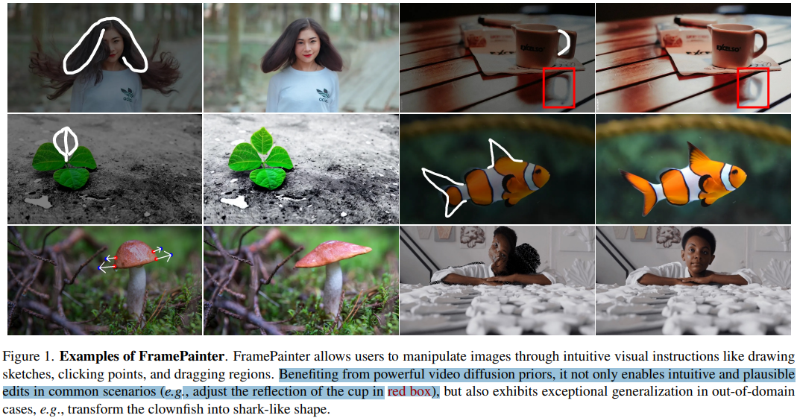
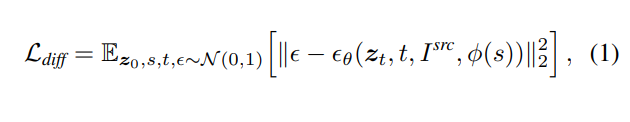
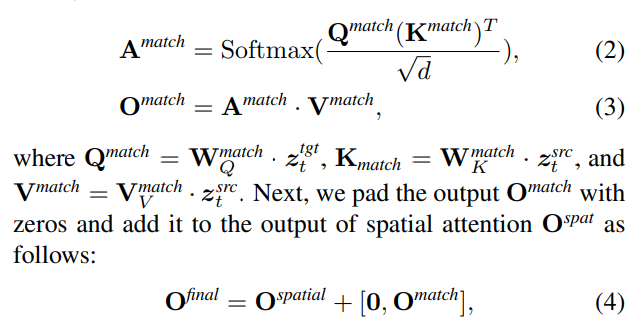
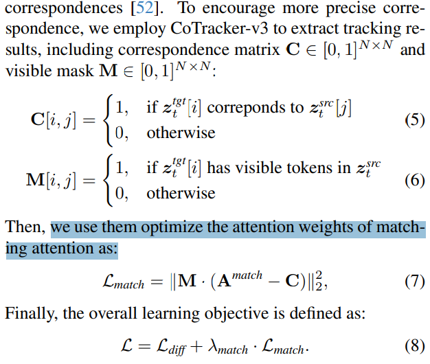
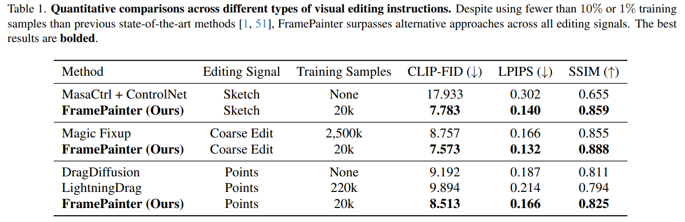
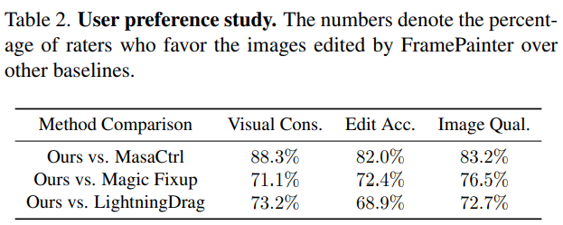
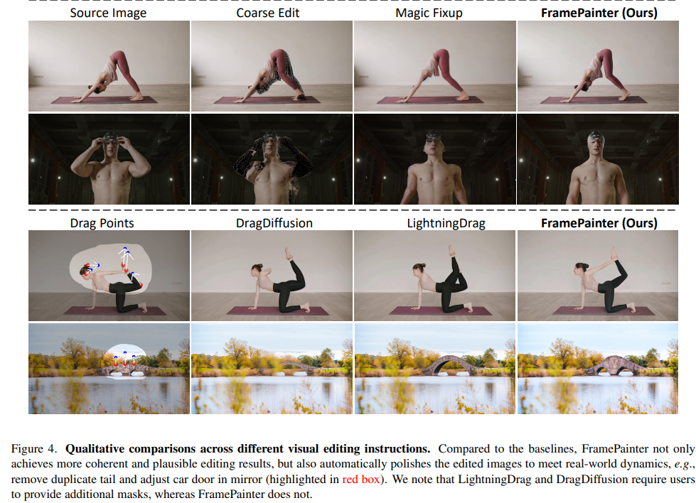
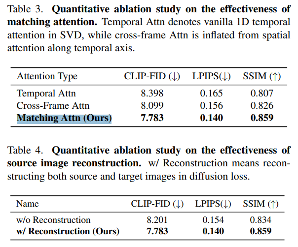

# FramePainter: Endowing Interactive Image Editing with Video Diffusion Priors

> "FramePainter: Endowing Interactive Image Editing with Video Diffusion Priors" Arxiv, 2025 Jan 14
> [paper](http://arxiv.org/abs/2501.08225v1) [code](https://github.com/YBYBZhang/FramePainter) [pdf](./2025_01_Arxiv_FramePainter--Endowing-Interactive-Image-Editing-with-Video-Diffusion-Priors.pdf) [note](./2025_01_Arxiv_FramePainter--Endowing-Interactive-Image-Editing-with-Video-Diffusion-Priors_Note.md)
> Authors: Yabo Zhang, Xinpeng Zhou, Yihan Zeng, Hang Xu, Hui Li, Wangmeng Zuo

## Key-point

- Task: Interactive image editing, AIGC 视频交互方式做 Video Restoration

- Problems

  - text2image 训练数据量太大

    >  Existing methods construct such supervision signals from videos, as they capture how objects change with various physical interactions. However, these models are usually built upon text-to-image diffusion models, so necessitate (i) massive training samples and (ii) an additional reference encoder to learn real-world dynamics and visual consistency

- :label: Label:

## Contributions

- SVD 做 image2video  & 交互方式编辑

> we reformulate this task as an **image-to-video** generation problem, so that inherit powerful video diffusion priors to reduce training costs and ensure temporal consistency.
>
> Specifically, we introduce FramePainter as an efficient instantiation of this formulation. Initialized with Stable Video Diffusion, it only uses a lightweight sparse control encoder to inject editing signals

- TemporalAttn 有限制，**提出一个 matching attention :star:**

> Considering the limitations of temporal attention in handling large motion between two frames, we further propose matching attention to enlarge the receptive field while encouraging dense correspondence between edited and source image tokens. 

- SOTA

## Introduction

## methods

img2video 任务，交互方式做编辑；**用 Dense correspondence 方式设计了一个 matching attention 提升 temporal 一致性**

- Q：编辑信号怎么用？

> **Inspired by ControlNext [44]**, we use a lightweight sparse control encoder with multiple ResNet blocks to efficiently encode editing signals. Notably, we only inject editing signals into target image features to avoid affecting the reconstruction of source image

用普通的 diffusion loss 训练

> The model ϵθ and control encoder ϕ are finetuned with the diffusion loss:

- Q：visual details 不行。。?

只用没那么好的 CLIP Image，controlnet 输入把 zt 和 noise concat 起来。。。

> Following SVD [4], we use two ways to preserve the visual details of I src: (i) inject the features encoded by **CLIP image encoder [46]** into cross-attention modules, and (ii) **concatenate z src 0 with per-frame noise latent** in channel dimension and then feed them to the denoising U-Net.

### Matching Attention for Dense Correspondence

> Since SVD relies on 1-D temporal attention to ensure frame consistency, its small receptive field struggles to preserve the identity of objects involving large movements, particularly when only two frames are available (i.e., in image editing task). 

把目标帧作为 Q，source 做 KV

> matching attention only takes z tgt t as query and z src t as key and value:

- Q：dense correspondence 在哪？？

**搞了一个 cross-attn map loss还是用 cross-attn 自己去学。。。但是呢，在训练时候加了一个 correspondence loss 去约束 Cross-attn map** 

训练时候**用预训练的  CoTracker-v3  先得到 correspondence 矩阵 & visual mask**

> To encourage more precise correspondence, we employ CoTracker-v3 to extract tracking results, including correspondence matrix C ∈ [0, 1]N×N and visible mask M ∈ [0, 1]N×N :

使用 self-attention 的参数初始化，先前工作发现 Self-attn 的具有 correspondence 的能力

> During training, matching attention copies the weights from spatial attention to inherit its implicit knowledge on image correspondences [52].

## setting

> We initialize FramePainter with Stable Video Diffusion v1.1 and finetune it on our collected training samples for each editing signal. Following SVD, the height and width of training images are set to 576 and 1024 respectively. We train the model on two A6000 GPUs with a total batch size of 4. The model is optimized for 20, 000 iterations with a learning rate of 1 × 10−5 using the AdamW algorithm. During inference, **we adopt euler discrete sampling with 25 steps by default.**

- CLIP-FID
- LPIPS
- SSIM

暗示 PSNR 不准了哈哈哈，受亮度影响太大了

## Experiment

> ablation study 看那个模块有效，总结一下

### ablation

对比 Cross-Frame， 在它基础上加 matching attention 会咋样，SSIM 高了0.03 只能是说还有点用

## Limitations

## Summary :star2:

> learn what

### how to apply to our task

- Q：dense correspondence Attention怎么做的？

搞了一个 cross-attn map loss还是用 cross-attn 自己去学。。。但是呢，在训练时候加了一个 correspondence loss 去约束 Cross-attn map ；对比 Cross-Frame， 在它基础上加 matching attention 会咋样，SSIM 高了0.03 只能是说还有点用

