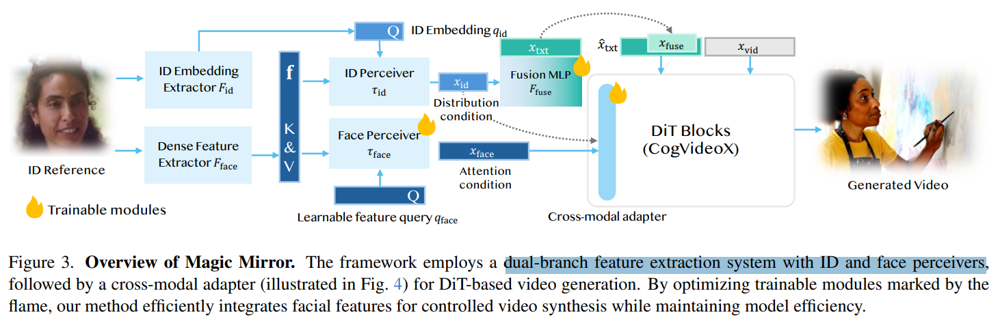

# Magic Mirror: ID-Preserved Video Generation in Video Diffusion Transformers

> "Magic Mirror: ID-Preserved Video Generation in Video Diffusion Transformers" Arxiv, 2025 Jan 7
> [paper](http://arxiv.org/abs/2501.03931v1) [code](https://github.com/dvlab-research/MagicMirror/) [pdf](./2025_01_Arxiv_Magic-Mirror--ID-Preserved-Video-Generation-in-Video-Diffusion-Transformers.pdf) [note](./2025_01_Arxiv_Magic-Mirror--ID-Preserved-Video-Generation-in-Video-Diffusion-Transformers_Note.md)
> Authors: Yuechen Zhang, Yaoyang Liu, Bin Xia, Bohao Peng, Zexin Yan, Eric Lo, Jiaya Jia

## Key-point

- Task
- Problems
- :label: Label:

## Contributions

## Introduction

## methods

## setting

## Experiment

> ablation study 看那个模块有效，总结一下

## Limitations

## Summary :star2:

> learn what

### how to apply to our task

