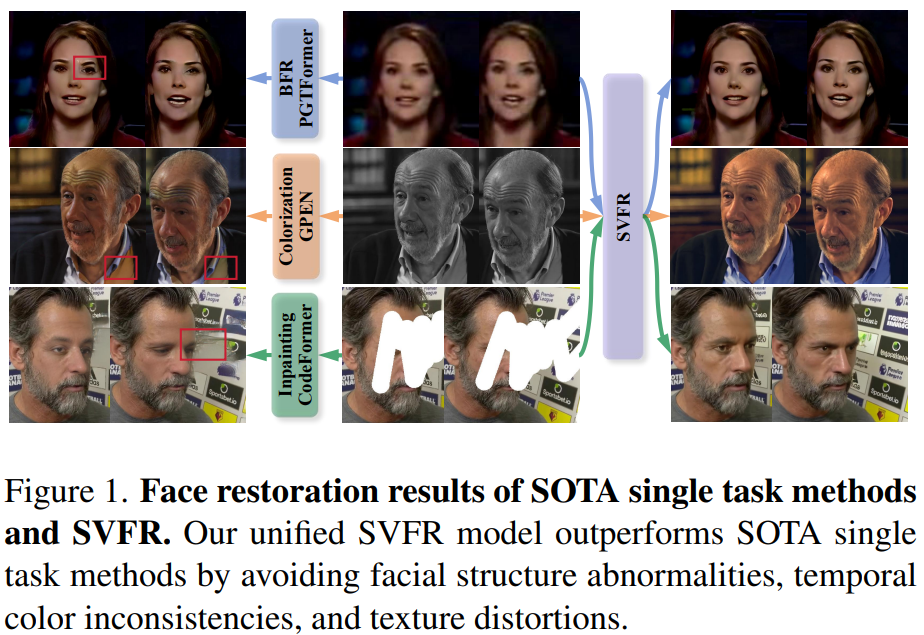
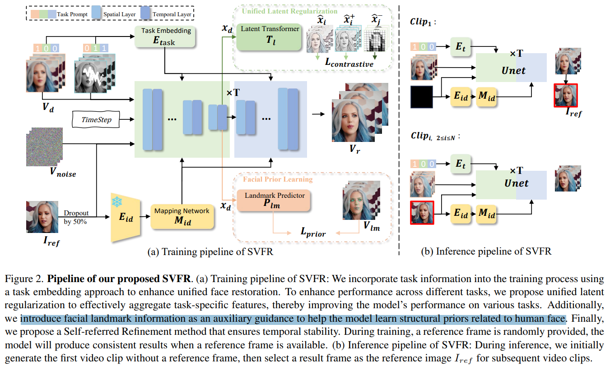
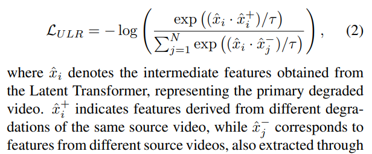
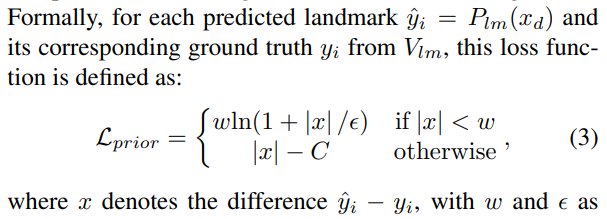
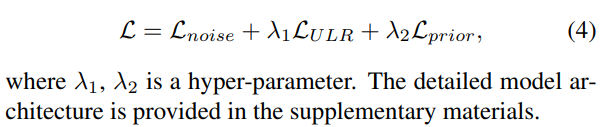
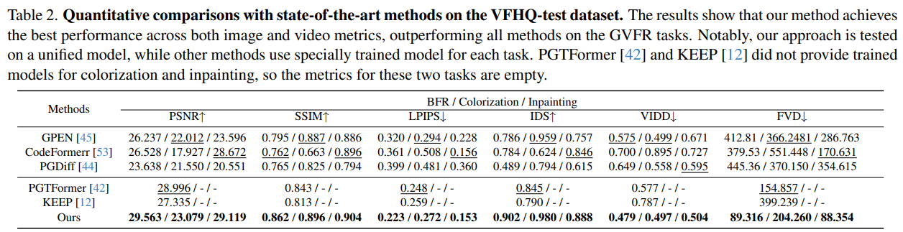
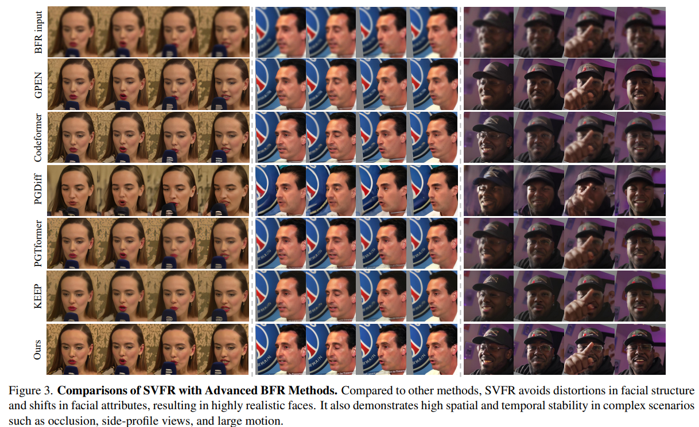
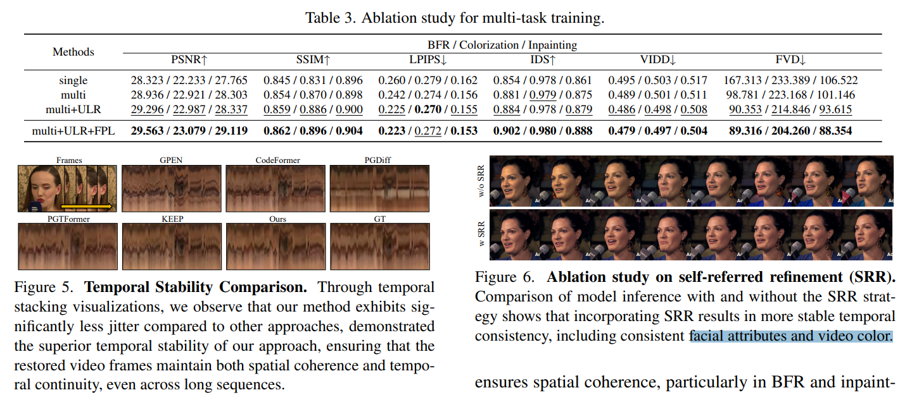

# SVFR: A Unified Framework for Generalized Video Face Restoration

> "SVFR: A Unified Framework for Generalized Video Face Restoration" Arxiv, 2025 Jan 2
> [paper](http://arxiv.org/abs/2501.01235v2) [code](https://github.com/wangzhiyaoo/SVFR.git) [pdf](./2025_01_Arxiv_SVFR--A-Unified-Framework-for-Generalized-Video-Face-Restoration.pdf) [note](./2025_01_Arxiv_SVFR--A-Unified-Framework-for-Generalized-Video-Face-Restoration_Note.md)
> Authors: Zhiyao Wang, Xu Chen, Chengming Xu, Junwei Zhu, Xiaobin Hu, Jiangning Zhang, Chengjie Wang, Yuqi Liu, Yiyi Zhou, Rongrong Ji

## Key-point

- Task: 多任务 Face Restoration(有 Film), **同时做 Blur, colorization and inpainting**
- Problems
  - 之前工作只做 SR 没做 inpaint。。。看起来是硬凑多个任务。。

- :label: Label:


## Contributions

- SVD 同时做 BFR, inpainting, and colorization tasks，搞了一个 learnable embedding 指定任务

> In this paper, we propose a novel approach for the Generalized Video Face Restoration (GVFR) task, which integrates video BFR, inpainting, and colorization tasks that we empirically show to benefit each other. We present a unified framework, termed as stable video face restoration (SVFR),

> We present a unified framework, termed as stable video face restoration (SVFR), which leverages the generative and motion priors of Stable Video Diffusion (SVD) and incorporates task-specific information through a unified face restoration framework.
>
> A learnable task embedding is introduced to enhance task identification

- Unified Latent Regularization (ULR)

> Meanwhile, a novel Unified Latent Regularization (ULR) is employed to encourage the shared feature representation learning among different subtasks

- 针对人脸，搞了特征点对齐进行训练 :star:

>  To further enhance the restoration quality and temporal stability, we introduce the facial prior learning and the self-referred refinement as auxiliary strategies used for both training and inference.

- SOTA


## Introduction




- Q: Can training on multiple video FR tasks help?


### SVD 

逐帧 Decode

> Given a video x ∈ R N×3×H×W , we first encode each frame into the latent space, represented as z = E(x). In this latent space, we perform forward and reverse processes. The final generated video, x, is then obtained by decoding from this latent representation

训练代码参考 MOFA， SVD + ControlNet

> - "MOFA-Video: Controllable Image Animation via Generative Motion Field Adaptions in Frozen Image-to-Video Diffusion Model" ECCV, 2024 May 30
>   [paper](http://arxiv.org/abs/2405.20222v2) [code](https://myniuuu.github.io/MOFA_Video/) [pdf](./2024_05_Arxiv_MOFA-Video--Controllable-Image-Animation-via-Generative-Motion-Field-Adaptions-in-Frozen-Image-to-Video-Diffusion-Model.pdf) [note](./2024_05_Arxiv_MOFA-Video--Controllable-Image-Animation-via-Generative-Motion-Field-Adaptions-in-Frozen-Image-to-Video-Diffusion-Model_Note.md)
>   Authors: Muyao Niu, Xiaodong Cun, Xintao Wang, Yong Zhang, Ying Shan, Yinqiang Zheng
> - https://github.com/pixeli99/SVD_Xtend/blob/main/train_svd.py
> - https://huggingface.co/stabilityai/stable-video-diffusion-img2vid-xt/tree/main


- "" https://arxiv.org/pdf/2406.05630 

SVD + ControlNet


#### image2video

> diffuser SVD https://github.com/huggingface/diffusers/blob/main/docs/source/en/using-diffusers/svd.md

```python
import torch

from diffusers import StableVideoDiffusionPipeline
from diffusers.utils import load_image, export_to_video

pipe = StableVideoDiffusionPipeline.from_pretrained(
  "stabilityai/stable-video-diffusion-img2vid-xt", torch_dtype=torch.float16, variant="fp16"
)
pipe.enable_model_cpu_offload()

# Load the conditioning image
image = load_image("https://huggingface.co/datasets/huggingface/documentation-images/resolve/main/diffusers/svd/rocket.png")
image = image.resize((1024, 576))

generator = torch.manual_seed(42)
frames = pipe(image, decode_chunk_size=1, generator=generator, motion_bucket_id=180, noise_aug_strength=0.1).frames[0]
export_to_video(frames, "generated.mp4", fps=7)
```

> config https://huggingface.co/stabilityai/stable-video-diffusion-img2vid-xt/tree/main

```
"num_frames": 25,
```


- Q：image 如何引导？

提取图像 vae 特征，重复 N 张图

```python
        image_latents = self._encode_vae_image(image, device, num_videos_per_prompt, self.do_classifier_free_guidance)
        image_latents = image_latents.to(image_embeddings.dtype)

        # cast back to fp16 if needed
        if needs_upcasting:
            self.vae.to(dtype=torch.float16)

        # Repeat the image latents for each frame so we can concatenate them with the noise
        # image_latents [batch, channels, height, width] ->[batch, num_frames, channels, height, width]
        image_latents = image_latents.unsqueeze(1).repeat(1, num_frames, 1, 1, 1)
```

搞一个 randn_tensor，再和 image concat 起来输入 UNet

```python
# Concatenate image_latents over channels dimention
latent_model_input = torch.cat([latent_model_input, image_latents], dim=2)
```


#### Clip

- Q：SVD 预训练 CLIP 提供了 fp16, 但 huggingface 里面只有默认的 float32 的？

```
laion-CLIP-ViT-H-14-laion2B-s32B-b79K
```


## methods



>  To leverage multiple tasks to mutually enhance the performance, we present a unified framework Stable Video Face Restoration (SVFR) as depicted in Fig. 2. Formally, for each task, the model is provided with **a contaminated source video Vd** (i.e., low-quality video for BFR, masked video for inpainting, and gray-scale video for colorization)


- Q：LQ video 怎么输入？

LQ 直接过 VAE 提取 latent 和 noise concat -> finetune UNet `conv_in` layer，改输入通道数，验证了可以的

> a simple approach is to encode Vd into latent space and directly concatenate E(Vd) with the noise z
>
> Therefore, simply adopting pretrained VAE cannot encode all source videos into a proper and consistent latent space which can then be used to guide the diffusion U-Net.


### multi-task

多个任务使用 Task Embed 指定任务，通过提出的 Latent Regularization 实现共享一个 latent space

> To this end, we propose a unified face restoration framework comprising two key modules: Task Embedding and the Unified Latent Regularization.

搞一个 binary vector -> 也就三个任务

> While the source video Vd can indicate the required task to some extent, directly relying on Vd for task information can lead to confusion. 
>
> Given a task set T = {T1, T2, T3}, where T1, T2 and T3 represent BFR, colorization, and inpainting tasks respectively
>
> To enhance the model’s ability to recognize tasks, each task is represented by a binary indicator ti(i ∈ [1, 3]) (0 for absence and 1 for presence). The task prompt is represented as a binary vector γ = [t1, t2, t3]. For example, [0, 1, 1] indicates that colorization and inpainting tasks are active while BFR is inactive. 


提取 UNet middle layer 特征，认为有很重要的特征。。。拿这个特征做 contrastive loss，搞同一个视频另一种 DA 作为正样本，其他视频作为负样本

> To further align features across different tasks and enable the model to leverage shared knowledge within a unified learning framework, we propose Unified Latent Regularization (ULR).
>
> we implement cross-task alignment using features from the middle block of the UNet. We first extract the output from the intermediate layers of the UNet, as these layers capture essential structural and semantic information crucial for modeling nuanced video details.




### Facial Prior

只用 Diffusion Loss 没法优化特定人脸区域，loss 太泛化没有针对性

> While the pretrained SVD can be directly adapted to our task by optimizing the noise prediction loss as in Eq. 1, such an objective cannot help inject the structure priors of human faces into the model.

拿 UNet mid features 过几层 MLP 预测 68 个人脸关键点，在训练时候搞一个新的 Loss

> Concretely, we leverage the features xd output from the **U-Net middle block and pass them through a landmark predictor Plm composed of an average pooling layer followed by five layers of MLP.** This predictor is trained to estimate a 68-points facial landmark set, obtained from ground truth frames using a pretrained landmark detection model [16]
>
> - "Wing Loss for Robust Facial Landmark Localisation with Convolutional Neural Networks" 
>   https://arxiv.org/pdf/1711.06753




完整 loss



> Effectiveness of Unified Latent Regularization. We conduct ablation studies on Unified Latent Regularization (ULR) with λ1 = 0.01, 
>
> Effectiveness of facial prior learning. As shown in Tab. 3 with λ2 = 0.1, Lprior


### self-refine

先生成一波，找一个 HQ 的一帧作为 reference 再修复一次

- Q：训练细节？

> In the training phase, we extract features from the reference frame Iref using a VAE encoder zref = E(Iref ). These features are then injected into the initial noise of the U-Net model
>
> l. Additionally, identity features fid are extracted by Eid and passed through a mapping network Mid before being injected into the cross-attention layers of the U-Net

实现 long consistency


### Code

> https://github.com/wangzhiyaoo/SVFR/blob/3a4539054281b1d3765e427c2294dd1776f0a57e/src/pipelines/pipeline.py#L75


## setting

- SVD-xt 25 frames

- We selected VoxCeleb2 [11], CelebV-Text [47], and VFHQ [39] as our training datasets

- we utilize ARNIQA [1] score to **filtere a highquality video dataset** comprising 20,000 clips

- 对比 5 个方法，3个数据集

- PSNR, SSIM, LPIPS

- IDS

- VIDD [10] measures temporal consistency by calculating identity feature differences between adjacent frames using ArcFace

- FVD [31] assesses overall video quality, reflecting spatial and temporal coherence. 

  https://github.com/ragor114/PyTorch-Frechet-Video-Distance?tab=readme-ov-file


## Experiment

> ablation study 看那个模块有效，总结一下




- 这么模糊。。。只看主观了。。。没关注纹理一致性，**看生成的文字超级垃圾**
- 时序也不太行。。看挑出来的图，**那个文字在多帧内很闪啊。。。。**




- 时序一致性，划条线看看
- 加了 refer 特征。。人脸细节看起来没啥变化，**颜色变化倒是明显一点**




## Limitations

- 同一个 scene 从修复结果找 reference，**一致性和 GT 没法保证**


## Summary :star2:

> learn what

### how to apply to our task

- Q：SVD 怎么 video2video?
- Q：condition mask怎么引入？如何实现可有可无？
- 数据集

