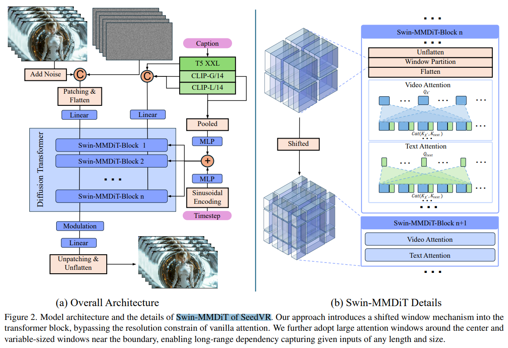
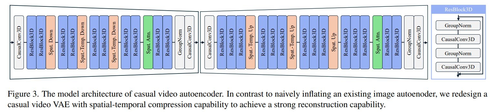

# SeedVR: Seeding Infinity in Diffusion Transformer Towards Generic Video Restoration

> "SeedVR: Seeding Infinity in Diffusion Transformer Towards Generic Video Restoration" Arxiv, 2025 Jan 2
> [paper](http://arxiv.org/abs/2501.01320v2) [code]() [pdf](./2025_01_Arxiv_SeedVR--Seeding-Infinity-in-Diffusion-Transformer-Towards-Generic-Video-Restoration.pdf) [note](./2025_01_Arxiv_SeedVR--Seeding-Infinity-in-Diffusion-Transformer-Towards-Generic-Video-Restoration_Note.md)
> Authors: Jianyi Wang, Zhijie Lin, Meng Wei, Yang Zhao, Ceyuan Yang, Chen Change Loy, Lu Jiang

## Key-point

- Task
- Problems
- :label: Label:

## Contributions

## Introduction

- "RealViformer: Investigating Attention for Real-World Video Super-Resolution" ECCV, 2024 Jul 19
  [paper](http://arxiv.org/abs/2407.13987v1) [code](https://github.com/Yuehan717/RealViformer.) [pdf](./2024_07_ECCV_RealViformer--Investigating-Attention-for-Real-World-Video-Super-Resolution.pdf) [note](./2024_07_ECCV_RealViformer--Investigating-Attention-for-Real-World-Video-Super-Resolution_Note.md)
  Authors: Yuehan Zhang, Angela Yao

Improved Channel Attention Module (ICA)

## methods

### 3D VAE

## setting

- We train SeedVR on 256 NVIDIA H100-80G GPUs with around 150 720p frames per batch per GPU. 

## Experiment

> ablation study 看那个模块有效，总结一下

## Limitations

## Summary :star2:

> learn what

### how to apply to our task

