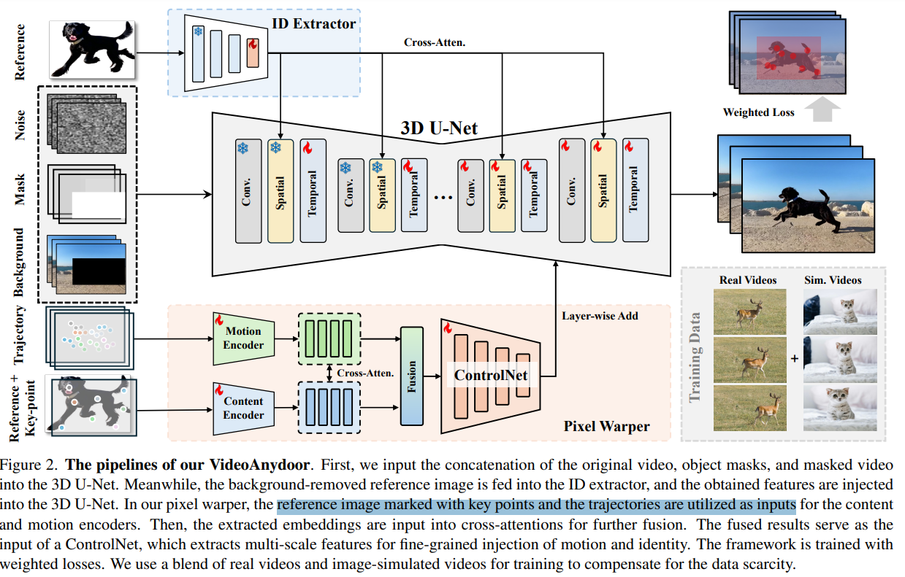
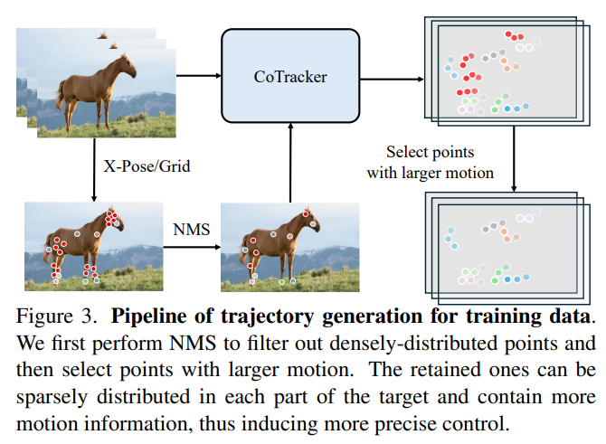

# VideoAnydoor: High-fidelity Video Object Insertion with Precise Motion Control

> "VideoAnydoor: High-fidelity Video Object Insertion with Precise Motion Control" Arxiv, 2025 Jan 2
> [paper](http://arxiv.org/abs/2501.01427v3) [code]() [pdf](./2025_01_Arxiv_VideoAnydoor--High-fidelity-Video-Object-Insertion-with-Precise-Motion-Control.pdf) [note](./2025_01_Arxiv_VideoAnydoor--High-fidelity-Video-Object-Insertion-with-Precise-Motion-Control_Note.md)
> Authors: Yuanpeng Tu, Hao Luo, Xi Chen, Sihui Ji, Xiang Bai, Hengshuang Zhao

## Key-point

- Task
- Problems
- :label: Label:

## Contributions

## Introduction

## methods

同时把关键点 & img+关键点 ，过两个 cross-attn -> controlNet

整个模型微调

### train data

### Weighted loss

参考 

- "DreamVideo-2: Zero-Shot Subject-Driven Video Customization with Precise Motion Control" Arxiv, 2024 Oct 17
  [paper](http://arxiv.org/abs/2410.13830v1) [code]() [pdf](./2024_10_Arxiv_DreamVideo-2--Zero-Shot-Subject-Driven-Video-Customization-with-Precise-Motion-Control.pdf) [note](./2024_10_Arxiv_DreamVideo-2--Zero-Shot-Subject-Driven-Video-Customization-with-Precise-Motion-Control_Note.md)
  Authors: Yujie Wei, Shiwei Zhang, Hangjie Yuan, Xiang Wang, Haonan Qiu, Rui Zhao, Yutong Feng, Feng Liu, Zhizhong Huang, Jiaxin Ye, Yingya Zhang, Hongming Shan

## setting

## Experiment

> ablation study 看那个模块有效，总结一下

## Limitations

## Summary :star2:

> learn what

### how to apply to our task

