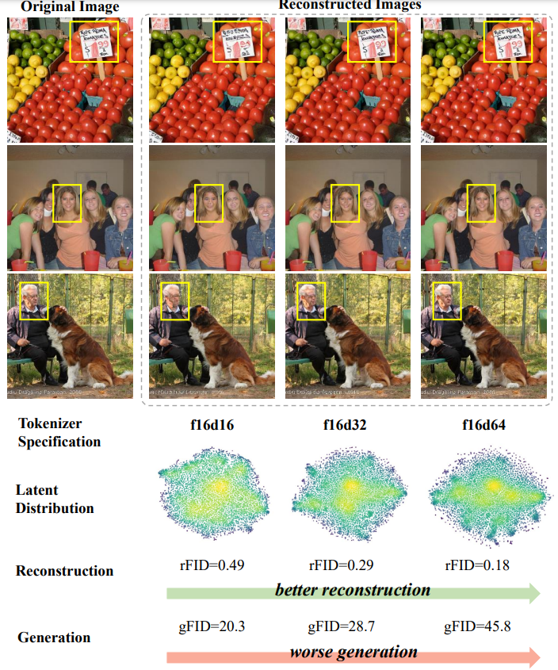
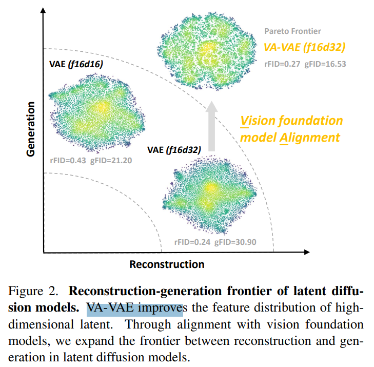
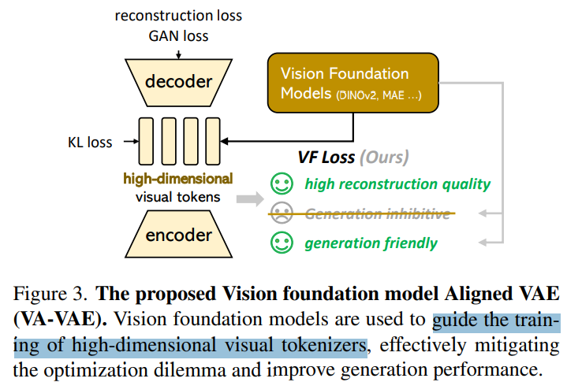

# Reconstruction vs. Generation: Taming Optimization Dilemma in Latent Diffusion Models

> "Reconstruction vs. Generation: Taming Optimization Dilemma in Latent Diffusion Models" CVPR-2025, 2025 Jan 2, `VA-VAE`
> [paper](http://arxiv.org/abs/2501.01423v3) [code](https://github.com/hustvl/LightningDiT) [pdf](./2025_01_CVPR_Reconstruction-vs--Generation--Taming-Optimization-Dilemma-in-Latent-Diffusion-Models.pdf) [note](./2025_01_CVPR_Reconstruction-vs--Generation--Taming-Optimization-Dilemma-in-Latent-Diffusion-Models_Note.md)
> Authors: Jingfeng Yao, Bin Yang, Xinggang Wang (Huazhong University of Science and Technology)

## Key-point

- Task: Optimization dilemma within latent diffusion models

- Problems

  - LDM 训练 optimization dilemma：**优化 VAE 维度，为了提升重建效果，但导致生成模型学习得更烂** -> 需要更大的 diffusion 模型再训练

  > However, recent studies reveal an optimization dilemma in this two-stage design: while increasing the per-token feature dimension in visual tokenizers improves reconstruction quality, it requires substantially larger diffusion models and more training iterations to achieve comparable generation performance

  - 训练得到的非最优解，VAE 造成损失

  > Consequently, existing systems often settle for suboptimal solutions, either producing visual artifacts due to information loss within tokenizers or failing to converge fully due to expensive computation costs.

- :label: Label:

## Contributions

- 认为 VAE & diffusion 优化困境，是因为 **VAE 空间没有约束 or 对齐，如此去学习 VAE space 本身就很难。**

> We argue that this dilemma stems from the inherent difficulty in learning unconstrained high-dimensional latent spaces. To address this, we propose aligning the latent space with pretrained vision foundation models when training the visual tokenizers. 

- 提出 VA-VAE: **用一个预训练的视觉模型的空间，训练 VAE 去对齐这个空间**；发现能够加快收敛

> Our proposed VA-VAE (Vision foundation model Aligned Variational AutoEncoder) significantly expands the reconstruction-generation frontier of latent diffusion models, enabling faster convergence of Diffusion Transformers (DiT) in high-dimensional latent spaces.

- 提出 VF loss 加速 diffusion 训练

> The proposed VF Loss effectively resolves the optimization dilemma in latent diffusion models, enabling over 2.5× faster DiT training with high-dimensional tokenizers;

- 基于 VA-VAE 训练一个 Lightning DiT 模型，在256x256 上SOTA，而且**训练快速，只需要 64epoch(8卡H800 10h)**

>  To exploit the full potential of VA-VAE, we build an enhanced DiT baseline with improved training strategies and architecture designs, termed LightningDiT. The integrated system achieves state-of-the-art (SOTA) performance on ImageNet 256×256 generation with an FID score of 1.35 while demonstrating remarkable training efficiency by reaching an FID score of 2.11 in just 64 epochs

## Introduction

- Q：Motivation?

DM 使用 VAE 压缩空间，降低显存消耗。但是存在一个 VAE 的重建损失。。

> The latent diffusion model [34] utilizes a continuous-valued variational autoencoder (VAE) [18], or visual tokenizer, to compress visual signals and thereby reduce the computational demands of high-resolution image generation. 

为了避免 VAE 重建损失，最简单的方法：**提升 VAE 空间维度，再去微调生成模型**

> A straightforward approach to enhance the reconstruction capability is to increase the feature dimension of visual tokens, which effectively expands the information capacity of the latent representation. 
>
>  Recently, several influential textto-image works [5, 7, 21] have explored higher-dimensional tokenizers compared to the widely adopted VAE in Stable Diffusion [31, 34], as these tokenizers offer improved detail reconstruction, enabling finer generative quality.

EMU 工作，直接训练 C=16 VAE 再用高质量数据微调 SDXL

> - "Emu: Enhancing Image Generation Models Using Photogenic Needles in a Haystack" Arxiv, 2023 Sep 27
>   [paper](http://arxiv.org/abs/2309.15807v1) [code]() [pdf](./2023_09_Arxiv_Emu--Enhancing-Image-Generation-Models-Using-Photogenic-Needles-in-a-Haystack.pdf) [note](./2023_09_Arxiv_Emu--Enhancing-Image-Generation-Models-Using-Photogenic-Needles-in-a-Haystack_Note.md)
>   Authors: Xiaoliang Dai, Ji Hou, Chih-Yao Ma, Sam Tsai, Jialiang Wang, Rui Wang, Peizhao Zhang, Simon Vandenhende, Xiaofang Wang, Abhimanyu Dubey, Matthew Yu, Abhishek Kadian, Filip Radenovic, Dhruv Mahajan, Kunpeng Li, Yue Zhao, Vladan Petrovic, Mitesh Kumar Singh, Simran Motwani, Yi Wen, Yiwen Song, Roshan Sumbaly, Vignesh Ramanathan, Zijian He, Peter Vajda, Devi Parikh
> - Black Forest Labs. Frontier ai lab. https://blackforestlabs.ai/

后续发现对于 LDM 用上述方法直接调，存在 LDM 的生成 & 重建问题：生成能力比之前烂了。。

- Q：什么是 LDM 的生成 & 重建问题？Optimization dilemma within latent diffusion models

提升 VAE 空间维度，能提升图像重建效果，这里的 F 为下采样倍数，D 为通道数。**测试 256x256 图像，发现提升了 VAE 维度后，diffusion模型很难学习，造成生成效果变烂了。。。**

> In latent diffusion models, increasing the dimension of the visual tokenizer enhances detail reconstruction but significantly reduces generation quality. 
>
> (In tokenizer specification, “f” and “d” represent the downsampling rate and dimension, respectively. All results are evaluated on ImageNet 256×256 dataset with a fixed compute budget during diffusion model training.)

- Q：之前方法咋搞？

SD3 直接增加模型参数，训练成本爆炸

> Currently, two common strategies exist to address this issue: the first involves scaling up model parameters, as demonstrated by Stable Diffusion 3 [7], which shows that higher-dimensional tokenizers can achieve stronger generation performance with a significantly larger model capacity—however, this approach requires significantly more training compute, making it prohibitively expensive for most practical applications. 

另一种是对 VAE 限制一下，例如进一步使用 F64 降低显存，不过会引入重建 loss

> - "Deep Compression Autoencoder for Efficient High-Resolution Diffusion Models" Arxiv, 2024 Oct 14, `DC-AE`
>   [paper](http://arxiv.org/abs/2410.10733v1) [code](https://github.com/mit-han-lab/efficientvit) [pdf](./2024_10_Arxiv_Deep-Compression-Autoencoder-for-Efficient-High-Resolution-Diffusion-Models.pdf) [note](./2024_10_Arxiv_Deep-Compression-Autoencoder-for-Efficient-High-Resolution-Diffusion-Models_Note.md)
>   Authors: Junyu Chen, Han Cai, Junsong Chen, Enze Xie, Shang Yang, Haotian Tang, Muyang Li, Yao Lu, Song Han (MIT)
>
> The second strategy is to deliberately **limit the tokenizer’s reconstruction capacity,** e.g. Sana [4, 42], W.A.L.T [14], for faster convergence of diffusion model training. Yet, this compromised reconstruction quality inherently limits the upper bound of generation performance, leading to imperfect visual details in generated results.

提出一种方法对于 f16d32 的情况，在保证重建效果的情况下，提升 diffusion 学习能力

> Our key finding demonstrates that learning latent representations guided by vision foundation models significantly enhances the generation performance of high-dimensional tokenizers while preserving their original reconstruction capabilities (see Fig. 2)

## methods

提出 VF loss

> Our key contribution lies in the design of Vision Foundation model alignment loss, VF loss, which substantially optimizes the latent space without altering the model architecture or training pipeline, effectively resolving the optimization dilemma discussed in Section 1

## setting

## Experiment

> ablation study 看那个模块有效，总结一下

## Limitations

## Summary :star2:

> learn what

### how to apply to our task

