# DC-VSR: Spatially and Temporally Consistent Video Super-Resolution with Video Diffusion Prior

> "DC-VSR: Spatially and Temporally Consistent Video Super-Resolution with Video Diffusion Prior" Arxiv, 2025 Feb 5
> [paper](http://arxiv.org/abs/2502.03502v1) [code]() [pdf](./2025_02_Arxiv_DC-VSR--Spatially-and-Temporally-Consistent-Video-Super-Resolution-with-Video-Diffusion-Prior.pdf) [note](./2025_02_Arxiv_DC-VSR--Spatially-and-Temporally-Consistent-Video-Super-Resolution-with-Video-Diffusion-Prior_Note.md)
> Authors: Janghyeok Han, Gyujin Sim, Geonung Kim, Hyunseung Lee, Kyuha Choi, Youngseok Han, Sunghyun Cho

## Key-point

- Task
- Problems
- :label: Label:

## Contributions

## Introduction

## methods

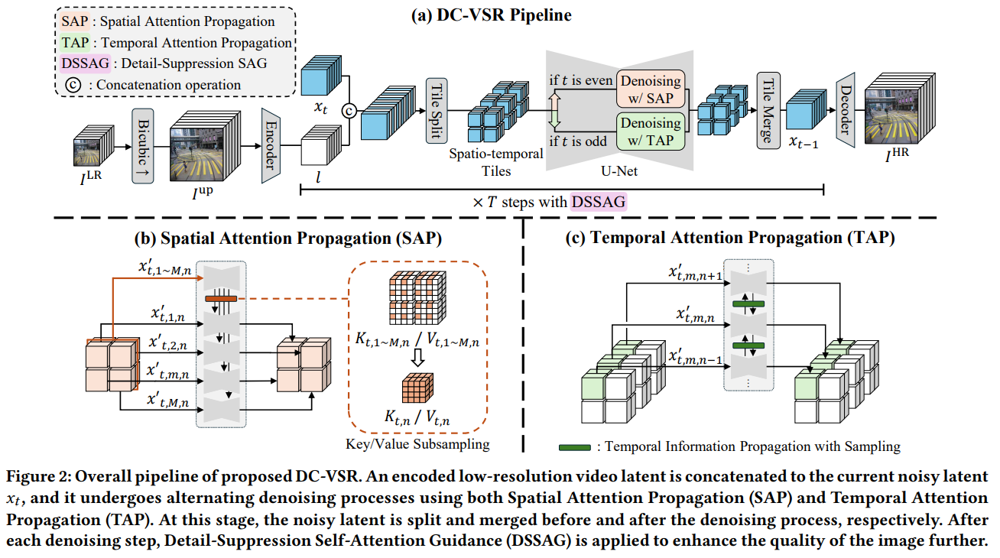

设计了 spatial 和 temporal 两种传播方式，根据去噪步数 t，决定当前去噪步数使用 SAP，还是 TAP 的传播方式。
使用 **SVD 框架，为了做 VSR，把 LR resize 再提取 VAE 特征**，和 random noise concat 在一起

> Fig. 2 illustrates the overall framework of DC-VSR, which is built upon the SVD framework [StabilityAI 2023]. To begin, DC-VSR upsamples 𝐼 𝐿𝑅 using bicubic interpolation to match the target resolution, and obtains an upscaled video 𝐼 up. It then embeds 𝐼 up into the latent space using the VAE encoder [Rombach et al. 2022], obtaining a latent representation 𝑙, which consists of [𝑙1, · · · ,𝑙𝑁 ] stacked along the channel dimension where 𝑙𝑖 represents the latent of the 𝑖-th upsampled video frame

在输入 UNet 之前打成 64 × 64 × 14 的 VAE 块

> The concatenated latents are then split into spatio-temporal tiles.
>
> We utilize spatio-temporal tiles of size 64 × 64 × 14 in the latent space, corresponding to 512×512×14 in the image space with a scaling factor of 8. 

参考先前方法，对 title 之间重叠 50%，使用 gaussian blending :star: :star:

> . In line with previous approaches [Yang et al. 2024a; Zhou et al. 2024], spatially and temporally neighboring tiles overlap by 50%. Overlapped tiles are blended in the tile merging step in our pipeline using gaussian blending. 
>
> - "Motion-Guided Latent Diffu sion for Temporally Consistent Real-world Video Super-resolution. In European Conference on Computer Vision"
> - "Upscale-A-Video: Temporal-Consistent Diffusion Model for Real-World Video Super-Resolution"

- Q：patch 之间不一致？

> DC-VSR employs a tile-based approach to handle lengthy videos with large frames with a video diffusion prior. However, naïvely splitting a video into tiles may introduce spatial and temporal in consistencie

使用 SVD Self-attn 类似方式解决

> . Likewise, video diffusion models such as SVD [StabilityAI 2023] leverage self-attention to achieve spatially and temporally coherent results. Specifically, the self-attention operation is defined as:
>
> For a certain spatial and temporal position in a video, the selfattention operation calculates the correlation between the query at position and keys at other positions, and aggregates values based on these correlations.

- Q：打成 title 了怎么用 self-attn ？

DC-VSR 把 self-attn 拓展了一下，搞了个 SAP，TAP

> However, when a video is split into tiles, each tile undergoes an independent attention process, resulting in spatial and temporal inconsistencies. 
>
> To address this, DC-VSR extends the self-attention operations using SAP and TAP, allowing attentions to be efficiently computed across tiles

### SAP

> However, due to the quadratic computational complexity of attention, naïve extension of self-attention operations is practically infeasible.
>
>  Instead, to avoid the quadratic increase of the computational complexity, SAP leverages subsampled features that represent the entire areas of video frames and injects them into the self-attention operations for each tile.

对 self-attn KV concat

> We construct new sets of keys and values 𝐾ˆ 𝑡,𝑚,𝑛 and 𝑉ˆ 𝑡,𝑚,𝑛 by merging 𝐾𝑡,𝑚,𝑛 and 𝐾𝑡,𝑛, and 𝑉𝑡,𝑚,𝑛 and 𝑉𝑡,𝑛, respectively. 

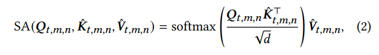

### TAP

对 T 上取 KV memory

> TAP bidirectionally propagates information from a tile to its neighbor. Specifically, at each diffusion sampling step for TAP, the propagation is performed in either the forward or backward direction

### Detail-Suppression Self-Attention Guidance

一种类似 CFG 的引导方式

SAG, PAG 对高频细节增加扰动

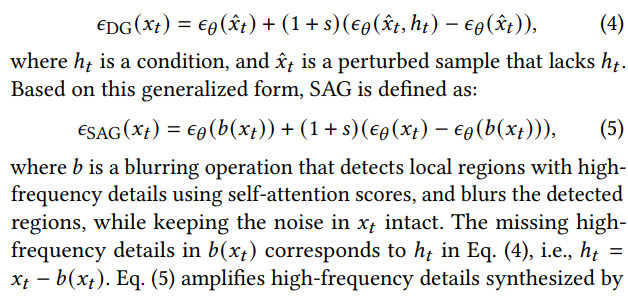

> SAG. Both SAG [Hong et al. 2023] and PAG [Ahn et al. 2024] improve high-frequency details in synthesized images by introducing perturbation to the high-frequency details in the estimation of the unconditional noise.

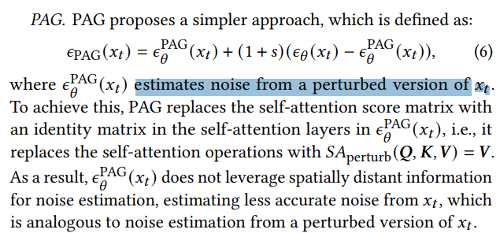

- Q：使用 SAG/PAG + CFG 计算量太大了

> SAG and PAG noticeably improve image synthesis quality, especially when combined with CFG. However, integrating them with CFG incurs substantial computational costs.

认为 self-attn 自己就能去找到高频细节

> self-attention layers in a denoising U-Net find image regions with similar high-frequency details, by computing weights based on the similarities between queries and keys. Then, they aggregate information from different image regions based on their weights.
>
> As noted by Wang et al. [2018a], this self-attention mechanism closely resembles bilateral filter [Tomasi and Manduchi 1998] and nonlocal means filter [Buades et al. 2005], both of which are renowned structure-preserving filters. I

对 self-attn map 加权一下

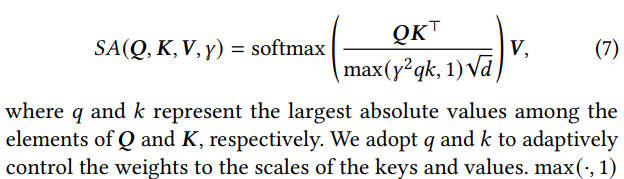

>  Inspired by this, we introduce an additional parameter **𝛾 to control the weighting function of the selfattention operation**, similar to the weighting parameters in bilateral and non-local means filters

把 self-attn 给换成 eq7，不需要训练 :star:

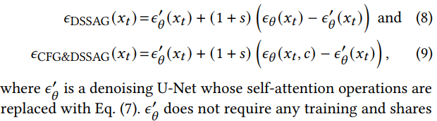

eq7 里面的权重，随着去噪步数改变而改变

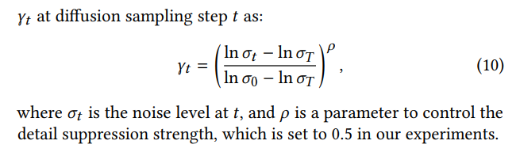

## setting

- SVD

> To build DC-VSR, we fine-tune Imageto-Video Stable Video Diffusion (I2V-SVD) [StabilityAI 2023], which adopts the LDM framework [Rombach et al. 2022] with the EDM [Karras et al. 2022] diffusion mechanism

- REDS 训练

> Following previous work [Chan et al. 2022b; Yang et al. 2024a], we merge 240 training videos and 30 test videos, reorganizing them into 266 training videos and 4 test videos, and refer to the latter as REDS4. We refer the reader to the supplementary material for more implementation details.

- RealESRGAN 构造训练数据

## Experiment

> ablation study 看那个模块有效，总结一下

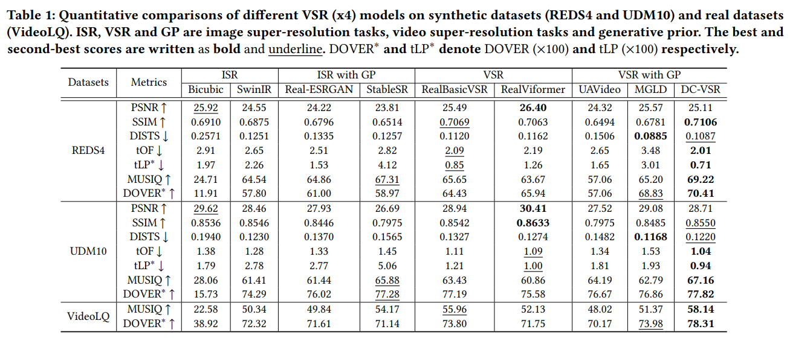

一致性也不行啊。。。

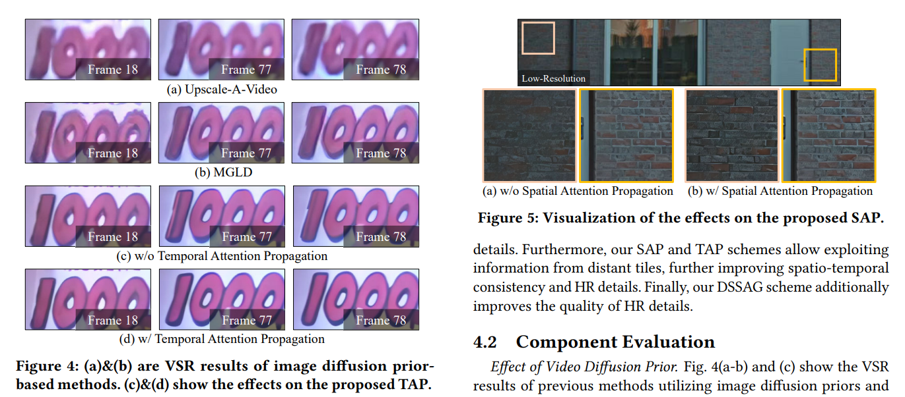

但看着张觉得 UpAVideo 好

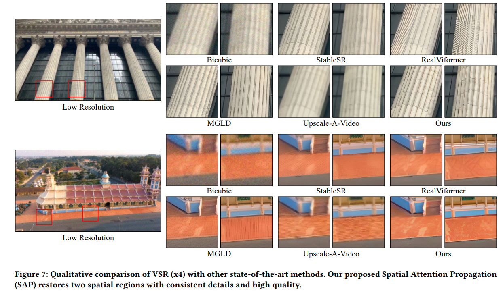

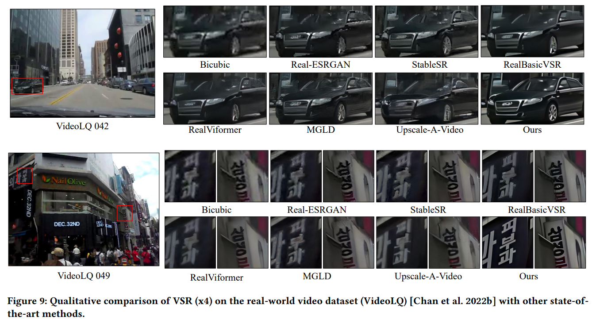

### ablation

不放原图能看出啥呢。。。这个操作太秀了。。。

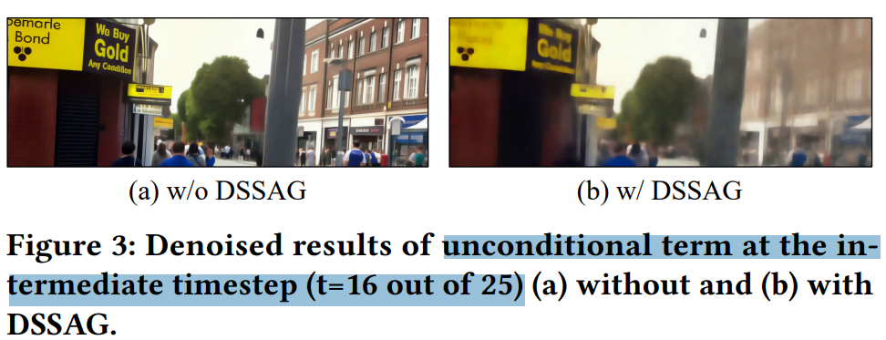

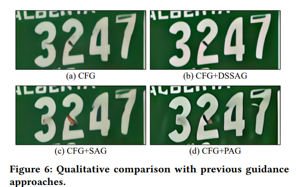

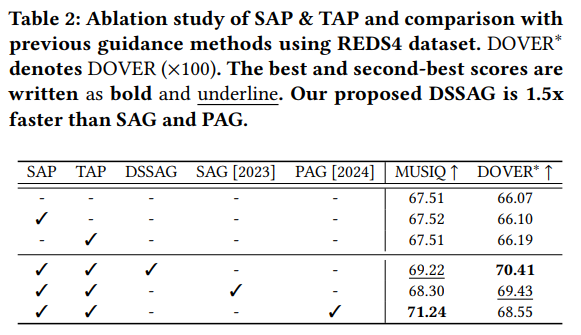

## Limitations

## Summary :star2:

> learn what

### how to apply to our task

