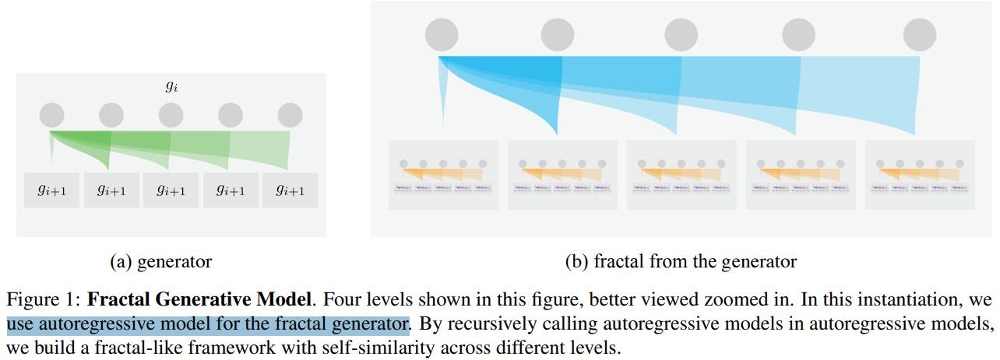
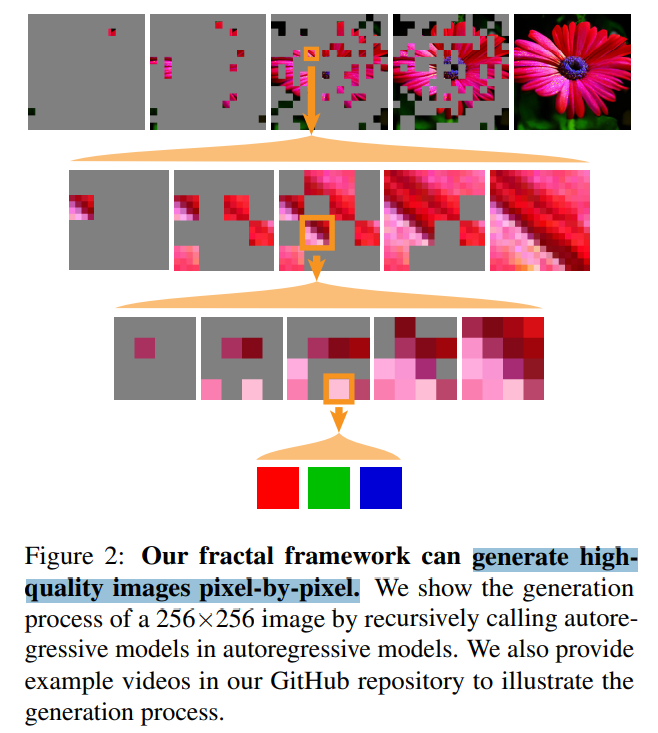
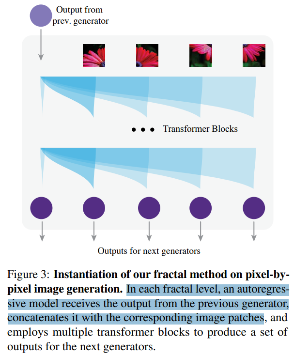
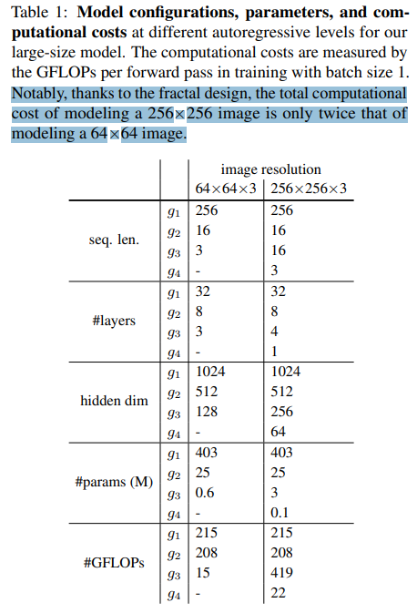
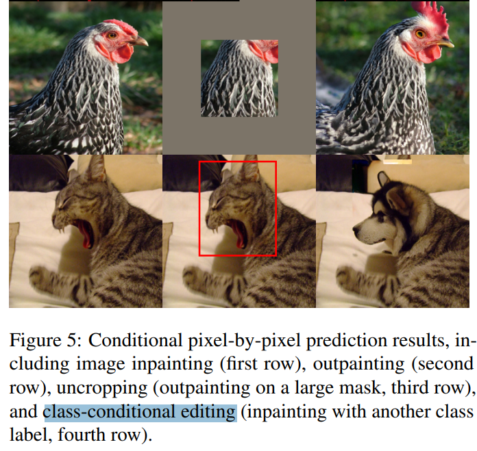
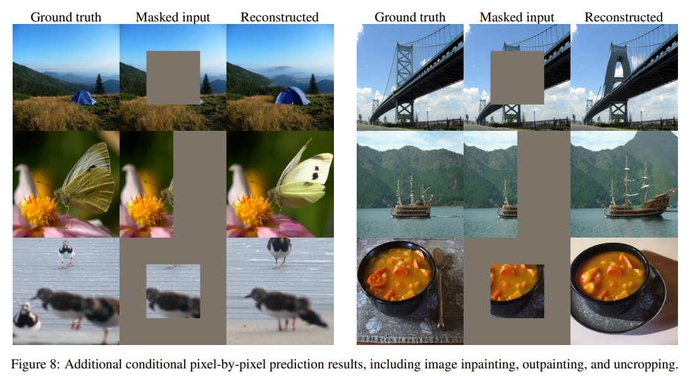

# Fractal Generative Models

> "Fractal Generative Models" Arxiv, 2025 Feb 24
> [paper](http://arxiv.org/abs/2502.17437v1) [code](https://github.com/LTH14/fractalgen) [pdf](./2025_02_Arxiv_Fractal-Generative-Models.pdf) [note](./2025_02_Arxiv_Fractal-Generative-Models_Note.md)
> Authors: Tianhong Li, Qinyi Sun, Lijie Fan, Kaiming He

## Key-point

- Task: 逐个像素生成（模块化） -> 图像
- Problems
- :label: Label:

逐个像素生成的过程，看 github page 实际是逐个 patch 生成，**信息量很少 & 多个 patch 配合很惊艳**

## Contributions

- 逐个像素生成的 framework

> In this paper, we introduce **a new level of modularization** by abstracting generative models into atomic generative modules.
>
> Analogous to fractals in mathematics, our method constructs a new type of generative model by recursively invoking atomic generative modules, resulting in self-similar fractal architectures that we call fractal generative models. 

- 用 autoregressive model 生成每个 unit （一个块像素）效果还可以

> As a running example, we instantiate our fractal framework using autoregressive models as the atomic generative modules and examine it on the challenging task of **pixelby-pixel image generation**, demonstrating strong performance in both likelihood estimation and generation quality

## Introduction

- Q：啥是 fractal model?

## methods

> In this section, we first present the **high-level motivation and intuition behind fractal generative models.** We then use the autoregressive model as an illustrative atomic module to demonstrate how fractal generative models can be instantiated and used to model very high-dimensional data distributions.

### motivation

> Fractals are complex patterns that emerge from simple, recursive rules. In fractal geometry, these rules are often called “generators” (Mandelbrot, 1983).

**有多个 generator**，类似一个级联的架构。**g1 先生成一个小部分，给 g2 把之前多个 patch 平起来一起处理**

> Formally, a fractal generator gi specifies how to produce a set of new data {xi+1} for the next-level generator based on one output xi from the previous-level generator: {xi+1} = gi(xi). For example, as shown in Figure 1, a generator can construct a fractal by recursively calling similar generators within each grey box.

生成模型随机性很大，级联之后生成多样新能增加？？

> Because each generator level can produce multiple outputs from a single input, a fractal framework can achieve an exponential increase in generated outputs while only requiring a linear number of recursive levels. This property makes it particularly suitable for modeling high-dimensional data with relatively few generator levels.

本文**探索用多个生成模型级联起来，实现 "逐个像素" 生成**

> Specifically, we introduce a fractal generative model that uses atomic generative modules as parametric fractal generators. In this way, a neural network “learns” the recursive rule directly from data. By combining the exponential growth of fractal outputs with neural generative modules, our fractal framework enables the modeling of high-dimensional non-sequential data. Next, we demonstrate how we instantiate this idea with an autoregressive model as the fractal generator.

### autoregressive model

对于单个生成模型难以处理的情况，去 model 数据分布

> Our goal is to model the joint distribution of a large set of random variables x1, · · · , xN , but directly modeling it with a single autoregressive model is computationally prohibitive

**迭代多次生成的过程**，先生成一波 -> 在下一个迭代拼接起来

> In each fractal level, an autoregressive model receives the output from the previous generator, concatenates it with the corresponding image patches, and employs multiple transformer blocks to produce a set of outputs for the next generators.

有多个模型。。。初始模型不小啊

## setting

> We thank Google TPU Research Cloud (TRC) for granting us access to TPUs, and Google Cloud Platform for supporting GPU resources

## Experiment

> ablation study 看那个模块有效，总结一下

- Q：Patch 不一致

> Since our autoregressive model divides images into patches, it can lead to **inconsistent patch boundaries** during generation. 

增加生成 patch 个数

> To address this issue, we provide the **next-level generator not only the output at the current patch but also the outputs at the surrounding four patches**. Although incorporating these additional inputs slightly increases the sequence length, it significantly reduces the patch boundary artifacts.

- Q：CFG 不稳定？

在 CFG 之前采样多个

> We also observed that CFG can suffer from numerical instability when the predicted probability for a pixel value is very small. To mitigate this issue, we apply top-p sampling with a threshold of 0.0001 on the conditional logits before applying CFG.

边缘不一致蛮严重的呀

Fig8 右上角那个桥有点垃。。。

## Limitations

- 生成的随机性比较大，也有 flaw 的，生成的 256x256 看不出来而已

## Summary :star2:

> learn what

### how to apply to our task

- 用多个 generator？处理 patch 不一致的问题？？搞一个`总分总`的架构，后面的模型给前面的擦屁股
