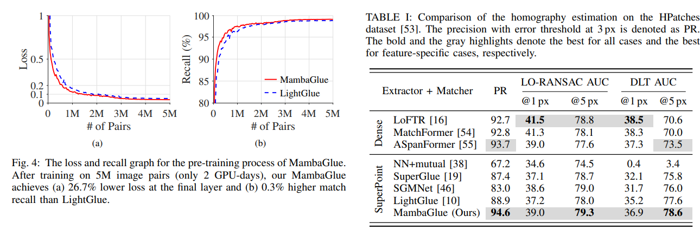

# MambaGlue: Fast and Robust Local Feature Matching With Mamba

> "MambaGlue: Fast and Robust Local Feature Matching With Mamba" ICRA, 2025 Feb 1
> [paper](http://arxiv.org/abs/2502.00462v1) [code](https://github.com/url-kaist/MambaGlue) [pdf](./2025_02_ICRA_MambaGlue--Fast-and-Robust-Local-Feature-Matching-With-Mamba.pdf) [note](./2025_02_ICRA_MambaGlue--Fast-and-Robust-Local-Feature-Matching-With-Mamba_Note.md)
> Authors: Kihwan Ryoo, Hyungtae Lim, Hyun Myung

## Key-point

- Task
- Problems
  - However, there remains a persistent demand for both robust and fast matching techniques. 

- :label: Label:

## Contributions

- 把 Attn 优化成 Mamba block

> we propose a novel block called MambaAttention mixer by utilizing the Mamba architecture, which is able to focus on input tokens selectively, with the attention architecture.

- 提出 deep confidence score regressor

> we propose a network called deep confidence score regressor to predict the confidence scores

- SOTA: 平衡性能 & 推理速度, 效果比 baseline 好

> achieves a balance between robustness and efficiency in real-world applications. 

## Introduction

- "LightGlue: Local Feature Matching at Light Speed" ICCV, 2023 Jun
  [paper](http://arxiv.org/abs/2306.13643v1) [code](https://github.com/cvg/LightGlue) [pdf](./2023_06_ICCV_LightGlue--Local-Feature-Matching-at-Light-Speed.pdf) [note](./2023_06_ICCV_LightGlue--Local-Feature-Matching-at-Light-Speed_Note.md)
  Authors: Philipp Lindenberger, Paul-Edouard Sarlin, Marc Pollefeys

## methods

Mamba Mixer 对每张图提取全局特征，再过一下 cross-attn 实现两张图的对齐；
**网络叠了 N 层，但可根据特征质量选择只用几层**：搞了一个 **confidence score predictor & 判断退出机制**，如果预测当前特征已经足够用于匹配，没必要过后续 layer 以此实现加速。如果特征不够，就再过几层 layer 优化一下；

> At the end of every layer, it decides whether to halt the process based on the confidence score. If enough number of features are confident for matching, MambaGlue stops the iteration and performs feature matching; otherwise, the iteration proceeds after pruning potentially unreliable features.

- Q：输入？

局部特征点 P，特征点 descriptors

## setting

## Experiment

> ablation study 看那个模块有效，总结一下

## Limitations

## Summary :star2:

> learn what

### how to apply to our task

