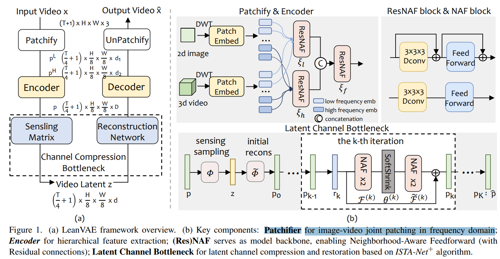
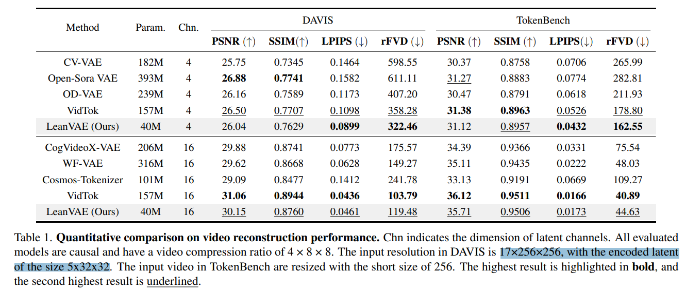
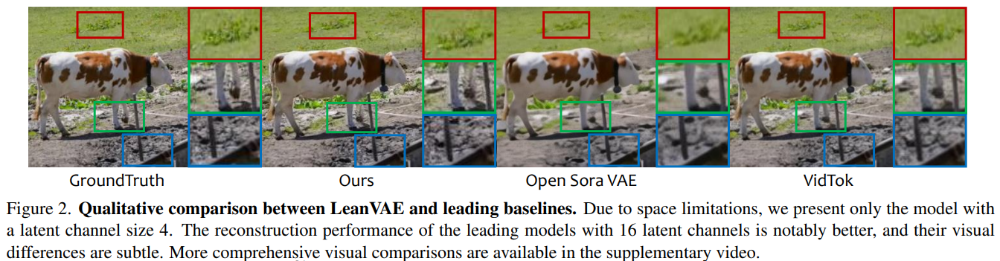

# LeanVAE: An Ultra-Efficient Reconstruction VAE for Video Diffusion Models

> "LeanVAE: An Ultra-Efficient Reconstruction VAE for Video Diffusion Models" Arxiv, 2025 Mar 18
> [paper](http://arxiv.org/abs/2503.14325v1) [code](https://github.com/westlake-repl/LeanVAE) [pdf](./2025_03_Arxiv_LeanVAE--An-Ultra-Efficient-Reconstruction-VAE-for-Video-Diffusion-Models.pdf) [note](./2025_03_Arxiv_LeanVAE--An-Ultra-Efficient-Reconstruction-VAE-for-Video-Diffusion-Models_Note.md)
> Authors: Yu Cheng, Fajie Yuan(西湖大学)

## Key-point

- Task
- Problems
- :label: Label:

## Contributions

## Introduction

## methods

## setting

## Experiment

> ablation study 看那个模块有效，总结一下

对 T 进行压缩 16frame->  latent T=5 F8 C4

看起来一个都用不了，追求细节，牛蹄上的斑点重建出来都没了。。。

## Limitations

## Summary :star2:

> learn what

### how to apply to our task

