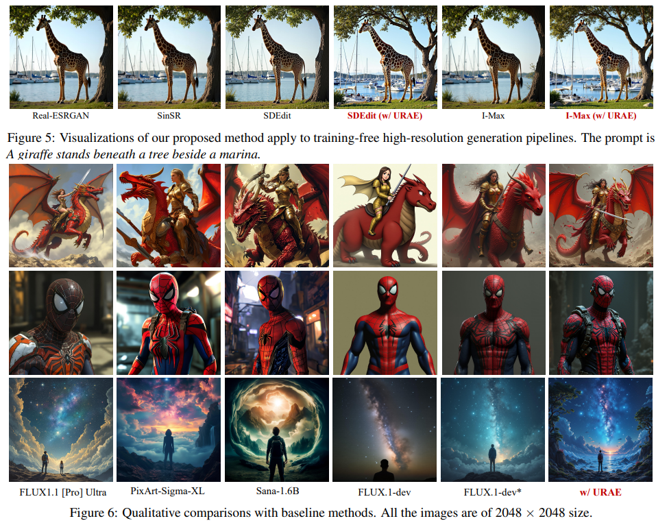

# Ultra-Resolution Adaptation with Ease

> "Ultra-Resolution Adaptation with Ease" Arxiv, 2025 Mar 20
> [paper](http://arxiv.org/abs/2503.16322v1) [code](https://github.com/Huage001/URAE) [pdf](./2025_03_Arxiv_Ultra-Resolution-Adaptation-with-Ease.pdf) [note](./2025_03_Arxiv_Ultra-Resolution-Adaptation-with-Ease_Note.md)
> Authors: Ruonan Yu, Songhua Liu, Zhenxiong Tan, Xinchao Wang	(NUS)

## Key-point

- Task
- Problems
  - training models for high-resolution image generation remains challenging, particularly when training data and computational resources are limited.

- :label: Label:

## Contributions

- 认为是第一个做 ultra-resolution 生成的工作。。。
- 提出**训练指南 URAE，需要训练模型，训练用的 GPU 还是不友好。。。**

> data and parameter efficiency, and propose a set of key guidelines for ultra-resolution adaptation termed URAE. 

- 训练速度，发现蒸馏收敛更快

> For data efficiency, we theoretically and empirically demonstrate that synthetic data generated by some teacher models can significantly promote training convergence.

- 模型参数训少量模块

> For parameter efficiency, we find that tuning minor components of the weight matrices outperforms widely-used low-rank adapters when synthetic data are unavailable, offering substantial performance gains while maintaining eff

- 不用 CFG 效果更好

> we show that disabling classifier-free guidance, i.e., setting the guidance scale to 1 during adaptation, is crucial for satisfactory performance

- 2K 分辨率图像生成 SOTA

## Introduction

### FLUX

> [code](https://github.com/black-forest-labs/flux)

12B 模型

> https://medium.com/@drmarcosv/how-does-flux-work-the-new-image-generation-ai-that-rivals-midjourney-7f81f6f354da
>
> *All public FLUX.1 models are based on a hybrid architecture of* [multimodal](https://arxiv.org/abs/2403.03206) *and* [parallel](https://arxiv.org/abs/2302.05442) [diffusion transformer](https://arxiv.org/abs/2212.09748) *blocks and scaled to 12B parameters. We improve over previous state-of-the-art diffusion models by building on* [flow matching](https://arxiv.org/abs/2210.02747)*, a general and conceptually simple method for training generative models, which includes diffusion as a special case. In addition, we increase model performance and improve hardware efficiency by incorporating* [rotary positional embeddings](https://arxiv.org/abs/2104.09864) *and* [parallel attention layers](https://arxiv.org/abs/2302.05442)*.*

#### Flow Matching

> https://zhuanlan.zhihu.com/p/741939590  :+1:
>
> - "Scaling rectified flow transformers for high-resolution image synthesis. " ICML 2024

#### Code

> [code](https://github.com/black-forest-labs/flux)
>
> https://zhuanlan.zhihu.com/p/741939590  :+1:
>
> FLUX.1 与 SD3 是同一批开发者的缘故，两者在架构上很相似，尤其是双流并行块部分完全相同（后文详述）

## methods

### Synthetic Data or Real Data 不好说

- Q：先前方法中，4K 数据难收集

> Previous works train 4K-generation models using millions of high-quality training images (Chen et al., 2024; Xie et al., 2024), leading to significant challenges in collecting, transmitting, storing, and processing such large volumes of data.

想使用蒸馏方式学习

> Building on recent advances in the distillation of diffusion models (Yang et al., 2023b; Kim et al., 2023; Liu et al., 2024b;a), we recognize that incorporating a teacher model for reference and a loss term for knowledge distillation (Hinton, 2015) can enhance training:

但是呢 FLUX1.1 [Pro] Ultra 闭源没开放模型权重，没法搞 loss 啊

> However, this approach relies on access to the diffusion backbone of the teacher model to compute the step-wise distillation loss, which is impractical for closed-weight models such as FLUX1.1 [Pro] Ultra

用 FLUX 生成的数据去训练。。。

> . We therefore experiment with an alternative approach that optimizes the vanilla flow matching loss defined in Eq. 1 using data synthesized by the teacher model. 

提出假设 & 推理

> Intuitively, Theorem 2.4 indicates that, when **training data are drawn from a mixture of real and synthetic** data points, the **distance to the optimal parameters at convergence reflects a tradeoff—governed by the synthetic portion p**—between two factors: the error introduced by label noise in the real data distribution and the discrepancy between the reference model used for generating synthetic data and the optimal model, shown in the 2nd and 3rd terms of Eq. 2.4 separately. Fig. 2 provides an illustrative example to visualize this effect

- Q：啥意思？

训练数据中真实数据 & 合成数据的比例影响训练收敛速度。

1. 当闭源 FLUX 和训练得到的最佳权重计算距离，差距越小 -> 合成数据越多收敛越快
2. 当差距超级大，合成数据越多效果越烂。。。
3. **全部用合成数据会导致训练崩掉。。。:star:**

> Although some works reveal that synthetic data can result in model collapse (Dohmatob et al., 2024b;a) by amplifying the gap between real and synthetic distributions, we demonstrate that they are useful particularly for ultra-resolution adaption

- Q：还是没懂，看起来是很直观的结论？

训练的模型和 FLUX 约接近，用 FLUX 的合成数据效果好点，**模型和 FLUX 接近->数据准，造得数据好有助于训练，然后呢？**

> Closely examining Eq.2.4, we can discover that, by diminishing label noise, synthetic data would be helpful if the reference model providing these data is accurate

- Q：为啥要这么高？

因为 LAION 数据集里面图像质量层次不齐 noise 很大，而 FLUX 合成数据也不完全好，想办法利用这个数据

**最后只说用合成数据训练 2K 模型方便对比。。。没啥啊**

> Building on this analysis, **we train our 2K-generation model using only synthetic data** in this work, demonstrating superior performance across various scenarios

### 只训练最小的 SVD

> Under this hypothesis, we introduce a method to tune the components associated with the smallest singular values instead

### 训练不用 CFG 

CFG 训练时候不要用，会增加训练难度；推理可以用

> If g remains larger than 1, a mismatch arises between the training targets in these two stages, making the training process more challenging
>
> During inference, CFG is still necessary by using g > 1.

## setting

- FLUX 作为基础模型

> In this paper, we adopt the open-source text-to-image FLUX.1-dev model (Black Forest Labs, 2023) as the base model to demonstrate the effectiveness of our proposed URAE guidelines, thanks to its superior performance

- 2K 分辨率图像，3k 数据 finetune FLUX.1-dev 2k iteration -> 在 2 个 H100 训练 1 天

> For our 2K-generation model, we collect 3K synthetic samples with various aspect ratios generated by the FLUX1.1 [Pro] Ultra model as the training dataset, and fine-tune the FLUX.1-dev on it for merely 2K iterations with a batch size of 8, which takes only ∼ 1 day on 2 H100 GPUs.

- 4K 分辨率图像，3w 图像微调 4k iteration -> 8 * H100 1 天

> For our 4K model, we utilize 30K images with at least 4K resolution from the LAION-5B dataset (Schuhmann et al., 2022) and fine-tune the base model FLUX.1-dev for 2K iterations on 8 H100 GPUs, which takes ∼ 1 days.

- Metrics
  - FID
  - LPIPS
  - MAN-IQA
  - QualiCLIP

## Experiment

> ablation study 看那个模块有效，总结一下

- 收敛速度提高，现在只要 4K iteration，比 SOTA 方法 SANA 微调的 10k iteration 快

效果没啥很多吧。。。

### ablation

- LAION 数据集质量也不怎么样。。。用 FLUX 合成的数据反而更好
- 用 CFG 会降低指标
- Lora 训练最小奇异值效果更好些

## Limitations

## Summary :star2:

> learn what

- LAION 数据集质量也不怎么样。。。用 FLUX 合成的数据反而更好
- 用 CFG 会降低指标
- Lora 训练最小奇异值效果更好些

### how to apply to our task

