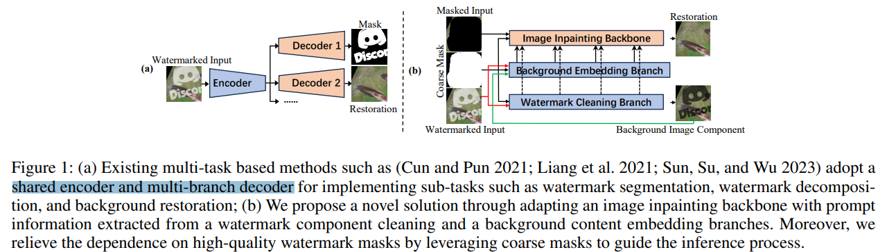
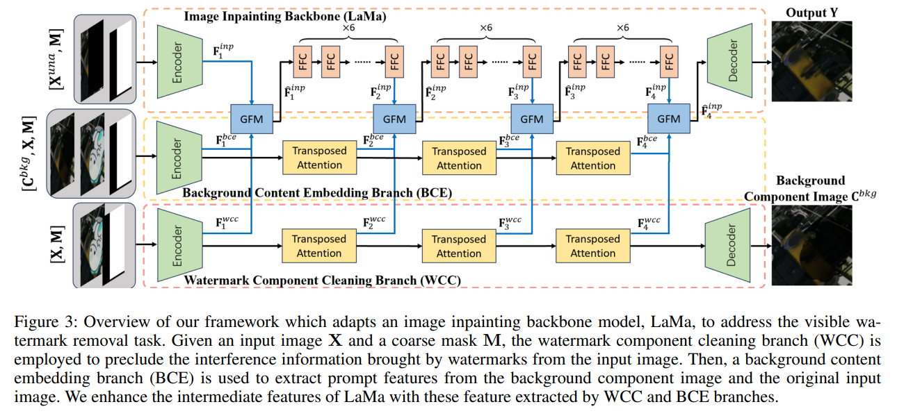
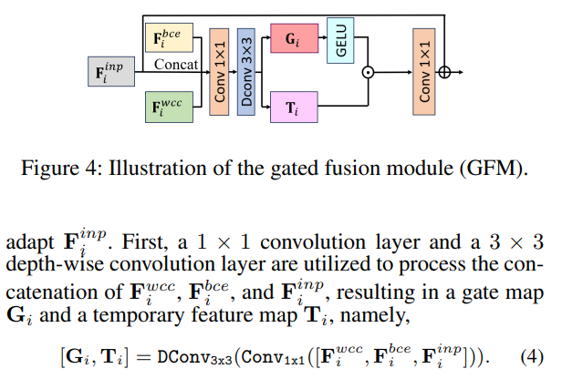
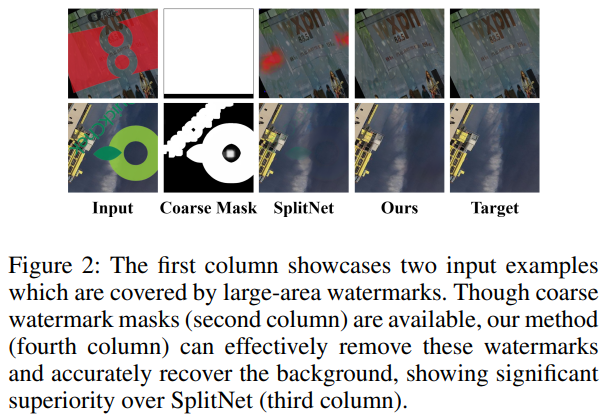

# Bridging Knowledge Gap Between Image Inpainting and Large-Area Visible Watermark Removal

> "Bridging Knowledge Gap Between Image Inpainting and Large-Area Visible Watermark Removal" Arxiv, 2025 Apr 7
> [paper](http://arxiv.org/abs/2504.04687v1) [code]() [pdf](./2025_04_Arxiv_Bridging-Knowledge-Gap-Between-Image-Inpainting-and-Large-Area-Visible-Watermark-Removal.pdf) [note](./2025_04_Arxiv_Bridging-Knowledge-Gap-Between-Image-Inpainting-and-Large-Area-Visible-Watermark-Removal_Note.md)
> Authors: Yicheng Leng, Chaowei Fang, Junye Chen, Yixiang Fang, Sheng Li, Guanbin Li

## Key-point

- Task: 水印图像去除
- Problems
- :label: Label:

## Contributions

## Introduction

## methods

先前方法，对图像用一个 Encoder 提取特征，多个 Decoder 分别输出 Mask & 去划痕结果。

本文提出用 image inpaint 方法改一下，只需要粗糙的 mask && **对 背景，水印部分单独提取特征**

多个 stage，先用粗糙 mask 划一下噪声位置，输出背景区域（不包含水印的图）。stage2: 把前面输出的背景图 & 含有水印的图 & 粗糙 mask 合在一起提取背景特征（水印遮住内容的特征），stage3 输入给 image inpaint 模型

- Q：怎么融合多个分支的特征？

concat 起来过卷积。。。

## setting

## Experiment

> ablation study 看那个模块有效，总结一下

## Limitations

## Summary :star2:

> learn what

### how to apply to our task

