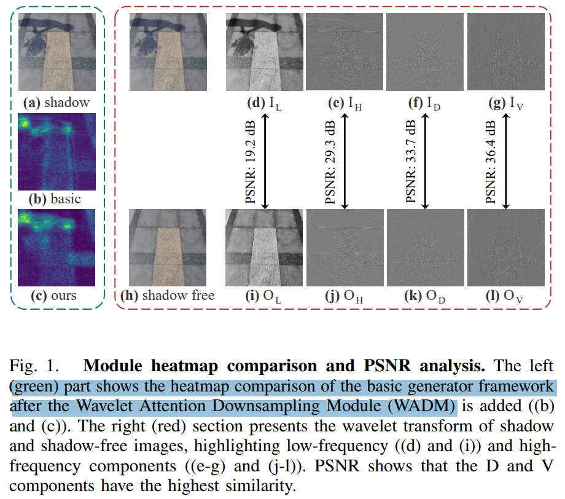
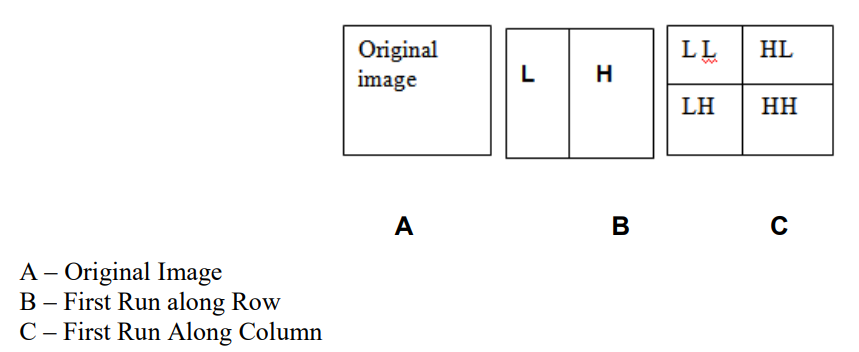
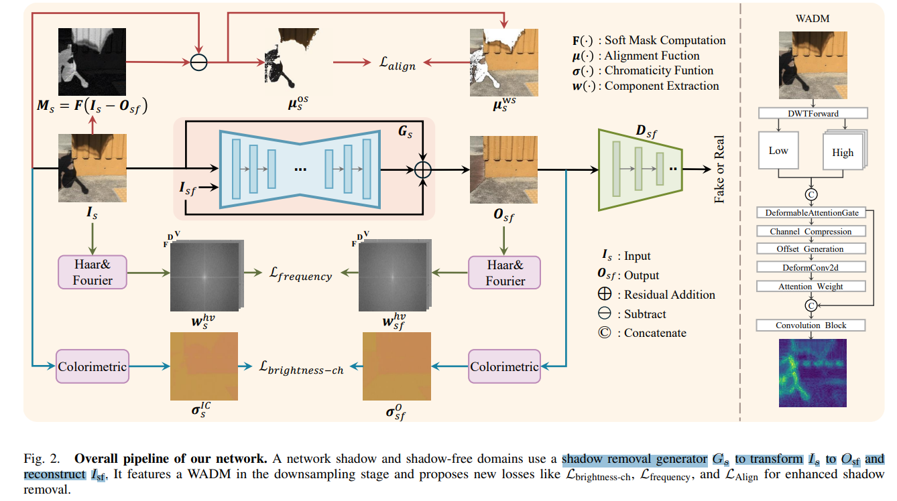
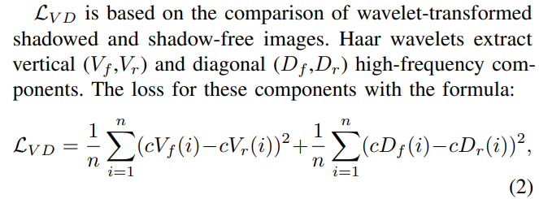
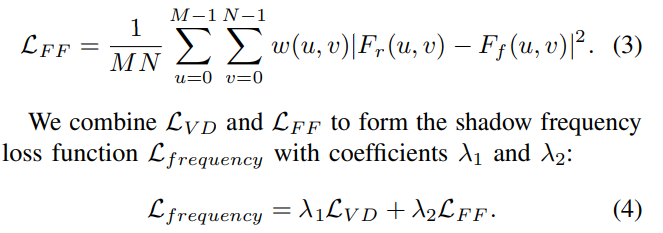
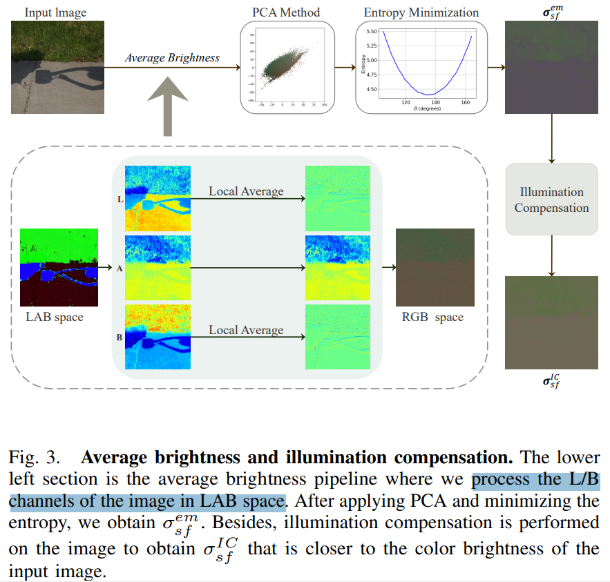
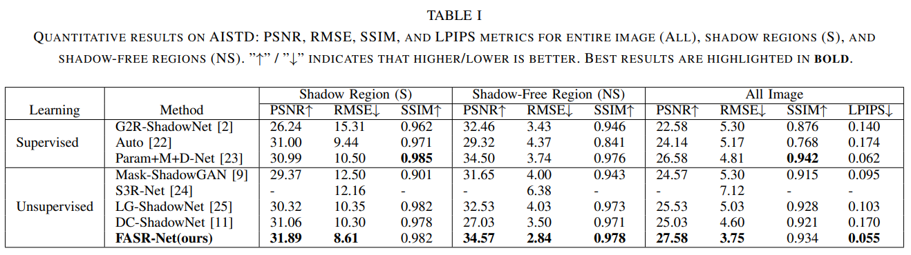
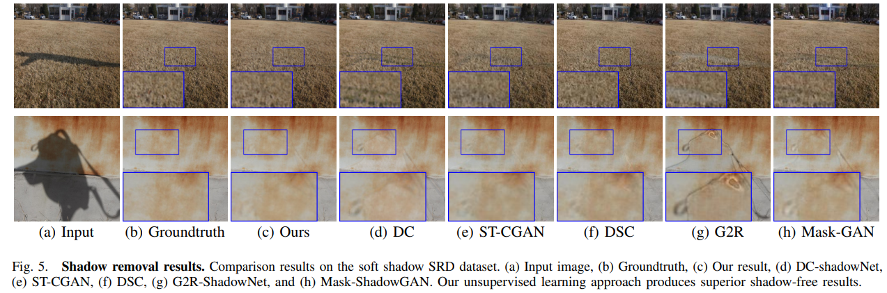
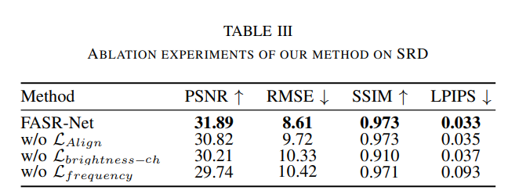

# FASR-Net: Unsupervised Shadow Removal Leveraging Inherent Frequency Priors

> "FASR-Net: Unsupervised Shadow Removal Leveraging Inherent Frequency Priors" Arxiv, 2025 Apr 8
> [paper](http://arxiv.org/abs/2504.05779v1) [code]() [pdf](./2025_04_Arxiv_FASR-Net--Unsupervised-Shadow-Removal-Leveraging-Inherent-Frequency-Priors.pdf) [note](./2025_04_Arxiv_FASR-Net--Unsupervised-Shadow-Removal-Leveraging-Inherent-Frequency-Priors_Note.md)
> Authors: Tao Lin, Qingwang Wang, Qiwei Liang, Minghua Tang, Yuxuan Sun

## Key-point

- Task: Shadow removal

- Problems

  - 影子没修复完整

    > Existing unsupervised methods often overlook shadow-specific priors, leading to incomplete shadow recovery

- :label: Label:

## Contributions

- 提出无监督的 Frequency Aware Shadow Removal Network (FASR-Net)

> To address this issue, we propose a novel unsupervised Frequency Aware Shadow Removal Network (FASR-Net), which leverages the inherent frequency characteristics of shadow regions.

- 使用小波变换，增强影子细节

>  the proposed Wavelet Attention Downsampling Module (WADM) integrates wavelet-based image decomposition and deformable attention, effectively breaking down the image into frequency components to enhance shadow details within specific frequency bands

- 使用多个 loss 增强模型学习的细节

> We also introduce several new loss functions for precise shadow-free image reproduction: a frequency loss to capture image component details, a brightness-chromaticity loss that references the chromaticity of shadow-free regions, and an alignment loss to ensure smooth transitions between shadowed and shadow-free regions. 

- SOTA

## Introduction

用 haar 小波的高频部分 & attn map 加了频率模块后的高频分量更细腻

### frequency

#### haar

- Q: haar wavelet 是啥

> https://www.whydomath.org/node/wavlets/hwt.html
>
> https://blog.csdn.net/m0_66890670/article/details/127721038

1D Haar Wavelet Transform 小波变换，**可以用平均值 & 差值的形式，组合表示一对数值 :star:**。有多对数 -> 多个平均值 & 差异 -> 前面每一对平均值继续类推，这个差异理解为高频细节，平均值理解为低频

- Q: haar wavelet 调整到 2D 图像里面 AHVD 是啥？

> https://www.whydomath.org/node/wavlets/hwt.html  :+1:
>
> How do we apply the HWT to a digital grayscale image? If the image is stored in matrix *A* with even dimensions M x N, then the natural thing to try is to compute *W**M**A* . We can view this matrix multiplication as *W**M* applied to each column of *A* so the output should be an **M x N matrix where each column is M/2 weighted averages followed by M/2 weighted differences.**

对 2D 图像就是在**多个方向做 1D haar 变换，计算平均值 & 差异**。

- 先按 height 方向，做 1D haar wavelet，竖直方向像素**成对计算平均值&差异**，就有了 H/2 个平均值 & H/2 个差异值

- 再对这个图做 width 方向 1D haar 变换

> 注意，这里图像矩阵可以表示为多个组成部分的乘积形式，看细节的时候看 https://www.whydomath.org/node/wavlets/hwt.html 

- 然后觉得左上角模糊的图像还不够模糊，还有很多细节咋搞？迭代把这个左上角的图像做上面两次的 1D haar 变换，注意这里就有了一个迭代次数

- Q：跟 entropy 有什么关系？

每一次做完 2D haar 变换，把左上角的图扔掉，看看损失多少信息量 -> **迭代次数 & 图像信息量的关系**

到这里就差不多了，再去看论文里面那个 LL， HL，LH，HH 的图或者 AHDV 的图就好理解了，**这个画的是做了两次 1D haar 的结果**

> https://core.ac.uk/download/pdf/234644244.pdf

#### focal frequency

> - "Focal Frequency Loss for Image Reconstruction and Synthesis" ICCV, 2020 Dec 23
>   [paper](http://arxiv.org/abs/2012.12821v3) [code]() [pdf](./2020_12_ICCV_Focal-Frequency-Loss-for-Image-Reconstruction-and-Synthesis.pdf) [note](./2020_12_ICCV_Focal-Frequency-Loss-for-Image-Reconstruction-and-Synthesis_Note.md)
>   Authors: Liming Jiang, Bo Dai, Wayne Wu, Chen Change Loy

## methods

GAN 方式训练，生成器 Gs，鉴别器 Ds

> Refer to Fig. 2 for an illustration of our method. The network has two domains: shadow Is and shadow-free Isf , with a shadow removal generator Gs that transforms Is into Osf and reconstructs Isf .

增加频率模块，使用 Harr 小波转为频率，做 Frequency loss。取 Haar 小波的 DV 部分 & FFT 的 F 部分

> In the generator and discriminator Ds framework containing the domain classifier, we propose a Wavelet Attention Down Module (WADM), which uses Haar wavelets to introduce frequency information and combines maximum pooling, average pooling, and deformable attention to enhance shadow detail capture.
>
> The shadow frequency loss Lfrequency is guided by the high-frequency components D and V in the wavelet transform and F in the Fourier transform

亮度增加一个 loss。把图像转为 LAB 空间，获取 chromaticity map 亮度图，输入输出做亮度 loss

> To guide Gs for shadow removal, we further propose new losses. 
>
> The brightnesschrominance loss Lbrightness-ch operates in the LAB color space. Guided by σ IC s in the brightness space of Is, we reduce the shadows of the L/B channels by mean filtering, then employ principal component analysis and entropy minimization to generate a shadow-free chromaticity map in the logarithmic chromaticity space. 

unmasked area 无影子区域做 align loss；

> Lastly, the shadow mask alignment loss LAlign adjusts the statistical characteristics of the masked area in the generated image to match the unmasked area of the target image.

###  Shadow Frequency Loss

使用 haar 变换提取高频部分 + focal frequency loss

对其一下文章定义高频部分的符号，HVD 高频分量

> Haar Wavelet Transform: When applying the Haar wavelet transform [14] to a 2D image of resolution H × W, the image is treated as a 2D signal. The process performs 1D Haar transforms on each row and column. Low-pass filter H and high-pass filter H1 reduce data length from L to L 2 , extracting low and high-frequency information. This yields four H 2 × W 2 components: **approximate component A and detail components H, V , and D in horizontal, vertical, and diagonal directions.** This lossless transform encodes information into the channel dimension, increasing channels from C to 4C.

取 V 和 D 分量做 MSE loss

> The shadow frequency loss combines the advantages of the horizontal-vertical and diagonal component loss LV D

focal frequency loss

### 亮度对齐

- Q：怎么计算 chromaticity map 亮度图？

转为 LAB 空间，对 L & B 通道取平均

## setting

## Experiment

> ablation study 看那个模块有效，总结一下

观察 GT 和论文方法的细节图，纹理差异还是蛮明显的。。。只能搞论文没法落地到高精度场景用啊。。。

### ablation

发现频率 loss 确实还可以啊，但没做 focal frequency loss 的消融

## Limitations

## Summary :star2:

> learn what

### how to apply to our task

- Q：怎么修正颜色色偏？
- unmasked area 无影子区域做 align loss；
