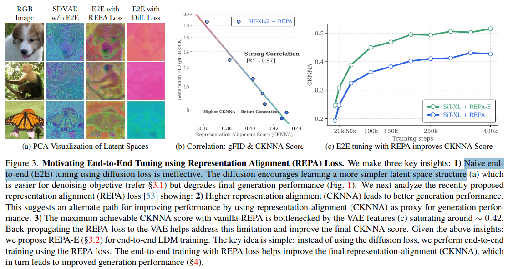

# REPA-E: Unlocking VAE for End-to-End Tuning with Latent Diffusion Transformers

> "REPA-E: Unlocking VAE for End-to-End Tuning with Latent Diffusion Transformers" Arxiv, 2025 Apr 14
> [paper](http://arxiv.org/abs/2504.10483v1) [code](https://github.com/End2End-Diffusion/REPA-E) [web](https://end2end-diffusion.github.io) [pdf](./2025_04_Arxiv_REPA-E--Unlocking-VAE-for-End-to-End-Tuning-with-Latent-Diffusion-Transformers.pdf) [note](./2025_04_Arxiv_REPA-E--Unlocking-VAE-for-End-to-End-Tuning-with-Latent-Diffusion-Transformers_Note.md)
> Authors: Xingjian Leng, Jaskirat Singh, Yunzhong Hou, Zhenchang Xing, Saining Xie, Liang Zheng

## Key-point

- Task

- Problems

  - UNet & VAE 能不能一起训练？

  > Can we train latent diffusion models together with the variational auto-encoder (VAE) tokenizer in an end-to-end manner?

  - 发现单独训练 VAE or UNet 用 diffusion loss 效果不好

  > However, for latent diffusion transformers, it is observed that end-toend training both VAE and diffusion-model using standard diffusion-loss is ineffective, even causing a degradation in final performance

- :label: Label:

## Contributions

- 提出 REPA-E loss 把 UNet & VAE 一起训练，在 REPA 基础上做了训练策略改进： VAE & UNet 交叉部分的梯度截断优化一下，看 fig1

> We show that while diffusion loss is ineffective, end-to-end training can be unlocked through the representation-alignment (REPA) loss − allowing both VAE and diffusion model to be jointly tuned during the training process.

- 加速 diffusion 训练速度，对比同样指标的训练步数，**REPA-E 比 diffusion loss 快 45x，比 REPA 快 17 倍**

> speeding up diffusion model training by over 17× and 45× over REPA and vanilla training recipes, respectively.

- 在 **256x256** ImageNet 数据上实验，end2end 训练发现 VAE 空间变好了！

> Interestingly, we observe that end-to-end tuning with REPA-E also improves the VAE itself; leading to improved latent space structure and downstream generation performance.

## Introduction

- Q：motivation？为什么之前 VAE 和 UNet 不在一起训练？？

作者认为一起训练会导致 latent space 爆炸。。。

> This is because directly using the diffusion loss to update the VAE (b) causes the latent space to collapse

- Q：看起来这个方法使用一起微调 UNet & VAE ，显存要求？

TODO

可视化 VAE 发现，使用 REPA-E 方法训练能够改善 VAE 空间；IN-VAE (f16d32) 训练的 VAE 反而会出现平滑的问题。。说使用 REPA-E 方法训练能够补上细节

- Q：怎么可视化 VAE?

> " Eq-vae: Equivariance regularized la tent space for improved generative image modeling"
>
> Following [25], we visualize latent space structure from different VAEs before and after end-to-end training using principal component analysis (PCA) that projects them to three channels colored by RGB

用 PCA 转到 RGB ？？

### RAPE

> - "Representation Alignment for Generation: Training Diffusion Transformers Is Easier Than You Think" ICLR, 2024 Oct 9
>   [paper](http://arxiv.org/abs/2410.06940v3) [code]() [pdf](./2024_10_Arxiv_Representation-Alignment-for-Generation--Training-Diffusion-Transformers-Is-Easier-Than-You-Think.pdf) [note](./2024_10_Arxiv_Representation-Alignment-for-Generation--Training-Diffusion-Transformers-Is-Easier-Than-You-Think_Note.md)
>   Authors: Sihyun Yu, Sangkyung Kwak, Huiwon Jang, Jongheon Jeong, Jonathan Huang, Jinwoo Shin, Saining Xie

## methods

> Given a variational autoencoder (VAE) and latent diffusion transformer (e.g., SiT [30]), we wish to jointly tune the VAE latent representation and diffusion model features in an end-to-end manner to best optimize the final generation performance.

- Q：对比 REPA 改进在哪？

前面论证了：diffusion loss 训练的 UNet+VAE 会造成 latent space 变平滑效果变烂，**思考不把 diffusion loss 梯度给 VAE **

因此改进训练策略，加一个 stop-grad，对于 VAE 只用 alignment loss 不再用 diffusion loss

> As discussed in Fig. 3a and §3.1, backpropagating the diffusion loss to the VAE causes a degradation of latent-space structure. To avoid this, we introduce a simple stopgrad operation which limits the application of diffusion loss LDIFF t

## setting

- All experiments are conducted on 8 NVIDIA H100 GPU
- Loss + DINOv2 特征

> The VAE regularization loss combines multiple objectives and is defined as: LREG = LKL + LMSE + LLPIPS + LGAN. For alignment loss, we use DINOv2 [33] as external visual features and apply alignment to the eighth layer of the SiT model

## Experiment

> ablation study 看那个模块有效，总结一下

用 SDVAE 初始化，diffusion loss 训练的 variance 降低 -> 特征变平滑，看 fig1 的指标不好，认为是 latent 变烂了。

发现直接全部微调，用 Diffusion-Loss 效果很烂，可视化后的 VAE 空间变平滑。。。

生成结果主管指标再不同模型上都好了一些

适用不同的 VAE，有 SD-VAE(f8d4), IN-VAE(f16d32), VA-VAE

- Q：如何证明？

看 PCA 可视化 VAE 的物体轮廓更明显。。。没搞重建啊

## Limitations

## Summary :star2:

> learn what

### how to apply to our task

- 这个方法需要微调整个 UNet & VAE，**试试看更小一点的模型，直觉来看修复来说生成量不多！**
- 用 REPA-E 方法微调试试，能否优化 VAE 空间

> 可视化 VAE 发现，使用 REPA-E 方法训练能够改善 VAE 空间；IN-VAE (f16d32) 训练的 VAE 反而会出现平滑的问题。。说使用 REPA-E 方法训练能够补上细节

