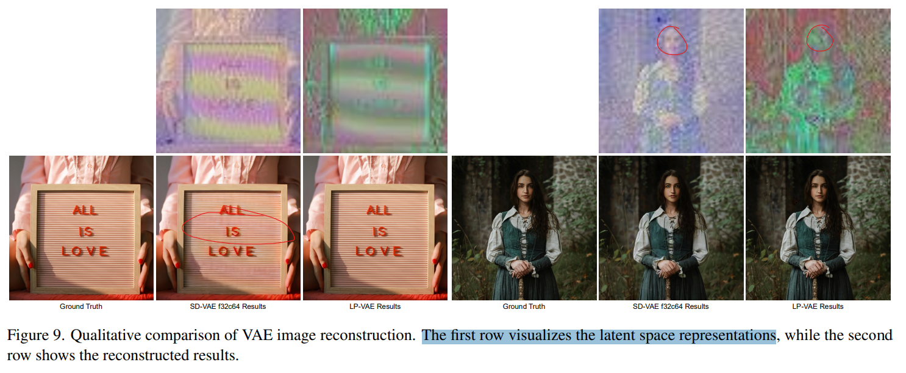

# ZipIR: Latent Pyramid Diffusion Transformer for High-Resolution Image Restoration

> "ZipIR: Latent Pyramid Diffusion Transformer for High-Resolution Image Restoration" Arxiv, 2025 Apr 11
> [paper](http://arxiv.org/abs/2504.08591v1) [code]() [pdf](./2025_04_Arxiv_ZipIR--Latent-Pyramid-Diffusion-Transformer-for-High-Resolution-Image-Restoration.pdf) [note](./2025_04_Arxiv_ZipIR--Latent-Pyramid-Diffusion-Transformer-for-High-Resolution-Image-Restoration_Note.md)
> Authors: Yongsheng Yu, Haitian Zheng, Zhifei Zhang, Jianming Zhang, Yuqian Zhou, Connelly Barnes, Yuchen Liu, Wei Xiong, Zhe Lin, Jiebo Luo

## Key-point

- Task: High-Resolution Image Restoration
- Problems
  - However, deploying these models at ultra-high resolutions faces a critical tradeoff between **quality and efficiency** due to the computational demands of long-range attention mechanisms.

- :label: Label:

## Contributions

- 提出 ZipIR, 压缩图像 F32，降低显存 -> **能够训练一个 DiT**

> To address this, we introduce ZipIR, a novel framework that enhances efficiency, scalability, and long-range modeling for high-res image restoration.
>
> ZipIR employs a highly compressed latent representation that compresses image 32×, effectively reducing the number of spatial tokens, and enabling the use of high-capacity models like the Diffusion Transformer (DiT). 
>
> Toward this goal, we propose a Latent Pyramid VAE (LP-VAE) design that structures the latent space into subbands to ease diffusion training

- 提出 Latent Pyramid VAE, f32

> Toward this goal, we propose a Latent Pyramid VAE (LP-VAE) design that structures the latent space into subbands to ease diffusion training.

- 2K 图像修复上的 SOTA

> Trained on full images up to 2K resolution, ZipIR surpasses existing diffusion-based methods, offering unmatched speed and quality in restoring high-resolution images from severely degraded inputs.

## Introduction

2K 修复一帧只要 7s ! 需要全部训练，**一个 3B 的模型**，但是呢一个 A100 80G 可以训练起来，相对比 SeeSR 只有 0.4B 左右的训练参数

### HR-IR

> Recently, blind IR methods have gained popularity [48, 56, 58], integrating multiple restoration tasks within unified frameworks that can generalize across diverse degradations, as exemplified by DiffBIR

GAN 生成的细节不行；Diffusion 计算量太大

> GAN-based methods have achieved realistic restoration results on real-world degraded images [48, 58]. However, these methods have limitations, particularly in preserving fine details under extreme scaling factors.
>
> Diffusion-based approaches like StableSR [46] and SUPIR [56], which leverage pre-trained models like Stable Diffusion [34, 38], have demonstrated notable improvements in restoration quality through multi-step processes, though these can be computationally intensive.

试试看用更大的 DiT 做修复

> Scaling up restoration models has shown promise, especially with advancements in large-scale architectures [56]. Our proposed method leverages the scalability of diffusion transformers [31] to tackle the complex, high-dimensional nature of HR-IR.

### Efficient Diffusion

减少去噪步数，蒸馏模型

> Samplingefficient methods [27, 39, 40, 55] reduce the number of sampling steps, thereby shortening runtime, while model-based optimizations refine model architecture, using strategies like pruning [7, 14] and linear-complexity modules [15, 26] to create faster, more compact models

同时模型大，显存撑不住。。。打算进一步降低 VAE 空间维度，拓展 C

> As diffusion models scale for high-resolution tasks, memory limitations and inference latency also become pressing issues

## methods

使用**多个 scale 的 VAE 提取特征，注意这里压缩比和 RGB 压缩比选好，使得 latent 尺寸除了 C 都一样**  -> 来支持高度压缩的空间。

注意这里 DiT 也只是在 F32 的那一个 VAE space 做哦，其他尺度 VAE 特征直接送到 VAE Decoder :star:

### LP-VAE

> To address these issues, we develop a novel Latent Pyramid VAE (LP-VAE) inspired by the Laplacian pyramid representation from image processing literature [3].

先改 VAE space，多加几个 downsample layer，减少 Self-attn 的 token 数量

> To enable billion-scale DiT models to operate at 2K resolution and beyond, our priority is to optimize latent channel capacity and deepen the latent space mapping by adding more downsampling layers. This reduces the token count, lowering the quadratic complexity of DiT built on selfattention

空间压缩 F32，拓展 C 避免信息损失

> As spatial compression increases, the spatial resolution of the latent representation shrinks, necessitating a corresponding increase in the latent channel count C to mitigate information loss

看最后训练的 LP-VAE 效果和 SD-VAE 没差多少。。相关工作 DC-VAE 直接 30 多了

### Pyramid Cascade Encoders

使用级联结构

> Cascading networks have proven effective in other generative models [20, 32, 43], which allows different networks to independently learn representations at different resolutions, optimizing overall pipeline performance.

- Q：多个特征怎么融合？

最高一层 Fine Level F32 C52 ....

> For f = 32, the fine-level encoder operates on the original image I without downsampling, producing a 52-channel latent encoding zfine ∈ R 52× H 32 × W 32 . 

Coarse Level  先 RGB 下采样 1/4，F8C9

>  The coarse-level encoder captures lower-resolution features with an 4× downsampled input, I↓4 ∈ R 3× H 4 × W

Macro Level 先把图像下采样 1/32，直接用 RGB 作为特征

3 个 level 特征，直接在 C 上 concat 起来，**得到一个 $C=52+9+3 = 64$ 的特征**

> Finally, the concatenated latent code across all levels, denoted by z = [zmacro; zcoarse; zfine], serves as the final highlycompressed 64-channel representation.

看这个图左下角那个 Cascaded Latent Maps

- Q: 显存？

后面说 1* 80G A100 可以搞 8K

#### Progressive Training

**要从头训练多个 VAE，训练量太大了。。。**

3个 level 逐个 level 训练，**先训 coarse level 的 VAE** $(Z_{macro}, Z_{coarse}) \to C=12$，然后把 Coarse Level 的 Decoder 扔掉

> We employ a progressive training approach. Training begins with the coarse-level encoder Ec, which requires a decoder Dc to reconstruct the 12-channel latent [zmacro; zcoarse] into pixel space
>
> After completing this training stage, the coarse-level decoder Dc is discarded.

coarse level VAE 冻住，训练 fine level VAE,  VAE space C=64 -> RGB

> Progressively, the next stage involves training the **fine-level autoencoder** to achieve full-level compression. The left side of Fig. 2 illustrates this stage, the **fine-level decoder Df is trained to reconstruct from a 64-channel latent z back to pixel space**, while the coarse-level encoder remains frozen.

- Q：训练 loss? :star:

 discriminator loss and LPIPS loss

> For both training phases, we use a combination of discriminator loss and LPIPS loss as recommended in [13].
>
> "Taming transformers for high-resolution image synthesis." VQ-GAN

### Pixel-aware Decoder

光靠 VAE 还是有细节 loss

>  However, without access to the full-resolution input, the decoder remains suboptimal for image processing applications, particularly restoration tasks that demand high pixel fidelity and detailed quality.

对 VAE Decoder 加 residual :star:

> we incorporate pixel-level details through skip connections to add spatial information during LP-VAE decoding, leading to a pixel-aware decoder Df∗

- Q：怎么训练？

用 VAE 权重初始化 RGB 特征提取器

Encoder 冻住，训练 RGB 特征提取 & VAE Decoder

> To capture spatial features, we replicate an LP-VAE subencoder, Ef , initializing it with weights from the pretrained Ef . This degradation-aware feature extractor specifically handles degraded images, such as those blurred, noisy, or affected by JPEG artifacts.
>
> To train the pixel-aware decoder D∗ f , we freeze the original Ef , but unlock the degradation-aware feature extractor and the entire decoder. 

- Q：motivation?

> With image reconstruction as the learning objec tive, this set-up enables the decoder to learn how to utilize low-quality images to complement the highly compressed latent code with pixel-level details. 

- Q：为什么说可以在训完 DiT 之后，finetune Decoder？

还是在同一个 latent space，认为学到得 DiT 不会改变 VAE space 分布。这里他们一开始训练了一个 F32C64 的 VAE，假设 vae loss 已经很小了

> Note that decoder fine tuning can occur after diffusion training to enhance quality, since the latent space is not altered by freezing Ef.

- Q：噪声？

blurred, noisy, or affected by JPEG artifacts.

- Q：residual 加到 VAE Decoder 哪里?

upsampling block 后面

> Additional residual layers are inserted between upsampling blocks in each layer of the LP-VAE decoder Df to pass multiscale spatial information from the degradation-aware feature extractor, effec

通过这里 Decoder 进一步加入细节，是训练完 DiT 之后，为了提升效果搞得哦！:star:

> With image reconstruction as the learning objective, this set-up enables the decoder to learn how to utilize low-quality images to complement the highly compressed latent code with pixel-level details.
>
> Note that decoder finetuning can occur after diffusion training to enhance quality, since the latent space is not altered by freezing Ef .

### Ultra-SR

> To further evaluate whether our method can generalize effectively to ultra-high-resolution image super-resolution, such as 4K and even 8K, we conducted additional experiments. 

256 -> 4K SR，放大看细节可以啊

## setting

LP-VAE  使用 bs=512 训练 5w it

> For training both LP-VAE and DiT, we use 300 million curated stock images paired with text as the data source. 
>
> For the **coarse-scale** sub-model of LP-VAE, we use a batch size of 512 and run for 50K iterations. 
>
> For the **fine-scale submodel,** we start with a batch size of 160 on 5122 cropped patches for 100K iterations, followed by a 1K patch adaptation with a batch size of 32 on 10242 cropped patches for 50K iterations.

DiT 训练 25w it, diffusion loss，bs128；推理 DDIM 去噪 25 步

> For DiT, we mix resolutions and aspect ratios to sample training images, similar to [34], using a batch size of 128 over 250K iterations
>
>  For DiT, we mix resolutions and aspect ratios to sample training images, similar to [34], using a batch size of 128 over 250K iterations, with the standard learning objective [31] guiding the training process. Inference for ZipIR employs the DDIM sampler with 25 denoising steps.

- All efficiency evaluations were conducted on an A100-80G GPU

## Experiment

> ablation study 看那个模块有效，总结一下

$128^2 \to 2048^2 $ 只需要 6.9s!

纹理比 DiffBIR 好很多

### ablation

对比 LP-VAE，SD f8c4 确实拉了

看一下重建效果， SDVAE 确实不行

SD-VAE 对于高频细节，例如文字 & 面部 & 纹理确实不行

> To intuitively highlight the differences between our proposed LP-VAE and a straightforward deepening of SDVAE, we present a qualitative comparison of LP-VAE and SD-VAE f32c64 on 2048-resolution image reconstruction. Both LP-VAE and SD-VAE f32c64 perform 32× image compression and use a 64-channel dimensionality to represent the latent space. As shown in Figure 9, our proposed LP-VAE faithfully reconstructs the images, while SD-VAE f32c64 struggles to recover high-frequency details such as text and facial features

## Limitations

## Summary :star2:

> learn what

### how to apply to our task

- Q：本文怎么 finetune Decoder？

本文认为学到得 DiT 不会改变 VAE space 分布，还是在同一个 latent space。这里他们一开始**训练了一个 F32C64 的 VAE，假设 vae loss 已经很小了，没考虑 VAE 重建损失**

> Note that decoder fine tuning can occur after diffusion training to enhance quality, since the latent space is not altered by freezing Ef.

- Q：我们 motivation ？

我们是在 SD-VAE 上面有较大损失的 VAE-space 上面修复，重新训练 VAE Encoder -> Diffusion -> Decoder 训练量太大，等于从头来一遍。。。

因此我们希望实现功能：通过 VAE 微调改进 VAE-space，**把 SD-VAE 的重建损失通过 Decoder 补起来**

1. 把 VAE 重建中**损失掉的细节补上去，保持 Diffusion 修复后的颜色**。
2. 加入 Temporal Layers **提升视频连续性**（其他工作证明可行）
3. 对于有损失我们修复坏掉的部分，重新用 LQ 改一改（最坏就是**干脆不要修复的内容，取原来的**）

- Q：怎么实现 `修复坏掉的部分，干脆不要修复的内容，取原来的` 这个功能呢?

用 GAN loss？让鉴别器自己去学，发现改不成 GT 就用 LQ

