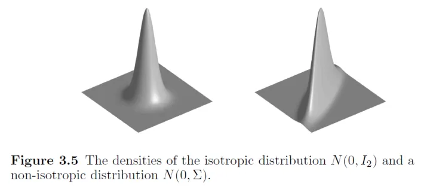
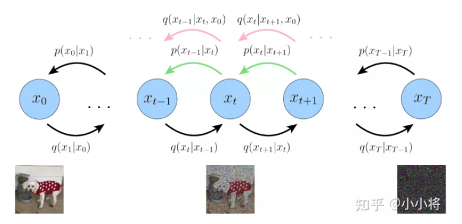
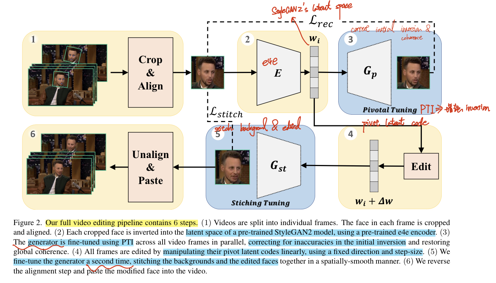

# Tongji_CV_Group_Journey

Rongji Xun	rongji.xun@gmail.com

> This document works as an **index to record the read papers.** And currently working on using generative models(Diffusion models)  to solve Old-films restoration problems. :laughing:
>
> - Use :baby: emoji to denote the **understanding status** for each paper.
>
>   - :baby: Only know the general methods, only partial details
>   - :star: understand the purposed methods in paper, but lack understanding for related methods or some code implementation details
>   - :star2: understand all the details and its code implementation
>   - :heavy_check_mark: reappear the paper with custom data
>
>   Note that **It's ok not understand the main methods in paper at first read.** Mark it as  :baby: emoji, go for making up for the lacking knowledge, keep reading and **check the paper again to update the emoji when have a deeper understanding** of related methods. :hugs:
>
> - Paper Importance extra status
>
>   - :statue_of_liberty: SOTA methods
>   - :moyai: MileStone
>   - :baseball: baseline methods in the paper
>   - :dart: Current working direction
>
> - GPU comparison website [GPU 4090vs V100](https://topcpu.net/gpu-c/GeForce-RTX-4090-vs-Tesla-V100-PCIe-32-GB) to evaluate whether the GPU resources is adequate to reappear the methods in paper.


## TODO PaperList

> https://orpatashnik.github.io/ 看一下这个组的工作 >> StyleCLIP, StyleGAN-NADA
> [Daniel Cohen-Or Blog](https://danielcohenor.com/publications/)

**Target: Old film restoration**

- [ ] 复现 Bringing Old Films Back to Life
- [ ] 融合 diffusion
- [ ] 数据


**Diffusion in Video** :1st_place_medal:

- [x] Bringing Old Photos Back to Life

  - [ ] code

- [ ] **Bringing Old Films Back to Life :fire: :star:**

  - [x] paper Summary
  - [ ] code

- [ ] [DeepRemaster: Temporal Source-Reference Attention Networks for Comprehensive Video Enhancement](http://iizuka.cs.tsukuba.ac.jp/projects/remastering/en/index.html)

  > **Bringing Old Films Back to Life** 's baseline
  >
  > [2019_SIGGRAPH_DeepRemaster-Temporal-Source-Reference-Attention-Networks-for-Comprehensive-Video-Enhancement.pdf](./2019_SIGGRAPH_DeepRemaster-Temporal-Source-Reference-Attention-Networks-for-Comprehensive-Video-Enhancement.pdf)

- [ ] Modernizing Old Photos Using Multiple References via Photorealistic Style Transfer

  https://kaist-viclab.github.io/old-photo-modernization/?utm_source=catalyzex.com

- [ ] **[Stitch it in Time: GAN-Based Facial Editing of Real Videos](https://stitch-time.github.io/)**

  - [x] paper
  - [ ] code
  - [ ] [2021_CVPR_StyleCLIP-Text-Driven-Manipulation-of-StyleGAN-Imagery.pdf](./2021_CVPR_StyleCLIP-Text-Driven-Manipulation-of-StyleGAN-Imagery.pdf)
    [Or Patashnik](https://orpatashnik.github.io/), [Zongze Wu ](https://www.cs.huji.ac.il/~wuzongze/), [Eli Shechtman ](https://research.adobe.com/person/eli-shechtman/), [Daniel Cohen-Or ](https://www.cs.tau.ac.il/~dcor/), [Dani Lischinski](https://www.cs.huji.ac.il/~danix/)
  - [ ] [2020_CVPR_InterFaceGAN_Interpreting-the-Latent-Space-of-GANs-for-Semantic-Face-Editing.pdf](./2020_CVPR_InterFaceGAN_Interpreting-the-Latent-Space-of-GANs-for-Semantic-Face-Editing.pdf)

- [ ] **Diffusion Video Autoencoders: Toward Temporally Consistent Face Video Editing via Disentangled Video Encoding**

  - [ ] code
  - [ ] 复现论文，评估算力是否足够

- [ ] [2023_Pix2Video: Video Editing using Image Diffusion >>paper with code](https://paperswithcode.com/paper/pix2video-video-editing-using-image-diffusion)

  https://github.com/G-U-N/Pix2Video

- [ ] [2022_ICLR_DDNM_Zero-Shot-Image-Restoration-Using-Denoising-Diffusion-Null-Space-Model](./2022_ICLR_DDNM_Zero-Shot-Image-Restoration-Using-Denoising-Diffusion-Null-Space-Model_Note.md)

- [ ] [2022_WACV_Pik-Fix-Restoring-and-Colorizing-Old-Photos.pdf](./2022_WACV_Pik-Fix-Restoring-and-Colorizing-Old-Photos.pdf)

- [ ] [HistoryNet](https://github.com/BestiVictory/HistoryNet#historynet)


**Diffusion/GAN Related**

- basics

  - [ ] StyleGAN V1-2-3

  - [x] VQ-GAN

  - [ ] High-Resolution Image Synthesis with Latent Diffusion Models :+1: 里程碑

    https://github.com/CompVis/latent-diffusion?utm_source=catalyzex.com

    https://github.com/CompVis/stable-diffusion

  - [ ] [2022_Understanding Diffusion Models-A Unified Perspective.pdf](./2022_Understanding Diffusion Models-A Unified Perspective.pdf) :+1:

  - [ ] DDPM

  - [ ] DDIM

  - [ ] IDDPM

  - [ ] DDRM

  - [ ] Score-based

  - [ ] BeatGAN

  - [ ] [VAE 博客](https://zhuanlan.zhihu.com/p/34998569) 提供了一个将概率图跟深度学习结合起来的一个非常棒的案例
    [code](https://github.com/bojone/vae)
    
  - [ ] CycleGAN and pix2pix in PyTorch https://github.com/junyanz/pytorch-CycleGAN-and-pix2pix

- [x] Zero-Shot Image Restoration Using Denoising Diffusion Null-Space Model :+1:
  - [x] paper
  - [ ] code
  
- [ ] Palette: Image-to-Image Diffusion Models

- [ ] [Drag Your GAN: Interactive Point-based Manipulation on the Generative Image Manifold](https://github.com/XingangPan/DragGAN) :moyai:

- [ ] Pix2Video

- [ ] Self-Supervised Learning with Random-Projection Quantizer for Speech Recognition

  参考 random-projection 操作

- 小波变换
  - [ ] Wavelet Diffusion Models are fast and scalable Image Generators :+1:
  - [ ] [2023_Fourmer-An Efficient Global Modeling Paradigm for Image Restoration.pdf](./2023_Fourmer-An Efficient Global Modeling Paradigm for Image Restoration.pdf)
  
- Image2Image Translation
  - [ ] [2023_Zero-shot-Image-to-Image-Translation.pdf](./2023_Zero-shot-Image-to-Image-Translation.pdf)
    [github repo](https://github.com/pix2pixzero/pix2pix-zero)

- [ ] Locally Hierarchical Auto-Regressive Modeling for Image Generation :+1:

  https://github.com/kakaobrain/hqtransformer

- [ ] JPEG Artifact Correction using Denoising Diffusion Restoration Models

- [ ] Scalable Diffusion Models with Transformers

- [ ] All are Worth Words: A ViT Backbone for Diffusion Models

- [ ] Implicit Diffusion Models for Continuous Super-Resolution

- [ ] LayoutDM: Transformer-based Diffusion Model for Layout Generation

- [ ] Vector Quantized Diffusion Model for Text-to-Image Synthesis

- [ ] Image Super-Resolution via Iterative Refinement

- [ ] Real-World Denoising via Diffusion Model

- [ ] Diffusion in the Dark A Diffusion Model for Low-Light Text Recognition

- [ ] Exploiting Diffusion Prior for Real-World Image Super-Resolution

  https://iceclear.github.io/projects/stablesr/?utm_source=catalyzex.com
  [2023_preprint_Exploiting-Diffusion-Prior-for-Real-World-Image-Super-Resolution.pdf](./2023_preprint_Exploiting-Diffusion-Prior-for-Real-World-Image-Super-Resolution.pdf)

- [ ] Privacy Leakage of SIFT Features via Deep Generative Model based Image Reconstruction


> 相关方向：大致理解 abstract + framework；Basics 理解 code

**Segmentation**

- [ ] SAM :star: >> story
- [ ] Fast Segment Anything https://github.com/CASIA-IVA-Lab/FastSAM >> FPS25
- [ ] UniAD CVPR23 Best paper
- [ ] MobileSAM https://mp.weixin.qq.com/s/zTakIRIsWOUBiUr3yn5rhQ

**Transformer  & Attention:moyai:**

- [ ] On the Expressivity Role of LayerNorm in Transformer's Attention  
  https://github.com/tech-srl/layer_norm_expressivity_role 这个工作可以加深对 transformer 的一些理解 :star:

- [ ] HaloNet padding 方式的注意力

  Scaling Local Self-Attention for Parameter Efficient Visual Backbones

- [ ] **SwimTransformer**

- [ ] SpectFormer: Frequency and Attention is what you need in a Vision Transformer  
  https://github.com/badripatro/SpectFormers

- [ ] Learning A Sparse Transformer Network for Effective Image Deraining 
  https://github.com/cschenxiang/DRSformer
  
- [ ] FEDformer: Frequency Enhanced Decomposed Transformer for Long-term Series Forecasting :star: 时序数据
  https://github.com/MAZiqing/FEDformer
  
- [ ] Permuted AdaIN: Reducing the Bias Towards Global Statistics in Image Classification
  https://github.com/onuriel/PermutedAdaIN  这个工作很简单但是对于提升模型鲁棒性很有效，大家都可以看一下

  理解核心的那一小段代码即可


**MAE**

- [ ] **MAE**

- [ ] Siamese Masked Autoencoders 

  Masked Siamese Networks for Label-Efficient Learning
  https://github.com/facebookresearch/msn

  MixMask: Revisiting Masking Strategy for Siamese ConvNets
  https://github.com/LightnessOfBeing/MixMask
  这几个半监督/自监督的工作很有意思，大家好好看下

- [ ] SimMIM: a Simple Framework for Masked Image Modeling 

- [ ] Hard Patches Mining for Masked Image Modeling https://mp.weixin.qq.com/s/YJFDjcTqtX_hzy-FXt-F6w

- [ ] Masked-Siamese-Networks-for-Label-Efficient-Learning


**NLP & 多模态**

- [ ] Multimodal Prompting with Missing Modalities for Visual Recognition
  https://github.com/YiLunLee/Missing_aware_prompts  训练或者测试是多模态非完美情况
- [ ] Is GPT-4 a Good Data Analyst
  https://github.com/damo-nlp-sg/gpt4-as-dataanalyst

**对比学习**

- [ ] CCPL: Contrastive Coherence Preserving Loss for Versatile Style Transfer 
  https://github.com/JarrentWu1031/CCPL

**LDR->HDR**

- [ ] DRHDR: A Dual branch Residual Network for Multi-Bracket High Dynamic Range Imaging
- [ ] Networks are Slacking Off: Understanding Generalization Problem in Image Deraining
- [ ] Image-based CLIP-Guided Essence Transfer
- [ ] Luminance Attentive Networks for HDR Image and Panorama Reconstruction
  https://github.com/LWT3437/LANet 
- [ ] Perceptual Attacks of No-Reference Image Quality Models with Human-in-the-Loop
- [ ] Perception-Oriented Single Image Super-Resolution using Optimal Objective Estimation 
- 小波变换 >> 无损
  - A simple but effective and efficient global modeling paradigm for image restoration
  - 周满


**NeRF & Implicit Neural Representations**

- [x] [2023_CVPR_Inverting-the-Imaging-Process-by-Learning-an-Implicit-Camera-Model_Note.md](./2023_CVPR_Inverting-the-Imaging-Process-by-Learning-an-Implicit-Camera-Model_Note.md)
- [ ] Neural Volume Super Resolution
  https://github.com/princeton-computational-imaging/Neural-Volume-Super-Resolution  NeRF+SR
- [x] LERF: Language Embedded Radiance Fields 
  https://github.com/kerrj/lerf  NeRF + 3D CLIP
- [ ] Implicit Neural Representations for Image Compression
  https://github.com/YannickStruempler/inr_based_compression 
- [ ] iNeRF: Inverting Neural Radiance Fields for Pose Estimation 
- [ ] ViP-NeRF: Visibility Prior for Sparse Input Neural Radiance Fields 
- [ ] AdaNeRF: Adaptive Sampling for Real-time Rendering of Neural Radiance Fields
- [ ] 2022_CVPR_Aug-NeRF--Training-Stronger-Neural-Radiance-Fields-with-Triple-Level-Physically-Grounded-Augmentations >> 输入增加扰动


**Neural Operators**

- [ ] Factorized Fourier Neural Operators
  https://github.com/alasdairtran/fourierflow
- [ ] Super-Resolution Neural Operator :grey_question:
  https://github.com/2y7c3/Super-Resolution-Neural-Operator
- [ ] Adaptive Fourier Neural Operators: Efficient Token Mixers for Transformers
  https://github.com/NVlabs/AFNO-transformer
- [ ] Fourier Neural Operator for Parametric Partial Differential Equations
  https://github.com/neuraloperator/neuraloperator


## PaperReadingSuggestion

- 论文笔记

  主要看懂方法；总结学到了啥（总结创新点，分析如何能用到自己的任务；提到的典型方法；...）

  **Background**

  **Contributions**

  **Related Work**

  **methods**

  **Unsolved Limitations**
  
  **Summary :star2:**
  
  > learn what & how to apply to our task
  
  
  
- 文章阅读建议

  每周 5 篇精读，一篇文章要看多次的，第一次看完不懂没关系，但要记录下来后面再看！**一定要整理 code，进性总结 :star::star:** 

  > https://gaplab.cuhk.edu.cn/cvpapers/#home  这里整理分类了近几年计算机视觉方面重要会议（CVPR，ICCV，ECCV，NeurIPS，ICLR）的文章和代码，大家可以多看看
  >
  > https://openaccess.thecvf.com/menu 这是CVF的官网，一些计算机视觉一些重要会议（CVPR，ICCV，WACV）的所有文章附录等材料
  >
  > https://www.ecva.net/index.php 这是ECCV的官网，历年的文章附录都有
  >
  > 建议这些会议（CVPR，ICCV，ECCV，NeurIPS，ICLR，ICML，AAAI，IJCAI，ACMMM等）的文章以及一些重要期刊（T-PAMI，T-IP，TOG，TVCG，IJCV，T-MM，T-CSVT等）大家多阅读，相同或者相近任务的文章至少全部粗读一遍，然后选择性精读，需要学会使用Google学术和GitHub查询有用资料


**diffusion model 用于老电影修复**。不要局限于技术细节，都看一下，只不过要学会某些进行略读
implicit neural representation 和 Neural Operator 这两个领域可以重点看看，将其应用于我们的 task

- 初期选一篇文章复现一下
  - [ ] BringOldFilmsBackToLife
  - [ ] Diffusion Video Autoencoders
- Possible direction
  - [ ] diffusion 稳定 or 加速训练
  - [ ] ControlNet >> 能否借鉴到 video editing :star:
- GAN 之前存在的问题，一些思想能否用到 diffusion 中
  - 模式崩塌：多样性很差，只生产几个类别，质量比较好
  - **Limited Data 看思想**，
  - wavelet diffusion models


## PaperWriting

> Latex Reference 直接在 Google research 上获取引用格式

- Abstract

  按句子：1 背景；2-3 存在问题；4-5-6 提出的方法，创新点；7实验证明有效

- introduction

  按段落可参考一下方式

  P1 介绍的任务 2-3C. 应用 & 但存在啥问题。早期的工作 3-4 个，**按总结的角度来列举**，不要只写 A propose B propose ...（挑3-4 个非常有名 or 典型的）

  P2 **按时间线**早期到近期写。但是还存在啥问题。

  P3 提出的方法

- related work 可以开 3 个小章节

  例如本文用到了 CLIP, MAE 在 LDR 任务上，可以分为以下三个小节介绍

  - LDR
  - CLIP
  - MAE

- Proposed Methods

  按一下顺序

  - overview

    按完整流程，结合公式详细，有条理的讲清楚本文的方法。同时，Framework 图下面 caption要很清楚，因为一般审稿人会先看 methods overview -> framework_graph。

  - 几个 proposed module xx

  - loss function
  
  > - 期刊：3.4 Methods 写完一般写到 6.5 页。初稿不算 reference 写12-13页，DL 实验部分一般4.5页
  >
  > - 公式
  >
  >   变量斜体，操作/运算符用正体 （Relu）

# GroupMeeting Note

> 6.30

- Inter-Instance Similarity Modeling for Contrastive Learning

  `PatchMix`

  

- No-Reference Image Quality Assessment via Multibranch Convolutional Neural Networks

- SparseFusion: Distilling View-conditioned Diffusion for 3D Reconstruction

  > Diffusion Model >> distillation

- PixelNeRF

- Luminance Attentive Networks for HDR Image and Panorama Reconstruction

- ExpandNet: A Deep Convolutional Neural Network for High Dynamic Range Expansion from Low Dynamic Range Content
  https://arxiv.org/abs/1803.02266 :star:

- A New Journey from SDRTV to HDRTV


# IQA

> [CVPR IQA 博客](https://zhuanlan.zhihu.com/p/154017806)

IQA(image quality assessment) Task target: quantification of human perception of image quality

- Application

  想对某一项视觉任务评估图像能否满足需要，比如针对人脸识别的质量评价，看一幅图像是否应该拒绝还是输入到人脸识别系统中

  - texture classification
  - texture retrieval （texture similarity）
  - texture recovery

  对于图像下游任务：denoising, deblurring, super-resolution, compression，能够提升图像质量

- Full Reference, No-reference 


## DISTS

> [2020_TPAMI_DISTS_Image-Quality-Assessment-Unifying-Structure-and-Texture-Similarity_Note.md](./2020_TPAMI_DISTS_Image-Quality-Assessment-Unifying-Structure-and-Texture-Similarity_Note.md)

针对有明显纹理的原图，让模型对 JPEG 压缩后、resample 的图像打分（实际上肉眼看上去 JPEG 更加模糊），之前方法对于 JPEG 图像质量评分错误地高于 resample 图。


## Re-IQA

> [2023_CVPR_Re-IQA-Unsupervised-Learning-for-Image-Quality-Assessment-in-the-Wild.pdf](./2023_CVPR_Re-IQA-Unsupervised-Learning-for-Image-Quality-Assessment-in-the-Wild.pdf)

一种 NR-IQA 算法，使用对比学习的方式，使用 2 个 Res50 去学习 content & image-quality-aware features. 最后加一个 regressor 输出 image quality scores.
对于 quality feature 一路，模仿 MoCoV2 ，修改了构造正负样本的方式进行训练。

- `Full-reference IQA` 方法 对于 images in the wild 场景，没有 reference 应用受限

  FR-IQA 需要参考图像（undistorted） & distorted 图像，一起才能输出评分。

- high-level content representation using MoCoV2

  2 crops from same image -> similar scores, but not the case for some human viewers.

  

  


# NeRF/HDR

- [What is HDR or LDR image?](https://www.easypano.com/showkb_228.html)
  **dynamic range** refers to *ratio between the brightest and darkest*（最亮与最暗亮度的比值） parts of the scene. **The Dynamic Range of real-world scenes can be quite high - ratios of 100,000:1** are common in the natural world.

  - HDR(High Dynamic Range)

    HDR image (image of 32bit/color channel) shows the dynamic range of real world (natural dynamic range is **generally considered to be 100,000:1 （十万比一）**

    the **dynamic range human eyes** can identify is around 100,000:1

    So from broad sense （consider the standard display equipment）, image with **dynamic range of higher than 255:1 (8 bit per cooler channel)** is regarded as HDR image.

  - LDR(Low Dynamic Range)

    Dynamic range of JPEG format image won't exceed 255:1, so it is considered as LDR (Low Dynamic Range).

  - [Tone mapping 进化论](https://zhuanlan.zhihu.com/p/21983679)

    对于 HDR Image 如果要显示到 LDR 设备，**需要 tone mapping 的过程，把HDR变成LDR**

  

- camera response function
  $$
  P = f(E) \\
  \text{where E is the image's irradiance, and P is the pixels' value}
  $$

- ghost artifact

  > [***What is ghosting and how do you measure it?*** ](https://mriquestions.com/ghosting.html)

  ***Ghosting*** is a type of structured noise appearing as repeated versions of the main object (or parts thereof) in the image. They occur because of signal instability between pulse cycle repetitions. Ghosts are usually blurred, smeared, and shifted and are most commonly seen along the phase encode direction. One of the most famous of these is the so-called ***Nyquist N/2 ghost***,

- image intensity 表示每个通道的图像的像素灰度值（值的大小）

- [radiance & irradiance](https://blog.csdn.net/u010476094/article/details/44106203)

  irradiance 入射光线

- [White balance](https://www.cambridgeincolour.com/tutorials/white-balance.htm)

  White balance (WB) is the **process of removing unrealistic color casts, so that objects which appear white in person are rendered white in your photo**. Proper camera white balance has to take into account the "color temperature" of a light source, which refers to the relative warmth or coolness of white light. Our eyes are very good at judging what is white under different light sources, but digital cameras often have great difficulty with auto white balance (AWB)


## Implicit camera model

> [2023_CVPR_Inverting-the-Imaging-Process-by-Learning-an-Implicit-Camera-Model_Note.md](./2023_CVPR_Inverting-the-Imaging-Process-by-Learning-an-Implicit-Camera-Model_Note.md)

Represent the visual signal using implicit coordinate-based neural networks is recent trend in CV. Existing methods directly conider using the whole NN to represent the scene, and **not consider the camera separately.**
The paper **proposed a new implicit camera model (using implicit neural network)** to represent the physical imaging process. 使用 NeRF 单独模拟相机模型和 scene，实现解耦，增加可调节能力


# GAN


## StyleGAN :baby:

> [StyleGAN_Note.md](./StyleGAN_Note.md)


## VQ-GAN :baby:

> [2021_CVPR_VQGAN_Taming-Transformers-for-High-Resolution-Image-Synthesis_Note.md](./2021_CVPR_VQGAN_Taming-Transformers-for-High-Resolution-Image-Synthesis_Note.md)


# Diffusion in Video :dart:

## Dataset

- FFHQ(Flickr-Faces-Hight-Quality)

  > [FFHQ 介绍博客](https://zhuanlan.zhihu.com/p/353168785)

  FFHQ是一个高质量的人脸数据集，包含1024x1024分辨率的70000张PNG格式高清人脸图像，在年龄、种族和图像背景上丰富多样且差异明显，在人脸属性上也拥有非常多的变化，拥有不同的年龄、性别、种族、肤色、表情、脸型、发型、人脸姿态等，包括普通眼镜、太阳镜、帽子、发饰及围巾等多种人脸周边配件，因此该数据集也是可以用于开发一些人脸属性分类或者人脸语义分割模型的。
  

### Old Films Dataset

> - Youtuber Old films  [10downloader >> Download Youtube Video](https://10downloader.com/en/74)
>   https://www.britishpathe.com/
>   https://www.youtube.com/watch?v=hZ1OgQL9_Cw
>   https://www.youtube.com/watch?v=_qjT1ToUx1Q >> [4k 60fps 修复](https://www.youtube.com/watch?v=hZ1OgQL9_Cw&t=36s)
>
> [How Old Movies Are Professionally Restored | Movies Insider](https://www.youtube.com/watch?v=6NzfJJny3Yg)
> [中国电影修复馆](https://www.cfa.org.cn/cfa/gz/xf/index.html)
> [Baidu 智感超清服务](https://zhuanlan.zhihu.com/p/302719798)

- `Pinto Ben` 从 6 个 soures 修复
  - eyelash 
  - dirt black point
  - scratches


## metrics :baby:

- PSNR

  目前一般重建指标 3/40 左右

- SSIM

- LPIPS(Learned Perceptual Image Patch Similarity)

  CVPR2018的一篇论文《The Unreasonable Effectiveness of Deep Features as a Perceptual Metric》，更符合人类的感知情况。LPIPS的值越低表示两张图像越相似，反之，则差异越大。

- E_warp

- NIQE

- BRISQUE

- FID

  > [FID score for PyTorch](https://github.com/mseitzer/pytorch-fid/blob/master/src/pytorch_fid/fid_score.py)

  **分数越低代表两组图像越相似**，或者说二者的统计量越相似，FID 在最佳情况下的得分为 0.0，表示两组图像相同

  用 torchvision 中预训练好的 InceptionV3 模型（修改了几层），提取第几个 block的输出。对每个图像弄成 dimens 尺寸的 embedding。对这个 embedding 提取均值和方差

  ```python
  def calculate_activation_statistics(files, model, batch_size=50, dims=2048,
                                      device='cpu', num_workers=1):
      """Calculation of the statistics used by the FID"""
      mu = np.mean(act, axis=0)
      sigma = np.cov(act, rowvar=False)
      return mu, sigma
  ```

  $ d^2 = ||mu_1 - mu_2||^2 + Tr(C_1 + C_2 - 2*sqrt(C_1*C_2)).$

  


## Diffusion basics

> [What are Diffusion Models?](https://lilianweng.github.io/posts/2021-07-11-diffusion-models/)
> [知乎 Diffusion 博客](https://zhuanlan.zhihu.com/p/587727367)
>
> [survey github repo](https://github.com/chq1155/A-Survey-on-Generative-Diffusion-Model)
> [Diffusion Models in Vision: A Survey](https://ieeexplore.ieee.org/abstract/document/10081412)

### Forward diffusion process

$$
q(x_t | x_{t-1}) = \mathcal{N}(x_t; \sqrt{1- \beta_t} x_{t-1}, \beta_tI)
$$

均值 $\mu= \sqrt{1- \beta_t}，\sigma^2= \beta_t$ ，Let $\alpha_t = 1-\beta_t >> \mu = \sqrt{1 - \alpha_t}, \sigma=\sqrt{1-\alpha_t}$ .
根据 Reparameterization Trick，$z = \mu + \sigma \bigodot \epsilon$ ，得到 $x_t = \sqrt{1 - \alpha_t} + \sqrt{1-\alpha_t} * \epsilon_{t-1}, ~where~\epsilon\sim\mathcal{N}(0,I)$ :star:
$$
x_t = \sqrt{\overline{\alpha}} \cdot x_0 + \sqrt{1- \overline{\alpha}} \cdot \epsilon_0 \\
= \sqrt{\alpha_0 \ldots\alpha_{t-(T-1)}} x_{t-T} + \sqrt{1-(\alpha_0 \ldots\alpha_{t-(T-1)})} \epsilon_{t-T}  ~~where~timestamp=T
$$


#### Reparameterization Trick

> [博客参考](https://lilianweng.github.io/posts/2018-08-12-vae/#reparameterization-trick)
>
> - isotropic Gaussian distribution
>
>   isotropic (having uniform physical properties in all directions) 各同向性，**isotropic distribution 在不同方向上的分布都很均匀**，这应该是”各向同性“的直观解释。
>
>   
>
>   `isotropic random vector` 指的就是每个方向上方差为 1，不同方向上协方差为 0 的随机向量。**VAE的reparameterization那一层其实就是isotropic random vector**
>   $$
>   Definition:~\text{A random vector X in } R^n \text{is called isotropic if} \\
>   Cov(X) = E(XX^T) = I_n
>   $$
>
>   1. 判定X是否为 isotropic
>      isotropic 的随机向量与任意向量的内积都等于那个向量的 L2-norm
>   2. 高维的 isotropic random vector 几乎正交（向量内积==0）

Sampling is a stochastic process and therefore we cannot backpropagate the gradient. To make it trainable, the reparameterization trick is introduced. 
$$
z \sim q_{\phi}(z | x) = \mathcal{N}(z;\mu^{(i)},\sigma^{2(i)}I)\\
z = \mu + \sigma \bigodot \epsilon , where ~\epsilon\sim N(0,I)
$$
In the multivariate Gaussian case, we make the model trainable by **learning the mean and variance of the distribution, $\mu$ and $\sigma$,** explicitly using the reparameterization trick, while the stochasticity remains in the random variable $\epsilon\sim N(0,I)$. 

> 随机采样，转化为 $z = \mu + \sigma \bigodot \epsilon$ 形式，能够去学习 $\mu, \sigma$


### [Reverse diffusion process](https://lilianweng.github.io/posts/2021-07-11-diffusion-models/#parameterization-of-l_t-for-training-loss)

reverse the above process and sample from $q(x_{t-1} | x_t)$， we will be able to recreate the true sample from a Gaussian noise input $x_T \sim \mathcal{N}(0,1)$. Unfortunately, we **cannot easily estimate $q(x_{t-1} | x_t)$ because it needs to use the entire dataset** 

Thus we need to learn a neural network to approximate the conditioned probability distributions in the reverse diffusion process, $q(x_{t-1} | x_t) = \mathcal{N}(x_t; \mu_{\theta}(x_t,t), \Sigma_{\theta}(x_t,t))$. 

**We would like to train $\mu_{\theta}$ to predict $\tilde{\mu_t} = \frac{1}{\sqrt{\alpha_t}}\cdot(x_t - \frac{1-\alpha_t}{\sqrt{1-\bar{\alpha}_t}}\cdot\epsilon_t)$** :star:

- model predict $\epsilon_{t}$ from input $x_t$ at timestep=t
  $$
  \mu_{\theta} = \frac{1}{\sqrt{\alpha_t}}\cdot(x_t - \frac{1-\alpha_t}{\sqrt{1-\bar{\alpha}_t}}\cdot \epsilon_{\theta}(x_t,t))
  $$
  

  真实值根据 forward Diffusion process 的公式逆推得到 $\tilde{\mu_t} = \frac{1}{\sqrt{\alpha_t}}\cdot(x_t - \frac{1-\alpha_t}{\sqrt{1-\bar{\alpha}_t}}\cdot\epsilon_t)$

使用 $L_t$ （细节后续补）优化模型，使得预测的 $\mu_{\theta}$ 与 $\tilde{\mu_t}$ 差别最小


- 小结

  1. Forward diffusion process

     对原图 x0 **逐步（Timestep t）**施加一个**少量（通过 $\beta_i$ 来控制）**的高斯噪声，使得原图逐渐失去特征，得到 noise map
     $$
     q(x_t | x_{t-1}) = \mathcal{N}(x_t; \sqrt{1- \beta_t} x_{t-1}, \beta_tI) \\
     x_t = \sqrt{1 - \alpha_t} + \sqrt{1-\alpha_t} * \epsilon_{t-1}, ~where~\epsilon\sim\mathcal{N}(0,I)
     $$

  2. Reverse diffusion process

     希望根据  $q(x_{t-1} | x_t) = \mathcal{N}(x_t; \mu_{\theta}(x_t,t), \Sigma_{\theta}(x_t,t))$ 采样来逆转上述加噪声过程，得到原图。模型预测 $\mu_{\theta}$ 

  3. 加速 Diffusion Process

     - DDIM samples only a subset of S diffusion steps

     - LDM(*Latent diffusion model*) runs the diffusion process in the latent space instead of pixel space, making training cost lower and inference speed faster. 


## DDPM :baby:

> [2020_NeurIPS_DDPM_Denoising-diffusion-probabilistic-models.pdf](./2020_NeurIPS_DDPM_Denoising-diffusion-probabilistic-models.pdf)
> [博客参考](https://zhuanlan.zhihu.com/p/563661713)
> [Markov Chain 博客参考](https://zhuanlan.zhihu.com/p/274775796)
> [DDPM B站视频](https://www.bilibili.com/video/BV1b541197HX/?spm_id_from=333.337.search-card.all.click&vd_source=eee3c3d2035e37c90bb007ff46c6e881)  [DDPM 数学基础](https://zhuanlan.zhihu.com/p/530602852)




reverse diffusion 迭代一步
$$
q(x_{t-1}| x_t,x_0) = \mathcal{N}(x_{t-1}; \tilde{\mu}(x_t, x_0), \tilde{\beta_t}I)\\
$$
网络训练 $ \tilde{\mu}(x_t, x_0), \tilde{\beta_t}$ 从而构成生成模型，模型给出的均值方差通过 reparameteration trick $y_{t-1} = \mu + \sigma * \epsilon$ 

> $\epsilon \in \mathcal{N}(0,1)$ 随机采样得到？


## DDIM :baby:

> [keras implementation](https://keras.io/examples/generative/ddim/):+1:
> [2020_ICLR_DDIM_Denoising-Diffusion-Implicit-Models.pdf](./2020_ICLR_DDIM_Denoising-Diffusion-Implicit-Models.pdf)

$$
\sigma^2_t = \eta * \tilde{\beta_t} \\

\tilde{\beta_t} = \sigma^2_t = \eta *\beta_t  ~~ where~\eta~is~constant \\
$$

 when $\eta ==0$ 


## Stable Diffusion :moyai::baby:

> [2022_High-Resolution Image Synthesis with Latent Diffusion Models_Note.md](./2022_High-Resolution Image Synthesis with Latent Diffusion Models_Note.md)


## Bringing Old Photos Back to Life

> [2020_CVPR_Bringing-Old-Photos-Back-to-Life_Note.md](./2020_CVPR_Bringing-Old-Photos-Back-to-Life_Note.md)


## Bringing-Old-Films-Back-to-Life :baby:

> [2022_CVPR_Bringing-Old-Films-Back-to-Life_Note.md](./2022_CVPR_Bringing-Old-Films-Back-to-Life_Note.md)

### DeepRemaster :baseball:


## STIT :star:

<video src="https://user-images.githubusercontent.com/24721699/153860260-a431379e-ebab-4777-844d-4900a448cf85.mp4" ></video>

> [official blog & code](https://stitch-time.github.io/)
> [2022_SIGGRAPH_STIT_Stitch-it-in-Time--GAN-Based-Facial-Editing-of-Real-Videos](./2022_SIGGRAPH_STIT_Stitch-it-in-Time--GAN-Based-Facial-Editing-of-Real-Videos_Note.md)
> [GROUP: Daniel Cohen-Or](https://danielcohenor.com/)


**Background**

**StyleGAN and several insightful tweaks** to the to the frame-by-frame inversion and editing pipeline to obtain a method that produces temporally consistent high quality edited videos, and yes, that includes CLIP-guided editing

**Contributions**

- stitching editing methods 优化 edited image 的边界
- e4e+ PTI 缓解 PTI distortion-editability trade-off
- 2 metrics: TL-ID, TG-ID

**Related Work/Details To Read** 

- Face alignment

  - [ ] StyleVideoGAN

- Inversion

  - [ ] PTI
  - [ ] e4e

- Editing :question:

  - [ ] [2021_CVPR_StyleCLIP-Text-Driven-Manipulation-of-StyleGAN-Imagery.pdf](./2021_CVPR_StyleCLIP-Text-Driven-Manipulation-of-StyleGAN-Imagery.pdf)
    [Or Patashnik](https://orpatashnik.github.io/), [Zongze Wu ](https://www.cs.huji.ac.il/~wuzongze/), [Eli Shechtman ](https://research.adobe.com/person/eli-shechtman/), [Daniel Cohen-Or ](https://www.cs.tau.ac.il/~dcor/), [Dani Lischinski](https://www.cs.huji.ac.il/~danix/)
    
  - [ ] [2020_CVPR_InterFaceGAN_Interpreting-the-Latent-Space-of-GANs-for-Semantic-Face-Editing.pdf](./2020_CVPR_InterFaceGAN_Interpreting-the-Latent-Space-of-GANs-for-Semantic-Face-Editing.pdf)

- Stitching Tuning

  - [ ] latent-Transformer :star:
    [2021_ICCV_A-Latent-Transformer-for-Disentangled-Face-Editing-in-Images-and-Videos.pdf](./2021_ICCV_A-Latent-Transformer-for-Disentangled-Face-Editing-in-Images-and-Videos.pdf)
  - [ ] BiSeNetV2

**methods**



**summary**

- Learn the general pipline of face video editing
- StyleGAN, PTI, E4E, Latent-transformer Previous GAN-related video-editing methods
- metrics: TL(Local)-ID, TL(Local)-ID
- how to design the loss to achieve target & show generated result in images as experiment result

**Limitations**

- The biggest one is speed. Unfortunately, the method does not work in realtime, which would be perfect for real world applications. Alas, a single 5 sec video takes 1.5 hours per edit
- Hair sometimes gets cropped incorrectly 
- lose details after edited, little bit cartoon-like


## Diffusion Video Autoencoders :baby:

> [2023_CVPR_Diffusion-Video-Autoencoders--Toward-Temporally-Consistent-Face-Video-Editing-via-Disentangled-Video-Encoding_Note.md](./2023_CVPR_Diffusion-Video-Autoencoders--Toward-Temporally-Consistent-Face-Video-Editing-via-Disentangled-Video-Encoding_Note.md)
> A CVPR 2022 (ORAL) paper

**Related Work/Details To Read** 

- [ ] [pytorch Facial Landmarks code](https://github.com/cunjian/pytorch_face_landmark) >> 面部关键点特征

- [ ] [Progressive Growing of GANs for Improved Quality, Stability, and Variation](https://arxiv.org/abs/1710.10196)

  https://github.com/tkarras/progressive_growing_of_gans.git

- [ ] [StyleGAN-NADA: **CLIP-Guided** Domain Adaptation of Image Generators](https://arxiv.org/abs/2108.00946)

- [ ] [Diffusion Autoencoders](https://github.com/phizaz/diffae) :star:


## DDNM :statue_of_liberty: :star:

> [github page](https://wyhuai.github.io/ddnm.io/)
> [2022_ICLR_DDNM_Zero-Shot-Image-Restoration-Using-Denoising-Diffusion-Null-Space-Model](./2022_ICLR_DDNM_Zero-Shot-Image-Restoration-Using-Denoising-Diffusion-Null-Space-Model_Note.md)

**Related Work/Details To Read** 

- score-based model
  - [ ] Score-Based Generative Modeling through Stochastic Differential Equations
  - [ ] [Generative Modeling by Estimating Gradients of the Data Distribution](https://arxiv.org/abs/1907.05600)
- DDIM
  - [ ] [2020_ICLR_DDIM_Denoising-Diffusion-Implicit-Models.pdf](./2020_ICLR_DDIM_Denoising-Diffusion-Implicit-Models.pdf)
- [ ] Repaint >> TimeTravel
- [ ] https://github.com/wyhuai/RND >> NullSpace
- [ ] https://github.com/bahjat-kawar/ddrm >> DDRM


## Palette :statue_of_liberty:

> [**Colorization Task Benchmarks**](https://paperswithcode.com/task/colorization) [paper with code](https://paperswithcode.com/paper/palette-image-to-image-diffusion-models-1)
> [2022_SIGGRAPH_Palette-Image-to-Image-Diffusion-Models.pdf](./2022_SIGGRAPH_Palette-Image-to-Image-Diffusion-Models.pdf)
> [2022_SIGGRAPH_Palette-Image-to-Image-Diffusion-Models](./2022_SIGGRAPH_Palette-Image-to-Image-Diffusion-Models_Note.md)

develops a unified framework for image-to-image translation based on conditional diffusion models and evaluates this framework on four challenging image-to-image translation tasks, namely colorization, inpainting, uncropping, and JPEG restoration. 


