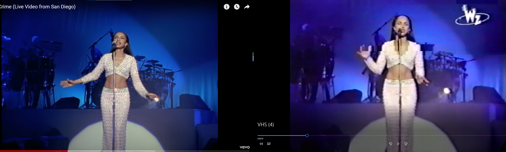

# Tongji_CV_Journey :gun:

> This document mainly works as an **paper List in categories** :cat:
> Also, our notes for read papers are linked beside, which could help us recall the main idea in paper more quickly.
>
> :ticket: Note that
>
> 1. The paper Information is listed at such format
>
>    ```
>    "Paper Name" Conference/Journal/Arxiv, year month, MethodsAbbreviation
>    Authors(optional)
>    [paper link]() [code link]() [paper website link]()
>    [the Note link, which we makde summary based on our understanding]()
>    short discription(optional)
>    ```
>
> 2. If only the paper website is listed, it denotes the paper link and code link could be found in the website page.
>
> 3. The priority order of papers in each category is based on paper importance(based on our task) and then paper-release time.
>
> - [GPU comparison website](https://topcpu.net/gpu-c/GeForce-RTX-4090-vs-Tesla-V100-PCIe-32-GB)


## Old photo restoration

- [x] "Time-Travel Rephotography" SIGGRAPH, 2020 Dec :star:
  [paper](https://arxiv.org/abs/2012.12261) [website](https://time-travel-rephotography.github.io/) [code](https://github.com/Time-Travel-Rephotography/Time-Travel-Rephotography.github.io) [talk](https://www.youtube.com/watch?v=C8IV7xK7-UI) :+1:
  [local pdf](./2020_12_SIGGRAPH_Time-Travel-Rephotography.pdf)

  > **无监督方式！！将灰度图人脸修复为彩色图 >> Sibling 概念，使用预训练 stylegan 的优良颜色特征**，用 StyleGAN 生成先弄一个类似的人脸（颜色ok，人不像），然后另外训一个 decoder 生成结构和原图相似的人脸，**`Color Transfer`,`contextual loss` 训练**。**无监督方式训练：模拟一个老相机的退化**，将 RGB 转为灰度图，与原图做 reconstruction loss （这里前提是数据集本身的噪声并不多，没有扭曲很多情况下）
  >
  > HWFD 数据集，100多张名人人脸灰度照片，可以下载
  >
  > - :question: Color Transfer Loss

- [x] "Bringing Old Photos Back to Life" CVPR oral, 2020 Apr :star:
  [paper(CVPR version)](https://arxiv.org/abs/2004.09484) [paper(TPAMI version)](https://arxiv.org/pdf/2009.07047v1.pdf) [code](https://github.com/microsoft/Bringing-Old-Photos-Back-to-Life) [website](http://raywzy.com/Old_Photo/)
  [Note](./2020_CVPR_Bringing-Old-Photos-Back-to-Life_Note.md)

  > Pascal VOC 上合成噪声（DA & 噪声模板 collect 62 scratch texture images and 55 paper texture image）；可以参考**消除合成数据和真实数据之间 domain gap 的方法**。
  >
  > Face Enhancement 模块用 FFHQ 数据

- [ ] "Pik-Fix: Restoring and Colorizing Old Photo" WACV, 2023
  [paper](https://arxiv.org/abs/2205.01902) [code](https://github.com/DerrickXuNu/Pik-Fix)

  > 有数据集，发邮件回复下载 url >> Runsheng Xu
  >
  > RealOld 200个老照片，**有 Expert 修复过的 GT！**

- [x] "Modernizing Old Photos Using Multiple References via Photorealistic Style Transfer" CVPR, 2023 Apr, **MROPM**
  [paper](https://arxiv.org/abs/2304.04461) [code](https://github.com/KAIST-VICLab/old-photo-modernization) [website](https://kaist-viclab.github.io/old-photo-modernization/?utm_source=catalyzex.com)
  [note](./2023_04_CVPR_Modernizing-Old-Photos-Using-Multiple-References-via-Photorealistic-Style-Transfer_Note.md)

  > 从风格迁移的角度做，修复完划痕看起来还很旧，修改风格
  >
  > Dataset: 从韩国 3 个博物馆收集到的文物照片，拍摄样式老旧，但没有明显的划痕
  
- [ ] "Self-Prior Guided Pixel Adversarial Networks for Blind Image Inpainting" TAPMI, 2023 June
  [paper](https://ieeexplore.ieee.org/abstract/document/10147235)
  
- [ ] "Focusing on Persons: Colorizing Old Images Learning from Modern Historical Movies" 2021 Aug, **HistoryNet**

  [paper](https://arxiv.org/abs/2108.06515) [code](https://github.com/BestiVictory/HistoryNet#historynet)


## Old video restoration :fire:

> :dart: Current Working Direction!

- [ ] "DeOldify" open-sourced toolbox to restore image and video
  [code](https://github.com/jantic/DeOldify)

  > strong baseline in multi papers :+1:
  
- [ ] "Bringing Old Films Back to Life" CVPR, 2022 Mar :star:
  [paper](https://arxiv.org/abs/2203.17276) [code](https://github.com/raywzy/Bringing-Old-Films-Back-to-Life) [website](http://raywzy.com/Old_Film/)
  [Note](./2022_CVPR_Bringing-Old-Films-Back-to-Life_Note.md)

  > crop **256 patches from REDS dataset** and apply the proposed **video degradation model（DA & noise template）** on the fly
  >
  > REDS `sharp data`: train 240 video and each has 100 Frame

- [x] "DeepRemaster: Temporal Source-Reference Attention Networks for Comprehensive Video Enhancement" SIGGRAPH, 2019 Nov
  [paper](https://arxiv.org/abs/2009.08692) [website](http://iizuka.cs.tsukuba.ac.jp/projects/remastering/en/index.html)
  [Note](./2019_SIGGRAPH_DeepRemaster-Temporal-Source-Reference-Attention-Networks-for-Comprehensive-Video-Enhancement_Note.md)

  > baseline in "Bringing Old Films Back to Life"  

- [x] "DSTT-MARB: Multi-scale Attention Based Spatio-Temporal Transformers for Old Film Restoration" Master Thesis report, 2022 Sep
  [thesis-report](https://ntnuopen.ntnu.no/ntnu-xmlui/bitstream/handle/11250/3023083/no.ntnu:inspera:118516831:64411262.pdf?sequence=1) [local pdf](./2022_master_report_DSTT-MARB--Multi-scale-Attention-Based-Spatio-Temporal-Transformers-for-Old-Film-Restoration.pdf)

  > 硕士论文，里面整合了上面 3 个文章

- [ ] "VRT: A Video Restoration Transformer" ArXiv, 2022 Jun, **VRT**
  [paper](https://arxiv.org/abs/2201.12288) [code](https://github.com/JingyunLiang/VRT?utm_source=catalyzex.com)

  > an unified framework for video SR, deblurring and denoising
  
- [ ] "Recurrent Video Restoration Transformer with Guided Deformable Attention" NeurlPS, 2022 June, **RVRT** :statue_of_liberty:
  [paper](https://arxiv.org/abs/2206.02146) [code](https://github.com/JingyunLiang/RVRT?utm_source=catalyzex.com)
  [note](./2022_06_NeurIPS_RVRT_Recurrent-Video-Restoration-Transformer-with-Guided-Deformable-Attention_Note.md)
  
  > Video SR, deblurring, Denoising
  >
  > dataset: **30 frames for REDS** [53], 14 frames for Vimeo-90K [87], and 16 frames for DVD [63], GoPro [54] as well as DAVIS [31]
  
- [x] "Blind Video Deflickering by Neural Filtering with a Flawed Atlas" CVPR, 2023 Mar :star:
  [paper](https://arxiv.org/abs/2303.08120) [code](https://github.com/ChenyangLEI/All-In-One-Deflicker?utm_source=catalyzex.com) [website](https://chenyanglei.github.io/deflicker/)
  [note](./2023_05_CVPR_Blind-Video-Deflickering-by-Neural-Filtering-with-a-Flawed-Atlas_Note.md)

  > **用 Nerf 类似的 atlas 处理视频一致性问题**
  >
  > 有公布数据  <a name="Blind flickering Dataset"></a> 60 * old_movie, 大多为 350 帧图像; 21* old_cartoon, 大多为 50-100 帧;
  > 用 [RE:VISION. De:flicker](https://revisionfx.com/products/deflicker/) 去用软件人工修复（存在新手修的质量差的问题）

- [ ] "RTTLC: Video Colorization with Restored Transformer and Test-time Local" CVPR, 2023 Mar
  [paper](https://openaccess.thecvf.com/content/CVPR2023W/NTIRE/html/Li_RTTLC_Video_Colorization_With_Restored_Transformer_and_Test-Time_Local_Converter_CVPRW_2023_paper.html)

  > NTIRE23(CVPR) video colorization competition 2nd rank, post their result, qualities result no so astounding
  >
  > evolved from RTN [23] in "Bringing Old Films Back to Life"
  
- [ ] "Exemplar-based Video Colorization with Long-term Spatiotemporal Dependency" Arxiv, 2023 Mar
  [paper](https://arxiv.org/abs/2303.15081)

  > Reference based video colorization, use DeepRemaster, DeepExemplar as baseline
  >
  > Train Datset: DAVIS[22], FVI[46] and Videvo [47].2090 training videos
  >
  > randomly select a video clips with max length of 20 frames, and use the first frame as reference
  >
  > All the experiments are implemented on a single NVIDIA 3090 GPU :open_mouth:
  
- [ ] "BiSTNet: Semantic Image Prior Guided Bidirectional Temporal Feature Fusion for Deep Exemplar-based Video Colorization" ArXiv, 2022 Dec :star:
  [paper](https://arxiv.org/abs/2212.02268) [website](https://yyang181.github.io/BiSTNet/?utm_source=catalyzex.com)

  > **NTIRE2023 Video Colorization Challenge Champion**
  >
  > synthetic datasets and real-world videos
  >
  > adopt the DAVIS dataset [17] and the Videvo dataset [8] as the benchmark datasets for training and testing
  >
  > - evaluate the proposed method on real-world grayscale videos, where the ground truth colors videos are not available
  >
  >  four RTX-A6000 GPUs
  
- [ ] "SVCNet: Scribble-based Video Colorization Network with Temporal Aggregation" Arxiv, 2023 Mar
  [paper](https://arxiv.org/abs/2303.11591) [code](https://github.com/zhaoyuzhi/SVCNet)
  
  > use [ImageNet](https://image-net.org/index.php), [DAVIS](https://davischallenge.org/), and [Videvo](https://github.com/phoenix104104/fast_blind_video_consistency) datasets as our training set. all the used data could be downloaded on paper's github repo.


## Diffusion in Video

> [Awesome Video Diffusion](https://github.com/showlab/Awesome-Video-Diffusion) :+1:
> https://scholar.google.com/scholar?as_ylo=2023&q=diffusion+video&hl=zh-CN&as_sdt=0,5

- [x] "Diffusion Video Autoencoders: Toward Temporally Consistent Face Video Editing via Disentangled Video Encoding" CVPR oral, 2023 Dec, **DVA**
  [paper](https://arxiv.org/abs/2212.02802) [code](https://github.com/man805/Diffusion-Video-Autoencoders)
  [note](./2023_CVPR_Diffusion-Video-Autoencoders--Toward-Temporally-Consistent-Face-Video-Editing-via-Disentangled-Video-Encoding_Note.md)

  > 人脸编辑
  
- [x] "Align your Latents: High-Resolution Video Synthesis with Latent Diffusion Models" CVPR, 2023 Apr, **VideoLDM** :star:
  [paper](https://arxiv.org/abs/2304.08818) [website](https://research.nvidia.com/labs/toronto-ai/VideoLDM/) [code: unofficial implementation](https://github.com/srpkdyy/VideoLDM.git)
  [note](./2023_04_CVPR_Align-your-Latents--High-Resolution-Video-Synthesis-with-Latent-Diffusion-Models_Note.md)

  > diffusion 用于 text2video 生成，用预训练的 stable-diffusion，对 U-net 加 temporal layer 实现时序一致性

- [x] "VideoComposer: Compositional Video Synthesis with Motion Controllability" Arxiv, 2023 Jun, **VideoComposer**
  [](https://github.com/damo-vilab/videocomposer) [](https://arxiv.org/abs/2306.02018) [](https://videocomposer.github.io/)
  [note](./2023_06_VideoComposer--Compositional-Video-Synthesis-with-Motion-Controllability_Note.md)

  > Video LDM 上加入各种样式的 condition 实现可控视频生成

- [ ] "LDMVFI: Video Frame Interpolation with Latent Diffusion Models" Arxiv, 2023 Mar
  [paper](https://arxiv.org/abs/2303.09508)
  
  > video restoration
  
- [ ] "Pix2Video: Video Editing using Image Diffusion" ICCV, 2023
  [paper](https://arxiv.org/pdf/2303.12688v1.pdf) [code](https://github.com/G-U-N/Pix2Video.pytorch)

- [ ] "DreamBooth: Fine Tuning Text-to-Image Diffusion Models for Subject-Driven Generation" CVPR, 2022 Aug
  [paper](https://arxiv.org/abs/2208.12242) [code](https://github.com/zanilzanzan/DreamBooth)

- [ ] "Make-Your-Video: Customized Video Generation Using Textual and Structural Guidance" Arxiv, 2023 Jun :s
  [paper](https://arxiv.org/abs/2306.00943) [website](https://doubiiu.github.io/projects/Make-Your-Video/?utm_source=catalyzex.com)


## **Diffusion/GAN related**

- [ ] "A Style-Based Generator Architecture for Generative Adversarial Networks" CVPR, 2019 Dec, **StyleGAN**
  [paper](https://arxiv.org/abs/1812.04948) [code](https://nvlabs.github.io/stylegan2/versions.html)
  [our note](./StyleGAN_Note.md)

- [x] "Taming Transformers for High-Resolution Image Synthesis" CVPR, 2020 Dec, **VQ-GAN** :star:

  [paper](https://arxiv.org/abs/2012.09841) [website](https://compvis.github.io/taming-transformers/)
  [our note](./2021_CVPR_VQGAN_Taming-Transformers-for-High-Resolution-Image-Synthesis_Note.md)

- [ ] "Denoising Diffusion Probabilistic Models" NeurIPS, 2020 Dec, **DDPM** :statue_of_liberty:

  [paper](https://arxiv.org/abs/2006.11239)

- [x] "High-Resolution Image Synthesis with Latent Diffusion Models" CVPR, 2022 Dec, **StableDiffusion** :statue_of_liberty:
  [paper](https://arxiv.org/abs/2112.10752) [github](https://github.com/CompVis/stable-diffusion) 
  [our note](./2022_CVPR_High-Resolution Image Synthesis with Latent Diffusion Models_Note.md)

- [ ] "Palette: Image-to-Image Diffusion Models" SIGGRAPH, 2022 Nov
  [paper](https://arxiv.org/abs/2111.05826) [website](https://iterative-refinement.github.io/palette/) [code: unofficial implementation](https://github.com/Janspiry/Palette-Image-to-Image-Diffusion-Models)
  [our note](./2022_SIGGRAPH_Palette-Image-to-Image-Diffusion-Models_Note.md)

- [ ] "Diffusion Models Beat GANs on Image Synthesis" NeurIPS, 2021 May :statue_of_liberty:

  [paper](https://arxiv.org/abs/2105.05233) [code](https://github.com/openai/guided-diffusion?utm_source=catalyzex.com)

- [ ] "Diffusion Models Beat GANs on Image Classification" Arxiv, 2023 Jul

  [paper](https://arxiv.org/abs/2307.08702)

- [x] "Zero-Shot Image Restoration Using Denoising Diffusion Null-Space Model" ICLR Notable-Top-25%, 2022 Dec, **DDNM** :+1:
  [paper](https://wyhuai.github.io/ddnm.io/) [website](https://wyhuai.github.io/ddnm.io/)
  [our note](./2022_ICLR_DDNM_Zero-Shot-Image-Restoration-Using-Denoising-Diffusion-Null-Space-Model_Note.md)

  > 将图像修复任务的数学模型，转换到 Range-Null space 分解，对于分解的其中一项替换为 Diffusion 的 noise 实现修复操作，融入 diffusion 的方式值得借鉴。

- [ ] [2022_Understanding Diffusion Models-A Unified Perspective.pdf](./2022_Understanding Diffusion Models-A Unified Perspective.pdf) :+1:

- [ ] DDIM

- [ ] IDDPM

- [ ] DDRM

- [ ] Score-based

- [ ] [VAE 博客](https://zhuanlan.zhihu.com/p/34998569) 提供了一个将概率图跟深度学习结合起来的一个非常棒的案例
  [code](https://github.com/bojone/vae)

- [ ] CycleGAN and pix2pix in PyTorch https://github.com/junyanz/pytorch-CycleGAN-and-pix2pix

- [ ] [2021_CVPR_StyleCLIP-Text-Driven-Manipulation-of-StyleGAN-Imagery.pdf](./2021_CVPR_StyleCLIP-Text-Driven-Manipulation-of-StyleGAN-Imagery.pdf)

- [ ] [2020_CVPR_InterFaceGAN_Interpreting-the-Latent-Space-of-GANs-for-Semantic-Face-Editing.pdf](./2020_CVPR_InterFaceGAN_Interpreting-the-Latent-Space-of-GANs-for-Semantic-Face-Editing.pdf)

- [ ] [2022_WACV_Pik-Fix-Restoring-and-Colorizing-Old-Photos.pdf](./2022_WACV_Pik-Fix-Restoring-and-Colorizing-Old-Photos.pdf)

- [ ] [Drag Your GAN: Interactive Point-based Manipulation on the Generative Image Manifold](https://github.com/XingangPan/DragGAN) :moyai:

- [ ] "DragDiffusion: Harnessing Diffusion Models for Interactive Point-based Image Editing" 2023 Jul

  [paper](https://arxiv.org/abs/2306.14435)

- [ ] Self-Supervised Learning with Random-Projection Quantizer for Speech Recognition

  > 参考 random-projection 操作

- [ ] Wavelet Diffusion Models are fast and scalable Image Generators :+1:

- [ ] [2023_Fourmer-An Efficient Global Modeling Paradigm for Image Restoration.pdf](./2023_Fourmer-An Efficient Global Modeling Paradigm for Image Restoration.pdf)

  > 小波变换

- [ ] "Zero-shot Image-to-Image Translation" Arxiv, 2023 Feb, **Pix2Pix** 
  [code](https://github.com/pix2pixzero/pix2pix-zero)
  [local pdf](./2023_Zero-shot-Image-to-Image-Translation.pdf)

- [ ] Locally Hierarchical Auto-Regressive Modeling for Image Generation :+1:

  https://github.com/kakaobrain/hqtransformer

- [ ] JPEG Artifact Correction using Denoising Diffusion Restoration Models

- [ ] Scalable Diffusion Models with Transformers

- [ ] All are Worth Words: A ViT Backbone for Diffusion Models

- [ ] Implicit Diffusion Models for Continuous Super-Resolution

- [ ] LayoutDM: Transformer-based Diffusion Model for Layout Generation

- [ ] Vector Quantized Diffusion Model for Text-to-Image Synthesis

- [ ] Image Super-Resolution via Iterative Refinement

- [ ] Real-World Denoising via Diffusion Model

- [ ] Diffusion in the Dark A Diffusion Model for Low-Light Text Recognition

- [ ] "Exploiting Diffusion Prior for Real-World Image Super-Resolution"
  [paper](https://arxiv.org/abs/2305.07015) [website](https://iceclear.github.io/projects/stablesr/?utm_source=catalyzex.com)
  [2023_preprint_Exploiting-Diffusion-Prior-for-Real-World-Image-Super-Resolution.pdf](./2023_preprint_Exploiting-Diffusion-Prior-for-Real-World-Image-Super-Resolution.pdf)

- [ ] Privacy Leakage of SIFT Features via Deep Generative Model based Image Reconstruction

- [ ] DreamDiffusion https://mp.weixin.qq.com/s/RDXINIvJvU_6FMoiX42bKg

- [ ] T2I-Adapter: Learning Adapters to Dig out More Controllable Ability for Text-to-Image Diffusion Models
  [paper](https://arxiv.org/abs/2302.08453) [code](https://github.com/TencentARC/T2I-Adapter)

  > 可控生成

- [ ] SWAGAN: A Style-based Wavelet-driven Generative Model  23.7.14

- [ ] Shifted Diffusion for Text-to-image generation 23.7.15

- [ ] [Generative image inpainting with contextual attention](http://openaccess.thecvf.com/content_cvpr_2018/html/Yu_Generative_Image_Inpainting_CVPR_2018_paper.html) :star:

  类似 non-local attention  

- [ ] "A Unified Conditional Framework for Diffusion-based Image Restoration" 23.7.16
  [paper](https://arxiv.org/abs/2305.20049) [code](https://github.com/zhangyi-3/UCDIR) [website](https://zhangyi-3.github.io/project/UCDIR/)


## Enhancement and Restoration :droplet:

- [x] "ReBotNet: Fast Real-time Video Enhancement" AeXiv, 2023 Mar 
  [paper](https://arxiv.org/abs/2303.13504) [website](https://jeya-maria-jose.github.io/rebotnet-web/?utm_source=catalyzex.com)
  [note](./2023_03_Arxiv_ReBotNet--Fast-Real-time-Video-Enhancement_Note.md)
  
  > **30 FPS 实时的方法，主要针对 video deblur**，用 ConvNext + Mixer 代替 Transformer 减小计算量；根据 Talkingheads 数据集，筛选+处理针对视频会议场景的数据集 （没开源）
  >
  > :question: ConvNext & MLP-mixer 原理
  
- [ ] "Depth-Aware Video Frame Interpolation" CVPR, 2019 Apr, **DAIN**
  [paper](https://arxiv.org/abs/1904.00830) [code](https://github.com/baowenbo/DAIN)

- [ ] "ESRGAN: Enhanced Super-Resolution Generative Adversarial Networks" ECCV, 2018 Sep, **ESRGAN(Enhanced SRGAN)**
  [paper](https://arxiv.org/abs/1809.00219) [code](https://github.com/xinntao/ESRGAN)

- [ ] "Real-ESRGAN: Training Real-World Blind Super-Resolution with Pure Synthetic Data" ICCV, 2021 Aug
  [paper](https://arxiv.org/abs/2107.10833) [code](https://github.com/xinntao/Real-ESRGAN)

- [ ] BasicSR (**Basic** **S**uper **R**estoration) is an open-source **image and video restoration** toolbox
  [github repo](https://github.com/XPixelGroup/BasicSR)

- [ ] "SB-VQA: A Stack-Based Video Quality Assessment Framework for Video Enhancement" CVPR, 2023 May
  [paper](https://arxiv.org/abs/2305.08408)

  > mention `old film restoration`

- [ ] "Towards Interpretable Video Super-Resolution via Alternating Optimization" ECCV, 2022 Jul

  [paper](https://arxiv.org/abs/2207.10765)


## Editing

- [ ] "Layered Neural Atlases for Consistent Video Editing" SIGGRAPH, 2021 Sep
  [paper](https://arxiv.org/abs/2109.11418) [website](https://layered-neural-atlases.github.io/)
- [x] "Stitch it in Time: GAN-Based Facial Editing of Real Videos" SIGGRAPH, 2019 Jan, STIT
  [paper](https://arxiv.org/abs/2201.08361) [code](https://github.com/rotemtzaban/STIT) [website](https://stitch-time.github.io/)
  [our note](./2022_SIGGRAPH_STIT_Stitch-it-in-Time--GAN-Based-Facial-Editing-of-Real-Videos_Note.md)
- [ ] "Pix2Video: Video Editing using Image Diffusion" 2023 Mar
  [paper](https://arxiv.org/abs/2303.12688) [code]()


## Denoising

> [Awesome-Deblurring](https://github.com/subeeshvasu/Awesome-Deblurring)

- [ ] "Learning Task-Oriented Flows to Mutually Guide Feature Alignment in Synthesized and Real Video Denoising" ReViD
  [paper](http://export.arxiv.org/abs/2208.11803)

- [ ] "Real-time Controllable Denoising for Image and Video" CVPR, 2023 Mar
  [paper](https://arxiv.org/abs/2303.16425) [website](https://zzyfd.github.io/RCD-page/) [code](https://github.com/jiangyitong/RCD)

  > video/image Denoising!
  
- [x] "Low-Dose CT with a Residual Encoder-Decoder Convolutional Neural Network (RED-CNN)" 
  [paper](https://arxiv.org/abs/1702.00288) [code](https://github.com/SSinyu/RED-CNN/tree/master)
  [local pdf](./2017_TMI_RED-CNN_Low-Dose-CT-with-a-Residual-Encoder-Decoder-Convolutional-Neural-Network.pdf)
  
  > 医学 CT 去噪（噪声 GT 对），模型结构很简单
  
- [x] "Let Segment Anything Help Image Dehaze" Arxiv, 2023 Jun
  [paper](https://arxiv.org/abs/2306.15870)
  [our note](./2023_06_Let-Segment-Anything-Help-Image-Dehaze_Note.md)
  
  > 将 SAM 分割结果作为通道扩展到 U-net 模块中，进行去雾
  
- [ ] "A Differentiable Two-stage Alignment Scheme for Burst Image Reconstruction with Large Shift" CVPR, 2022 Mar
  [paper](https://arxiv.org/pdf/2203.09294.pdf) [code]()

 

## **Colorization**

> https://github.com/MarkMoHR/Awesome-Image-Colorization :star: 

- [x] "Deep Exemplar-based Video Colorization" CVPR, 2019 Jun
  [paper](https://arxiv.org/abs/1906.09909) [code](https://github.com/zhangmozhe/Deep-Exemplar-based-Video-Colorization)
  [local pdf](./2019_07_CVPR_Deep-Exemplar-based-Video-Colorization.pdf) [note](./2019_07_CVPR_Deep-Exemplar-based-Video-Colorization_Note.md)

  > Bring old films 张博老师的工作
  >
  > T 帧结合作者选取的 reference image，输入VGG19提取关联性矩阵。上色模块结合 t-1 时刻的输出，实现 temporal consistency

- [ ] "Video Colorization with Pre-trained Text-to-Image Diffusion Models" Arxiv, 2023 Jun :star:

  [website](https://colordiffuser.github.io/?utm_source=catalyzex.com)

- [ ] "Temporal Consistent Automatic Video Colorization via Semantic Correspondence" CVPR, 2023 May
  [paper](https://arxiv.org/abs/2305.07904)

- [ ] Interactive Deep Colorization

  https://github.com/junyanz/interactive-deep-colorization

- [ ] Improved Diffusion-based Image Colorization via Piggybacked Models  *Apr 2023*

  https://piggyback-color.github.io/


## Super-resolution

- [ ] "Video Super-Resolution Transformer" 2021 Jun
  [paper](https://arxiv.org/abs/2106.06847) [code](https://github.com/caojiezhang/VSR-Transformer)


## **Segmentation**

> [paper-list](https://github.com/liliu-avril/Awesome-Segment-Anything)

- [ ] SAM
  [paper](https://arxiv.org/abs/2304.02643) [code](https://github.com/facebookresearch/segment-anything)
  [Note](./2023_04_preprint_SAM_Segment-Anything_Note.md)

- [ ] Fast Segment Anything https://github.com/CASIA-IVA-Lab/FastSAM >> FPS25

- [x] UniAD CVPR23 Best paper

- [ ] MobileSAM https://mp.weixin.qq.com/s/zTakIRIsWOUBiUr3yn5rhQ

- [ ] Video SAM

  https://mp.weixin.qq.com/s/hyf_DnEdbUTh8VpeP0Mq-w


**Transformer  & Attention:moyai:**

- [ ] On the Expressivity Role of LayerNorm in Transformer's Attention  
  https://github.com/tech-srl/layer_norm_expressivity_role 这个工作可以加深对 transformer 的一些理解 :star:

- [ ] HaloNet padding 方式的注意力

  Scaling Local Self-Attention for Parameter Efficient Visual Backbones

- [ ] **SwimTransformer**

- [ ] SpectFormer: Frequency and Attention is what you need in a Vision Transformer  
  https://github.com/badripatro/SpectFormers

- [ ] Learning A Sparse Transformer Network for Effective Image Deraining 
  https://github.com/cschenxiang/DRSformer

- [ ] FEDformer: Frequency Enhanced Decomposed Transformer for Long-term Series Forecasting :star: 时序数据
  https://github.com/MAZiqing/FEDformer

- [ ] Permuted AdaIN: Reducing the Bias Towards Global Statistics in Image Classification
  https://github.com/onuriel/PermutedAdaIN  这个工作很简单但是对于提升模型鲁棒性很有效，大家都可以看一下

  理解核心的那一小段代码即可

- [ ] [A ConvNet for the 2020s](https://arxiv.org/abs/2201.03545)


**MAE**

- [ ] **MAE**

- [ ] Siamese Masked Autoencoders 

  Masked Siamese Networks for Label-Efficient Learning
  https://github.com/facebookresearch/msn

  MixMask: Revisiting Masking Strategy for Siamese ConvNets
  https://github.com/LightnessOfBeing/MixMask
  这几个半监督/自监督的工作很有意思，大家好好看下

- [ ] SimMIM: a Simple Framework for Masked Image Modeling 

- [ ] Hard Patches Mining for Masked Image Modeling https://mp.weixin.qq.com/s/YJFDjcTqtX_hzy-FXt-F6w

- [ ] Masked-Siamese-Networks-for-Label-Efficient-Learning


**NLP & 多模态**

- [ ] Multimodal Prompting with Missing Modalities for Visual Recognition
  https://github.com/YiLunLee/Missing_aware_prompts  训练或者测试是多模态非完美情况
- [ ] Is GPT-4 a Good Data Analyst
  https://github.com/damo-nlp-sg/gpt4-as-dataanalyst

**对比学习**

- [ ] CCPL: Contrastive Coherence Preserving Loss for Versatile Style Transfer 
  https://github.com/JarrentWu1031/CCPL

## **HDR**

- [ ] "Inverting the Imaging Process by Learning an Implicit Camera Model" CVPR, 2023, Apr
  [paper](https://arxiv.org/abs/2304.12748) [website](https://xhuangcv.github.io/neucam/)
  [our note](./2023_CVPR_Inverting-the-Imaging-Process-by-Learning-an-Implicit-Camera-Model_Note.md)

  > Represent the visual signal using implicit coordinate-based neural networks is recent trend in CV. Existing methods directly conider using the whole NN to represent the scene, and **not consider the camera separately.**
  > The paper **proposed a new implicit camera model (using implicit neural network)** to represent the physical imaging process. 使用 NeRF 单独模拟相机模型和 scene，实现解耦，增加可调节能力

- [ ] "BokehMe: When Neural Rendering Meets Classical Rendering" CVPR oral, 2022 Jun
  [paper](https://arxiv.org/abs/2206.12614v1) [website](https://juewenpeng.github.io/BokehMe/)

  > 对图像实现**可控的**模糊，调整焦距，光圈等效果。发布了数据集

- [ ] "DC2: Dual-Camera Defocus Control by Learning to Refocus" CVPR, 2023 Apr
  [website](https://defocus-control.github.io/)

  > **image refocus** requires deblurring and blurring different regions of the image at the same time, that means that image refocus is at least as hard as DoF Control

- [ ] DRHDR: A Dual branch Residual Network for Multi-Bracket High Dynamic Range Imaging

- [ ] Networks are Slacking Off: Understanding Generalization Problem in Image Deraining

- [ ] Image-based CLIP-Guided Essence Transfer

- [ ] Luminance Attentive Networks for HDR Image and Panorama Reconstruction
  https://github.com/LWT3437/LANet 

- [ ] Perceptual Attacks of No-Reference Image Quality Models with Human-in-the-Loop

- [ ] Perception-Oriented Single Image Super-Resolution using Optimal Objective Estimation 


## NeRF

- [ ] [VALSE conference report: Nerf summary](http://mp.weixin.qq.com/s?__biz=MzU1NzM4MjgzOA==&mid=2247527478&idx=1&sn=6c664ca46afec8ea4ba078021911cad9&chksm=fc3481efcb4308f9241b96c6849a96b3b4e3bf5264446ee33f166861d676fa5ef04e4dcdd2cc&mpshare=1&scene=1&srcid=0615JwWD9OMIDP1NZpDwlZG9&sharer_sharetime=1686804410952&sharer_shareid=afbf4ec884958d4f7776ecf78d096f90#rd)
- [ ] [2023_CVPR_Inverting-the-Imaging-Process-by-Learning-an-Implicit-Camera-Model_Note.md](./2023_CVPR_Inverting-the-Imaging-Process-by-Learning-an-Implicit-Camera-Model_Note.md)
- [ ] Neural Volume Super Resolution
  https://github.com/princeton-computational-imaging/Neural-Volume-Super-Resolution  NeRF+SR
- [x] LERF: Language Embedded Radiance Fields 
  https://github.com/kerrj/lerf  NeRF + 3D CLIP
- [ ] Implicit Neural Representations for Image Compression
  https://github.com/YannickStruempler/inr_based_compression 
- [ ] iNeRF: Inverting Neural Radiance Fields for Pose Estimation 
- [ ] ViP-NeRF: Visibility Prior for Sparse Input Neural Radiance Fields 
- [ ] AdaNeRF: Adaptive Sampling for Real-time Rendering of Neural Radiance Fields
- [ ] 2022_CVPR_Aug-NeRF--Training-Stronger-Neural-Radiance-Fields-with-Triple-Level-Physically-Grounded-Augmentations >> 输入增加扰动


## **Neural Operators**

- [ ] Factorized Fourier Neural Operators
  https://github.com/alasdairtran/fourierflow
- [ ] Super-Resolution Neural Operator
  https://github.com/2y7c3/Super-Resolution-Neural-Operator
- [ ] Adaptive Fourier Neural Operators: Efficient Token Mixers for Transformers
  https://github.com/NVlabs/AFNO-transformer
- [ ] Fourier Neural Operator for Parametric Partial Differential Equations
  https://github.com/neuraloperator/neuraloperator


## IQA

> :grey_question: what is IQA [CVPR IQA 博客](https://zhuanlan.zhihu.com/p/154017806)
> IQA(image quality assessment) Task target: quantification of human perception of image quality
>
> - Application
>   想对某一项视觉任务评估图像能否满足需要，比如针对人脸识别的质量评价，看一幅图像是否应该拒绝还是输入到人脸识别系统中；texture classification；texture retrieval （texture similarity）；texture recovery
> - 对于图像下游任务：denoising, deblurring, super-resolution, compression，能够提升图像质
> - Full Reference, No-reference 

- [x] "Image Quality Assessment: Unifying Structure and Texture Similarity" TPAMI, 2020 Dec, DISTS
  [paper](https://ieeexplore.ieee.org/abstract/document/9298952)
  [our note](./2020_TPAMI_DISTS_Image-Quality-Assessment-Unifying-Structure-and-Texture-Similarity_Note.md)

  > 针对有明显纹理的原图，让模型对 JPEG 压缩后、resample 的图像打分（实际上肉眼看上去 JPEG 更加模糊），之前方法对于 JPEG 图像质量评分错误地高于 resample 图。

- [x] "Re-IQA: Unsupervised Learning for Image Quality Assessment in the Wild" CVPR, 2023 Apr
  [paper]()
  [our noted pdf](./2023_CVPR_Re-IQA-Unsupervised-Learning-for-Image-Quality-Assessment-in-the-Wild.pdf)

  > 一种 NR-IQA 算法，使用对比学习的方式，使用 2 个 Res50 去学习 content & image-quality-aware features. 最后加一个 regressor 输出 image quality scores.
  > 对于 quality feature 一路，模仿 MoCoV2 ，修改了构造正负样本的方式进行训练。
  >
  > - `Full-reference IQA` 方法 对于 images in the wild 场景，没有 reference 应用受限
  >
  >   FR-IQA 需要参考图像（undistorted） & distorted 图像，一起才能输出评分。
  >
  > - high-level content representation using MoCoV2
  >
  >   2 crops from same image -> similar scores, but not the case for some human viewers.


# Research Note


## PaperWriting

> Latex Reference 直接在 Google research 上获取引用格式

- Abstract

  按句子：1 背景；2-3 存在问题；4-5-6 提出的方法，创新点；7实验证明有效

- introduction

  按段落可参考一下方式

  P1 介绍的任务 2-3C. 应用 & 但存在啥问题。早期的工作 3-4 个，**按总结的角度来列举**，不要只写 A propose B propose ...（挑3-4 个非常有名 or 典型的）

  P2 **按时间线**早期到近期写。但是还存在啥问题。

  P3 提出的方法

- related work 可以开 3 个小章节

  例如本文用到了 CLIP, MAE 在 LDR 任务上，可以分为以下三个小节介绍

  - LDR
  - CLIP
  - MAE

- Proposed Methods

  按一下顺序

  - overview

    按完整流程，结合公式详细，有条理的讲清楚本文的方法。同时，Framework 图下面 caption要很清楚，因为一般审稿人会先看 methods overview -> framework_graph。

  - 几个 proposed module xx

  - loss function

  > - 期刊：3.4 Methods 写完一般写到 6.5 页。初稿不算 reference 写12-13页，DL 实验部分一般4.5页
  >
  > - 公式
  >
  >   变量斜体，操作/运算符用正体 （Relu）


## ResearchSuggestion

- 论文笔记

  主要看懂方法；总结学到了啥（总结创新点，分析如何能用到自己的任务；提到的典型方法；...）

  **Key-point**

  **Contributions**

  **Related Work**

  **methods**

  **Experiment**

  **Limitations**

  **Summary :star2:**

  > learn what & how to apply to our task

  

- 文章阅读建议

  每周 5 篇精读，一篇文章要看多次的，第一次看完不懂没关系，但要记录下来后面再看！**一定要整理 code，进性总结 :star::star:** 

  > https://gaplab.cuhk.edu.cn/cvpapers/#home  这里整理分类了近几年计算机视觉方面重要会议（CVPR，ICCV，ECCV，NeurIPS，ICLR）的文章和代码，大家可以多看看
  >
  > https://openaccess.thecvf.com/menu 这是CVF的官网，一些计算机视觉一些重要会议（CVPR，ICCV，WACV）的所有文章附录等材料
  >
  > https://www.ecva.net/index.php 这是ECCV的官网，历年的文章附录都有
  >
  > 建议这些会议（CVPR，ICCV，ECCV，NeurIPS，ICLR，ICML，AAAI，IJCAI，ACMMM等）的文章以及一些重要期刊（T-PAMI，T-IP，TOG，TVCG，IJCV，T-MM，T-CSVT等）大家多阅读，相同或者相近任务的文章至少全部粗读一遍，然后选择性精读，需要学会使用Google学术和GitHub查询有用资料

1. 至少想 2 个创新点，做实验看为什么不 work，分析问题&看文献；

   > Possible direction

   - diffusion 稳定 or 加速训练

   - ControlNet >> 能否借鉴到 video editing :star:

   - GAN 之前存在的问题，一些思想能否用到 diffusion 中

     - 模式崩塌：多样性很差，只生产几个类别，质量比较好

     - **Limited Data 看思想**

     - wavelet diffusion models

   - Rado, 张雷老师组 >> diffusion model in low level

   - https://orpatashnik.github.io/ 看一下这个组的工作 >> StyleCLIP, StyleGAN-NADA
     [Daniel Cohen-Or Blog](https://danielcohenor.com/publications/)

2. 关注自己的研究方向，作为主线：**diffusion model 用于老电影修复**。
   当这周的论文阅读量没做完，**优先看自己的主线方向论文和项目进展**！

3. 主线方向，和视频相关方向都要看，只不过要学会某些进行略读。不要局限于技术细节，识别哪些可以暂时跳过，记录下来后面看。


# Current Progress :dart:

Main stream: Old video restoration!

## TODO :blue_book:

- [ ] 调研 old films 修复的 SOTA 论文	7.17
- [ ] 调研现有 old films 数据集

- Paper reading question
  - :question: AdaIN 原理

- [ ] :question: Diffusion 如何用到 video restoration?


## Dataset

> - [youtube-dl](https://ytdl-org.github.io/youtube-dl/index.html)
>
>   *youtube-dl* is a command-line program to download videos from YouTube.com

- FFHQ(Flickr-Faces-Hight-Quality) **(人脸图像恢复)**

  > [FFHQ 介绍博客](https://zhuanlan.zhihu.com/p/353168785)

  FFHQ是一个高质量的人脸数据集，包含1024x1024分辨率的70000张PNG格式高清人脸图像，在年龄、种族和图像背景上丰富多样且差异明显，在人脸属性上也拥有非常多的变化，拥有不同的年龄、性别、种族、肤色、表情、脸型、发型、人脸姿态等，包括普通眼镜、太阳镜、帽子、发饰及围巾等多种人脸周边配件，因此该数据集也是可以用于开发一些人脸属性分类或者人脸语义分割模型的。
  
- [YouTube-VIS](https://youtube-vos.org/dataset/vis/)

  the first large-scale dataset for video instance segmentation
  大部分视频为 human & one item 互动。


> several video super-resolution, deblurring, and denoising datasets like REDS [49], DVD [69], GoPro [50], DAVIS [35], Set8 [72] 
> quote from "ReBotNet: Fast Real-time Video Enhancement"

### video dataset

- The Densely Annotation **Video Segmentation dataset** (**DAVIS**) 

  > [dataset](https://paperswithcode.com/dataset/davis)

  There are 50 video sequences with 3455 densely annotated frames in pixel level. 可用于 Video inpaint, denoising, interactive segmentation 任务

- Talking-Heads **(video deblur, heads video)**

  > "One-Shot Free-View Neural Talking-Head Synthesis for Video Conferencing" CVPR, 2021 Apr
  > [paper](https://arxiv.org/abs/2011.15126) [code:unofficial](https://github.com/zhanglonghao1992/One-Shot_Free-View_Neural_Talking_Head_Synthesis)

  public dataset that uses Youtube videos and processes them using face detectors to obtain just the face. 

  

- GoPro **(video deblur)**

  > "Deep Multi-scale Convolutional Neural Network for Dynamic Scene Deblurring"
  >
  > [paper](https://arxiv.org/abs/1612.02177) [blog](https://zhuanlan.zhihu.com/p/32216223)

  作者使用GOPRO4 HERO Black相机拍摄了**240fps的视频，然后对连续的7到13帧取平均获得模糊程度不一的图像**。每张清晰图像的快门速度为1/240s，对15帧取平均相当于获得了一张快门速度为1/16s的模糊图像。作者将模糊图像对应的清晰图像定义为处于中间位置的那一帧图像。最终，一共生成了3214对模糊-清晰图像，分辨率为1280×720

  

- DVD **(video deblur)**

  > "Deep Video Deblurring for Hand-held Cameras" CVPR 2017
  >
  > [paper](https://ieeexplore.ieee.org/document/8099516) [code](https://github.com/shuochsu/DeepVideoDeblurring)
  > [dataset website](https://www.cs.ubc.ca/labs/imager/tr/2017/DeepVideoDeblurring/)

  拍摄了 71 个 240 FPS 视频，含有多个场景：**合成 Long Exposure 来得到 blur video**，最后处理得到 2Million training patches 

  

- "ReBotNet: Fast Real-time Video Enhancement" 从 Youtube Talking-Head数据集处理，针对视频会议构造的两个数据集，没开源 **(video deblur, heads video)**

  - PortraitVideo 关注人脸区域：，筛选&抠出人脸区域视频；resolution of the faces to 384 × 384. The videos are processed at 30 frames per second (FPS) with a total of 150 frames per video. 加上退化操作

  - FullVideo 关注说话人的身体和其他周围场景：从 Talking-Head 数据集筛选，没用 Talking-Head 的预处理方法。132 training videos and 20 testing videos, and all videos are 720 × 1280, 30 FPS and 128 frames long. We apply similar degradations as PortraitVideo

- Set8 (usually used as test set)

  *Set8* is composed of 8 sequences: 4 sequences from the *Derf 480p* testset ("tractor", "touchdown", "park_joy", "sunflower") plus other 4 540p sequences. You can find these under the *test_sequences* folder [here](https://drive.google.com/drive/folders/11chLkbcX-oKGLOLONuDpXZM2-vujn_KD?usp=sharing).

- Vimeo-90K

  > "Video Enhancement with Task-Oriented Flow" IJCV 2019
  > [website](http://toflow.csail.mit.edu/) [sample-clip-from-viemo-90K](https://data.csail.mit.edu/tofu/dataset.html)

  build a large-scale, high-quality video dataset, Vimeo90K. This dataset consists of **89,800 video clips downloaded from [vimeo.com](http://toflow.csail.mit.edu/vimeo.com),** which covers large variaty of scenes and actions. It is designed for the following four video processing tasks: **temporal frame interpolation, video denoising, video deblocking, and video super-resolution.**


### **Old photos Dataset**

> [老照片修复中心](http://www.lzpxf.com/portal.php)
> https://www.ancientfaces.com/photo/george-roberts/1328388
> [old photos textures](https://www.google.com/search?q=old+photo+texture&tbm=isch&ved=2ahUKEwiNn_vEoLbsAhUM5hoKHXBiCUwQ2-cCegQIABAA&oq=old+photo+texture&gs_lcp=CgNpbWcQAzICCAAyAggAMgIIADICCAAyAggAMgIIADICCAAyAggAMgIIAFC3GFiBJmCsLWgAcAB4AIABkgGIAagGkgEDMS42mAEAoAEBqgELZ3dzLXdpei1pbWfAAQE&sclient=img&ei=QhKIX432HIzMa_DEpeAE&bih=875&biw=1920&client=ubuntu&hs=gm2)

- "Time-Travel Rephotography" SIGGRAPH, 2021 Dec :star:

  HWFD 数据集，100多张名人人脸照片，可以下载

- "Bringing Old Photos Back to Life" CVPR oral, 2020 Apr :star:

  Pascal VOC, DIV2K 上合成的照片（DA 看论文，退化模板没给要去网上找），真实老照片只用来测试（ancient face）

- "Modernizing Old Photos Using Multiple References via Photorealistic Style Transfer" CVPR, 2023 Apr

  644 old color photos produced in 20th century >> 3个韩国博物馆找的文物图

- "Pik-Fix: Restoring and Colorizing Old Photo" WACV, 2023

  Div2K [1], Pascal [17], and RealOld

  - hired Photoshop experts to mimic the degradation patterns in real old photos (but not from our newly created RealOld dataset) on images from the **Pascal dataset**, using alpha compositing with randomized transparency levels, thereby generating synthetic old photos.

  - Real-World Old Photos (RealOld)

    we collected digitized copies of 200 real old black & white photographs. **Each of these photos were digitally manually restored and colorized by Photoshop experts.** 

     **the first real-world old photo dataset that has aligned “ground truth”**


### Old Films Dataset

> old movie, old cartoon 都可以！
>
> [10downloader tools to Download Youtube Video](https://10downloader.com/en/74)
> [How Old Movies Are Professionally Restored | Movies Insider](https://www.youtube.com/watch?v=6NzfJJny3Yg)
> [中国电影修复馆](https://www.cfa.org.cn/cfa/gz/xf/index.html)
> [Baidu 智感超清服务](https://zhuanlan.zhihu.com/p/302719798)

- Commercial Old films 
  https://www.britishpathe.com/ 老电影商店 75英镑下载一个。。

- Youtube [Denis Shiryaev](https://www.youtube.com/@DenisShiryaev) Youtuber permit other to use the video for research in his video comment. 有给出 source video Youtube url

  [[4k, 60 fps] A Trip Through New York City in 1911](https://www.youtube.com/watch?v=hZ1OgQL9_Cw&t=12s) already restore by several algorithms :warning:
  [[4k, 60 fps] San Francisco, a Trip down Market Street, April 14, 1906](https://www.youtube.com/watch?v=VO_1AdYRGW8) >> tell what methods used to restore

- Youtube [guy jones](https://www.youtube.com/@guy_jones)
  [1902c - Crowd Ice Skating in Montreal (stabilized w/ added sound)](https://www.youtube.com/watch?v=_qjT1ToUx1Q)

- Youtube Old cartoon

  [A Day at the Zoo (1939)](https://www.youtube.com/watch?v=RtblQQvT2Nk&list=PL-F4vmhdMdiXIXZEDNQ3UFLXmQqjHguBA)

- 优酷搜索老电影

  [优酷 kux 文件转为 mp4](https://zhuanlan.zhihu.com/p/111764932)

- B 站博主

  https://www.bilibili.com/video/BV1dT411u7Hu/?spm_id_from=333.788&vd_source=eee3c3d2035e37c90bb007ff46c6e881
  https://www.bilibili.com/video/BV1oG41187Rp/?spm_id_from=333.999.0.0&vd_source=eee3c3d2035e37c90bb007ff46c6e881

  https://github.com/leiurayer/downkyi b站视频下载工具


**The Dataset that used in `old video restoration` related paper**

- `Time-Travel Rephotography` 修复林肯黑白图-> 彩色图，无监督！！

- `Deepremaster` :+1:
  
  作者从 Youtube-8M dataset 数据集，筛选了一些合适用于合成的视频，**共 1569 个youtube 视频，给出了视频 url 和退化模板**（网上按 `film noise` 关键字搜索 ）。
  
  按 DA 方式对视频帧进行退化
  
  
  
- "Blind flickering" paper 
  提供自己构造的 flickering 数据  （<a href="#Blind flickering Dataset">Link to paper info</a>）

  - 真实数据

    60 * old_movie clip，存储为 `%05d.jpg` 大多为 350 帧图像，若 fps=25，约为 10-14s的视频。

    21* old_cartoon clip，图像格式存储，大多为 50-100 帧，约为 1 - 4s 视频

  - 合成数据

    用软件自己修复的视频

  
  
- "DSTT-MARB: Multi-scale Attention Based Spatio-Temporal Transformers for Old Film Restoration" Master Thesis

  > 没看文章里面有 release 数据的 url

  参考 Deepremaster 使用**合成数据**，a subset of 103845 images is selected from `YouTube-VOS` Dataset

  - 找 Noise 模板，增加到 5770 个
  - noise 模板预处理：几个模板融合起来
  - Noise-level：原图和 noise 模板，使用图形学 Grain-merge 等方法融合
  - frame-level >> pdf Page 51
  
- "RTTLC: Video Colorization with Restored Transformer and Test-time Local" CVPR, 2023 Mar

  [LDV Dataset](https://github.com/RenYang-home/LDV_dataset) contains 240 high-quality videos and exhibits a high degree of diversity. Specifically, we select 200 color videos with a resolution of 960×536 as the training set. The validation set contains 15 videos

  trained for 4 days on four NVIDIA GeForce RTX 3090 GPUs.

  DeOldify [1], RTN [23] and BasicVSR++ 


### Old-VHS-recording-dataset

> **VHS recordings videos** given from Mr.[Jorvan](https://discuss.huggingface.co/u/Jorvan) contacted under the blog: [Can I upload a dataset of old VHS recordings of music videos?](https://discuss.huggingface.co/t/can-i-upload-a-dataset-of-old-vhs-recordings-of-music-videos/37362)
> You’ll probably need to do some trimming and velocity adjustments here and there, and some videos don’t have audio for some reason. 
>
> - [What is VHS?](https://en.wikipedia.org/wiki/VHS)
>   VHS(Video Home System) is a [standard](https://en.wikipedia.org/wiki/Technical_standard) for consumer-level [analog](https://en.wikipedia.org/wiki/Analog_recording) [video recording](https://en.wikipedia.org/wiki/Video_recording) on tape [cassettes](https://en.wikipedia.org/wiki/Videocassette) invented in **1976 by the [Victor Company of Japan](https://en.wikipedia.org/wiki/Victor_Company_of_Japan)** and was the competitor to the ill-fated [Sony Betamax](https://en.wikipedia.org/wiki/Sony_Betamax) system.
> - 没有 GT 但有相似的？
> - [How the 90s VHS look works](https://www.youtube.com/watch?v=h6RRNNztN5o)

- [x] accept file transfer

- [ ] :question: have old music videos (with blur, noise, artifacts, etc.) that nowadays are on youtube in HD

  At least some of them have GT！

  - [ ] 确定视频 degradation 类型
    [Sade - Is It A Crime (Live Video from San Diego)](https://www.youtube.com/watch?v=U-SHfpm5Bxk)
    [Mariah Carey - Emotions](https://www.youtube.com/watch?v=s-J5znCS1Ng)

  

- [ ] 可以模仿类似方法找老视频数据！去影像店找那种旧的录像带
  [如何把图片处理成VHS录像带的效果？](https://www.zhihu.com/question/53534828)

  自己找 VHS 视频，淘宝上有商家做修复 1h视频 30元


## metrics :baby:

- PSNR

  `skimage\metrics\simple_metrics.py`

- SSIM

- LPIPS(Learned Perceptual Image Patch Similarity)

  CVPR2018的一篇论文《The Unreasonable Effectiveness of Deep Features as a Perceptual Metric》，更符合人类的感知情况。LPIPS的值越低表示两张图像越相似，反之，则差异越大。

- E_warp

- NIQE

- BRISQUE

- FID

  > [FID score for PyTorch](https://github.com/mseitzer/pytorch-fid/blob/master/src/pytorch_fid/fid_score.py)

  **分数越低代表两组图像越相似**，或者说二者的统计量越相似，FID 在最佳情况下的得分为 0.0，表示两组图像相同

  用 torchvision 中预训练好的 InceptionV3 模型（修改了几层），提取第几个 block的输出。对每个图像弄成 dimens 尺寸的 embedding。对这个 embedding 提取均值和方差

  ```python
  def calculate_activation_statistics(files, model, batch_size=50, dims=2048,
                                      device='cpu', num_workers=1):
      """Calculation of the statistics used by the FID"""
      mu = np.mean(act, axis=0)
      sigma = np.cov(act, rowvar=False)
      return mu, sigma
  ```

  $ d^2 = ||mu_1 - mu_2||^2 + Tr(C_1 + C_2 - 2*sqrt(C_1*C_2)).$

  

## Loss

- Contextual Loss >> See  [note](./2019_07_CVPR_Deep-Exemplar-based-Video-Colorization_Note.md) in "Deep Exemplar-based Video Colorization" CVPR, 2019 Jun


## Diffusion basics

> [What are Diffusion Models?](https://lilianweng.github.io/posts/2021-07-11-diffusion-models/)
> [知乎 Diffusion 博客](https://zhuanlan.zhihu.com/p/587727367)
>
> [survey github repo](https://github.com/chq1155/A-Survey-on-Generative-Diffusion-Model)
> [Diffusion Models in Vision: A Survey](https://ieeexplore.ieee.org/abstract/document/10081412)

### Forward diffusion process

$$
q(x_t | x_{t-1}) = \mathcal{N}(x_t; \sqrt{1- \beta_t} x_{t-1}, \beta_tI)
$$

均值 $\mu= \sqrt{1- \beta_t}，\sigma^2= \beta_t$ ，Let $\alpha_t = 1-\beta_t >> \mu = \sqrt{1 - \alpha_t}, \sigma=\sqrt{1-\alpha_t}$ .
根据 Reparameterization Trick，$z = \mu + \sigma \bigodot \epsilon$ ，得到 $x_t = \sqrt{1 - \alpha_t} + \sqrt{1-\alpha_t} * \epsilon_{t-1}, ~where~\epsilon\sim\mathcal{N}(0,I)$ :star:
$$
x_t = \sqrt{\overline{\alpha}} \cdot x_0 + \sqrt{1- \overline{\alpha}} \cdot \epsilon_0 \\
= \sqrt{\alpha_0 \ldots\alpha_{t-(T-1)}} x_{t-T} + \sqrt{1-(\alpha_0 \ldots\alpha_{t-(T-1)})} \epsilon_{t-T}  ~~where~timestamp=T
$$


#### Reparameterization Trick

> [博客参考](https://lilianweng.github.io/posts/2018-08-12-vae/#reparameterization-trick)
>
> - isotropic Gaussian distribution
>
>   isotropic (having uniform physical properties in all directions) 各同向性，**isotropic distribution 在不同方向上的分布都很均匀**，这应该是”各向同性“的直观解释。
>
>   
>
>   `isotropic random vector` 指的就是每个方向上方差为 1，不同方向上协方差为 0 的随机向量。**VAE的reparameterization那一层其实就是isotropic random vector**
>   $$
>   Definition:~\text{A random vector X in } R^n \text{is called isotropic if} \\
>   Cov(X) = E(XX^T) = I_n
>   $$
>
>   1. 判定X是否为 isotropic
>      isotropic 的随机向量与任意向量的内积都等于那个向量的 L2-norm
>   2. 高维的 isotropic random vector 几乎正交（向量内积==0）

Sampling is a stochastic process and therefore we cannot backpropagate the gradient. To make it trainable, the reparameterization trick is introduced. 
$$
z \sim q_{\phi}(z | x) = \mathcal{N}(z;\mu^{(i)},\sigma^{2(i)}I)\\
z = \mu + \sigma \bigodot \epsilon , where ~\epsilon\sim N(0,I)
$$
In the multivariate Gaussian case, we make the model trainable by **learning the mean and variance of the distribution, $\mu$ and $\sigma$,** explicitly using the reparameterization trick, while the stochasticity remains in the random variable $\epsilon\sim N(0,I)$. 

> 随机采样，转化为 $z = \mu + \sigma \bigodot \epsilon$ 形式，能够去学习 $\mu, \sigma$


### [Reverse diffusion process](https://lilianweng.github.io/posts/2021-07-11-diffusion-models/#parameterization-of-l_t-for-training-loss)

reverse the above process and sample from $q(x_{t-1} | x_t)$， we will be able to recreate the true sample from a Gaussian noise input $x_T \sim \mathcal{N}(0,1)$. Unfortunately, we **cannot easily estimate $q(x_{t-1} | x_t)$ because it needs to use the entire dataset** 

Thus we need to learn a neural network to approximate the conditioned probability distributions in the reverse diffusion process, $q(x_{t-1} | x_t) = \mathcal{N}(x_t; \mu_{\theta}(x_t,t), \Sigma_{\theta}(x_t,t))$. 

**We would like to train $\mu_{\theta}$ to predict $\tilde{\mu_t} = \frac{1}{\sqrt{\alpha_t}}\cdot(x_t - \frac{1-\alpha_t}{\sqrt{1-\bar{\alpha}_t}}\cdot\epsilon_t)$** :star:

- model predict $\epsilon_{t}$ from input $x_t$ at timestep=t
  $$
  \mu_{\theta} = \frac{1}{\sqrt{\alpha_t}}\cdot(x_t - \frac{1-\alpha_t}{\sqrt{1-\bar{\alpha}_t}}\cdot \epsilon_{\theta}(x_t,t))
  $$
  

  真实值根据 forward Diffusion process 的公式逆推得到 $\tilde{\mu_t} = \frac{1}{\sqrt{\alpha_t}}\cdot(x_t - \frac{1-\alpha_t}{\sqrt{1-\bar{\alpha}_t}}\cdot\epsilon_t)$

使用 $L_t$ （细节后续补）优化模型，使得预测的 $\mu_{\theta}$ 与 $\tilde{\mu_t}$ 差别最小


- 小结

  1. Forward diffusion process

     对原图 x0 **逐步（Timestep t）**施加一个**少量（通过 $\beta_i$ 来控制）**的高斯噪声，使得原图逐渐失去特征，得到 noise map
     $$
     q(x_t | x_{t-1}) = \mathcal{N}(x_t; \sqrt{1- \beta_t} x_{t-1}, \beta_tI) \\
     x_t = \sqrt{1 - \alpha_t} + \sqrt{1-\alpha_t} * \epsilon_{t-1}, ~where~\epsilon\sim\mathcal{N}(0,I)
     $$

  2. Reverse diffusion process

     希望根据  $q(x_{t-1} | x_t) = \mathcal{N}(x_t; \mu_{\theta}(x_t,t), \Sigma_{\theta}(x_t,t))$ 采样来逆转上述加噪声过程，得到原图。模型预测 $\mu_{\theta}$ 

  3. 加速 Diffusion Process

     - DDIM samples only a subset of S diffusion steps

     - LDM(*Latent diffusion model*) runs the diffusion process in the latent space instead of pixel space, making training cost lower and inference speed faster. 


## DDPM :baby:

> [2020_NeurIPS_DDPM_Denoising-diffusion-probabilistic-models.pdf](./2020_NeurIPS_DDPM_Denoising-diffusion-probabilistic-models.pdf)
> [博客参考](https://zhuanlan.zhihu.com/p/563661713)
> [Markov Chain 博客参考](https://zhuanlan.zhihu.com/p/274775796)
> [DDPM B站视频](https://www.bilibili.com/video/BV1b541197HX/?spm_id_from=333.337.search-card.all.click&vd_source=eee3c3d2035e37c90bb007ff46c6e881)  [DDPM 数学基础](https://zhuanlan.zhihu.com/p/530602852)


reverse diffusion 迭代一步
$$
q(x_{t-1}| x_t,x_0) = \mathcal{N}(x_{t-1}; \tilde{\mu}(x_t, x_0), \tilde{\beta_t}I)\\
$$
网络训练 $ \tilde{\mu}(x_t, x_0), \tilde{\beta_t}$ 从而构成生成模型，模型给出的均值方差通过 reparameteration trick $y_{t-1} = \mu + \sigma * \epsilon$ 

> $\epsilon \in \mathcal{N}(0,1)$ 随机采样得到？


## DDIM :baby:

> [keras implementation](https://keras.io/examples/generative/ddim/):+1:
> [2020_ICLR_DDIM_Denoising-Diffusion-Implicit-Models.pdf](./2020_ICLR_DDIM_Denoising-Diffusion-Implicit-Models.pdf)

$$
\sigma^2_t = \eta * \tilde{\beta_t} \\

\tilde{\beta_t} = \sigma^2_t = \eta *\beta_t  ~~ where~\eta~is~constant \\
$$

 when $\eta ==0$ 


# package

## diffusers

> [**Hugging Face** documentation](https://huggingface.co/docs/diffusers/main/en/tutorials/tutorial_overview)

