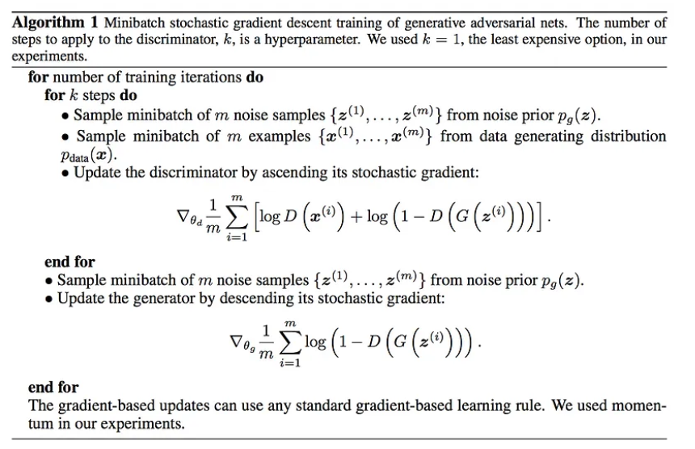

# GAN

> [GAN — What is Generative Adversarial Networks GAN?](https://jonathan-hui.medium.com/gan-whats-generative-adversarial-networks-and-its-application-f39ed278ef09)

**define GAN as a minimax game which *Generator* wants to minimize *V* while *Discriminator* wants to maximize it** :star:

- discriminator 的 loss
  $$
  D(G(x)) \text{ is the possibility of G(x) is real image, expect } D(real\_data)=1\\
  \max_{D}{V(D)} = E[\log{D(real\_data)}] + E[1-log(D(G(x)))]
  $$

  - 第一项为 真实数据，希望预测 D(z) =1 >> loss 接近0
  - 第二项为生成的数据，希望能鉴别出是假的，D(G(x)) = 0  >> loss 接近0

- 生成器：希望鉴别器看不出来，就是 D(G(x)) 接近 0
  $$
  \min_{G}{V(G)} = E[1-\log{D(G(x))}]
  $$

- 训练方式：交替训

  

- gradient diminishing problem for the generator
  $$
  \nabla_{\theta}{\log{(1-D(G(z^{(i)}))})} \\
  change~to >> \nabla_{\theta}{\log{(D(G(z^{(i)})))}}
  $$

# Progressive GAN

TODO

# StyleGAN

> [2019_CVPR_StyleGAN_A-Style-Based-Generator-Architecture-for-Generative-Adversarial-Networks.pdf](./2019_CVPR_StyleGAN_A-Style-Based-Generator-Architecture-for-Generative-Adversarial-Networks.pdf)
>
> https://zhuanlan.zhihu.com/p/63230738
> [styleGAN-step-by-step-tutorial](https://github.com/christianversloot/machine-learning-articles/blob/main/stylegan-a-step-by-step-introduction.md) 
> [GAN — StyleGAN & StyleGAN2](https://jonathan-hui.medium.com/gan-stylegan-stylegan2-479bdf256299) :+1:
> [A Gentle Introduction to StyleGAN the Style Generative Adversarial Network](https://machinelearningmastery.com/introduction-to-style-generative-adversarial-network-stylegan/)
>
> [Official Full List of Code](https://nvlabs.github.io/stylegan2/versions.html)

warps a space that can be sampled with a uniform or normal distribution (middle below) into the latent feature space (left) 

- mapping network

  convert to a new latent space

- Progress GAN network design ([details](https://medium.com/@jonathan_hui/gan-progressive-growing-of-gans-f9e4f91edf33)) and reuses many hyperparameters 

1. nearest-neighbor up/downsampling in G/D >> bilinear sampling

2. AdIN replace PixelNorm

   In each layer, StyleGAN computes a pair of style values (y(s, i) and y(b, i)) as the scale and the bias from w to apply the style to the spatial feature map i

3. Constant Input layer

4. Add noise to create stochastic variation 增加细节（头发）细节变化

5. Mixing regularization

   With Mixing regularization, we **switch to a different latent factor *z*₂** to derive the style after reaching a certain spatial resolution

   use the latent factors that generate image “source B” to derive the coarse spatial resolutions (4×4 to 8×8) style and use that of “source A” for finer spatial resolutions. 

   用两张 source Image

## Perceptual path length

introduces a new metric in measuring GAN’s performance called perceptual path length.

- problems

  - Blob-like artifacts

    StyleGAN2 paper, it traces the problem to the instance normalization used in AdaIN.

# StyleGAN-V2

> [StyleGAN v2: notes on training and latent space exploration](https://medium.com/towards-data-science/stylegan-v2-notes-on-training-and-latent-space-exploration-e51cf96584b3)

