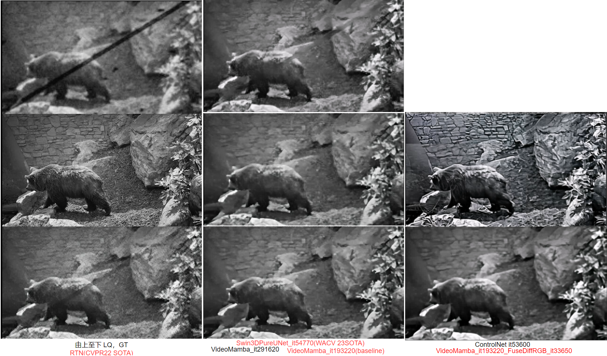
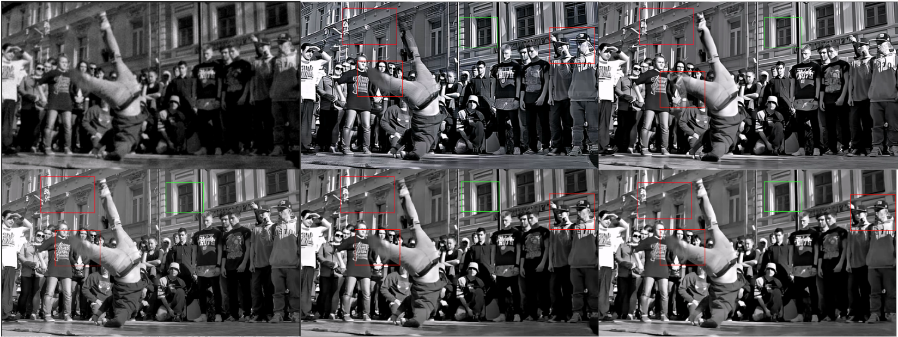
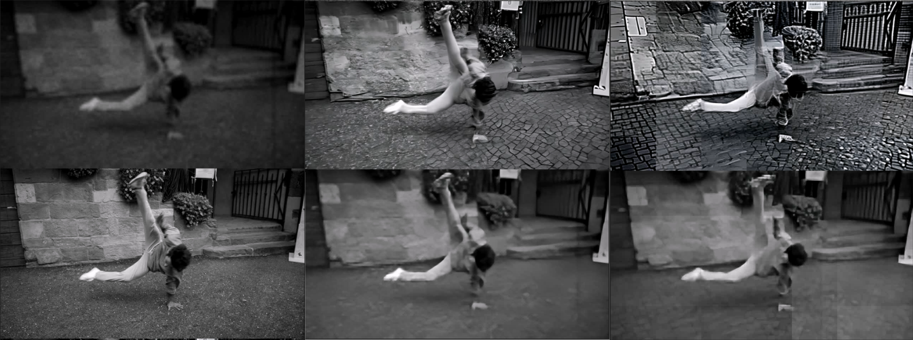

# Old movie restoration

Authors: Rongji(Loki) Xun

> [CCF deadlines](https://ccfddl.github.io/)

We try to employ Video Diffusion Models & Mamba to solve the old film restoration task. 

Currently, only support Gray Video Input and still working on some issues, like texture mismatch in each patch, train video model on limited 24 GPU memory, etc.


## results

Here we posts some current results.

**Video results**

> **From Top to Bottom**, Row1-2LQ; GT; 
>
> Row3 VideoDiffusion; :star:
>
> Row4-5 PreprocessModuleOutput; VideoMamba;

<table style="width: 100%; border-collapse: collapse;">
  <tr>
     <td style="border: 1px solid #ddd; padding: 8px; text-align: center;">
      <div style="font-weight: bold; margin-bottom: 8px;">DAVIS-boat</div>
      
    </td>
    <td style="border: 1px solid #ddd; padding: 8px; text-align: center;">
      <div style="font-weight: bold; margin-bottom: 8px;">DAVIS-bear</div>
      
    </td>
    <td style="border: 1px solid #ddd; padding: 8px; text-align: center;">
      <div style="font-weight: bold; margin-bottom: 8px;">DAVIS-swan</div>
      
    </td>
   </tr>
</table>


**Scratches removing result**

Fusion-based method: best results, we show the first Frame for DAVIS-bear.




- Q：Why some of the evaluation metrics, like PSNR, nearly unchanged after fusion Diffusion and Mamba?



> column1 From Top to Bottom: LQ, GT; column2 VideoDiffusion result, Mamba's result; 
> column3 VideoDiffusion with Preprocess Module; 

Analysis: For some simple textures, Video Diffusion Generates totally different texture from the one in GT, like the window sill rock. Only using cross-attention & L1 loss, the model could hardly learn the well-generated texture from Diffusion.


- Q: texture mismatch in different patch? (Working on it) :fire:



> column1 From Top to Bottom: LQ, GT;
> column2 From Top to Bottom: VideoDiffusionWithPreprocess; VideoMamba;
> column3 From Top to Bottom: VideoDiffusion(24.04.12); FusionResult

In order to lower the GPU memory usage, we emulate RVRT to split the frame into multi-patch during inference. By the Column2 Row1 `VideoDiffusionWithPreprocess` result, we could observe that there exists texture difference in different patches.


## installation

the experiment is conduct under `python3.10.9, CUDA11.8`

**using configured docker image** :turtle:

```
TODO
```


**Or configure a docker image from scratch ** :construction_worker:

docker base-images

```
docker pull pytorch/pytorch:2.1.0-cuda11.8-cudnn8-devel
docker run -it --gpus all --name="xrj_diffusion_outpaint" -v /store:/nas a7108713a5fb bash
```

setup CUDA VARIABLE

```
vim ~/.bashrc
export PATH="/usr/local/cuda/bin:$PATH"
export LD_LIBRARY_PATH="/usr/local/cuda-11.8/lib64:$LD_LIBRARY_PATH"
export HF_ENDPOINT=https://hf-mirror.com
source ~/.bashrc
```

install packages

```sh
pip install -r requirements_torch211cu118.txt -i https://mirrors.aliyun.com/pypi/simple
pip install torch==2.1.1 torchvision==0.16.1 torchaudio==2.1.1 --index-url https://download.pytorch.org/whl/cu118
```

compile SSM in `mamba`

```shell
cd model/video_mamba/causal-conv1d
pip install -e .
cd ../../..

cd model/video_mamba/mamba
pip install -e .
```

install `mamba`

```shell
cd model/video_mamba/mamba
pip install -e .
```


## checkpoints

### pretrained

`SDv1.5` , `SD-turbo`

download pretrained-models from huggingface or [hf-mirror](https://hf-mirror.com/)

```shell
pip install -U huggingface_hub -i https://mirrors.aliyun.com/pypi/simple
echo $HF_ENDPOINT  # none
export HF_ENDPOINT=https://hf-mirror.com

# SD-turbo
huggingface-cli download --resume-download stabilityai/sd-turbo --local-dir-use-symlinks False --local-dir /nas/model/sd-turbo
# SDv1.5
huggingface-cli download --resume-download runwayml/stable-diffusion-v1-5 --local-dir-use-symlinks False --local-dir /nas/model/stable-diffusion-v1-5
```

> :bulb: PS
>
> 1. remember setting parameter `--local-dir-use-symlinks False` ，in case of saving checkpoints in `.cache` as non-human readable form.
> 2. modify `--local-dir`

```
/home/ps/Desktop/xrj/video_understanding/stable-diffusion-v1-5
/home/ps/Desktop/xrj/video_understanding/sd_turbo
```


**Finetuned-VAE**

```sh
/home/ps/Desktop/xrj/video_understanding/sd-vae-ft-mse
/home/ps/Desktop/xrj/video_understanding/sd-vae-ft-mse.zip
```


**AnimateDiff MotionModule**

> used in SDv1.5 version

```
/home/ps/Desktop/xrj/video_understanding/AnimateDiff/mm_sd_v15_v2.ckpt
```


### model

> check space: `du -h --max-depth=1 dir_path` 

- ControlNet-video Diffusion(SDv1.5)

reference PASD, without PASD-module; add Temporal-Layer From `AnimateDiff`

```
#/home/ps/Desktop/xrj/video_understanding/VHS_restoration_journey/release_model/video_diff_fp32_256x256/checkpoint-53600
/home/ps/Desktop/xrj/video_understanding/VHS_restoration_journey/release_model/video_diff_fp32_256x256/PASD_video_diff_fp32_256x256_checkpoint-53600.zip
```


- Swin3D-VideoUNet

```
# Swin3D might lack training
/home/ps/Desktop/xrj/video_understanding/VHS_restoration_journey/release_model/video_diff_fp32_256x256_stage1_encoder/checkpoint-39900

# Swin3D baseline (swin3d__pureUNet)
/home/ps/Desktop/xrj/video_understanding/VHS_restoration_journey/release_model/video_diff_fp32_256x256_with_newDecoder_pureUNet/checkpoint_PSNR_SSIM_LPIPS_BRISQUE_NIQE-53720
```


- `VideoMamba`

```
# it193220
/home/ps/Desktop/xrj/video_understanding/VHS_restoration_journey/release_model/video_restoration_video_mamba_Unet/checkpoint_PSNR-193220
/home/ps/Desktop/xrj/video_understanding/VHS_restoration_journey/release_model/video_restoration_video_mamba_Unet/VideoMamba_checkpoint_PSNR-193220.zip

# it304220
/home/ps/Desktop/xrj/video_understanding/VHS_restoration_journey/release_model/video_restoration_video_mamba_Unet/checkpoint_PSNR_SSIM-304220
/home/ps/Desktop/xrj/video_understanding/VHS_restoration_journey/release_model/video_restoration_video_mamba_Unet/VideoMamba_checkpoint_PSNR_SSIM-304220.zip
```


- `video_mamba_Unet_fuse_diff_FullEncoder`


## datasets

### **training dataset**

- [REDS train_sharp](https://seungjunnah.github.io/Datasets/reds.html)

```
/home/ps/Desktop/dataset/REDS/train_sharp.zip
/home/ps/Desktop/dataset/REDS/train_sharp_bicubic.zip
/home/ps/Desktop/dataset/REDS/val_sharp.zip
/home/ps/Desktop/dataset/REDS/val_sharp_bicubic.zip

# fixed-degradation
/home/ps/Desktop/dataset/REDS/reds_train_degradation
/home/ps/Desktop/dataset/REDS/reds_train_degradation.zip
/home/ps/Desktop/xrj/video_understanding/VHS_restoration_journey/datasets/train_eval.json  # partial test
```


download-dataset script

```
/home/ps/Desktop/dataset/REDS/download_REDS_url.txt
/home/ps/Desktop/dataset/REDS/download_REDS_same-time.sh
```


### **validation dataset**

- `DAVIS` dataset

put it under folder `/home/ps/Desktop/dataset/davis/DAVIS/JPEGImages/480p`

**Fixed-degradation 480p-DAVIS dataset** under `/home/ps/Desktop/dataset/davis/davis_degradation`

```
# train
/home/ps/Desktop/dataset/davis/DAVIS/JPEGImages/480p
/home/ps/Desktop/dataset/davis/DAVIS-2017-trainval-480p.zip
/home/ps/Desktop/dataset/davis/DAVIS-2017-trainval-Full-Resolution.zip

# fixed-degrade
/home/ps/Desktop/dataset/davis/davis_degradation
/home/ps/Desktop/dataset/davis/davis_degradation.zip
```

**partial-validation set for quick validation**

```
/home/ps/Desktop/xrj/video_understanding/VHS_restoration_journey/datasets/davis/test_11video.json
```


- Real-Old-Video Dataset

```
/home/ps/Desktop/dataset/real_old_films_clips/ba_xian.mov
```


### degradation process

Film Noise Template following [RTN:"Bringing-Old-Films-Back-to-Life"]()

```
/home/ps/Desktop/xrj/video_understanding/Bringing-Old-Films-Back-to-Life/noise_data
/home/ps/Desktop/xrj/video_understanding/Bringing-Old-Films-Back-to-Life/RTN_noise_data.zip
```


### SSD-backup

> SSD-disk backup `/media/ps/Loki_WD1T/Tongji_CV_group/VHS_video_restoration/old-film-restoration_env/`


## Q&A

- Q：change `diffusers==0.21.4 ` to `diffusers==0.25.1`, which would result in some modules in `model/video_diffusion/autoencoder_kl.py` not work

> [Fix SD workflow to work with latest diffusers version](https://github.com/microsoft/DeepSpeed/pull/4918/files)

```python
            #if hasattr(diffusers.models.vae, "AutoencoderKL"):
            #    self._orig_layer_class = diffusers.models.vae.AutoencoderKL
            if hasattr(diffusers.models.autoencoders.vae, "AutoencoderKL"):
                self._orig_layer_class = diffusers.models.autoencoders.vae.AutoencoderKL
            else:
                # Diffusers >= 0.12.0 changes location of AutoencoderKL
            #    self._orig_layer_class = diffusers.models.autoencoder_kl.AutoencoderKL
                self._orig_layer_class = diffusers.models.autoencoders.autoencoder_kl.AutoencoderKL
```


- Q：`ImportError: libcudart.so.12: cannot open shared object file: No such file or directory`

`cupy` not installed properly. Reinstall `cupy` with proper version :ok:

Or maybe?

```
vim ~/.bashrc
export PATH="/usr/local/cuda/bin:$PATH"
export LD_LIBRARY_PATH="/usr/local/cuda-11.8/lib64:$LD_LIBRARY_PATH"
source ~/.bashrc
```


- Q：`Module 'scipy' has no attribute 'finfo'`

`pip install scipy=1.11.4`


- Q: Error when calculate `NIQE` metrics using `skvideo`?

```sh
File "/nas/model/xrj/diffusion_video_restoration_VHS/core/metrics.py", line 165, in calc_niqe
    return skvideo.measure.niqe(img)[0]
  File "/opt/conda/lib/python3.10/site-packages/skvideo/measure/niqe.py", line 139, in niqe
    feats = get_patches_test_features(inputVideoData[t, :, :, 0], patch_size)
  File "/opt/conda/lib/python3.10/site-packages/skvideo/measure/niqe.py", line 32, in get_patches_test_features
    return _get_patches_generic(img, patch_size, 0, stride)
  File "/opt/conda/lib/python3.10/site-packages/skvideo/measure/niqe.py", line 69, in _get_patches_generic
    img2 = scipy.misc.imresize(img, 0.5, interp='bicubic', mode='F')
  File "/opt/conda/lib/python3.10/site-packages/scipy/misc/__init__.py", line 45, in __getattr__
    raise AttributeError(
AttributeError: scipy.misc is deprecated and has no attribute imresize.
```

> https://github.com/scikit-video/scikit-video/issues/122
>
> get package path
>
> ```
> python -c "import scipy; print(scipy.__file__)"
> ```

按下面改一下 `scikit_video==1.1.11` 的源码

modify `site-packages/skvideo/measure/niqe.py", line 69` as

```python
import PIL
from PIL import Image

img = img.astype(np.float32)
#img2 = scipy.misc.imresize(img, 0.5, interp='bicubic', mode='F')
img2 = np.array(Image.fromarray(img).resize(
    (int(0.5 * img.shape[0]), int(img.shape[1] * 0.5)),
    resample=PIL.Image.BICUBIC)
 )
```

 modify `"site-packages/skvideo/measure/niqe.py", line L38 `as

```
patch_size = int(patch_size)
```


- pretrained-model

  ```
  #alexnet
  https://download.pytorch.org/models/alexnet-owt-7be5be79.pth
  
  # metrics
  https://download.pytorch.org/models/vgg19-dcbb9e9d.pth
  https://github.com/photosynthesis-team/piq/releases/download/v0.4.0/brisque_svm_weights.pt
  ```

  

