# Rersearch Writing Note

本文档主要整理

- 论文中值得参考的语言表达，行文顺序/逻辑
- 文献整理工具
- 论文写作教程


## tutorial

- "The Most Common Habits from more than 200 English Papers written by  Graduate Chinese Engineering Students"
  [paper](https://www.semanticscholar.org/paper/The-Most-Common-Habits-from-more-than-200-English/a80b02201a44e69fcf5f1b037327449d292b0f10) [pdf](./The Most Common Habits from more than 200 English Papers written by Graduate Chinese Engineering Students.pdf)

### Not work?

> [Frustration with machine learning and deep learning research](https://academia.stackexchange.com/questions/175209/frustration-with-machine-learning-and-deep-learning-research)

不 work 要知道为什么不 work

> **Why was the theory wrong?** "It didn't work" is not the end -- the end is knowing why it didn't work. There are at least two possible answers:


确保代码没问题；疯狂加 assert ，例如输入输出 tensor 的 range， cross-attention 是否用到了 KV 特征还是没做 cross 只是做了 self-attn

> do many "sanity checks" before running the complicated, conclusive experiment or calculation

尽可能简化模型，达到一个能 work & **快速能得到反馈的状态；之后再加模块，看哪个模块导致了不 work**

> I always suggest the opposite: start with the simplest possible thing (e.g., 16x16 thumbnail images) and verify that that works as expected. Keep simplifying until it does the right thing (and ideally, until it runs very quickly, allowing you to run experiments in near-real time). 
>
> Then you can **slowly add back the complexity.** In this way, you can ensure things are implemented correctly, and if it ends up not working, you'll have some intuition for why the original idea didn't work in practice.

- GAN 很难训，会增加训练时间；简化的模型里面先暂时不用


## structure

> Latex Reference 直接在 Google research 上获取引用格式

- Title

- Abstract

  按句子：1 背景；2-3 存在问题；4-5-6 提出的方法，创新点；7实验证明有效

  会议版本 paper 长度限制，背景可以不写。teaser 第一页右上角给出能展示 idea 的图

  


### introduction

> https://www.zhihu.com/question/551747204/answer/2664501959?utm_campaign=shareopn&utm_content=group2_Answer&utm_medium=social&utm_psn=1791814378418479105&utm_source=wechat_session

按段落可参考一下方式

P1 介绍的任务 2-3C. 应用 & 但存在啥问题。早期的工作 3-4 个，**按总结的角度来列举**，不要只写 A propose B propose ...（挑3-4 个非常有名 or 典型的）

P2 **按时间线**早期到近期写。但是还存在啥问题。

P3 提出的方法

contribution 要总结


### related work 

可以开 3 个小章节

例如本文用到了 CLIP, MAE 在 LDR 任务上，可以分为以下三个小节介绍

- LDR
- CLIP
- MAE

- Proposed Methods

  按一下顺序

  - overview

    按完整流程，结合公式详细，有条理的讲清楚本文的方法。同时，Framework 图下面 caption要很清楚，因为一般审稿人会先看 methods overview -> framework_graph。

  - 几个 proposed module xx

  - loss function

  > - 期刊：3.4 Methods 写完一般写到 6.5 页。初稿不算 reference 写12-13页，DL 实验部分一般4.5页
  >
  > - 公式
  >
  >   变量斜体，操作/运算符用正体 （Relu）
  >
  > - 表格
  >
  >   用三线表（表头，为用两条线）；SOTA 性能用颜色+区分
  >
  > - 图
  >
  >   测试集上平均结果更好，要选一看就能凸显优势的图


### Experiments

- setting

  数据集、指标、training_details （例如 loss 权值，优化器，learning rate）

  comparing baseline

- 性能比较

  指标的客观比较，qualitative comparision

- ablation study :star:

  **证明提出的不同模块是有效的，**可以排列组合（太多）。可以直接把要验证的模块去掉 or 换成普通的 cov. 

- Conclusion


## reference

MLA是Modern Language Association的缩写，是美国现代语言协会制定的论文指导格式，相比APA，CMS等格式来说，MLA论文格式更加严谨，更加常用

`Wan, Ziyu, et al. "Bringing old films back to life." *Proceedings of the IEEE/CVF Conference on Computer Vision and Pattern Recognition*. 2022.`


文献引用的常用方法和技巧，能清楚地展示前人已经研究了什么，研究的困难和挑战在什么地方


## Tools

> [research 常见工具](https://www.zhihu.com/question/384512106/answer/1140626874?utm_campaign=shareopn&utm_content=group3_Answer&utm_medium=social&utm_oi=1068508841213423616&utm_psn=1618971927564963840&utm_source=wechat_session)
>

- AI/ML Papers with Code Everywhere - CatalyzeX Chrome 插件
- [get $\LaTeX$ code from formula's image](https://www.simpletex.cn/ai/latex_ocr)
- Web of science


- Q: How to get remind when a specific article has been referenced?

> https://www.cnblogs.com/picassooo/p/13206329.html

点击文章的 `被引用次数`，点击左边栏中的 `创建快讯`


## judge research impact

> [如何判断自己研究的价值](https://www.bilibili.com/video/BV1oL411c7Us/?spm_id_from=333.788&vd_source=eee3c3d2035e37c90bb007ff46c6e881)

用**新意**的方法，**有效**地解决一个**研究**问题。

- 技术类

  1. 研究问题

     **有一些想法，在试之前不知道行不行，一般前几个都不行**

     所以要多实验

  2. 工程问题

     试之前就大概率知道行不行

- 有效性

  相对于之前工作，对于当前问题有所提升

- 新意

  所在领域，有新意。不要求方法，之前没有人提到过。

写文章也要这样：解决什么研究问题，方法新意在哪里，效果咋样。


**判断自己研究的 “价值”**
$$
新意度 \times 有效性 \times 问题大小 = 价值
$$

- 问题大小

  1: 对于前面的工作，在某个不好的点上进行改进

  10: 中等大小，CV 的某个子任务

  100: 机器对图像，文字的理解

- 有效性

  > 精度、规模、安全

  1: 最小，模型精度

  10: 中等，整个社区一年才把数据集提升 10 个点，自己提升了1个点

  100:  提升 5 个点

- 新意度

  > 跟前面的工作相比 or 针对读者来说的新意度，一个技术很难之前没人用过

  1: 一点不意外，说了这个方法，不用看后面，大概率知道结果什么样

  10: 有一定新意度，用了某个技术解决了某个问题

  100: 你用的技术大家之前不熟，感觉打开新世界的大门


分数=1000，能在一个指标上拉满也很好。

```shell
1, 100, 10
100, 10, 1  # 用很有新意的方法，还算有效地解决了一个问题（可以是小问题）！！
100, 1, 10  # 很有新意的方法，不那么有效地解决了中等问题。参考 DETR

# 某个指标达不到 100，3 个 10 也不错
10, 10, 10  # 中等问题上，用还算新意，还有效地解决了问题

# 但某个指标上掉到 1
1,10,10  # 工程味太重
10,1,10  # 不 work
10, 10, 1  # 问题太小了，以至于后续没人更近，但很值得写，至少可以当作写作练习！！！

```


### Novelty

> [Novelty in Science A guide for reviewers](https://perceiving-systems.blog/en/news/novelty-in-science)
>
> 一般入门以后，5篇中一篇？

对于偏理论的领域，上面讲的不太适用。 beauty 将复杂性和创作难度抽离掉，但 beauty 不好定义，举反例。


## writing phrases

- In other words

- To the end. Then

- 总结 paper 贡献、逻辑

  - Our main contributions are as follows
  - The organization of the paper is as follows
  
- $w/o$ without
  $w/$ with

- The schematic of MoudleName 框架图

- generate new features Fc ∈ R 1×1×HW by

  > 2022_05_TPAMI_Learning-Enriched-Features-for-Fast-Image-Restoration-and-Enhancement'
  
- 发现问题 + 提出

  ```
  However, we observe that
  The reason might be lies in that
  To address this issue
  ```
  
- **“e.g.”和“i.e.”** [blog](https://zhuanlan.zhihu.com/p/369563107)

  ”e.g.”是拉丁语exempli gratia的缩写，意思是“举例” (for example)
  “i.e.”是拉丁短语id est的缩写，意思是“也就是说”或“换句话说” (that is)

  **e.g. 提供例子，所以e.g. 倾向于增加选项的数量；而i.e.提供澄清或精确的信息，所以i.e.倾向于缩小选项的数量。**
  
- `Some` 不要用，直接写 Exiting works 就可


### 时态

自己工作（abstract,intro, methos, exp ...）一般现在时，描述客观事实。

related work 可以用一般过去时。


## 写作思路

发现之前方法的问题，再进行针对性改进

> "Clearer Frames, Anytime: Resolving Velocity Ambiguity in Video Frame Interpolation" Arxiv, 2023 Nov
> [paper]() [website](https://zzh-tech.github.io/InterpAny-Clearer/)
> [note](./2023_11_Arxiv_Clearer-Frames--Anytime--Resolving-Velocity-Ambiguity-in-Video-Frame-Interpolation_Note.md)

**Abstract**

1. 研究背景
2. 目前存在的问题
3. contribution


**Introduction**

要有总结性的写，例如：一部分人提出基于哈希编码的（列几个工作），一部分。。。

不要仅仅罗列


## 实验设计

### LowLevel

- "One-Step Effective Diffusion Network for Real-World Image Super-Resolution" Arxiv, 2024 Jun 12, `OSEDiff`
  [paper](http://arxiv.org/abs/2406.08177v2) [code](https://github.com/cswry/OSEDiff.) [pdf](./2024_06_Arxiv_One-Step-Effective-Diffusion-Network-for-Real-World-Image-Super-Resolution.pdf) [note](./2024_06_Arxiv_One-Step-Effective-Diffusion-Network-for-Real-World-Image-Super-Resolution_Note.md)
  Authors: Rongyuan Wu, Lingchen Sun, Zhiyuan Ma, Lei Zhang

- 这个图很漂亮，能直观反映性能！
- 圆形大小反映参数量！

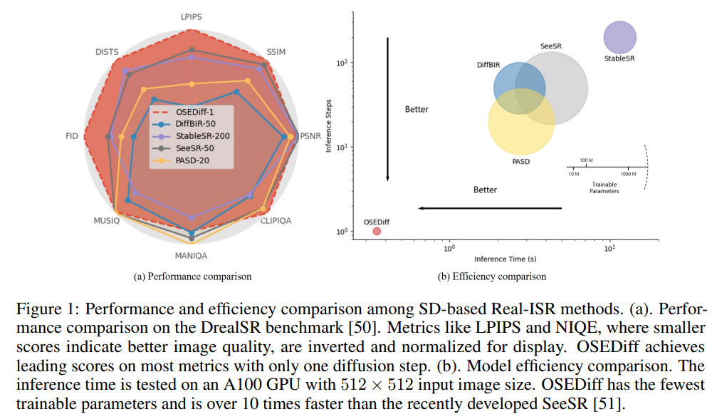


## Graphs

> 画图宗旨：清晰、完整表达 idea 基础上尽可能美观；图主要部分要突出
>
> - "Multi-Modality Deep Network for JPEG Artifacts Reduction" Arxiv, 2023 May
>   [paper](https://arxiv.org/abs/2305.02760)
>
>   参考 figure 设计
>
> - 变量斜体，操作正体
>
> - Loss 缩写 
>   $L_{rec}$ 不要写 $L_1$
>
> - 数据集可以看情况单独一章节
>
>   参考 Ni‘s ESIM

- 线上标明操作代表的含义 & Reshape 前后加上 size

  > MIRNetv2

  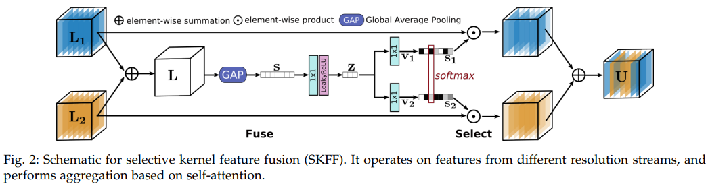

  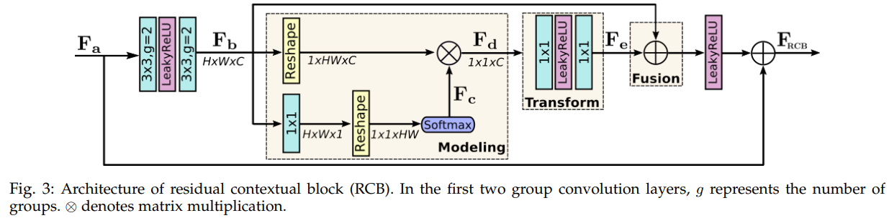

- 单独一个 loss 模块

  > UEGAN

  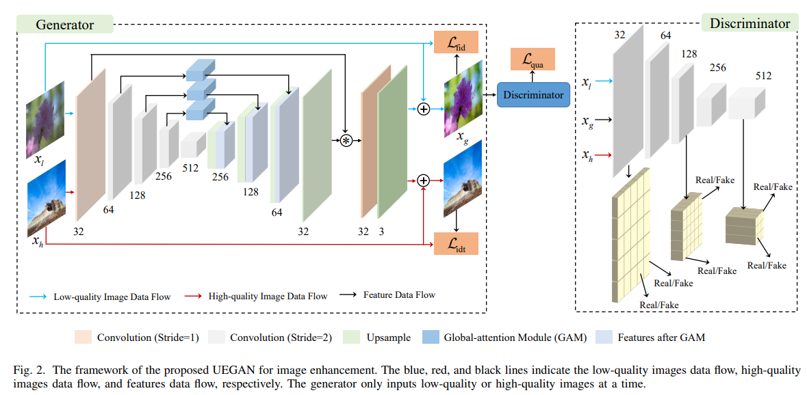

- 模型图示要突出输入，输出，要让能看出模型的整体流程

  对于多个模块，可以通过添加背景配色实现区分

  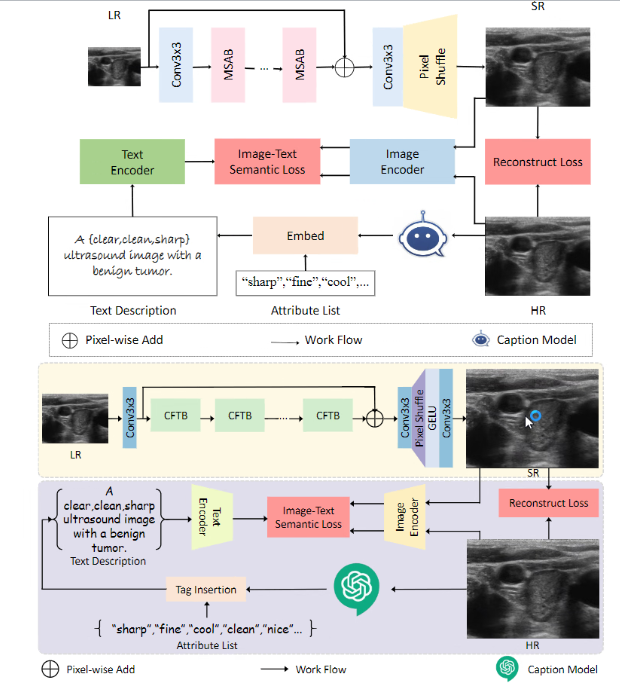	


- 不同的模块，背景不要用一个
- Nature Science 
  - 配色表
  - 属性图，表格

### drawio 图标不足

- 找图标

https://icones.js.org/collection/all?s=loader&icon=system-uicons:loader

https://lucide.dev/icons/rotate-ccw

https://www.jyshare.com/more/svgeditor/

https://www.iconfont.cn/ :star:

- 插入 SVG url

https://www.drawio.com/doc/faq/arrange-insert-menu

- Q: SVG 有想去掉一部分？

https://www.jyshare.com/more/svgeditor/


### 配色

> [0blog](https://mp.weixin.qq.com/s/iNK1YvZTxQg2CeqRAmMXFA) 
>
> [科研配色｜ 第5期. CNS科研配色闭眼抄！](https://mp.weixin.qq.com/s/yKPB9ZK0Nv4BPmokG1B-yA) 
> [科研配色 | 第6期： Nature文章中的缤纷nature配色！](https://mp.weixin.qq.com/s/Mp9ewGtpU2VO3pwedfiJUQ)  :star:  
> [科研配色 | 第7期 清冷色系和堆叠图色系](https://mp.weixin.qq.com/s/0wrRm8R13UoSf_RzPQ2sUQ) 
> [科研配色 blog8](https://mp.weixin.qq.com/s/p3zngb9V7PTfvukmXeq8xw)

Drawio 取色器：点一个模块，`样式` 中点击颜色区域的画笔，进去点击大的画笔


- 双色

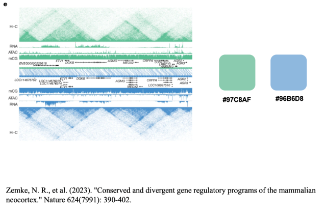

```
#97C8AF
#96B6D8
```


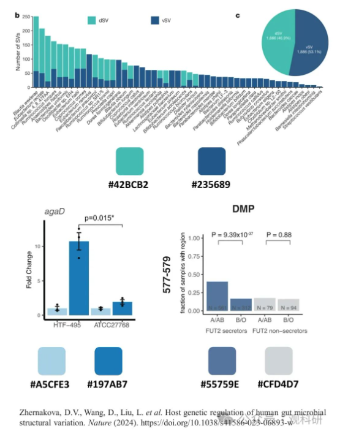

```
#42BCB2 #235689  #A5CFE3 #197AB7 #55759E #CFD4D7
```


- 多色搭配

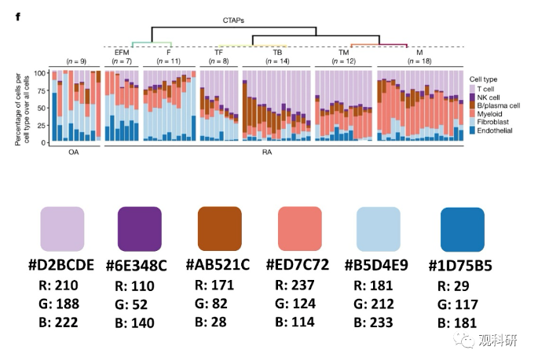

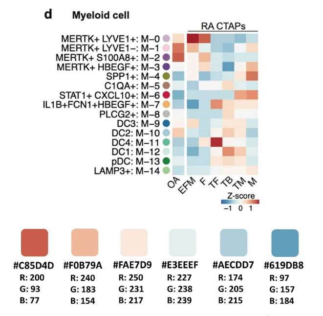


渐进配色 :+1:

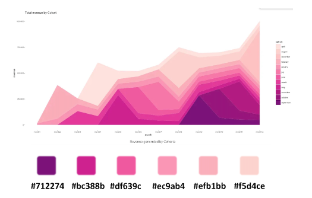

```
#712274 #bc388b df639c#ec9ab4 #efb1bb #f5d4ce
```


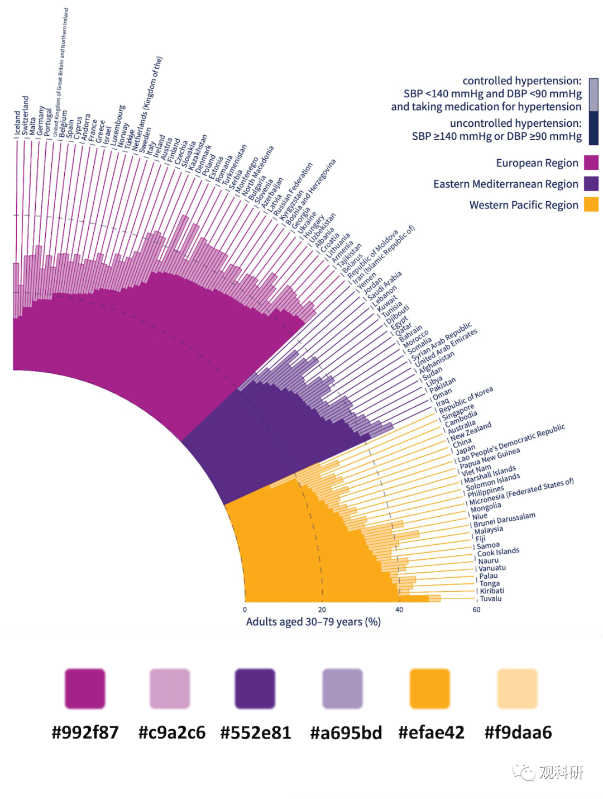

```
#992f87 #c9a2c6 #552e81 #a695bd #efae42 #f9daa6
```


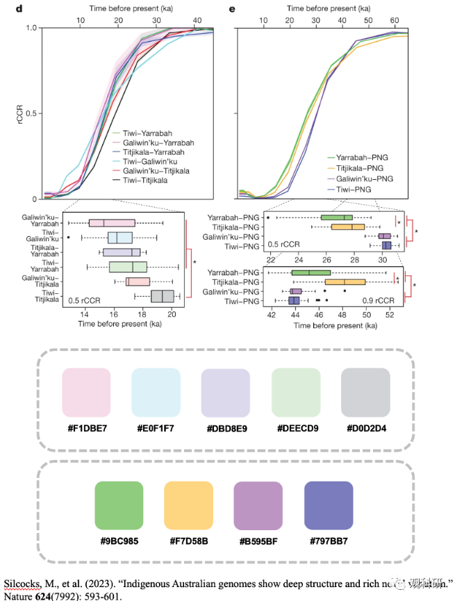

浅色

```
#F1DBE7
#E0F1F7
#DBD8E9
#DEECD9
#D0D2D4
```

深色

```
9BC985
F7D58B
B595BF
797BB7
```


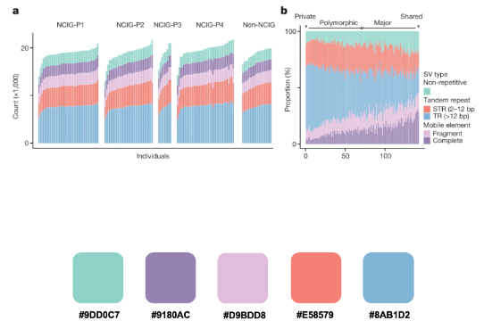

```
#9DDOC7
#9180AC
#D9BDD8
#E58579
#8AB1D2
```


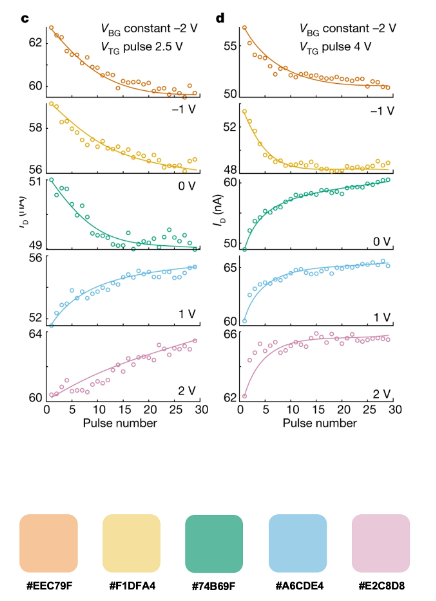

```
#EEC79F
#F1DFA4
#74B69F
#A6CDE4
#E2C8D8
```


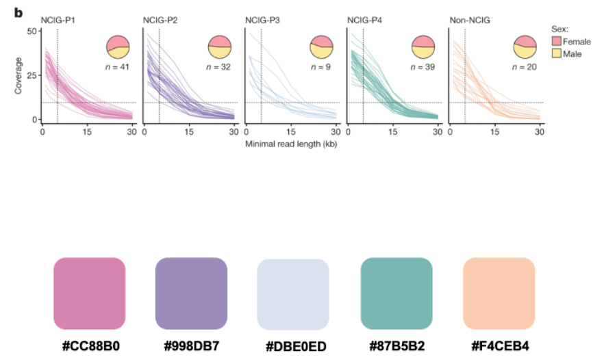

```
#CC88B0
#998DB7
#DBEOED
#87B5B2
#F4CEB4
```


## 论文写作课程

> [course](https://tongxuetang.tongji.edu.cn/course/1445/task/5018/show#)

## github webpage

播放视频，放 gif，github 没法渲染 MP4 

https://raw.githubusercontent.com/guoyww/AnimateDiff/main/README.md

https://github.com/LokiXun/diffusion_video_paper_list/blob/master/old_movie_restoration_progress.md

<table class="center">
	<tr style="line-height: 0">
    <td width=25% style="border: none; text-align: center">Input Scribble</td>
    <td width=25% style="border: none; text-align: center">Output</td>
    <td width=25% style="border: none; text-align: center">Input Scribbles</td>
    <td width=25% style="border: none; text-align: center">Output</td>
    </tr>
    <tr>
      <td width=25% style="border: none"></td>
      <td width=25% style="border: none"></td>
      <td width=25% style="border: none"></td>
      <td width=25% style="border: none"></td>
    </tr>
</table>
