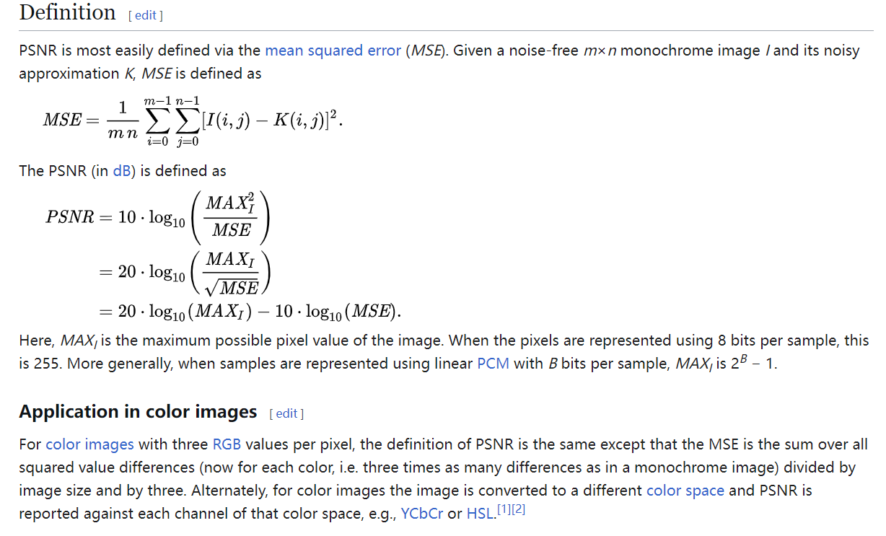
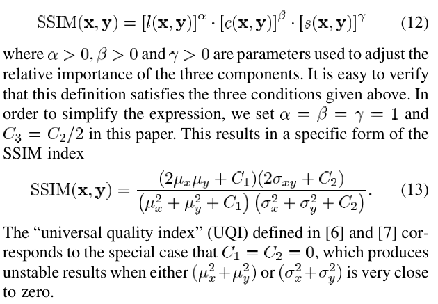
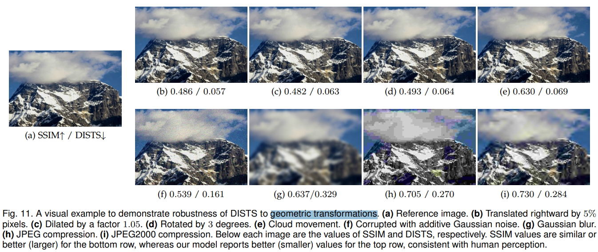
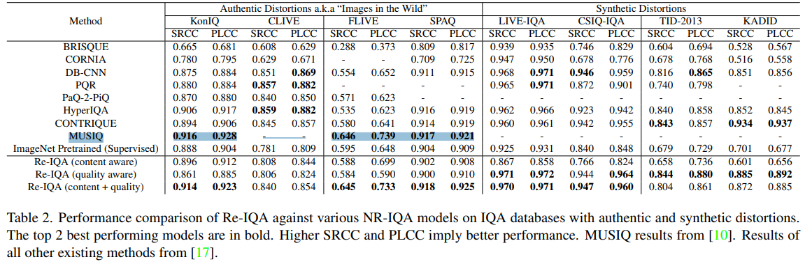
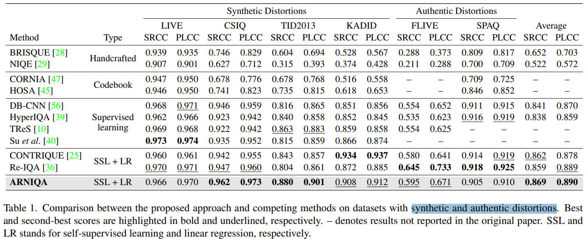
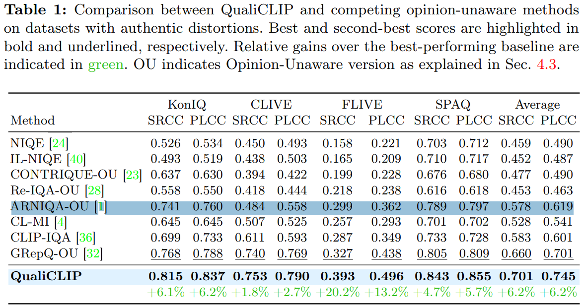
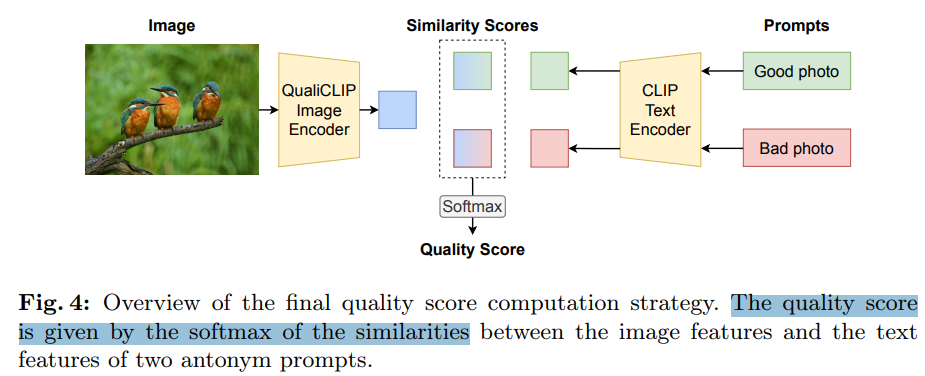

# Survey IQA

> https://github.com/chaofengc/Awesome-Image-Quality-Assessment :star:
>
> https://github.com/ziqihuangg/Awesome-Evaluation-of-Visual-Generation
>
> https://github.com/bcmi/Awesome-Aesthetic-Evaluation-and-Cropping
>
> 
>
> https://github.com/chaofengc/IQA-PyTorch
>
> [README.md](./README.md)

- Objective: Summarize all the image/video quality assessment metrics.


## metrics

SRCC and PLCC

> Spearman rank ordered correlation (SRCC), Pearson linear correlation (PLCC), and the standard deviation (std) are reported.

- SRCC range[-1,1]，接近于1，IQA 效果越好
- KRCC 越大越好
- PLCC range[-1,1]，接近于1，IQA 效果越好


## Full-reference

### PSNR

> **Peak signal-to-noise ratio** (**PSNR**) is an engineering term for the ratio between the maximum possible power of a [signal](https://en.wikipedia.org/wiki/Signal_(information_theory)) and the power of corrupting [noise](https://en.wikipedia.org/wiki/Noise) that affects the fidelity of its representation.
>
> https://en.wikipedia.org/wiki/Peak_signal-to-noise_ratio 



MSE越小，则PSNR越大；所以PSNR越大，代表着图像质量越好。

> PSNR高于40dB说明图像质量极好（即非常接近原始图像），
> 在30—40dB通常表示图像质量是好的（即失真可以察觉但可以接受），
> 在20—30dB说明图像质量差；
> 最后，PSNR低于20dB图像不可接受


对应 code 看一下实现

```python
from skimage.metrics import structural_similarity, peak_signal_noise_ratio  # SSIM, PSNR
```

- MSE

```python
def mean_squared_error(image0, image1):
    """
    Compute the mean-squared error between two images.

    Parameters
    ----------
    image0, image1 : ndarray
        Images.  Any dimensionality, must have same shape.

    Returns
    -------
    mse : float
        The mean-squared error (MSE) metric.

    Notes
    -----
    .. versionchanged:: 0.16
        This function was renamed from ``skimage.measure.compare_mse`` to
        ``skimage.metrics.mean_squared_error``.

    """
    check_shape_equality(image0, image1)
    image0, image1 = _as_floats(image0, image1)
    return np.mean((image0 - image1) ** 2, dtype=np.float64)
```

- 带入公式 `10 * np.log10((data_range ** 2) / err)`

这里 err 是 MSE，data_range 是灰度最大值

```python
def peak_signal_noise_ratio(image_true, image_test, *, data_range=None):
    """
    Compute the peak signal to noise ratio (PSNR) for an image.

    Parameters
    ----------
    image_true : ndarray
        Ground-truth image, same shape as im_test.
    image_test : ndarray
        Test image.
    data_range : int, optional
        The data range of the input image (distance between minimum and
        maximum possible values).  By default, this is estimated from the image
        data-type.

    Returns
    -------
    psnr : float
        The PSNR metric.

    Notes
    -----
    .. versionchanged:: 0.16
        This function was renamed from ``skimage.measure.compare_psnr`` to
        ``skimage.metrics.peak_signal_noise_ratio``.

    References
    ----------
    .. [1] https://en.wikipedia.org/wiki/Peak_signal-to-noise_ratio

    """
    check_shape_equality(image_true, image_test)

    if data_range is None:
        if image_true.dtype != image_test.dtype:
            warn("Inputs have mismatched dtype.  Setting data_range based on "
                 "image_true.")
        dmin, dmax = dtype_range[image_true.dtype.type]
        true_min, true_max = np.min(image_true), np.max(image_true)
        if true_max > dmax or true_min < dmin:
            raise ValueError(
                "image_true has intensity values outside the range expected "
                "for its data type. Please manually specify the data_range.")
        if true_min >= 0:
            # most common case (255 for uint8, 1 for float)
            data_range = dmax
        else:
            data_range = dmax - dmin

    image_true, image_test = _as_floats(image_true, image_test)

    err = mean_squared_error(image_true, image_test)
    return 10 * np.log10((data_range ** 2) / err)
```


### SSIM

- "Image quality assessment: From error visibility to structural similarity" TIP, 2004 Apr 30, `SSIM` 
  [paper](https://ieeexplore.ieee.org/document/1284395) [code](https://cave.cs.columbia.edu/projects/categories/project?cid=Computational+Imaging&pid=Minimalist+Vision+with+Freeform+Pixels) [pdf](./2004_04_TIP_Image-quality-assessment--From-error-visibility-to-structural-similarity.pdf) [note](./2004_04_TIP_Image-quality-assessment--From-error-visibility-to-structural-similarity_Note.md)
  Authors: Zhou Wang,  A.C. Bovik,  H.R. Sheikh,  E.P. Simoncelli

对亮度 $\mu$, 对比度 $\sigma$, 结构特征 $(x-\mu)/\sigma$ 的加权乘积，指数=1




### DISTS

关注纹理的指标！

- "Image Quality Assessment: Unifying Structure and Texture Similarity" TPAMI, 2020 Apr 16, `DISTS`
  [paper](http://arxiv.org/abs/2004.07728v3) [code](https://github.com/dingkeyan93/DISTS) [pdf](./2020_04_TPAMI_Image-Quality-Assessment--Unifying-Structure-and-Texture-Similarity.pdf) [note](./2020_04_TPAMI_Image-Quality-Assessment--Unifying-Structure-and-Texture-Similarity_Note.md)
  Authors: Keyan Ding, Kede Ma, Shiqi Wang, Eero P. Simoncelli

人眼对于相同大致纹理相同（都是草坪）但细节区域纹理不一致的图像，感觉是类似的。PSNR & SSIM & MSE 等传统指标基于两张**对齐的图像**去对比，**发现对于大致纹理相同&细节不同的图像（非对其但是为同一个纹理），和人眼主观感知是有差距的！**

1. SSIM 对物理位置整体移动很敏感！**对于物体移动 vs 高斯退化，高斯退化后的图像居然 SSIM 更高！！**
2. DISTS 区分度主要在 0-0.2 左右，**对于物体移动不敏感，物体移动但不降低质量的 DISTS 比加高斯噪声的更好**




## No-Reference

- "Making a ‘Completely Blind’ Image Quality Analyzer" SPL-2012, `NIQE`

- "A Feature-Enriched Completely Blind Image Quality Evaluator" TIP 2015, `ILNIQE`

  [paper](https://live.ece.utexas.edu/publications/2015/zhang2015feature.pdf)

NIQE 先别用了，真实退化上面效果很拉


- "No-Reference Image Quality Assessment in the Spatial Domain" TIP, 2012 Dec, `BRISQUE`
  [paper](https://www.live.ece.utexas.edu/publications/2012/TIP%20BRISQUE.pdf)


- "The Unreasonable Effectiveness of Deep Features as a Perceptual Metric" CVPR, 2018 Jan 11, `LPIPS`
  [paper](http://arxiv.org/abs/1801.03924v2) [code](https://github.com/richzhang/PerceptualSimilarity) [pdf](./2018_01_CVPR_The-Unreasonable-Effectiveness-of-Deep-Features-as-a-Perceptual-Metric.pdf) [note](./2018_01_CVPR_The-Unreasonable-Effectiveness-of-Deep-Features-as-a-Perceptual-Metric_Note.md)
  Authors: Richard Zhang, Phillip Isola, Alexei A. Efros, Eli Shechtman, Oliver Wang


- "MUSIQ: Multi-scale Image Quality Transformer" ICCV, 2021 Aug 12
  [paper](http://arxiv.org/abs/2108.05997v1) [code](https://github.com/google-research/google-research/tree/master/musiq) [pdf](./2021_08_ICCV_MUSIQ--Multi-scale-Image-Quality-Transformer.pdf) [note](./2021_08_ICCV_MUSIQ--Multi-scale-Image-Quality-Transformer_Note.md)
  Authors: Junjie Ke, Qifei Wang, Yilin Wang, Peyman Milanfar, Feng Yang


- "MANIQA: Multi-dimension Attention Network for No-Reference Image Quality Assessment" **NTIRE2022-1st**, 2022 Apr 19
  [code](https://github.com/IIGROUP/MANIQA)


- "Re-IQA: Unsupervised Learning for Image Quality Assessment in the Wild" CVPR, 2023 Apr 2
  [paper](http://arxiv.org/abs/2304.00451v2) [code]() [pdf](./2023_04_CVPR_Re-IQA--Unsupervised-Learning-for-Image-Quality-Assessment-in-the-Wild.pdf) [note](./2023_04_CVPR_Re-IQA--Unsupervised-Learning-for-Image-Quality-Assessment-in-the-Wild_Note.md)
  Authors: Avinab Saha, Sandeep Mishra, Alan C. Bovik




- "ARNIQA: Learning Distortion Manifold for Image Quality Assessment" WACV-oral 2024, 2023 Oct 20
  [paper](http://arxiv.org/abs/2310.14918v2) [code](https://github.com/miccunifi/ARNIQA.) [pdf](./2023_10_WACV-oral_ARNIQA--Learning-Distortion-Manifold-for-Image-Quality-Assessment.pdf) [note](./2023_10_WACV-oral_ARNIQA--Learning-Distortion-Manifold-for-Image-Quality-Assessment_Note.md)
  Authors: Lorenzo Agnolucci, Leonardo Galteri, Marco Bertini, Alberto Del Bimbo



相比本文指标，Re-IQA 在合成数据上性能接近 & 真实数据上也没差多少；BRISQUE, NIQE 就完全不准了。。。


- "Exploring clip for assessing the look and feel of images" AAAI, 2023, `CLIP-IQA`


- "Quality-Aware Image-Text Alignment for Real-World Image Quality Assessment" Arxiv, 2024 Mar 17, `QualiCLIP`
  [paper](http://arxiv.org/abs/2403.11176v1) [code](https://github.com/miccunifi/QualiCLIP) [pdf](./2024_03_Arxiv_Quality-Aware-Image-Text-Alignment-for-Real-World-Image-Quality-Assessment.pdf) [note](./2024_03_Arxiv_Quality-Aware-Image-Text-Alignment-for-Real-World-Image-Quality-Assessment_Note.md)
  Authors: Lorenzo Agnolucci, Leonardo Galteri, Marco Bertini





Inference 得到的是一个接近于 positive prompt 特征的相似度，范围 [0,1] 越接近 1 越好


### LPIPS

> Learned Perceptual Image Patch Similarity (LPIPS) metric
>
> [LPIPS Loss producing negative values](https://github.com/richzhang/PerceptualSimilarity/issues/72)

- "The Unreasonable Effectiveness of Deep Features as a Perceptual Metric" CVPR, 2018 Jan 11, `LPIPS`
  [paper](http://arxiv.org/abs/1801.03924v2) [code](https://github.com/richzhang/PerceptualSimilarity) [pdf](./2018_01_CVPR_The-Unreasonable-Effectiveness-of-Deep-Features-as-a-Perceptual-Metric.pdf) [note](./2018_01_CVPR_The-Unreasonable-Effectiveness-of-Deep-Features-as-a-Perceptual-Metric_Note.md)
  Authors: Richard Zhang, Phillip Isola, Alexei A. Efros, Eli Shechtman, Oliver Wang

"The Unreasonable Effectiveness of Deep Features as a Perceptual Metric"，更符合人类的感知情况。LPIPS的值越低表示两张图像越相似，反之，则差异越大。` ['alex','vgg','squeeze'] are the base/trunk networks available` 预训练提取初步特征，之后额外的几层 MLP(dropout + Conv) 输出后相加

**将图像归一化到 [-1, 1]，取指定层的特征，计算差值的平方；**


- Perceptual Loss

取 VGG19，5 层 ConvBlock 的第一层 LayerNorm 出来的特征？（记忆里的，待再次核实）


### FID

> [FID score for PyTorch](https://github.com/mseitzer/pytorch-fid/blob/master/src/pytorch_fid/fid_score.py)

**分数越低代表两组图像越相似**，或者说二者的统计量越相似，FID 在最佳情况下的得分为 0.0，表示两组图像相同

用 torchvision 中**预训练好的 InceptionV3 模型**（修改了几层），提取第几个 block 的输出。对每个图像弄成 dimens 尺寸的 embedding。对这个 embedding 提取均值和方差

```python
def calculate_activation_statistics(files, model, batch_size=50, dims=2048,
                                    device='cpu', num_workers=1):
    """Calculation of the statistics used by the FID"""
    mu = np.mean(act, axis=0)
    sigma = np.cov(act, rowvar=False)
    return mu, sigma
```

$ d^2 = ||mu_1 - mu_2||^2 + Tr(C_1 + C_2 - 2*sqrt(C_1*C_2)).$


### BRISQUE

- "No-Reference Image Quality Assessment in the Spatial Domain" TIP, 2012 Dec, `BRISQUE`
  [paper](https://www.live.ece.utexas.edu/publications/2012/TIP%20BRISQUE.pdf)


```python
import piq

def calc_brisque(out, data_range=1., reduction='none') -> torch.Tensor:
    """brisque metric

    Args:
        out : tensor, range[-1,1]
        data_range int: max value Defaults to 1..
        reduction (str, optional): Defaults to 'none'.

    Returns:
        _type_: _description_
    """
    out = torch.clamp((out + 1) / 2., min=0., max=1.)
    return piq.brisque(out, data_range=data_range, reduction=reduction)
```


### NIQE

- "Making a ‘Completely Blind’ Image Quality Analyzer" SPL-2012, `NIQE`

- "A Feature-Enriched Completely Blind Image Quality Evaluator" TIP 2015, `ILNIQE`

  [paper](https://live.ece.utexas.edu/publications/2015/zhang2015feature.pdf)

```python
def calc_niqe(img: torch.Tensor):
    """img.convert("L")"""
    img = torchvision.transforms.ToPILImage()(img)
    img = np.array(img.convert("L")).astype(np.float32)
    if img is None:
        return None
    return skvideo.measure.niqe(img)[0]
```


## UHD

- "UHD-IQA Benchmark Database: Pushing the Boundaries of Blind Photo Quality Assessment" 
  [paper](https://arxiv.org/pdf/2406.17472)


- "Assessing UHD Image Quality from Aesthetics, Distortions, and Saliency" ECCVWorkshop, 2024 Sep 1
  [paper](http://arxiv.org/abs/2409.00749v1) [code](https://github.com/sunwei925/UIQA) [pdf](./2024_09_ECCVWorkshop_Assessing-UHD-Image-Quality-from-Aesthetics--Distortions--and-Saliency.pdf) [note](./2024_09_ECCVWorkshop_Assessing-UHD-Image-Quality-from-Aesthetics--Distortions--and-Saliency_Note.md)
  Authors: Wei Sun, Weixia Zhang, Yuqin Cao, Linhan Cao, Jun Jia, Zijian Chen, Zicheng Zhang, Xiongkuo Min, Guangtao Zhai


## Video

> https://github.com/ckkelvinchan/BasicVSR_PlusPlus/tree/master/tests
>
> https://github.com/open-mmlab/mmagic/blob/main/mmagic/evaluation/__init__.py
>
> - Warp Error https://github.com/phoenix104104/fast_blind_video_consistency
> - VFID https://github.com/amjltc295/Free-Form-Video-Inpainting/blob/master/src/evaluate.py#L28

- "Learning Blind Video Temporal Consistency" ECCV, 2018 Aug 1, `warping-error`
  [paper](http://arxiv.org/abs/1808.00449v1) [code](https://github.com/phoenix104104/fast_blind_video_consistency) [pdf](./2018_08_ECCV_Learning-Blind-Video-Temporal-Consistency.pdf) [note](./2018_08_ECCV_Learning-Blind-Video-Temporal-Consistency_Note.md)
  Authors: Wei-Sheng Lai, Jia-Bin Huang, Oliver Wang, Eli Shechtman, Ersin Yumer, Ming-Hsuan Yang

warp error 有代码，这个论文用的 FlowNet 生成光流，需要自己换成别的光流模型 :warning:


- "FAST-VQA: Efficient End-to-end Video Quality Assessment with Fragment Sampling" ECCV2022+TPAMI2023, 2022 Jul 6
  [paper](http://arxiv.org/abs/2207.02595v1) [code](https://github.com/VQAssessment/FAST-VQA-and-FasterVQA) [pdf](./2022_07_ECCV_FAST-VQA--Efficient-End-to-end-Video-Quality-Assessment-with-Fragment-Sampling.pdf) [note](./2022_07_ECCV_FAST-VQA--Efficient-End-to-end-Video-Quality-Assessment-with-Fragment-Sampling_Note.md)
  Authors: Haoning Wu, Chaofeng Chen, Jingwen Hou, Liang Liao, Annan Wang, Wenxiu Sun, Qiong Yan, Weisi Lin

> our future work DOVER based on FAST-VQA with even better performance

- "Exploring Video Quality Assessment on User Generated Contents from Aesthetic and Technical Perspectives" ICCV, 2022 Nov 9, `DOVER` :star:
  [paper](http://arxiv.org/abs/2211.04894v3) [code](https://github.com/VQAssessment/DOVER) [pdf](./2022_11_ICCV_Exploring-Video-Quality-Assessment-on-User-Generated-Contents-from-Aesthetic-and-Technical-Perspectives.pdf) [note](./2022_11_ICCV_Exploring-Video-Quality-Assessment-on-User-Generated-Contents-from-Aesthetic-and-Technical-Perspectives_Note.md)
  Authors: Haoning Wu, Erli Zhang, Liang Liao, Chaofeng Chen, Jingwen Hou, Annan Wang, Wenxiu Sun, Qiong Yan, Weisi Lin

注意测试时候用的 224x224 T=32 的视频，需要 6G VRAM 左右


- "Human Preference Score v2: A Solid Benchmark for Evaluating Human Preferences of Text-to-Image Synthesis" Arxiv, 2023 Jun 15, `HPSv2`
  [paper](http://arxiv.org/abs/2306.09341v2) [code](https://github.com/tgxs002/HPSv2) [pdf](./2023_06_Arxiv_Human-Preference-Score-v2--A-Solid-Benchmark-for-Evaluating-Human-Preferences-of-Text-to-Image-Synthesis.pdf) [note](./2023_06_Arxiv_Human-Preference-Score-v2--A-Solid-Benchmark-for-Evaluating-Human-Preferences-of-Text-to-Image-Synthesis_Note.md)
  Authors: Xiaoshi Wu, Yiming Hao, Keqiang Sun, Yixiong Chen, Feng Zhu, Rui Zhao, Hongsheng Li

> - "Not All Noises Are Created Equally:Diffusion Noise Selection and Optimization" Arxiv, 2024 Jul 19
>   [paper](http://arxiv.org/abs/2407.14041v1) [code]() [pdf](./2024_07_Arxiv_Not-All-Noises-Are-Created-Equally-Diffusion-Noise-Selection-and-Optimization.pdf) [note](./2024_07_Arxiv_Not-All-Noises-Are-Created-Equally-Diffusion-Noise-Selection-and-Optimization_Note.md)
>   Authors: Zipeng Qi, Lichen Bai, Haoyi Xiong, and Zeke Xie
>
> HPS v2, PickScore, and ImageReward are all emerging human reward models that **approximate human preference** for text-to-image generation
>
> **HPS v2 is the state-of-the-art human reward model so far and offers a metric more close to human preference**
>
> human preference is regarded as the ground-truth and ultimate evaluation method for text-to-image generation. Thus, we regard **human preference and HPS v2 as the two most important metrics.**


- "VBench: Comprehensive Benchmark Suite for Video Generative Models" CVPR-highlight, 2023 Nov 29 :star:
  [paper](http://arxiv.org/abs/2311.17982v1) [code]() [pdf](./2023_11_CVPR-highlight_VBench--Comprehensive-Benchmark-Suite-for-Video-Generative-Models.pdf) [note](./2023_11_CVPR-highlight_VBench--Comprehensive-Benchmark-Suite-for-Video-Generative-Models_Note.md)
  Authors: Ziqi Huang, Yinan He, Jiashuo Yu, Fan Zhang, Chenyang Si, Yuming Jiang, Yuanhan Zhang, Tianxing Wu, Qingyang Jin, Nattapol Chanpaisit, Yaohui Wang, Xinyuan Chen, Limin Wang, Dahua Lin, Yu Qiao, Ziwei Liu


- "Perceptual Video Quality Assessment: A Survey" Arxiv, 2024 Feb 5
  [paper](http://arxiv.org/abs/2402.03413v1) [code]() [pdf](./2024_02_Arxiv_Perceptual-Video-Quality-Assessment--A-Survey.pdf) [note](./2024_02_Arxiv_Perceptual-Video-Quality-Assessment--A-Survey_Note.md)
  Authors: Xiongkuo Min, Huiyu Duan, Wei Sun, Yucheng Zhu, Guangtao Zhai


- "PTM-VQA: Efficient Video Quality Assessment Leveraging Diverse PreTrained Models from the Wild" CVPR2024, 2024 May 5
  [paper](https://arxiv.org/abs/2405.17765)


- "A Survey of AI-Generated Video Evaluation" Arxiv, 2024 Oct 24
  [paper](http://arxiv.org/abs/2410.19884v1) [code]() [pdf](./2024_10_Arxiv_A-Survey-of-AI-Generated-Video-Evaluation.pdf) [note](./2024_10_Arxiv_A-Survey-of-AI-Generated-Video-Evaluation_Note.md)
  Authors: Xiao Liu, Xinhao Xiang, Zizhong Li, Yongheng Wang, Zhuoheng Li, Zhuosheng Liu, Weidi Zhang, Weiqi Ye, Jiawei Zhang


- "VBench++: Comprehensive and Versatile Benchmark Suite for Video Generative Models" Arxiv, 2024 Nov 20
  [paper](http://arxiv.org/abs/2411.13503v1) [code](https://github.com/Vchitect/VBench) [pdf](./2024_11_Arxiv_VBench++--Comprehensive-and-Versatile-Benchmark-Suite-for-Video-Generative-Models.pdf) [note](./2024_11_Arxiv_VBench++--Comprehensive-and-Versatile-Benchmark-Suite-for-Video-Generative-Models_Note.md)
  Authors: Ziqi Huang, Fan Zhang, Xiaojie Xu, Yinan He, Jiashuo Yu, Ziyue Dong, Qianli Ma, Nattapol Chanpaisit, Chenyang Si, Yuming Jiang, Yaohui Wang, Xinyuan Chen, Ying-Cong Chen, Limin Wang, Dahua Lin, Yu Qiao, Ziwei Liu

