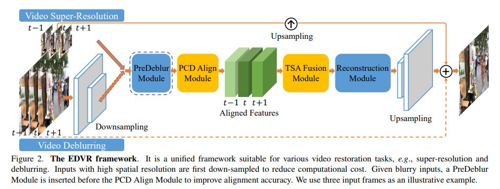

# Survey on Video SR & VFI & deblur

> main note [README](./README.md)
>
> - https://github.com/liuzhen03/awesome-video-enhancement :star:
> - https://github.com/orbit253/Awesome-Space-Time-Video-Super-Resolution

- Q：diffusion Venhancer 生成的细节改变了，非 diffusion 方案生成人体形变比 diffusion 更严重

思考大致方向

- Reference based? 强调一致性
- 跨越 clip


## data & ckpt & metrics

> RVRT 仓库整理了很多 test-set 可以直接下
>
> https://github.com/JingyunLiang/VRT/releases

- VSR Synthetic Data

  - REDS

    > https://seungjunnah.github.io/Datasets/reds.html
    >
    > https://github.com/KAIST-VICLab/FMA-Net?tab=readme-ov-file#data-preprocessing 
    >
    > Also, to evaluate generalization performance, we employ the GoPro [51] and YouTube datasets as test sets alongside REDS4
    >
    > **1Clips 000, 011, 015, 020 of the REDS training set :star:**

  - Vimeo90K

  - Vid4

    > https://github.com/shangwei5/ST-AVSR?tab=readme-ov-file#datasets

  - UMD10

    > https://github.com/ckkelvinchan/RealBasicVSR?tab=readme-ov-file#videolq-dataset

- deblur

  - GoPro

    > https://seungjunnah.github.io/Datasets/gopro

  - DVD

    > https://github.com/JingyunLiang/VRT/releases

- denoise

  - Davis

    > https://github.com/JingyunLiang/VRT/releases

  - Set8

    > https://github.com/JingyunLiang/VRT/releases


- RealWorld Data(Diffusion SR)

  - YouHQ, 1920x1090 :star:，含有物体主题镜头，背景虚化 :+1:

    > from Upscale-A-Video
    >
    > https://github.com/sczhou/Upscale-A-Video?tab=readme-ov-file#%EF%B8%8F-youhq-dataset

  - VideoLQ，质量很垃圾。。。<=640x360

    > https://github.com/ckkelvinchan/RealBasicVSR?tab=readme-ov-file#videolq-dataset

- [ ] MovieNet Movie Clips


- Q：BI vs BD degradation 啥区别？

> 参考 RVRT
>
>  For video SR, we consider two settings: bicubic (BI) and blur-downsampling (BD) degradation.

因此 BI Degradation 测试

- REDS4 RGB
- Vimeo90K-T
- Vid4 (有 BI, BD 两种，差别不大)

BD degradation

- UDM10
- Vimeo-90K-T
- Vid4


### **metrics**

> [survey_IQA.md](./survey_IQA.md)

- 模型运行性能

  - Params(M), Runtime(s)

- Full-Reference

  - PSNR(RGB or Y), SSIM


  > https://github.com/KAIST-VICLab/FMA-Net/blob/337bb45f56b1e550073eaa0dfaee199395a3606f/utils.py#L351

  - LPIPS
  - DISTS :star:


- No-reference

  - QualiCLIP :star:

  - ARNIQA

  - MUSIQ :+1: (Upscale-A-Video)

  - CLIP-IQA :+1: :+1: (Upscale-A-Video)

  - DOVER (VQA) :+1: :+1: (Upscale-A-Video) 无 GT 视频的时序指标

    > "Exploring Video Quality Assessment on User Generated Contents from Aesthetic and Technical Perspectives" ICCV2023, `DOVER`
    > [paper](https://arxiv.org/pdf/2211.04894) [code](https://github.com/VQAssessment/FAST-VQA-and-FasterVQA?tab=readme-ov-file)

  - BRISQUE，没有 DOVER 准 & 扭曲情况下效果很垃圾
  - NIQE，先别用了，很垃圾


- Video Temporal metrics

  - toF

    > FMA-Net code 
    > https://github.com/KAIST-VICLab/FMA-Net/blob/337bb45f56b1e550073eaa0dfaee199395a3606f/utils.py#L351

  - warping error

    > "Learning blind video temporal consistency" ECCV, 2018

  - 视频每帧同一位置取一条线，在 t 上拼起来

  - DOVER (VQA NR)

    > "Exploring Video Quality Assessment on User Generated Contents from Aesthetic and Technical Perspectives" ICCV2023, `DOVER`
    > [paper](https://arxiv.org/pdf/2211.04894) [code](https://github.com/VQAssessment/FAST-VQA-and-FasterVQA?tab=readme-ov-file)


### synthetic data x4SR

#### REDS4 BD

- (val_blur_bicubic)

|                                                | Params(M)                        | time(s/f) | PSNR(RGB)  | PSNR(Y)    | SSIM↑     | LPIPS ↓  | FID  | DISTS↓ | toF↓    | WE↓  | BRISQUE   |
| ---------------------------------------------- | -------------------------------- | --------- | ---------- | ---------- | --------- | -------- | ---- | ------ | ------- | ---- | --------- |
| BasicVSR++(CVPR2022)                           |                                  |           |            |            |           |          |      |        |         |      |           |
| RealBasicVSR(CVPR2022)                         |                                  |           |            |            |           |          |      |        |         |      |           |
| VRT(Arxiv2022 -> TIP2024)                      |                                  |           |            |            |           |          |      |        |         |      |           |
| RVRT(NIPS2022) <br />30frames                  | 9.3419949 + 1.4403(optical flow) |           | 24.9378466 | 26.3318931 | 0.7329819 |          |      |        |         |      |           |
| PSRT(NIPS2022)                                 | 13.366943                        |           | 24.917350  |            | 0.732055  |          |      |        |         |      |           |
| MGLD-VSR(ECCV2024)                             |                                  |           |            |            |           |          |      |        |         |      |           |
| Upscale-A-Video(CVPR2024)                      | 691.036436                       |           | 22.82469   | 24.27972   | 0.60125   | 0.430240 |      |        | 6.05114 |      | 26.398020 |
| `MIA-VSR` (CVPR2024)                           | 16.596719                        |           | 24.920246  |            | 0.731834  |          |      |        |         |      |           |
| FAM-Net(CVPR2024) <br />:warning: 没生成首尾帧 | 9.766503                         |           | 28.87683   | 30.2705    | 0.83172   | 0.2466   |      |        | 1.9148  |      | 45.0958   |

#### REDS4 BI

- (val_sharp_bicubic)

|                                                | Params(M)                        | time(s/f) | PSNR(RGB)  | PSNR(Y)    | SSIM↑     | LPIPS ↓   | FID  | DISTS↓ | toF↓    | WE↓  | QualiCLIP | MUSIQ | DOVER | BRISQUE  |
| ---------------------------------------------- | -------------------------------- | --------- | ---------- | ---------- | --------- | --------- | ---- | ------ | ------- | ---- | --------- | ----- | ----- | -------- |
| BasicVSR++(CVPR2022)                           |                                  |           |            |            |           |           |      |        |         |      |           |       |       |          |
| RealBasicVSR(CVPR2022)                         |                                  |           |            |            |           |           |      |        |         |      |           |       |       |          |
| VRT(Arxiv2022 -> TIP2024)<br />16 frames       |                                  |           |            |            |           |           |      |        |         |      |           |       |       |          |
| RVRT(NIPS2022) <br />30 frames                 | 9.3419949 + 1.4403(optical flow) |           | 32.7447438 | 34.1391806 | 0.9113206 |           |      |        |         |      |           |       |       |          |
| PSRT(NIPS2022)                                 | 13.366943                        |           | 32.721308  |            | 0.910585  |           |      |        |         |      |           |       |       |          |
| MGLD-VSR(ECCV2024)                             |                                  |           |            |            |           |           |      |        |         |      |           |       |       |          |
| Upscale-A-Video(CVPR2024)                      | 691.036436                       |           | 24.46673   | 25.96335   | 0.644729  | 0.3248732 |      |        | 3.82121 |      |           |       |       | 21.46043 |
| `MIA-VSR` (CVPR2024)                           | 16.596719                        |           | 32.790506  |            | 0.911523  |           |      |        |         |      |           |       |       |          |
| FAM-Net(CVPR2024) <br />:warning: 没生成首尾帧 | 9.766503                         |           | 26.377029  | 27.73774   | 0.800012  | 0.2722    |      |        | 2.19973 |      |           |       |       | 46.3111  |


#### Vid4 BI

|                                                | Params(M)                        | time(s/f) | PSNR(RGB)  | PSNR(Y)    | SSIM↑     | LPIPS ↓  | FID  | DISTS↓ | toF↓    | WE↓  | QualiCLIP | MUSIQ | DOVER | BRISQUE  |
| ---------------------------------------------- | -------------------------------- | --------- | ---------- | ---------- | --------- | -------- | ---- | ------ | ------- | ---- | --------- | ----- | ----- | -------- |
| BasicVSR++(CVPR2022)                           |                                  |           |            |            |           |          |      |        |         |      |           |       |       |          |
| RealBasicVSR(CVPR2022)                         |                                  |           |            |            |           |          |      |        |         |      |           |       |       |          |
| VRT(Arxiv2022 -> TIP2024)<br />16 frames       |                                  |           |            |            |           |          |      |        |         |      |           |       |       |          |
| RVRT(NIPS2022)<br />14 frames                  | 9.3419949 + 1.4403(optical flow) |           | 26.4388716 | 27.9865636 | 0.8285110 |          |      |        |         |      |           |       |       |          |
| PSRT(NIPS2022) :warning:                       | 13.366943                        |           | 26.246403  |            | 0.828969  |          |      |        |         |      |           |       |       |          |
| MGLD-VSR(ECCV2024)                             |                                  |           |            |            |           |          |      |        |         |      |           |       |       |          |
| Upscale-A-Video(CVPR2024)                      | 691.036436                       |           | 20.99954   | 22.516599  | 0.5233378 | 0.328662 |      |        |         |      |           |       |       | 31.81846 |
| `MIA-VSR` (CVPR2024) <br />REDS ckpt           | 16.596719                        |           | 26.200055  |            | 0.826181  |          |      |        |         |      |           |       |       |          |
| `MIA-VSR` (CVPR2024) <br />Vid ckpt            |                                  |           | 26.665814  |            | 0.833495  |          |      |        |         |      |           |       |       |          |
| FAM-Net(CVPR2024) <br />:warning: 没生成首尾帧 | 9.766503                         |           | 24.74557   | 26.169861  | 0.77544   | 0.27727  |      |        | 0.22583 |      |           |       |       | 45.69872 |

#### Vid4 BD

|                                                | Params(M)                        | time(s/f) | PSNR(RGB)  | PSNR(Y)  | SSIM↑    | LPIPS ↓   | FID  | DISTS↓ | toF↓    | WE↓  | QualiCLIP | MUSIQ | DOVER | BRISQUE  |
| ---------------------------------------------- | -------------------------------- | --------- | ---------- | -------- | -------- | --------- | ---- | ------ | ------- | ---- | --------- | ----- | ----- | -------- |
| BasicVSR++(CVPR2022)                           |                                  |           |            |          |          |           |      |        |         |      |           |       |       |          |
| RealBasicVSR(CVPR2022)                         |                                  |           |            |          |          |           |      |        |         |      |           |       |       |          |
| VRT(Arxiv2022 -> TIP2024)<br />16 frames       |                                  |           |            |          |          |           |      |        |         |      |           |       |       |          |
| RVRT(NIPS2022)<br />14frames, Vimeo-BI-train   | 9.3419949 + 1.4403(optical flow) |           | 21.22      | 22.58    | 0.6508   |           |      |        |         |      |           |       |       |          |
| RVRT(NIPS2022)<br />14frames, Vimeo-BD-train   | 9.3419949 + 1.4403(optical flow) |           | 27.95      | 29.54    | 0.8648   |           |      |        |         |      |           |       |       |          |
| PSRT(NIPS2022)                                 | 13.366943                        |           | 23.887546  |          | 0.761327 |           |      |        |         |      |           |       |       |          |
| MGLD-VSR(ECCV2024)                             |                                  |           |            |          |          |           |      |        |         |      |           |       |       |          |
| Upscale-A-Video(CVPR2024)                      | 691.036436                       |           | 20.7733858 | 22.27809 | 0.499901 | 0.3471969 |      |        | 0.48384 |      |           |       |       | 30.18532 |
| `MIA-VSR` (CVPR2024) <br />REDS ckpt           | 16.596719                        |           | 24.100690  |          | 0.765291 |           |      |        |         |      |           |       |       |          |
| `MIA-VSR` (CVPR2024) <br />Vid ckpt            | 16.596719                        |           | 22.384626  |          | 0.680851 |           |      |        |         |      |           |       |       |          |
| FAM-Net(CVPR2024) <br />:warning: 没生成首尾帧 | 9.766503                         |           | 24.468332  | 25.89256 | 0.758848 | 0.29327   |      |        | 0.28081 |      |           |       |       | 47.28148 |

- REDS 数据 motion 程度更大，对于 deblur 效果换到不同数据集上可以的


#### UDM10 BD

|                                                        | Params(M)                        | time(s/f) | PSNR(RGB)  | PSNR(Y)    | SSIM↑     | LPIPS ↓ | FID  | DISTS↓ | toF↓    | WE↓  | QualiCLIP | MUSIQ | DOVER | BRISQUE  |
| ------------------------------------------------------ | -------------------------------- | --------- | ---------- | ---------- | --------- | ------- | ---- | ------ | ------- | ---- | --------- | ----- | ----- | -------- |
| BasicVSR++(CVPR2022)                                   |                                  |           |            |            |           |         |      |        |         |      |           |       |       |          |
| RealBasicVSR(CVPR2022)                                 |                                  |           |            |            |           |         |      |        |         |      |           |       |       |          |
| VRT(Arxiv2022 -> TIP2024)<br />16 frames               |                                  |           |            |            |           |         |      |        |         |      |           |       |       |          |
| RVRT(NIPS2022)<br />14 frames VimeoBI train :question: | 9.3419949 + 1.4403(optical flow) |           | 31.3469180 | 32.9194171 | 0.9123503 |         |      |        |         |      |           |       |       |          |
| RVRT(NIPS2022)<br />14 frames VimeoBD train :question: | 9.3419949 + 1.4403(optical flow) |           | 38.44      | 40.90      | 0.9610    |         |      |        |         |      |           |       |       |          |
| PSRT(NIPS2022)                                         | 13.366943 - 1.4403(optical flow) |           | 33.729763  |            | 0.932817  |         |      |        |         |      |           |       |       |          |
| MGLD-VSR(ECCV2024)                                     |                                  |           |            |            |           |         |      |        |         |      |           |       |       |          |
| Upscale-A-Video(CVPR2024)                              | 691.036436                       |           | 28.11334   | 29.78240   | 0.795406  | 0.23650 |      |        | 1.08350 |      |           |       |       | 25.82656 |
| `MIA-VSR` (CVPR2024)<br />REDS Ckpt                    | 16.596719                        |           | 33.855371  |            | 0.934207  |         |      |        |         |      |           |       |       |          |
| FAM-Net(CVPR2024) <br />:warning: 没生成首尾帧         | 9.766503                         |           | 33.33307   | 34.89573   | 0.92992   | 0.09925 |      |        | 0.49535 |      |           |       |       | 53.17313 |

- UDM10 BD 退化，其他模型只训了 BI 的


#### Vimeo-90K-T BI

> Test script https://github.com/XPixelGroup/RethinkVSRAlignment/blob/main/inference/inference_psrtrecurrent_vimeo90k.py
>
> Test Dataset https://github.com/JingyunLiang/VRT/releases
>
> - :warning: Vimeo90K test set 一共 `7824` 个 video clip， 96个父目录 
> - PSRT 等工作只测每个 clip(7帧）中间那一帧(im4.png) 的指标，**一共 7824 帧单独算指标，看看 spatial 指标就可以了**

|                                                | Params(M)  | time(s/f) | PSNR(RGB) | PSNR(Y) | SSIM↑ | LPIPS ↓ | FID  | DISTS↓ | toF↓ | WE↓  | QualiCLIP | MUSIQ | DOVER | BRISQUE |
| ---------------------------------------------- | ---------- | --------- | --------- | ------- | ----- | ------- | ---- | ------ | ---- | ---- | --------- | ----- | ----- | ------- |
| BasicVSR++(CVPR2022)                           |            |           |           |         |       |         |      |        |      |      |           |       |       |         |
| RealBasicVSR(CVPR2022)                         |            |           |           |         |       |         |      |        |      |      |           |       |       |         |
| RVRT(NIPS2022) <br />14 frames                 |            |           |           |         |       |         |      |        |      |      |           |       |       |         |
| PSRT(NIPS2022)                                 |            | o         |           |         |       |         |      |        |      |      |           |       |       |         |
| MGLD-VSR(ECCV2024)                             |            |           |           |         |       |         |      |        |      |      |           |       |       |         |
| Upscale-A-Video(CVPR2024)                      | 691.036436 |           |           |         |       |         |      |        |      |      |           |       |       |         |
| `MIA-VSR` (CVPR2024)                           | 16.596719  | o         |           |         |       |         |      |        |      |      |           |       |       |         |
| FAM-Net(CVPR2024) <br />:warning: 没生成首尾帧 | 9.766503   |           |           |         |       |         |      |        |      |      |           |       |       |         |


### realworld data

#### VideoLQ


TODO


#### Movie Data

TODO


### **ckpts** & visual result

- RealBasicVSR, CVPR2022

  > https://github.com/ckkelvinchan/RealBasicVSR?tab=readme-ov-file#videolq-dataset

  ```
  /ailab-train/cv/xunrongji/pretrained/RealBasicVSR
  ```

- BasicVSR++, CVPR2022

- RVRT

  ```
  /ailab-train/cv/datas_sets/RVRT_test_data
  ```

- PSRT

  ```
  /ailab-train/cv/xunrongji/video_enhance/RethinkVSRAlignment/checkpoints
  
  /ailab-train/cv/xunrongji/video_enhance/MIA-VSR-main/results
  ```

- Upscale-A-Video

  ```
  /ailab-train/cv/shirunhua/Upscale-A-Video
  # result
  /ailab-train/cv/xunrongji/video_enhance/Upscale-A-Video-master/results/frame
  ```

- MGLD-VSR https://github.com/IanYeung/MGLD-VSR?tab=readme-ov-file#testing

  - SD2.1  https://huggingface.co/stabilityai/stable-diffusion-2-1-base

- FAM-Net, `CVPR2024`

  ```
  /ailab-train/cv/xunrongji/video_enhance/FMA-Net-main
  ```

- ST-AVSR, `ECCV2024`

  > https://github.com/shangwei5/ST-AVSR?tab=readme-ov-file#download-pre-trained-model

  ```
  /ailab-train/cv/xunrongji/pretrained/ST-AVSR
  ```


- "Video Super-Resolution Transformer with Masked Inter&Intra-Frame Attention" CVPR-2024, 2024 Jan 12,`MIA-VSR` 
  [paper](http://arxiv.org/abs/2401.06312v4) [code](https://github.com/LabShuHangGU/MIA-VSR) [pdf](./2024_01_CVPR_Video-Super-Resolution-Transformer-with-Masked-Inter&Intra-Frame-Attention.pdf) [note](./2024_01_CVPR_Video-Super-Resolution-Transformer-with-Masked-Inter&Intra-Frame-Attention_Note.md)
  Authors: Xingyu Zhou, Leheng Zhang, Xiaorui Zhao, Keze Wang, Leida Li, Shuhang Gu

```
/ailab-train/cv/xunrongji/video_enhance/MIA-VSR-main/results
```


### summary

- Q：the restoration result's texture details **not match exactly with the GT texture, which is deadly in film restoration**
  - Fail in repetition patterns, generate multiple false pattern
  - delicate details like rafters, text, fail


 


## all-in-focus

- "Foreground-background separation and deblurring super-resolution method[☆](https://www.sciencedirect.com/science/article/pii/S0143816624006079#aep-article-footnote-id1)"

- "BokehMe: When Neural Rendering Meets Classical Rendering" CVPR-oral, 2022 Jun 25
  [paper](http://arxiv.org/abs/2206.12614v1) [code]() [pdf](./2022_06_CVPR-oral_BokehMe--When-Neural-Rendering-Meets-Classical-Rendering.pdf) [note](./2022_06_CVPR-oral_BokehMe--When-Neural-Rendering-Meets-Classical-Rendering_Note.md)
  Authors: Juewen Peng, Zhiguo Cao, Xianrui Luo, Hao Lu, Ke Xian, Jianming Zhang


render bokeh effect 光圈虚化效果，需要给定 disparity 图（类似深度图）


- "BokehMe++: Harmonious Fusion of Classical and Neural Rendering for Versatile Bokeh Creation"


## Video SR

- "EDVR: Video Restoration with Enhanced Deformable Convolutional Networks" CVPR NTIRE 1st, 2019 May
  [paper](http://arxiv.org/abs/1905.02716v1) [code](https://github.com/xinntao/EDVR) [pdf](./2019_05_CVPR-NTIRE_EDVR--Video-Restoration-with-Enhanced-Deformable-Convolutional-Networks.pdf) [note](./2019_05_CVPR-NTIRE_EDVR--Video-Restoration-with-Enhanced-Deformable-Convolutional-Networks_Note.md)
  Authors: Xintao Wang, Kelvin C. K. Chan, Ke Yu, Chao Dong, Chen Change Loy




- "Progressive fusion video super-resolution net work via exploiting non-local spatio-temporal correlations" ICCV, 2019, `PNFL` 
  [code](https://github.com/psychopa4/PFNL?tab=readme-ov-file)


- "BasicVSR++: Improving video super-resolution with enhanced propagation and alignment" CVPR, 2021 Apr :moyai:
  [paper](https://arxiv.org/abs/2104.13371) [code](https://github.com/open-mmlab/mmagic/blob/main/configs/basicvsr_pp/README.md) [note](./2021_04_CVPR_BasicVSR++--Improving-Video-Super-Resolution-with-Enhanced-Propagation-and-Alignment_Note.md)

1. Flow guided Deformable Transformer
2. 增加 second order residual 信息


- "Investigating Tradeoffs in Real-World Video Super-Resolution" CVPR, 2021 Nov, **RealBasicVSR**
  [paper](https://arxiv.org/abs/2111.12704) [code](https://github.com/ckkelvinchan/RealBasicVSR) [note](./2021_11_CVPR_Investigating-Tradeoffs-in-Real-World-Video-Super-Resolution_Note.md)


盲视频超分，**基于2个发现进行改进**：长时序反而会降低性能，有噪声没有特殊处理；iteration L=10 太少了会造成颜色伪影，20->30 会好一些；基于 BasicVSR 加入动态**预处理模块**，改进训练数据策略降低计算量


- "VRT: A Video Restoration Transformer" TIP, 2022 Jan 28
  [paper](http://arxiv.org/abs/2201.12288v2) [code](https://github.com/JingyunLiang/VRT) [pdf](./2022_01_TIP_VRT--A-Video-Restoration-Transformer.pdf) [note](./2022_01_TIP_VRT--A-Video-Restoration-Transformer_Note.md)
  Authors: Jingyun Liang, Jiezhang Cao, Yuchen Fan, Kai Zhang, Rakesh Ranjan, Yawei Li, Radu Timofte, Luc Van Gool (ETH + Meta)


UNet 结构，提出的 TMSA 里面就是一个 clip （两帧1个clip）拆开两帧，一个 source 一个 ref（互换顺序）做 cross-attn

整理好了 testset 数据集 :+1:


- "Recurrent Video Restoration Transformer with Guided Deformable Attention" NeurlPS, 2022 June, **RVRT** :statue_of_liberty:
  [paper](https://arxiv.org/abs/2206.02146) [code](https://github.com/JingyunLiang/RVRT) [pdf](./2022_06_NeurIPS_RVRT_Recurrent-Video-Restoration-Transformer-with-Guided-Deformable-Attention.pdf) [note](./2022_06_NeurIPS_RVRT_Recurrent-Video-Restoration-Transformer-with-Guided-Deformable-Attention_Note.md)


- "Rethinking Alignment in Video Super-Resolution Transformers" NIPS, 2022 Jul 18, `PSRT` :star:
  [paper](http://arxiv.org/abs/2207.08494v2) [code](https://github.com/XPixelGroup/RethinkVSRAlignment) [pdf](./2022_07_NIPS_Rethinking-Alignment-in-Video-Super-Resolution-Transformers.pdf) [note](./2022_07_NIPS_Rethinking-Alignment-in-Video-Super-Resolution-Transformers_Note.md)
  Authors: Shuwei Shi, Jinjin Gu, Liangbin Xie, Xintao Wang, Yujiu Yang, Chao Dong

发现光流 warp 不适合 VSR 任务，光流存在很多噪声，**改成用 attention 去做对齐**


- "STDAN: Deformable Attention Network for Space-Time Video Super-Resolution" NNLS, 2023 Feb
  [paper](https://ieeexplore.ieee.org/document/10045744) [code](https://github.com/littlewhitesea/STDAN) [note](./2023_02_NNLS_STDAN--Deformable-Attention-Network-for-Space-Time-Video-Super-Resolution_Note.md)


Deformable Transformer 用到 video 上面，逐帧搞 deformable


- "Expanding Synthetic Real-World Degradations for Blind Video Super Resolution" CVPR, 2023 May
  [paper](https://arxiv.org/abs/2305.02660)


- "Learning Spatial-Temporal Implicit Neural Representations for Event-Guided Video Super-Resolution" CVPR-2023, 2023 Mar 24 
  [paper](https://arxiv.org/pdf/2303.13767)


- "Enhancing Video Super-Resolution via Implicit Resampling-based Alignment" CVPR, 2023 Apr 29
  [paper](http://arxiv.org/abs/2305.00163v2) [code]() [pdf](./2023_04_CVPR_Enhancing-Video-Super-Resolution-via-Implicit-Resampling-based-Alignment.pdf) [note](./2023_04_CVPR_Enhancing-Video-Super-Resolution-via-Implicit-Resampling-based-Alignment_Note.md)
  Authors: Kai Xu, Ziwei Yu, Xin Wang, Michael Bi Mi, Angela Yao


发现 optical sample 中 bilinear 存在缺陷，**提出 implicit resample，改进 bilinear 采样方式**


- "Motion-Guided Latent Diffusion for Temporally Consistent Real-world Video Super-resolution" ECCV, 2023 Dec, `MGLD-VSR`
  [paper](http://arxiv.org/abs/2312.00853v1) [code](https://github.com/IanYeung/MGLD-VSR) [note](2023_12_Arxiv_Motion-Guided-Latent-Diffusion-for-Temporally-Consistent-Real-world-Video-Super-resolution_Note.md) [pdf](./2023_12_Arxiv_Motion-Guided-Latent-Diffusion-for-Temporally-Consistent-Real-world-Video-Super-resolution.pdf)
  Authors: Xi Yang, Chenhang He, Jianqi Ma, Lei Zhang


- "Upscale-A-Video: Temporal-Consistent Diffusion Model for Real-World Video Super-Resolution" CVPR, 2023 Dec, `Upscale-A-Video`
  [paper](http://arxiv.org/abs/2312.06640v1) [code](https://github.com/sczhou/Upscale-A-Video) [website](https://shangchenzhou.com/projects/upscale-a-video/) [pdf](./2023_12_CVPR_Upscale-A-Video--Temporal-Consistent-Diffusion-Model-for-Real-World-Video-Super-Resolution.pdf) [note](./2023_12_CVPR_Upscale-A-Video--Temporal-Consistent-Diffusion-Model-for-Real-World-Video-Super-Resolution_Note.md)
  Authors: Shangchen Zhou, Peiqing Yang, Jianyi Wang, Yihang Luo, Chen Change Loy


- "TMP: Temporal Motion Propagation for Online Video Super-Resolution" TIP, 2023 Dec 15
  [paper](http://arxiv.org/abs/2312.09909v2) [code](https://github.com/xtudbxk/TMP.) [pdf](./2023_12_TIP_TMP--Temporal-Motion-Propagation-for-Online-Video-Super-Resolution.pdf) [note](./2023_12_TIP_TMP--Temporal-Motion-Propagation-for-Online-Video-Super-Resolution_Note.md)
  Authors: Zhengqiang Zhang, Ruihuang Li, Shi Guo, Yang Cao, Lei Zhang


- "FMA-Net: Flow-Guided Dynamic Filtering and Iterative Feature Refinement with Multi-Attention for Joint Video Super-Resolution and Deblurring" CVPR-oral, 2024 Jan 8 :star: 
  [paper](http://arxiv.org/abs/2401.03707v2) [code](https://kaist-viclab.github.io/fmanet-site) [pdf](./2024_01_CVPR-oral_FMA-Net--Flow-Guided-Dynamic-Filtering-and-Iterative-Feature-Refinement-with-Multi-Attention-for-Joint-Video-Super-Resolution-and-Deblurring.pdf) [note](./2024_01_CVPR-oral_FMA-Net--Flow-Guided-Dynamic-Filtering-and-Iterative-Feature-Refinement-with-Multi-Attention-for-Joint-Video-Super-Resolution-and-Deblurring_Note.md)
  Authors: Geunhyuk Youk, Jihyong Oh, Munchurl Kim


- 同时做 deblur + x4 SR；

- 实验发现 Dynamic Filter 传统 conv2d 版本不支持 large motion. 把输入特征加光流 warp 了一下，支持 large motion。。

  - 和  DCN 很类似，效果好一丢丢

- 训练数据使用 REDS 除去 REDS4 的 4 个视频。

- 对比 4 个方法 ok 了

  
  
- 测试代码很简洁，赏心悦目 :bear:


- "Video Super-Resolution Transformer with Masked Inter&Intra-Frame Attention" CVPR-2024, 2024 Jan 12,`MIA-VSR` 
  [paper](http://arxiv.org/abs/2401.06312v4) [code](https://github.com/LabShuHangGU/MIA-VSR) [pdf](./2024_01_CVPR_Video-Super-Resolution-Transformer-with-Masked-Inter&Intra-Frame-Attention.pdf) [note](./2024_01_CVPR_Video-Super-Resolution-Transformer-with-Masked-Inter&Intra-Frame-Attention_Note.md)
  Authors: Xingyu Zhou, Leheng Zhang, Xiaorui Zhao, Keze Wang, Leida Li, Shuhang Gu


- "CoCoCo: Improving Text-Guided Video Inpainting for Better Consistency, Controllability and Compatibility" Arxiv, 2024 Mar 18
  [paper](http://arxiv.org/abs/2403.12035v1) [code]() [pdf](./2024_03_Arxiv_CoCoCo--Improving-Text-Guided-Video-Inpainting-for-Better-Consistency--Controllability-and-Compatibility.pdf) [note](./2024_03_Arxiv_CoCoCo--Improving-Text-Guided-Video-Inpainting-for-Better-Consistency--Controllability-and-Compatibility_Note.md)
  Authors: Bojia Zi, Shihao Zhao, Xianbiao Qi, Jianan Wang, Yukai Shi, Qianyu Chen, Bin Liang, Kam-Fai Wong, Lei Zhang


- "Learning Spatial Adaptation and Temporal Coherence in Diffusion Models for Video Super-Resolution" CVPR-2024, 2024 Mar 25
  [paper](http://arxiv.org/abs/2403.17000v1) [code]() [pdf](./2024_03_CVPR_Learning-Spatial-Adaptation-and-Temporal-Coherence-in-Diffusion-Models-for-Video-Super-Resolution.pdf) [note](./2024_03_CVPR_Learning-Spatial-Adaptation-and-Temporal-Coherence-in-Diffusion-Models-for-Video-Super-Resolution_Note.md)
  Authors: Zhikai Chen, Fuchen Long, Zhaofan Qiu, Ting Yao, Wengang Zhou, Jiebo Luo, Tao Mei


- "VideoGigaGAN: Towards Detail-rich Video Super-Resolution" ECCV, 2024 Apr 18 
  [paper](http://arxiv.org/abs/2404.12388v2) [code](https://github.com/danaigc/videoGigaGanHub) :warning: [web](https://videogigagan.github.io/) [pdf](./2024_04_ECCV_VideoGigaGAN--Towards-Detail-rich-Video-Super-Resolution.pdf) [note](./2024_04_ECCV_VideoGigaGAN--Towards-Detail-rich-Video-Super-Resolution_Note.md)
  Authors: Yiran Xu, Taesung Park, Richard Zhang, Yang Zhou, Eli Shechtman, Feng Liu, Jia-Bin Huang, Difan Liu(Adobe)


把 Image GigaGAN (未开源) 改到 Video 上面，加 temporal attention & 光流；把 downsample block 改为 Pool 降低伪影；只比较了 PSNR（没 BasicVSR++好）LPIPS(好了一些)，FVD


- "DaBiT: Depth and Blur informed Transformer for Joint Refocusing and Super-Resolution" Arxiv, 2024 Jul 1
  [paper](http://arxiv.org/abs/2407.01230v2) [code](https://github.com/crispianm/DaBiT) [pdf](./2024_07_Arxiv_DaBiT--Depth-and-Blur-informed-Transformer-for-Joint-Refocusing-and-Super-Resolution.pdf) [note](./2024_07_Arxiv_DaBiT--Depth-and-Blur-informed-Transformer-for-Joint-Refocusing-and-Super-Resolution_Note.md) :warning:
  Authors: Crispian Morris, Nantheera Anantrasirichai, Fan Zhang, David Bull


- "Arbitrary-Scale Video Super-Resolution with Structural and Textural Priors" ECCV, 2024 Jul 13, `ST-AVSR`
  [paper](http://arxiv.org/abs/2407.09919v1) [code](https://github.com/shangwei5/ST-AVSR) [pdf](./2024_07_ECCV_Arbitrary-Scale-Video-Super-Resolution-with-Structural-and-Textural-Priors.pdf) [note](./2024_07_ECCV_Arbitrary-Scale-Video-Super-Resolution-with-Structural-and-Textural-Priors_Note.md)
  Authors: Wei Shang, Dongwei Ren, Wanying Zhang, Yuming Fang, Wangmeng Zuo, Kede Ma


- "RealViformer: Investigating Attention for Real-World Video Super-Resolution" ECCV, 2024 Jul 19
  [paper](http://arxiv.org/abs/2407.13987v1) [code](https://github.com/Yuehan717/RealViformer) [pdf](./2024_07_ECCV_RealViformer--Investigating-Attention-for-Real-World-Video-Super-Resolution.pdf) [note](./2024_07_ECCV_RealViformer--Investigating-Attention-for-Real-World-Video-Super-Resolution_Note.md)
  Authors: Yuehan Zhang, Angela Yao


- "SeeClear: Semantic Distillation Enhances Pixel Condensation for Video Super-Resolution" NIPS, 2024 Oct 8
  [paper](http://arxiv.org/abs/2410.05799v4) [code](https://github.com/Tang1705/SeeClear-NeurIPS24) [pdf](./2024_10_NIPS_SeeClear--Semantic-Distillation-Enhances-Pixel-Condensation-for-Video-Super-Resolution.pdf) [note](./2024_10_NIPS_SeeClear--Semantic-Distillation-Enhances-Pixel-Condensation-for-Video-Super-Resolution_Note.md) :warning: 
  Authors: Qi Tang, Yao Zhao, Meiqin Liu, Chao Yao


- "Inflation with Diffusion: Efficient Temporal Adaptation for Text-to-Video Super-Resolution" WACV
  [paper](https://openaccess.thecvf.com/content/WACV2024W/VAQ/papers/Yuan_Inflation_With_Diffusion_Efficient_Temporal_Adaptation_for_Text-to-Video_Super-Resolution_WACVW_2024_paper.pdf)


### diffusion

- "Motion-Guided Latent Diffusion for Temporally Consistent Real-world Video Super-resolution" ECCV, 2023 Dec, `MGLD-VSR`
  [paper](http://arxiv.org/abs/2312.00853v1) [code](https://github.com/IanYeung/MGLD-VSR) [note](2023_12_Arxiv_Motion-Guided-Latent-Diffusion-for-Temporally-Consistent-Real-world-Video-Super-resolution_Note.md) [pdf](./2023_12_Arxiv_Motion-Guided-Latent-Diffusion-for-Temporally-Consistent-Real-world-Video-Super-resolution.pdf)
  Authors: Xi Yang, Chenhang He, Jianqi Ma, Lei Zhang


- "Upscale-A-Video: Temporal-Consistent Diffusion Model for Real-World Video Super-Resolution" CVPR, 2023 Dec, `Upscale-A-Video`
  [paper](http://arxiv.org/abs/2312.06640v1) [code](https://github.com/sczhou/Upscale-A-Video) [website](https://shangchenzhou.com/projects/upscale-a-video/) [pdf](./2023_12_CVPR_Upscale-A-Video--Temporal-Consistent-Diffusion-Model-for-Real-World-Video-Super-Resolution.pdf) [note](./2023_12_CVPR_Upscale-A-Video--Temporal-Consistent-Diffusion-Model-for-Real-World-Video-Super-Resolution_Note.md)
  Authors: Shangchen Zhou, Peiqing Yang, Jianyi Wang, Yihang Luo, Chen Change Loy


### cartoon

- "AnimeSR: Learning Real-World Super-Resolution Models for Animation Videos" NIPS, 2022 Jul :star:
  [paper](https://arxiv.org/abs/2206.07038) [code](https://github.com/TencentARC/AnimeSR#open_book-animesr-learning-real-world-super-resolution-models-for-animation-videos)


###  Compression

- "Compression-Aware Video Super-Resolution" CVPR-2023 
  [paper](https://openaccess.thecvf.com/content/CVPR2023/papers/Wang_Compression-Aware_Video_Super-Resolution_CVPR_2023_paper.pdf)

  

- "Towards High-Quality and Efficient Video Super-Resolution via Spatial-Temporal Data Overfitting" CVPR_highlight-2024, 2023 Mar
  [paper](http://arxiv.org/abs/2303.08331v2) [code](https://github.com/coulsonlee/STDO-CVPR2023.git) [note](./2023_03_CVPR_highlight_Towards-High-Quality-and-Efficient-Video-Super-Resolution-via-Spatial-Temporal-Data-Overfitting_Note.md)


### Event Camera

- "EvTexture: Event-driven Texture Enhancement for Video Super-Resolution" Arxiv, 2024 Jun 19, `EvTexture`
  [paper](http://arxiv.org/abs/2406.13457v1) [code](https://github.com/DachunKai/EvTexture) [pdf](./2024_06_Arxiv_EvTexture--Event-driven-Texture-Enhancement-for-Video-Super-Resolution.pdf) [note](./2024_06_Arxiv_EvTexture--Event-driven-Texture-Enhancement-for-Video-Super-Resolution_Note.md)
  Authors: Dachun Kai, Jiayao Lu, Yueyi Zhang, Xiaoyan Sun


### 3D SR :bear:

- "SuperGaussian: Repurposing Video Models for 3D Super Resolution" ECCV, 2024 Jun 2
  [paper](http://arxiv.org/abs/2406.00609v4) [code](https://github.com/adobe-research/SuperGaussian) [pdf](./2024_06_ECCV_SuperGaussian--Repurposing-Video-Models-for-3D-Super-Resolution.pdf) [note](./2024_06_ECCV_SuperGaussian--Repurposing-Video-Models-for-3D-Super-Resolution_Note.md)
  Authors: Yuan Shen, Duygu Ceylan, Paul Guerrero, Zexiang Xu, Niloy J. Mitra, Shenlong Wang, Anna Frühstück


- "Sequence Matters: Harnessing Video Models in 3D Super-Resolution" AAAI, 2024 Dec 16
  [paper](http://arxiv.org/abs/2412.11525v3) [code](https://ko-lani.github.io/Sequence-Matters) [pdf](./2024_12_AAAI_Sequence-Matters--Harnessing-Video-Models-in-3D-Super-Resolution.pdf) [note](./2024_12_AAAI_Sequence-Matters--Harnessing-Video-Models-in-3D-Super-Resolution_Note.md)
  Authors: Hyun-kyu Ko, Dongheok Park, Youngin Park, Byeonghyeon Lee, Juhee Han, Eunbyung Park


## Video Deblur

- "Spatio-Temporal Filter Adaptive Network for Video Deblurring" ICCV, 2019 
  [code](https://github.com/sczhou/STFAN)

Dynamic Filter Network 预测退化特征，融入 deblur/SR


- "High-resolution optical flow and frame-recurrent network for video super-resolution and deblurring" NeuralComputing, 2022 Jun 7, `HOFFR`
  [paper](https://www.sciencedirect.com/science/article/pii/S0925231222002363) [code]() [pdf](./2022_06_NeuralComputing_High-resolution-optical-flow-and-frame-recurrent-network-for-video-super-resolution-and-deblurring.pdf) [note](./2022_06_NeuralComputing_High-resolution-optical-flow-and-frame-recurrent-network-for-video-super-resolution-and-deblurring_Note.md)
  Authors: Ning Fang, Zongqian Zhan

双分支，一个搞 SR，一个 Deblur 最后 channel attention 合起来；一开始预测一个光流


- "Rethinking Fast Fourier Convolution in Image Inpainting" ICCV, 2023 Oct 1, `UFFC`
  [paper](https://openaccess.thecvf.com/content/ICCV2023/papers/Chu_Rethinking_Fast_Fourier_Convolution_in_Image_Inpainting_ICCV_2023_paper.pdf) [code](https://github.com/1911cty/Unbiased-Fast-Fourier-Convolution) [pdf](./2023_10_ICCV_Rethinking-Fast-Fourier-Convolution-in-Image-Inpainting.pdf) [note](./2023_10_ICCV_Rethinking-Fast-Fourier-Convolution-in-Image-Inpainting_Note.md)
  Authors: Tianyi Chu, Jiafu Chen, Jiakai Sun, Shuobin Lian, Zhizhong Wang, Zhiwen Zuo


- "Rethinking Video Deblurring with Wavelet-Aware Dynamic Transformer and Diffusion Model" ECCV, 2024 Aug 24
  [paper](http://arxiv.org/abs/2408.13459v1) [code](https://github.com/Chen-Rao/VD-Diff) [pdf](./2024_08_ECCV_Rethinking-Video-Deblurring-with-Wavelet-Aware-Dynamic-Transformer-and-Diffusion-Model.pdf) [note](./2024_08_ECCV_Rethinking-Video-Deblurring-with-Wavelet-Aware-Dynamic-Transformer-and-Diffusion-Model_Note.md)
  Authors: Chen Rao, Guangyuan Li, Zehua Lan, Jiakai Sun, Junsheng Luan, Wei Xing, Lei Zhao, Huaizhong Lin, Jianfeng Dong, Dalong Zhang


### Dynamic Filter Network

理解为根据输入退化，动态地预测类似卷积核，效果比 DCN 好一些


- "Spatio-Temporal Filter Adaptive Network for Video Deblurring" ICCV, 2019 
  [code](https://github.com/sczhou/STFAN)


- "FMA-Net: Flow-Guided Dynamic Filtering and Iterative Feature Refinement with Multi-Attention for Joint Video Super-Resolution and Deblurring" CVPR-oral, 2024 Jan 8
  [paper](http://arxiv.org/abs/2401.03707v2) [code](https://kaist-viclab.github.io/fmanet-site) [pdf](./2024_01_CVPR-oral_FMA-Net--Flow-Guided-Dynamic-Filtering-and-Iterative-Feature-Refinement-with-Multi-Attention-for-Joint-Video-Super-Resolution-and-Deblurring.pdf) [note](./2024_01_CVPR-oral_FMA-Net--Flow-Guided-Dynamic-Filtering-and-Iterative-Feature-Refinement-with-Multi-Attention-for-Joint-Video-Super-Resolution-and-Deblurring_Note.md)
  Authors: Geunhyuk Youk, Jihyong Oh, Munchurl Kim


## Reference-VSR :book:

- "TDAN: Temporally Deformable Alignment Network for Video Super-Resolution" CVPR, 2018 Dec
  [paper](https://arxiv.org/abs/1812.02898)


- "EFENet: Reference-based Video Super-Resolution with Enhanced Flow Estimation" CICAI, 2021 Oct
  [paper](https://arxiv.org/pdf/2110.07797)


- "Reference-based Video Super-Resolution Using Multi-Camera Video Triplets" CVPR2022, 2021 Oct 
  [paper](https://arxiv.org/pdf/2110.07797) [code](https://github.com/haewonc/ERVSR)


- "NeuriCam: Key-Frame Video Super-Resolution and Colorization for IoT Cameras" MobiCom-2023,
  [paper](https://arxiv.org/abs/2207.12496)


- "Reference-Based Image and Video Super-Resolution via C2-Matching" TPAMI, 2023 Dec 21
  [paper](https://ieeexplore.ieee.org/abstract/document/9996154)


- "Efficient Reference-based Video Super-Resolution (ERVSR): Single Reference Image Is All You Need" WACV, 2023
  [paper](https://openaccess.thecvf.com/content/WACV2023/papers/Kim_Efficient_Reference-Based_Video_Super-Resolution_ERVSR_Single_Reference_Image_Is_All_WACV_2023_paper.pdf) [code](https://github.com/haewonc/ERVSR)


- "Reference-based Restoration of Digitized Analog Videotapes" WACV, 2023 Oct, TAPE
  [paper](http://arxiv.org/abs/2310.14926v2) [code](https://github.com/miccunifi/TAPE) [note](./2023_10_WACV_Reference-based-Restoration-of-Digitized-Analog-Videotapes_Note.md)
  Authors: Lorenzo Agnolucci, Leonardo Galteri, Marco Bertini, Alberto Del Bimbo


- "Self-Supervised Learning for Real-World Super-Resolution from Dual Zoomed Observations" ECCV, 2022 Mar, 
  [paper](https://arxiv.org/abs/2203.01325)
- "Self-Supervised Learning for Real-World Super-Resolution from Dual and Multiple Zoomed Observations" TPAMI, 2024 May, :star:
  [paper](https://arxiv.org/pdf/2405.02171) [code](https://github.com/cszhilu1998/SelfDZSR_PlusPlus)


- "Reference-based Burst Super-resolution" ACMM 
  [paper](https://dl.acm.org/doi/pdf/10.1145/3664647.3681447) [code](https://github.com/SeonggwanKo/RefBSR)


- "PERSONALIZED REPRESENTATION FROM PERSONALIZED GENERATION" 
  [paper](https://arxiv.org/pdf/2412.16156v1) 


- "Reference-based Video Super-Resolution Using Multi-Camera Video Triplets" CVPR, 2022 Mar, **RefVSR** :statue_of_liberty:
  [paper](https://arxiv.org/abs/2203.14537) [website](https://junyonglee.me/projects/RefVSR/) [code](https://github.com/codeslake/RefVSR) [pdf](./2022_03_Reference-based-Video -Super-Resolution-Using-Multi-Camera-Video-Triplets.pdf)
- "RefVSR++: Exploiting Reference Inputs for Reference-based Video Super-resolution" Arxiv, 2023 Jul **RefVSR++**
  [paper](https://arxiv.org/abs/2307.02897)


- "Toward Real-World Super Resolution With Adaptive Self-Similarity Mining" 


- "Reference-based Burst Super-resolution" ACM-MM, 2024 Oct 28
  [paper](https://dl.acm.org/doi/pdf/10.1145/3664647.3681447) [code](https://github.com/SeonggwanKo/RefBSR) [pdf](./2024_10_ACM-MM_Reference-based-Burst-Super-resolution.pdf) [note](./2024_10_ACM-MM_Reference-based-Burst-Super-resolution_Note.md)
  Authors: Seonggwan Ko, Yeong Jun Koh, Donghyeon Cho


### Image

- "Robust Reference-based Super-Resolution via C2-Matching" CVPR, 2021 Jun, C2-Matching :statue_of_liberty:
  [paper](https://arxiv.org/abs/2106.01863) [code](https://github.com/yumingj/C2-Matching)

- "Reference-Based Image and Video Super-Resolution via C2-Matching" TPAMI, 2023 July 01
  [paper](https://ieeexplore.ieee.org/abstract/document/9996154)


- "Dual-Camera Super-Resolution with Aligned Attention Modules" ICCV oral, 2021 Sep, DCSR
  [paper](https://arxiv.org/abs/2109.01349) [code](https://github.com/Tengfei-Wang/DCSR) [note](./2021_09_ICCV_oral_Dual-Camera-Super-Resolution-with-Aligned-Attention-Modules_Note.md)


- "Reference-based Image Super-Resolution with Deformable Attention Transformer" ECCV, 2022 Jul, DATSR :statue_of_liberty:
  [paper](https://arxiv.org/abs/2207.11938) [code](https://github.com/caojiezhang/DATSR) [note](./2022_07_ECCV_Reference-based-Image-Super-Resolution-with-Deformable-Attention-Transformer_Note.md)


- "DARTS: Double Attention Reference-based Transformer for Super-resolution" Arxiv, 2023 Jul
  [paper](https://arxiv.org/abs/2307.08837) [code](https://github.com/bia006/DARTS)


- "LMR: A Large-Scale Multi-Reference Dataset for Reference-based Super-Resolution" ICCV, 2023
  [paper](https://openaccess.thecvf.com/content/ICCV2023/papers/Zhang_LMR_A_Large-Scale_Multi-Reference_Dataset_for_Reference-Based_Super-Resolution_ICCV_2023_paper.pdf) [code](https://github.com/wdmwhh/MRefSR)


- "Refine-by-Align: Reference-Guided Artifacts Refinement through Semantic Alignment" 
  [paper](https://arxiv.org/abs/2412.00306)


###  dense correspondence :spider_web:

> - [researcher: Prune Truong](https://prunetruong.com/)

- "Learning Video Representations from Correspondence Proposals" CVPR, 2019 May 20 
  [paper](https://arxiv.org/abs/1905.07853)


- "Rethinking Self-supervised Correspondence Learning: A Video Frame-level Similarity Perspective" WACV, 2021 Mar 31 
  [paper](https://arxiv.org/abs/2103.17263)


- "Comparing Correspondences: Video Prediction with Correspondence-wise Losses" CVPR, 2021 Apr 
  [paper](https://arxiv.org/abs/2104.09498)


- "PDC-Net+: Enhanced Probabilistic Dense Correspondence Network" TPAMI, 2021 Sep 28,
  [paper](https://arxiv.org/abs/2109.13912)


- "Modelling Neighbor Relation in Joint Space-Time Graph for Video Correspondence Learning" ICCV-2021, 2021 Sep 28 
  [paper](https://arxiv.org/abs/2109.13499)


- "Warp Consistency for Unsupervised Learning of Dense Correspondences" ICCV-2021-oral, 2021 Apr 7
  [paper](https://arxiv.org/abs/2104.03308)


- "Locality-Aware Inter-and Intra-Video Reconstruction for Self-Supervised Correspondence Learning" CVPR-2022, 2022 Mar 
  [paper](https://arxiv.org/abs/2203.14333)


- "Probabilistic Warp Consistency for Weakly-Supervised Semantic Correspondences" CVPR-2022, 2022 Mar
  [paper](https://browse.arxiv.org/abs/2203.04279) [code](https://github.com/PruneTruong/DenseMatching)


- "Correspondence Matters for Video Referring Expression Comprehension" ACMM-2022, 2022 Jul 
  [paper](https://arxiv.org/pdf/2207.10400)


- "Neural Matching Fields: Implicit Representation of Matching Fields for Visual Correspondence" NeurIPS, 2022 Oct 6
  [paper](https://arxiv.org/abs/2210.02689) [code](https://github.com/KU-CVLAB/NeMF/) [website](https://ku-cvlab.github.io/NeMF/) [note](./2022_10_NeurIPS_Neural-Matching-Fields--Implicit-Representation-of-Matching-Fields-for-Visual-Correspondence_Note.md)

  > INR 隐式网络用于特征点匹配，SOTA & 推理一张图要 8-9s


- "DiffMatch: Diffusion Model for Dense Matching" Arxiv, 2023 May :warning:
  [paper](https://arxiv.org/abs/2305.19094) [website](https://ku-cvlab.github.io/DiffMatch/)

  > Neural Matching Fields 同个组


- "Emergent Correspondence from Image Diffusion" NIPS, 2023 Jun 6
  [paper](http://arxiv.org/abs/2306.03881v2) [code](https://diffusionfeatures.github.io) [pdf](./2023_06_NIPS_Emergent-Correspondence-from-Image-Diffusion.pdf) [note](./2023_06_NIPS_Emergent-Correspondence-from-Image-Diffusion_Note.md)
  Authors: Luming Tang, Menglin Jia, Qianqian Wang, Cheng Perng Phoo, Bharath Hariharan


- "Match me if you can: Semi-Supervised Semantic Correspondence Learning with Unpaired Images" ACCV, 2023 Nov 30
  [paper](https://arxiv.org/abs/2311.18540v2)


- "Unifying Feature and Cost Aggregation with Transformers for Semantic and Visual Correspondence" ICLR, 2024 Mar 17 
  [paper](https://arxiv.org/abs/2403.11120)


- "DreamMatcher: Appearance Matching Self-Attention for Semantically-Consistent Text-to-Image Personalization" 2024 Feb
  [paper](https://arxiv.org/pdf/2402.09812)

新的 KV memory，用 memory KV 去和新的做 match


- "CONDA: Condensed Deep Association Learning for Co-Salient Object Detection" Arxiv, 2024 Oct 10 
  [paper](https://arxiv.org/pdf/2409.01021)


- "Cross-View Completion Models are Zero-shot Correspondence Estimators" 2024 Dec
  [paper](https://arxiv.org/pdf/2412.09072)


### video grounding

- "Knowing Where to Focus: Event-aware Transformer for Video Grounding" ICCV-2023, 2023 Aug 14 
  [paper](https://arxiv.org/abs/2308.06947)


- "OmniViD: A Generative Framework for Universal Video Understanding" CVPR-2024
  [paper](https://openaccess.thecvf.com/content/CVPR2024/papers/Wang_OmniViD_A_Generative_Framework_for_Universal_Video_Understanding_CVPR_2024_paper.pdf)


## Space-Time VSR

VSR+VFI

- "How Video Super-Resolution and Frame Interpolation Mutually Benefit" ACMM 
  [paper](https://discovery.ucl.ac.uk/id/eprint/10136963/1/ChengchengZhou-ACMMM2021-final.pdf)


- "Enhancing Space-time Video Super-resolution via Spatial-temporal Feature Interaction" Arxiv, 2022 Jul

https://github.com/yuezijie/STINet-Space-time-Video-Super-resolution?tab=readme-ov-file


- "RSTT: Real-time Spatial Temporal Transformer for Space-Time Video Super-Resolution" CVPR 2022
  [paper](https://openaccess.thecvf.com/content/CVPR2022/papers/Geng_RSTT_Real-Time_Spatial_Temporal_Transformer_for_Space-Time_Video_Super-Resolution_CVPR_2022_paper.pdf)


- "MoTIF: Learning Motion Trajectories with Local Implicit Neural Functions for Continuous Space-Time Video Super-Resolution" ICCV-2023, 2023 Jul 16 
  [paper](https://arxiv.org/abs/2307.07988) [code](https://github.com/sichun233746/MoTIF)


- "[Scale-adaptive feature aggregation for efficient space-time video super-resolution](https://openaccess.thecvf.com/content/WACV2024/html/Huang_Scale-Adaptive_Feature_Aggregation_for_Efficient_Space-Time_Video_Super-Resolution_WACV_2024_paper.html)" WACV 2024


- "Complementary Dual-Branch Network for Space-Time Video Super-Resolution" ICPR, 2024 Dec 05 

  https://link.springer.com/chapter/10.1007/978-3-031-78125-4_13


- "A Resource-Constrained Spatio-Temporal Super Resolution Model" 2024


- "Global Spatial-Temporal Information-based Residual ConvLSTM for Video Space-Time Super-Resolution" 2024 Jul 
  [paper](https://arxiv.org/pdf/2407.08466)


- "VEnhancer: Generative Space-Time Enhancement for Video Generation" Arxiv, 2024 Jul 10
  [paper](http://arxiv.org/abs/2407.07667v1) [code]() [pdf](../2024_07_Arxiv_VEnhancer--Generative-Space-Time-Enhancement-for-Video-Generation.pdf) [note](../2024_07_Arxiv_VEnhancer--Generative-Space-Time-Enhancement-for-Video-Generation_Note.md)
  Authors: Jingwen He, Tianfan Xue, Dongyang Liu, Xinqi Lin, Peng Gao, Dahua Lin, Yu Qiao, Wanli Ouyang, Ziwei Liu


- "3DAttGAN: A 3D Attention-based Generative Adversarial Network for Joint Space-Time Video Super-Resolution" 
  [paper](https://github.com/FCongRui/3DAttGan/tree/main/Code)


## VFI

- "LDMVFI: Video Frame Interpolation with Latent Diffusion Models" Arxiv, 2023 Mar, `LDMVFI`
  [paper](https://arxiv.org/abs/2303.09508) [code](https://github.com/danier97/LDMVFI) [note](./2023_03_Arxiv_LDMVFI--Video-Frame-Interpolation-with-Latent-Diffusion-Models_Note.md)


- "Disentangled Motion Modeling for Video Frame Interpolation" Arxiv, 2024 Jun 25
  [paper](http://arxiv.org/abs/2406.17256v1) [code](https://github.com/JHLew/MoMo) [pdf](./2024_06_Arxiv_Disentangled-Motion-Modeling-for-Video-Frame-Interpolation.pdf) [note](./2024_06_Arxiv_Disentangled-Motion-Modeling-for-Video-Frame-Interpolation_Note.md)
  Authors: Jaihyun Lew, Jooyoung Choi, Chaehun Shin, Dahuin Jung, Sungroh Yoon

We use [Vimeo90k](http://toflow.csail.mit.edu/) for training, and use [SNU-FILM](https://myungsub.github.io/CAIN/), [Xiph](https://github.com/JHLew/MoMo/blob/main/dataset.py#L168), [Middlebury-others](https://vision.middlebury.edu/flow/data/) for validation.


- "VFIMamba: Video Frame Interpolation with State Space Models" NIPS, 2024 Oct

  https://github.com/MCG-NJU/VFIMamba


- "Perception-Oriented Video Frame Interpolation via Asymmetric Blending" CVPR, 2024 Apr 10, `PerVFI`
  [paper](http://arxiv.org/abs/2404.06692v1) [code](https://github.com/mulns/PerVFI) [pdf](./2024_04_CVPR_Perception-Oriented-Video-Frame-Interpolation-via-Asymmetric-Blending.pdf) [note](../2024_04_CVPR_Perception-Oriented-Video-Frame-Interpolation-via-Asymmetric-Blending_Note.md)
  Authors: Guangyang Wu, Xin Tao, Changlin Li, Wenyi Wang, Xiaohong Liu, Qingqing Zheng


### Image

- "DynamiCrafter: Animating Open-domain Images with Video Diffusion Priors" ECCV, 2023 Oct 18
  [paper](http://arxiv.org/abs/2310.12190v2) [code]() [pdf](./2023_10_ECCV_DynamiCrafter--Animating-Open-domain-Images-with-Video-Diffusion-Priors.pdf) [note](./2023_10_ECCV_DynamiCrafter--Animating-Open-domain-Images-with-Video-Diffusion-Priors_Note.md)
  Authors: Jinbo Xing, Menghan Xia, Yong Zhang, Haoxin Chen, Wangbo Yu, Hanyuan Liu, Xintao Wang, Tien-Tsin Wong, Ying Shan


- "ToonCrafter: Generative Cartoon Interpolation" Arxiv, 2024 May 28
  [paper](http://arxiv.org/abs/2405.17933v1) [code]() [pdf](./2024_05_Arxiv_ToonCrafter--Generative-Cartoon-Interpolation.pdf) [note](./2024_05_Arxiv_ToonCrafter--Generative-Cartoon-Interpolation_Note.md)
  Authors: Jinbo Xing, Hanyuan Liu, Menghan Xia, Yong Zhang, Xintao Wang, Ying Shan, Tien-Tsin Wong


- Film: Frame interpolation for large motion.


### cartoon

- "Thin-Plate Spline-based Interpolation for Animation Line Inbetweening" 
  [paper](https://arxiv.org/pdf/2408.09131)


## AnyScale

- "Lumina-T2X: Transforming Text into Any Modality, Resolution, and Duration via Flow-based Large Diffusion Transformers" Arxiv, 2024 May 9
  [paper](http://arxiv.org/abs/2405.05945v3) [code]() [pdf](./2024_05_Arxiv_Lumina-T2X--Transforming-Text-into-Any-Modality--Resolution--and-Duration-via-Flow-based-Large-Diffusion-Transformers.pdf) [note](./2024_05_Arxiv_Lumina-T2X--Transforming-Text-into-Any-Modality--Resolution--and-Duration-via-Flow-based-Large-Diffusion-Transformers_Note.md)
  Authors: Peng Gao, Le Zhuo, Dongyang Liu, Ruoyi Du, Xu Luo, Longtian Qiu, Yuhang Zhang, Chen Lin, Rongjie Huang, Shijie Geng, Renrui Zhang, Junlin Xi, Wenqi Shao, Zhengkai Jiang, Tianshuo Yang, Weicai Ye, He Tong, Jingwen He, Yu Qiao, Hongsheng Li


## VAE 优化

- "CV-VAE: A Compatible Video VAE for Latent Generative Video Models" NIPS, 2024 May 30
  [paper](http://arxiv.org/abs/2405.20279v2) [code](https://github.com/AILab-CVC/CV-VAE) [pdf](./2024_05_NIPS_CV-VAE--A-Compatible-Video-VAE-for-Latent-Generative-Video-Models.pdf) [note](./2024_05_NIPS_CV-VAE--A-Compatible-Video-VAE-for-Latent-Generative-Video-Models_Note.md)
  Authors: Sijie Zhao, Yong Zhang, Xiaodong Cun, Shaoshu Yang, Muyao Niu, Xiaoyu Li, Wenbo Hu, Ying Shan

SVD 优化 3D VAE 25frames-> 96frames


## Text/FrameConsistency

- "VideoRepair: Improving Text-to-Video Generation via Misalignment Evaluation and Localized Refinement" Arxiv, 2024 Nov 22
  [paper](http://arxiv.org/abs/2411.15115v1) [code]() [pdf](./2024_11_Arxiv_VideoRepair--Improving-Text-to-Video-Generation-via-Misalignment-Evaluation-and-Localized-Refinement.pdf) [note](./2024_11_Arxiv_VideoRepair--Improving-Text-to-Video-Generation-via-Misalignment-Evaluation-and-Localized-Refinement_Note.md)
  Authors: Daeun Lee, Jaehong Yoon, Jaemin Cho, Mohit Bansal


- "Video-Infinity: Distributed Long Video Generation"

