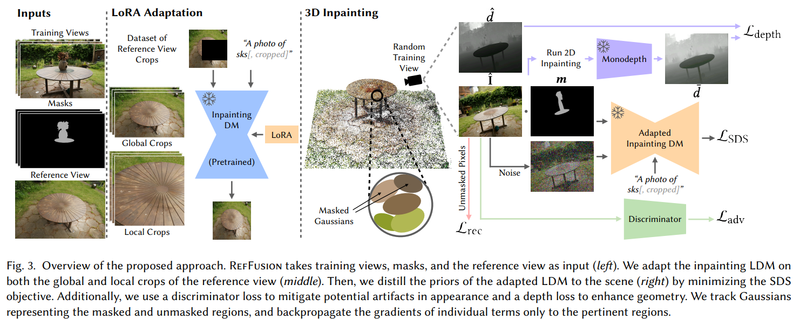
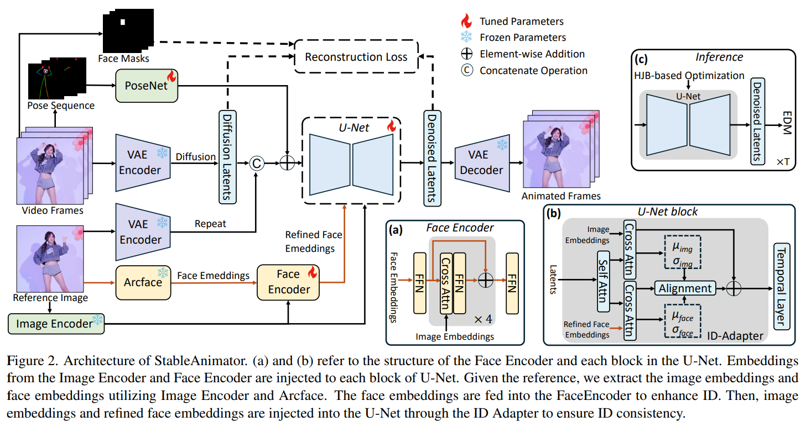
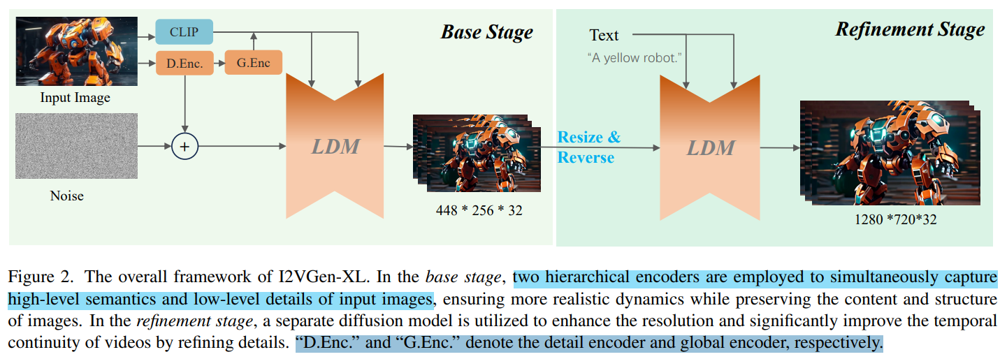
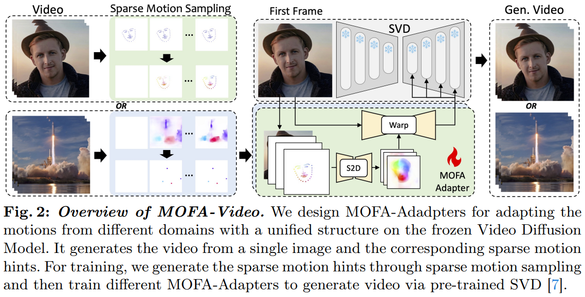
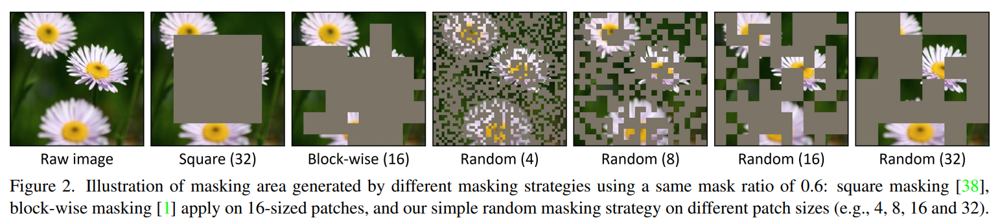

# survey_comics_generate_video

> https://github.com/zengyh1900/Awesome-Image-Inpainting
>
> - [README.md](./README.md)

- 需求：给定一张动漫图像（漫画中的一格），进行 fidelity 的补图

image outpaint 进行调研，整理 related work  效果


## control_diffusion

- "Controllable Generation with Text-to-Image Diffusion Models: A Survey"
  [paper](https://arxiv.org/pdf/2403.04279)


- "Deep Learning-Based Image and Video Inpainting: A Survey"
  [paper](https://link.springer.com/article/10.1007/s11263-023-01977-6)


- "UniControl: A Unified Diffusion Model for Controllable Visual Generation In the Wild"
  [paper](https://arxiv.org/pdf/2305.11147)


- "ControlNet++: Improving Conditional Controls with Efficient Consistency Feedback" Arxiv, 2024 Apr 11
  [paper](http://arxiv.org/abs/2404.07987v1) [code]() [pdf](./2024_04_Arxiv_ControlNet++--Improving-Conditional-Controls-with-Efficient-Consistency-Feedback.pdf) [note](./2024_04_Arxiv_ControlNet++--Improving-Conditional-Controls-with-Efficient-Consistency-Feedback_Note.md)
  Authors: Ming Li, Taojiannan Yang, Huafeng Kuang, Jie Wu, Zhaoning Wang, Xuefeng Xiao, Chen Chen


### pose

> 素描 pose 教程：https://www.posemuse.com/social-media

- "Animate Anyone: Consistent and Controllable Image-to-Video Synthesis for Character Animation" 
  [paper](https://arxiv.org/pdf/2311.17117) [code](https://github.com/HumanAIGC/AnimateAnyone)
- "CharacterGen: Efficient 3D Character Generation from Single Imageswith Multi-View Pose Calibration" 2024 Feb
  [paper](https://arxiv.org/abs/2402.17214) [code](https://charactergen.github.io/)

- "PoseAnimate: Zero-shot high fidelity pose controllable character animation" 2024 Apr
  [paper](https://arxiv.org/pdf/2404.13680) [code]()


- MusePose: a Pose-Driven Image-to-Video Framework for Virtual Human Generation
  [code](https://github.com/TMElyralab/MusePose) 腾讯开源软件

> [MusePose](https://github.com/TMElyralab/MusePose) is an image-to-video generation framework for virtual human under control signal such as pose. The current released model was an implementation of [AnimateAnyone](https://github.com/HumanAIGC/AnimateAnyone) by optimizing [Moore-AnimateAnyone](https://github.com/MooreThreads/Moore-AnimateAnyone).


## img_completion

动漫图像，进行 `outpaint`, `Image Completion`


- "High-Resolution Image Synthesis with Latent Diffusion Models" CVPRoral, 2022 Dec, `StableDiffusion` :statue_of_liberty:
  [paper](https://arxiv.org/abs/2112.10752) [V1_code](https://github.com/CompVis/stable-diffusion) [note](./2022_CVPR_High-Resolution Image Synthesis with Latent Diffusion Models_Note.md) [pdf](./2022_CVPR_High-Resolution Image Synthesis with Latent Diffusion Models.pdf)

- SDv2-inpaint
  [code](https://github.com/Stability-AI/stablediffusion) [checkpoint](https://huggingface.co/stabilityai/stable-diffusion-2-inpainting)

```sh
python scripts/gradio/inpainting.py configs/stable-diffusion/v2-inpainting-inference.yaml <path-to-checkpoint>
```

`masked_image` VAE 得到的特征 & resized（插值） `RGB 图像` & resized  `Mask 图像` **在 C 维度 `concat`**，加噪 T 步作为初始噪声；文本特征用于 `cross-attention`


- 基于 SDv1.5 outpaint 的工具

  - https://github.com/lkwq007/stablediffusion-infinity 实现无限画布

  - https://www.segmind.com/models/sd1.5-outpaint?ref=blog.segmind.com

  [ComfyUI doc](https://comfyanonymous.github.io/ComfyUI_examples/inpaint/)


- "ReGO: Reference-Guided Outpainting for Scenery Image" TIP, 2021 Jun
  [paper]() [code](https://github.com/wangyxxjtu/ReGO-Pytorch)


- "FishDreamer: Towards Fisheye Semantic Completion via Unified Image Outpainting and Segmentation"
  [paper](2303.13842)


- "Personalized Restoration via Dual-Pivot Tuning"
  [paper](https://arxiv.org/abs/2312.17234) [code](https://github.com/personalized-restoration/personalized-restoration) :warning:


- "[Diffinfinite: Large mask-image synthesis via parallel random patch diffusion in histopathology](https://proceedings.neurips.cc/paper_files/paper/2023/hash/f64927f5de00c47899e6e58c731966b6-Abstract-Datasets_and_Benchmarks.html)" NIPS, 2023
  [paper](https://proceedings.neurips.cc/paper_files/paper/2023/file/f64927f5de00c47899e6e58c731966b6-Paper-Datasets_and_Benchmarks.pdf)

病理组织 outpaint


- "RealFill: Reference-Driven Generation for Authentic Image Completion" Arxiv, 2023 Sep 28
  [paper](http://arxiv.org/abs/2309.16668v1) [code](https://realfill.github.io) [pdf](./2023_09_Arxiv_RealFill--Reference-Driven-Generation-for-Authentic-Image-Completion.pdf) [note](./2023_09_Arxiv_RealFill--Reference-Driven-Generation-for-Authentic-Image-Completion_Note.md)
  Authors: Luming Tang, Nataniel Ruiz, Qinghao Chu, Yuanzhen Li, Aleksander Holynski, David E. Jacobs, Bharath Hariharan, Yael Pritch, Neal Wadhwa, Kfir Aberman, Michael Rubinstein

类似 DreamBooth, 用几张图去微调 Diffusion 学习 target image 的场景；
参考图 & target 图做 mask 去微调 Diffusion；
Diffusion 出图原始区域模糊，对 mask blur & 用 alpha  把生成的和原图融合；
diffusion 每次推理不同随机种子随机性太大，用预训练的 dense correspondence 去筛选生成较好的图


- "AnyText: Multilingual Visual Text Generation And Editing" ICLR-Spotlight, 2023 Nov
  [paper](http://arxiv.org/abs/2311.03054v4) [code](https://github.com/tyxsspa/AnyText) [pdf](./2023_11_ICLR_AnyText--Multilingual-Visual-Text-Generation-And-Editing.pdf) [note](./2023_11_ICLR_AnyText--Multilingual-Visual-Text-Generation-And-Editing_Note.md)


- "Repositioning the Subject within Image" Arxiv, 2024 Jan 30
  [paper](http://arxiv.org/abs/2401.16861v2) [code](https://github.com/Yikai-Wang/ReS) [pdf](./2024_01_Arxiv_Repositioning-the-Subject-within-Image.pdf) [note](./2024_01_Arxiv_Repositioning-the-Subject-within-Image_Note.md)
  Authors: Yikai Wang, Chenjie Cao, Ke Fan, Qiaole Dong, Yifan Li, Xiangyang Xue, Yanwei Fu

针对物体移动的编辑操作，提出一个数据集


- "Improving Diffusion Models for Virtual Try-on" Arxiv, 2024 Mar 8
  [paper](http://arxiv.org/abs/2403.05139v2) [code](https://idm-vton.github.io) [pdf](./2024_03_Arxiv_Improving-Diffusion-Models-for-Virtual-Try-on.pdf) [note](./2024_03_Arxiv_Improving-Diffusion-Models-for-Virtual-Try-on_Note.md)
  Authors: Yisol Choi, Sangkyung Kwak, Kyungmin Lee, Hyungwon Choi, Jinwoo Shin


> provide a **detailed caption** to the garment (e.g., [V]: “short sleeve round neck t-shirts”). Then it is used for input prompt of GarmentNet (e.g., “A photo of [V]”) and TryonNet (e.g., “Model is wearing [V]”). 


- "BrushNet: A Plug-and-Play Image Inpainting Model with Decomposed Dual-Branch Diffusion" Arxiv, 2024 Mar 11
  [paper](http://arxiv.org/abs/2403.06976v1) [code](https://github.com/tencentarc/brushnet) [pdf](./2024_03_Arxiv_BrushNet--A-Plug-and-Play-Image-Inpainting-Model-with-Decomposed-Dual-Branch-Diffusion.pdf) [note](./2024_03_Arxiv_BrushNet--A-Plug-and-Play-Image-Inpainting-Model-with-Decomposed-Dual-Branch-Diffusion_Note.md) [ComfyUI](https://github.com/nullquant/ComfyUI-BrushNet)
  Authors: Xuan Ju, Xian Liu, Xintao Wang, Yuxuan Bian, Ying Shan, Qiang Xu


- "Structure Matters: Tackling the Semantic Discrepancy in Diffusion Models for Image Inpainting" Arxiv, 2024 Mar 29
  [paper](http://arxiv.org/abs/2403.19898v2) [code](https://github.com/htyjers/StrDiffusion.) [pdf](./2024_03_Arxiv_Structure-Matters--Tackling-the-Semantic-Discrepancy-in-Diffusion-Models-for-Image-Inpainting.pdf) [note](./2024_03_Arxiv_Structure-Matters--Tackling-the-Semantic-Discrepancy-in-Diffusion-Models-for-Image-Inpainting_Note.md)
  Authors: Haipeng Liu, Yang Wang, Biao Qian, Meng Wang, Yong Rui

使用**结构信息**辅助 SDE diffusion 去噪 :star:


- "Taming Latent Diffusion Model for Neural Radiance Field Inpainting" Arxiv, 2024 Apr 15
  [paper](http://arxiv.org/abs/2404.09995v1) [code](https://hubert0527.github.io/MALD-NeRF) [pdf](./2024_04_Arxiv_Taming-Latent-Diffusion-Model-for-Neural-Radiance-Field-Inpainting.pdf) [note](./2024_04_Arxiv_Taming-Latent-Diffusion-Model-for-Neural-Radiance-Field-Inpainting_Note.md)
  Authors: Chieh Hubert Lin, Changil Kim, Jia-Bin Huang, Qinbo Li, Chih-Yao Ma, Johannes Kopf, Ming-Hsuan Yang, Hung-Yu Tseng


- "Salient Object-Aware Background Generation using Text-Guided Diffusion Models" CVPR-workshop, 2024 Apr 15
  [paper](http://arxiv.org/abs/2404.10157v1) [code]() [pdf](./2024_04_CVPR-workshop_Salient-Object-Aware-Background-Generation-using-Text-Guided-Diffusion-Models.pdf) [note](./2024_04_CVPR-workshop_Salient-Object-Aware-Background-Generation-using-Text-Guided-Diffusion-Models_Note.md)
  Authors: Amir Erfan Eshratifar, Joao V. B. Soares, Kapil Thadani, Shaunak Mishra, Mikhail Kuznetsov, Yueh-Ning Ku, Paloma de Juan

处理静态物体（抠出来物体）去生成背景，认为有**出图物体不一致问题**；**用预训练分割图获取粗糙一些的 mask，从里面取点输入 SAM**

`SI2 + ControlNet` 效果比 `SD2 + ControlNet` 好一些


- "RefFusion: Reference Adapted Diffusion Models for 3D Scene Inpainting" Arxiv, 2024 Apr 16
  [paper](http://arxiv.org/abs/2404.10765v1) [code]() [pdf](./2024_04_Arxiv_RefFusion--Reference-Adapted-Diffusion-Models-for-3D-Scene-Inpainting.pdf) [note](./2024_04_Arxiv_RefFusion--Reference-Adapted-Diffusion-Models-for-3D-Scene-Inpainting_Note.md)
  Authors: Ashkan Mirzaei, Riccardo De Lutio, Seung Wook Kim, David Acuna, Jonathan Kelly, Sanja Fidler, Igor Gilitschenski, Zan Gojcic

2D image inpainting 阶段类似 Refill 只对几张 reference image & 用 Lora 微调 Diffusion




- "LatentPaint: Image Inpainting in Latent Space with Diffusion Models" WACV
  [paper](https://openaccess.thecvf.com/content/WACV2024/papers/Corneanu_LatentPaint_Image_Inpainting_in_Latent_Space_With_Diffusion_Models_WACV_2024_paper.pdf)


- "Anywhere: A Multi-Agent Framework for Reliable and Diverse Foreground-Conditioned Image Inpaintin"
  [paper](https://arxiv.org/abs/2404.18598)


## reference-based :star:

- "Paint by Example: Exemplar-based Image Editing with Diffusion Models" CVPR, 2022 Nov
  [paper](http://arxiv.org/abs/2211.13227v1) [code](https://github.com/Fantasy-Studio/Paint-by-Example) [pdf](./2022_11_CVPR_Paint-by-Example--Exemplar-based-Image-Editing-with-Diffusion-Models.pdf) [note](./2022_11_CVPR_Paint-by-Example--Exemplar-based-Image-Editing-with-Diffusion-Models_Note.md)
  Authors: Binxin Yang, Shuyang Gu, Bo Zhang, Ting Zhang, Xuejin Chen, Xiaoyan Sun, Dong Chen, Fang Wen


- "RealFill: Reference-Driven Generation for Authentic Image Completion" Arxiv, 2023 Sep 28
  [paper](http://arxiv.org/abs/2309.16668v1) [code](https://realfill.github.io) [pdf](./2023_09_Arxiv_RealFill--Reference-Driven-Generation-for-Authentic-Image-Completion.pdf) [note](./2023_09_Arxiv_RealFill--Reference-Driven-Generation-for-Authentic-Image-Completion_Note.md)
  Authors: Luming Tang, Nataniel Ruiz, Qinghao Chu, Yuanzhen Li, Aleksander Holynski, David E. Jacobs, Bharath Hariharan, Yael Pritch, Neal Wadhwa, Kfir Aberman, Michael Rubinstein

类似 DreamBooth, 用几张图去微调 Diffusion 学习 target image 的场景；
参考图 & target 图做 mask 去微调 Diffusion；
Diffusion 出图原始区域模糊，对 mask blur & 用 alpha  把生成的和原图融合；
diffusion 每次推理不同随机种子随机性太大，用预训练的 dense correspondence 去筛选生成较好的图


- "CLiC: Concept Learning in Context" CVPR, 2023 Nov 28 :star:
  [paper](http://arxiv.org/abs/2311.17083v1) [code]() [pdf](./2023_11_CVPR_CLiC--Concept-Learning-in-Context.pdf) [note](./2023_11_CVPR_CLiC--Concept-Learning-in-Context_Note.md)
  Authors: Mehdi Safaee, Aryan Mikaeili, Or Patashnik, Daniel Cohen-Or, Ali Mahdavi-Amiri

>  CLiC [35] could customize the local patterns to edit different objects, but it only demonstrates inner-category generalizations and still requires subject-specific fine-tuning


- "StoryDiffusion: Consistent Self-Attention for Long-Range Image and Video Generation" Arxiv, 2024 May 2
  [paper](http://arxiv.org/abs/2405.01434v1) [code](https://github.com/HVision-NKU/StoryDiffusion) [pdf](./2024_05_Arxiv_StoryDiffusion--Consistent-Self-Attention-for-Long-Range-Image-and-Video-Generation.pdf) [note](./2024_05_Arxiv_StoryDiffusion--Consistent-Self-Attention-for-Long-Range-Image-and-Video-Generation_Note.md)
  Authors: Yupeng Zhou, Daquan Zhou, Ming-Ming Cheng, Jiashi Feng, Qibin Hou


- "AnyDoor: Zero-shot Object-level Image Customization" CVPR, 2023 Jul 18
  [paper](http://arxiv.org/abs/2307.09481v2) [code](https://github.com/ali-vilab/AnyDoor) [pdf](./2023_07_CVPR_AnyDoor--Zero-shot-Object-level-Image-Customization.pdf) [note](./2023_07_CVPR_AnyDoor--Zero-shot-Object-level-Image-Customization_Note.md)
  Authors: Xi Chen, Lianghua Huang, Yu Liu, Yujun Shen, Deli Zhao, Hengshuang Zhao

> - **使用预训练的 DINOv2 提供细节特征**，DINOv2 有全局 和 patch 的特征，发现 concat 起来过可学习的 MLP，可以与 UNet 特征空间对齐 :star:
> - **贴图的时候使用高频特征**，而不是放图像，避免生成图像不搭的情况
> - 各个 trick，**细节一致性还是不足，例如文字扭曲了**
>   1. DNIO or CLIP 特征很重要，作为图像物体生成的基本盘，不加物体直接不一样；细节不一致的问题要再用高频特征约束一下
>   2. **发现训练早期多用视频中多姿态物体训练，能够增强生成物体的细节一致性，缓解色偏的问题**
> - **对比 DINO, CLIP 提取物体特征**
>   1. DINO 特征对于物体细节的特征比 CLIP 特征更优秀，但 DINO 特征要处理下才能好：用分割图提取物体再去提取特征才能得到接近原始物体的结果
>   2. CLIP 特征有点离谱，可能是背景干扰很大


- "Zero-shot Image Editing with Reference Imitation" Arxiv, 2024 Jun 11, `MimicBrush`
  [paper](http://arxiv.org/abs/2406.07547v1) [code](https://github.com/ali-vilab/MimicBrush) [pdf](./2024_06_Arxiv_Zero-shot-Image-Editing-with-Reference-Imitation.pdf) [note](./2024_06_Arxiv_Zero-shot-Image-Editing-with-Reference-Imitation_Note.md)
  Authors: Xi Chen, Yutong Feng, Mengting Chen, Yiyang Wang, Shilong Zhang, Yu Liu, Yujun Shen, Hengshuang Zhao


- "Improving Virtual Try-On with Garment-focused Diffusion Models" Arxiv, 2024 Sep 12
  [paper](http://arxiv.org/abs/2409.08258v1) [code](https://github.com/siqi0905/GarDiff/tree/master) [pdf](./2024_09_Arxiv_Improving-Virtual-Try-On-with-Garment-focused-Diffusion-Models.pdf) [note](./2024_09_Arxiv_Improving-Virtual-Try-On-with-Garment-focused-Diffusion-Models_Note.md)
  Authors: Siqi Wan, Yehao Li, Jingwen Chen, Yingwei Pan, Ting Yao, Yang Cao, Tao Mei


UNet 预测噪声 -> 一步去噪 -> **过 VAE 转为 RGB 图像**，增加 reference loss


- "StableAnimator: High-Quality Identity-Preserving Human Image Animation" Arxiv, 2024 Nov 26
  [paper](http://arxiv.org/abs/2411.17697v2) [code]() [pdf](./2024_11_Arxiv_StableAnimator--High-Quality-Identity-Preserving-Human-Image-Animation.pdf) [note](./2024_11_Arxiv_StableAnimator--High-Quality-Identity-Preserving-Human-Image-Animation_Note.md)
  Authors: Shuyuan Tu, Zhen Xing, Xintong Han, Zhi-Qi Cheng, Qi Dai, Chong Luo, Zuxuan Wu (MSRA + Fudan)

1. 保持分布一致，加入 ID 特征，**避免 temporal layer 干扰 ID 一致性**
2. 提出 HJB **在推理过程中，保持 ID 一致性** :star:




- "Identity-Preserving Text-to-Video Generation by Frequency Decomposition" Arxiv, 2024 Nov 26
  [paper](http://arxiv.org/abs/2411.17440v1) [code](https://github.com/PKU-YuanGroup/ConsisID) [web](https://pku-yuangroup.github.io/ConsisID/) [pdf](./2024_11_Arxiv_Identity-Preserving-Text-to-Video-Generation-by-Frequency-Decomposition.pdf) [note](./2024_11_Arxiv_Identity-Preserving-Text-to-Video-Generation-by-Frequency-Decomposition_Note.md)
  Authors: Shenghai Yuan, Jinfa Huang, Xianyi He, Yunyuan Ge, Yujun Shi, Liuhan Chen, Jiebo Luo, Li Yuan


自己定义人脸高频特征 ArcFace + CLIP Image Embedding.... 额外加入人脸关键点作为低频特征去强调一下


- "Magic Mirror: ID-Preserved Video Generation in Video Diffusion Transformers" Arxiv, 2025 Jan 7
  [paper](http://arxiv.org/abs/2501.03931v1) [code](https://github.com/dvlab-research/MagicMirror/) [pdf](./2025_01_Arxiv_Magic-Mirror--ID-Preserved-Video-Generation-in-Video-Diffusion-Transformers.pdf) [note](./2025_01_Arxiv_Magic-Mirror--ID-Preserved-Video-Generation-in-Video-Diffusion-Transformers_Note.md)
  Authors: Yuechen Zhang, Yaoyang Liu, Bin Xia, Bohao Peng, Zexin Yan, Eric Lo, Jiaya Jia


人脸图像 ID 特征优化 img_condition & text_condition，输入 CogVideoX 的 cross-atten 模块


- "VideoAnydoor: High-fidelity Video Object Insertion with Precise Motion Control" Arxiv, 2025 Jan 2 :star:
  [paper](http://arxiv.org/abs/2501.01427v3) [code]() [pdf](./2025_01_Arxiv_VideoAnydoor--High-fidelity-Video-Object-Insertion-with-Precise-Motion-Control.pdf) [note](./2025_01_Arxiv_VideoAnydoor--High-fidelity-Video-Object-Insertion-with-Precise-Motion-Control_Note.md)
  Authors: Yuanpeng Tu, Hao Luo, Xi Chen, Sihui Ji, Xiang Bai, Hengshuang Zhao


### cross-attn loss

- "GLIGEN: Open-Set Grounded Text-to-Image Generation" CVPR, 2023 Jan 17
  [paper](http://arxiv.org/abs/2301.07093v2) [code](https://github.com/gligen/GLIGEN) [pdf](./2023_01_CVPR_GLIGEN--Open-Set-Grounded-Text-to-Image-Generation.pdf) [note](./2023_01_CVPR_GLIGEN--Open-Set-Grounded-Text-to-Image-Generation_Note.md)
  Authors: Yuheng Li, Haotian Liu, Qingyang Wu, Fangzhou Mu, Jianwei Yang, Jianfeng Gao, Chunyuan Li, Yong Jae Lee


- "FastComposer: Tuning-Free Multi-Subject Image Generation with Localized Attention" Arxiv, 2023 May 17 :star:
  [paper](http://arxiv.org/abs/2305.10431v2) [code](https://github.com/mit-han-lab/fastcomposer) [pdf](./2023_05_Arxiv_FastComposer--Tuning-Free-Multi-Subject-Image-Generation-with-Localized-Attention.pdf) [note](./2023_05_Arxiv_FastComposer--Tuning-Free-Multi-Subject-Image-Generation-with-Localized-Attention_Note.md)
  Authors: Guangxuan Xiao, Tianwei Yin, William T. Freeman, Frédo Durand, Song Han (MIT)


- "Subject-Diffusion:Open Domain Personalized Text-to-Image Generation without Test-time Fine-tuning" SIGGRAPH, 2023 Jul 21 :star: 
  [paper](http://arxiv.org/abs/2307.11410v2) [code](https://oppo-mente-lab.github.io/subject_diffusion/) [pdf](./2023_07_SIGGRAPH_Subject-Diffusion-Open-Domain-Personalized-Text-to-Image-Generation-without-Test-time-Fine-tuning.pdf) [note](./2023_07_SIGGRAPH_Subject-Diffusion-Open-Domain-Personalized-Text-to-Image-Generation-without-Test-time-Fine-tuning_Note.md) 
  Authors: Jian Ma, Junhao Liang, Chen Chen, Haonan Lu (OPPO-AI)

利用丰富的辅助信息：SegMap + Location + Text + CLIP-image


- "MM-Diff: High-Fidelity Image Personalization via Multi-Modal Condition Integration" Arxiv, 2024 Mar 22
  [paper](http://arxiv.org/abs/2403.15059v1) [code](https://github.com/alibaba/mm-diff) [pdf](./2024_03_Arxiv_MM-Diff--High-Fidelity-Image-Personalization-via-Multi-Modal-Condition-Integration.pdf) [note](./2024_03_Arxiv_MM-Diff--High-Fidelity-Image-Personalization-via-Multi-Modal-Condition-Integration_Note.md)
  Authors: Zhichao Wei, Qingkun Su, Long Qin, Weizhi Wang


- "StoryMaker: Towards Holistic Consistent Characters in Text-to-image Generation" Arxiv, 2024 Sep 19
  [paper](http://arxiv.org/abs/2409.12576v1) [code](https://github.com/RedAIGC/StoryMaker.) [pdf](./2024_09_Arxiv_StoryMaker--Towards-Holistic-Consistent-Characters-in-Text-to-image-Generation.pdf) [note](./2024_09_Arxiv_StoryMaker--Towards-Holistic-Consistent-Characters-in-Text-to-image-Generation_Note.md)
  Authors: Zhengguang Zhou, Jing Li, Huaxia Li, Nemo Chen, Xu Tang


- "DreamMix: Decoupling Object Attributes for Enhanced Editability in Customized Image Inpainting" Arxiv, 2024 Nov 26
  [paper](http://arxiv.org/abs/2411.17223v1) [code](https://github.com/mycfhs/DreamMix.) [pdf](./2024_11_Arxiv_DreamMix--Decoupling-Object-Attributes-for-Enhanced-Editability-in-Customized-Image-Inpainting.pdf) [note](./2024_11_Arxiv_DreamMix--Decoupling-Object-Attributes-for-Enhanced-Editability-in-Customized-Image-Inpainting_Note.md)
  Authors: Yicheng Yang, Pengxiang Li, Lu Zhang, Liqian Ma, Ping Hu, Siyu Du, Yunzhi Zhuge, Xu Jia, Huchuan Lu


训练 DreamBooth，只要 20min；**在推理阶段**，提出局部优化 + 全局优化，把指定区域 VAE 替换掉，和新的图像特征加权


### correspondence

> **dataset**
>
> - SPair-71k，最难的语义匹配数据集，12234 张图像，18个类别
> - PF-Willow 900 个图像对，PASCAL VOC 数据的子集
> - 14 different splits of CUB (each containing 25 images)
>
> > SPair-71k [55], PF-WILLOW [27] and CUB-200-2011 [89]. SPair-71k is the most challenging semantic correspondence dataset, containing diverse variations in viewpoint and scale with 12,234 image pairs on 18 categories for testing. PF-Willow is a subset of PASCAL VOC dataset [20] with 900 image pairs for testing. For CUB, following [58], we evaluate 14 different splits of CUB (each containing 25 images) and report the average performance across all splits.
>
> **metrics**
>
> percentage of correct keypoints (PCK)，给一个距离 & 阈值，在范围内部算 ok
>
> - PCK per point，数据集中所有的预测点 -> `预测的所有点中 ok 的个数 / 预测所有点的个数`
>
>   > use the total number of correctly-predicted points in the whole dataset (or each category split) divided
>
> - PCK per image，以单张图像去统计点的 PCK，数据集每张图的 PCK 取平均


- "Emergent Correspondence from Image Diffusion" NIPS, 2023 Jun 6
  [paper](http://arxiv.org/abs/2306.03881v2) [code](https://diffusionfeatures.github.io) [pdf](./2023_06_NIPS_Emergent-Correspondence-from-Image-Diffusion.pdf) [note](./2023_06_NIPS_Emergent-Correspondence-from-Image-Diffusion_Note.md)
  Authors: Luming Tang, Menglin Jia, Qianqian Wang, Cheng Perng Phoo, Bharath Hariharan

发现 SD 自带 correspondence 能力；提出**一种抽取 SD UNet decoder 特征做匹配的简单方式**，对于 match point 做插值提取特征（类似 deformable cnn），计算特征之间距离做匹配；**挑了几个**认为 "challenge" 的图看看结果，**至少说明部分场景 SD 有能力做 reference 理解**；右边那张椅子都不行。。。猜测不同视角物体占据图像的比例 & 姿态差异太大效果会显著降低?


- "Edicho: Consistent Image Editing in the Wild" Arxiv, 2024 Dec 30
  [paper](http://arxiv.org/abs/2412.21079v2) [code]() [web](https://ezioby.github.io/edicho/) [pdf](./2024_12_Arxiv_Edicho--Consistent-Image-Editing-in-the-Wild.pdf) [note](./2024_12_Arxiv_Edicho--Consistent-Image-Editing-in-the-Wild_Note.md)
  Authors: Qingyan Bai, Hao Ouyang, Yinghao Xu, Qiuyu Wang, Ceyuan Yang, Ka Leong Cheng, Yujun Shen, Qifeng Chen


用 2023 NIPS 的一篇 diffusion 做匹配点的方法提取显示的匹配点，用来去 warp query 特征，做到对齐；再用 cross-attention 学习 reference 特征


## Image-to-video

> - Q: SVD 框架图？
> - Q: 光流如何去 warp 特征？

- "Simulating Fluids in Real-World Still Images" ICCV-2023, 2022 Apr 24
  [paper](http://arxiv.org/abs/2204.11335v1) [code]() [pdf](./2022_04_ICCV_Simulating-Fluids-in-Real-World-Still-Images.pdf) [note](./2022_04_ICCV_Simulating-Fluids-in-Real-World-Still-Images_Note.md)
  Authors: Siming Fan, Jingtan Piao, Chen Qian, Kwan-Yee Lin, Hongsheng Li


静止图像生成流动水流的视频；预测水流的 RGBA 图层，分割背景 & 水流，看效果还可以啊；构造 3D mesh，加上 NS 仿真水流移动轨迹，去优化水流轨迹


- "Control-A-Video: Controllable Text-to-Video Generation with Diffusion Models" Arxiv, 2023 May :star:
  [paper](https://arxiv.org/abs/2305.13840) [code](https://github.com/Weifeng-Chen/control-a-video) [website](https://controlavideo.github.io /) [note](../2023_05_Arxiv_Control-A-Video--Controllable-Text-to-Video-Generation-with-Diffusion-Model_Note.md)

训练 I2V 把首帧 xT 换成 VAE embedding


- "VideoComposer: Compositional Video Synthesis with Motion Controllability" Arxiv, 2023 Jun, **VideoComposer**
  [arXiv](https://arxiv.org/abs/2306.02018) [Website](https://videocomposer.github.io/) [note](./2023_06_VideoComposer--Compositional-Video-Synthesis-with-Motion-Controllability_Note.md)


- "I2VGen-XL: High-Quality Image-to-Video Synthesis via Cascaded Diffusion Models" Arxiv, 2023 Nov 7
  [paper](http://arxiv.org/abs/2311.04145v1) [code](https://i2vgen-xl.github.io) [pdf](./2023_11_Arxiv_I2VGen-XL--High-Quality-Image-to-Video-Synthesis-via-Cascaded-Diffusion-Models.pdf) [note](../2023_11_Arxiv_I2VGen-XL--High-Quality-Image-to-Video-Synthesis-via-Cascaded-Diffusion-Models_Note.md)
  Authors: Shiwei Zhang, Jiayu Wang, Yingya Zhang, Kang Zhao, Hangjie Yuan, Zhiwu Qin, Xiang Wang, Deli Zhao, Jingren Zhou




- "Stable Video Diffusion: Scaling Latent Video Diffusion Models to Large Datasets" Arxiv, 2023 Nov 25
  [paper](http://arxiv.org/abs/2311.15127v1) [code](https://github.com/Stability-AI/generative-models) [pdf](../2023_11_Arxiv_Stable-Video-Diffusion--Scaling-Latent-Video-Diffusion-Models-to-Large-Datasets.pdf) [note](./2023_11_Arxiv_Stable-Video-Diffusion--Scaling-Latent-Video-Diffusion-Models-to-Large-Datasets_Note.md)
  Authors: Andreas Blattmann, Tim Dockhorn, Sumith Kulal, Daniel Mendelevitch, Maciej Kilian, Dominik Lorenz, Yam Levi, Zion English, Vikram Voleti, Adam Letts, Varun Jampani, Robin Rombach

**SVD Video pretrain** 在 SDv2.1 text2image 基础上，加入 656M 参数量的 temporal layer(总共 1521M 参数)，T=14 256x384 上训练 15w iteration; 看文章是整个 UNet 都训练？

> use the resulting model as the image backbone of our video model. We then insert temporal convolution and attention layers. In particular, we follow the exact setup from [9], inserting a total of 656M new parameters into the UNet bumping its total size (spatial and temporal layers) to 1521M parameters. We then train the resulting UNet on 14 frames on resolution 256 × 384 for 150k iters using AdamW [59] with learning rate 10−4 and a batch size of 1536.

**增加分辨率**，85% 概率使用文本，增加 noise 程度，再调 10w iteration

> increase the spatial resolution to 320 × 576 and train for an additional 100k iterations,

Appendix D 部分, **换到 image2video 进行微调**；不使用文本，**把文本换成 CLIP-Image feature**; 把 condition frame 加噪，复制 T 帧 和 UNet 原始输入 concat

> We do not use text-conditioning but rather replace text embeddings fed into the base model with the CLIP image embedding of the conditioning frame. Additionally, we concatenate a noise-augmented [39] version of the conditioning frame channel-wise to the input of the UNet [73]. In particular, we add a small amount of noise of strength log σ ∼ N (−3.0, 0.5 2 ) to the conditioning frame and then feed it through the standard SD 2.1 encoder.

只微调 5w iteration 够了，batch size of 768

> We train two versions: one to generate 14 frames and one to generate 25 frames. We train both models for 50k iterations at a batch size of 768, learning rate 3 × 10−5


- "Motion-I2V: Consistent and Controllable Image-to-Video Generation with Explicit Motion Modeling" Arxiv, 2024 Jan 29
  [paper](http://arxiv.org/abs/2401.15977v2) [code](https://xiaoyushi97.github.io/Motion-I2V/.) [pdf](./2024_01_Arxiv_Motion-I2V--Consistent-and-Controllable-Image-to-Video-Generation-with-Explicit-Motion-Modeling.pdf) [note](./2024_01_Arxiv_Motion-I2V--Consistent-and-Controllable-Image-to-Video-Generation-with-Explicit-Motion-Modeling_Note.md)
  Authors: Xiaoyu Shi, Zhaoyang Huang, Fu-Yun Wang, Weikang Bian, Dasong Li, Yi Zhang, Manyuan Zhang, Ka Chun Cheung, Simon See, Hongwei Qin, Jifeng Dai, Hongsheng Li


- "Improving Diffusion Models for Virtual Try-on" Arxiv, 2024 Mar 8
  [paper](http://arxiv.org/abs/2403.05139v2) [code](https://idm-vton.github.io) [pdf](./2024_03_Arxiv_Improving-Diffusion-Models-for-Virtual-Try-on.pdf) [note](./2024_03_Arxiv_Improving-Diffusion-Models-for-Virtual-Try-on_Note.md)
  Authors: Yisol Choi, Sangkyung Kwak, Kyungmin Lee, Hyungwon Choi, Jinwoo Shin


- "Pix2Gif: Motion-Guided Diffusion for GIF Generation" Arxiv, 2024 Mar 7
  [paper](http://arxiv.org/abs/2403.04634v2) [code](https://github.com/XuweiyiChen/Pix2Gif) [pdf](./2024_03_Arxiv_Pix2Gif--Motion-Guided-Diffusion-for-GIF-Generation.pdf) [note](./2024_03_Arxiv_Pix2Gif--Motion-Guided-Diffusion-for-GIF-Generation_Note.md)
  Authors: Hitesh Kandala, Jianfeng Gao, Jianwei Yang

> Our model takes three inputs: an image, a text instruction, and a motion magnitude. These inputs are fed into the model through two pathways


- "Ctrl-Adapter: An Efficient and Versatile Framework for Adapting Diverse Controls to Any Diffusion Model" Arxiv, 2024 Apr 15
  [paper](http://arxiv.org/abs/2404.09967v2) [code]() [pdf](../2024_04_Arxiv_Ctrl-Adapter--An-Efficient-and-Versatile-Framework-for-Adapting-Diverse-Controls-to-Any-Diffusion-Model.pdf) [note](../2024_04_Arxiv_Ctrl-Adapter--An-Efficient-and-Versatile-Framework-for-Adapting-Diverse-Controls-to-Any-Diffusion-Model_Note.md)
  Authors: Han Lin, Jaemin Cho, Abhay Zala, Mohit Bansal


- "ConsistI2V: Enhancing Visual Consistency for Image-to-Video Generation" Arxiv, 2024 Feb 6
  [paper](http://arxiv.org/abs/2402.04324v1) [code](https://github.com/TIGER-AI-Lab/ConsistI2V) [website](https://tiger-ai-lab.github.io/ConsistI2V/) [pdf](../2024_02_Arxiv_ConsistI2V--Enhancing-Visual-Consistency-for-Image-to-Video-Generation.pdf) [note](./2024_02_Arxiv_ConsistI2V--Enhancing-Visual-Consistency-for-Image-to-Video-Generation_Note.md)
  Authors: Weiming Ren, Harry Yang, Ge Zhang, Cong Wei, Xinrun Du, Stephen Huang, Wenhu Chen


- "MOFA-Video: Controllable Image Animation via Generative Motion Field Adaptions in Frozen Image-to-Video Diffusion Model" Arxiv, 2024 May 30
  [paper](http://arxiv.org/abs/2405.20222v2) [code](https://myniuuu.github.io/MOFA_Video/) [pdf](./2024_05_Arxiv_MOFA-Video--Controllable-Image-Animation-via-Generative-Motion-Field-Adaptions-in-Frozen-Image-to-Video-Diffusion-Model.pdf) [note](./2024_05_Arxiv_MOFA-Video--Controllable-Image-Animation-via-Generative-Motion-Field-Adaptions-in-Frozen-Image-to-Video-Diffusion-Model_Note.md) :star:
  Authors: Muyao Niu, Xiaodong Cun, Xintao Wang, Yong Zhang, Ying Shan, Yinqiang Zheng

将多种模态计算帧间的移动信息，获取一个运动向量，再去训练一个 Sparse2Dense CMP 网络将运动向量修复成 dense optical flow;

多种模态通过 dense optical flow 统一进行控制




- "StableAnimator: High-Quality Identity-Preserving Human Image Animation" Arxiv, 2024 Nov 26
  [paper](http://arxiv.org/abs/2411.17697v2) [code]() [pdf](./2024_11_Arxiv_StableAnimator--High-Quality-Identity-Preserving-Human-Image-Animation.pdf) [note](./2024_11_Arxiv_StableAnimator--High-Quality-Identity-Preserving-Human-Image-Animation_Note.md)
  Authors: Shuyuan Tu, Zhen Xing, Xintong Han, Zhi-Qi Cheng, Qi Dai, Chong Luo, Zuxuan Wu (MSRA + Fudan)

1. 保持分布一致，加入 ID 特征，**避免 temporal layer 干扰 ID 一致性**
2. 提出 HJB **在推理过程中，保持 ID 一致性** :star:


- "FramePainter: Endowing Interactive Image Editing with Video Diffusion Priors" Arxiv, 2025 Jan 14
  [paper](http://arxiv.org/abs/2501.08225v1) [code](https://github.com/YBYBZhang/FramePainter) [pdf](./2025_01_Arxiv_FramePainter--Endowing-Interactive-Image-Editing-with-Video-Diffusion-Priors.pdf) [note](./2025_01_Arxiv_FramePainter--Endowing-Interactive-Image-Editing-with-Video-Diffusion-Priors_Note.md)
  Authors: Yabo Zhang, Xinpeng Zhou, Yihan Zeng, Hang Xu, Hui Li, Wangmeng Zuo


## Pose

使用场景：部分肢体出现，补充肢体 && 让手部动起来

- "Animate Anyone: Consistent and Controllable Image-to-Video Synthesis for Character Animation" Arxiv, 2023 Nov 28
  [paper](http://arxiv.org/abs/2311.17117v2) [code](https://github.com/MooreThreads/Moore-AnimateAnyone.git) [pdf](./2023_11_Arxiv_Animate-Anyone--Consistent-and-Controllable-Image-to-Video-Synthesis-for-Character-Animation.pdf) [note](../2023_11_Arxiv_Animate-Anyone--Consistent-and-Controllable-Image-to-Video-Synthesis-for-Character-Animation_Note.md)
  Authors: Li Hu, Xin Gao, Peng Zhang, Ke Sun, Bang Zhang, Liefeng Bo

We employ DWPose[52] to extract the pose sequence of characters in the video, including the body and hands, rendering it as pose skeleton images following OpenPose[5]


- "Effective Whole-body Pose Estimation with Two-stages Distillation" ICCV 2023
  [paper](https://arxiv.org/abs/2307.15880) [code](https://github.com/IDEA-Research/DWPose) [demo](https://openxlab.org.cn/apps/detail/mmpose/RTMPose)

使用 DWPose 提取骨架再输入网络，支持部分身体


- MusePose: a Pose-Driven Image-to-Video Framework for Virtual Human Generation
  [code](https://github.com/TMElyralab/MusePose) 腾讯开源软件

> [MusePose](https://github.com/TMElyralab/MusePose) is an image-to-video generation framework for virtual human under control signal such as pose. The current released model was an implementation of [AnimateAnyone](https://github.com/HumanAIGC/AnimateAnyone) by optimizing [Moore-AnimateAnyone](https://github.com/MooreThreads/Moore-AnimateAnyone).


## Story-telling

> search key-word `comic video generation`

- "The Manga Whisperer: Automatically Generating Transcriptions for Comics"
  [paper](https://arxiv.org/pdf/2401.10224)

- "Utilizing a Dense Video Captioning Technique for Generating Image Descriptions of Comics for People with Visual Impairments" ACM
  [paper](https://dl.acm.org/doi/pdf/10.1145/3640543.3645154)

- "The Manga Whisperer: Automatically Generating Transcriptions for Comics"
  [paper](https://arxiv.org/pdf/2401.10224)

- "COMIXIFY: TRANSFORM VIDEO INTO A COMICS"
  [paper](https://arxiv.org/pdf/1812.03473)

- "Automatic Comic Generation with Stylistic Multi-page Layouts and Emotion-driven Text Balloon Generation" 2021 Jan
  [paper](https://arxiv.org/pdf/2101.11111)

- "StoryDiffusion: Consistent Self-Attention for Long-Range Image and Video Generation" Arxiv, 2024 May 2
  [paper](http://arxiv.org/abs/2405.01434v1) [code](https://github.com/HVision-NKU/StoryDiffusion) [pdf](./2024_05_Arxiv_StoryDiffusion--Consistent-Self-Attention-for-Long-Range-Image-and-Video-Generation.pdf) [note](./2024_05_Arxiv_StoryDiffusion--Consistent-Self-Attention-for-Long-Range-Image-and-Video-Generation_Note.md)
  Authors: Yupeng Zhou, Daquan Zhou, Ming-Ming Cheng, Jiashi Feng, Qibin Hou


- "AesopAgent: Agent-driven Evolutionary System on Story-to-Video Production"
  [paper](https://arxiv.org/pdf/2403.07952)

电影生成动漫


- "Evolving Storytelling: Benchmarks and Methods for New Character Customization with Diffusion Models" Arxiv, 2024 May 20
  [paper](http://arxiv.org/abs/2405.11852v1) [code]() [pdf](./2024_05_Arxiv_Evolving-Storytelling--Benchmarks-and-Methods-for-New-Character-Customization-with-Diffusion-Models.pdf) [note](./2024_05_Arxiv_Evolving-Storytelling--Benchmarks-and-Methods-for-New-Character-Customization-with-Diffusion-Models_Note.md)
  Authors: Xiyu Wang, Yufei Wang, Satoshi Tsutsui, Weisi Lin, Bihan Wen, Alex C. Kot


## loss

- "Boosting Latent Diffusion with Perceptual Objectives" Meta

  https://arxiv.org/pdf/2411.04873


## talking head

- "Make Your Actor Talk: Generalizable and High-Fidelity Lip Sync with Motion and Appearance Disentanglement" Arxiv, 2024 Jun 12
  [paper](http://arxiv.org/abs/2406.08096v1) [code](https://Ingrid789.github.io/MyTalk/) [pdf](./2024_06_Arxiv_Make-Your-Actor-Talk--Generalizable-and-High-Fidelity-Lip-Sync-with-Motion-and-Appearance-Disentanglement.pdf) [note](./2024_06_Arxiv_Make-Your-Actor-Talk--Generalizable-and-High-Fidelity-Lip-Sync-with-Motion-and-Appearance-Disentanglement_Note.md)
  Authors: Runyi Yu, Tianyu He, Ailing Zeng, Yuchi Wang, Junliang Guo, Xu Tan, Chang Liu, Jie Chen, Jiang Bian


## video_inpaint

- "Hierarchical Masked 3D Diffusion Model for Video Outpainting" Arxiv, 2023 Sep
  [paper](https://arxiv.org/abs/2309.02119) [website](https://fanfanda.github.io/M3DDM/) [pdf](./2023_09_Arxiv_Hierarchical-Masked-3D-Diffusion-Model-for-Video-Outpainting.pdf)


- "Be-Your-Outpainter: Mastering Video Outpainting through Input-Specific Adaptation" Arxiv, 2024 Mar 20
  [paper](http://arxiv.org/abs/2403.13745v1) [code]() [website](https://be-your-outpainter.github.io/) [pdf](./2024_03_Arxiv_Be-Your-Outpainter--Mastering-Video-Outpainting-through-Input-Specific-Adaptation.pdf) [note](./2024_03_Arxiv_Be-Your-Outpainter--Mastering-Video-Outpainting-through-Input-Specific-Adaptation_Note.md) :warning:
  Authors: Fu-Yun Wang, Xiaoshi Wu, Zhaoyang Huang, Xiaoyu Shi, Dazhong Shen, Guanglu Song, Yu Liu, Hongsheng Li


## Find reference

**one-shot img-cls**

- "One-Shot Image Classification by Learning to Restore Prototypes" Arxiv, 2020 May 4
  [paper](http://arxiv.org/abs/2005.01234v1) [code](https://github.com/xuewanqi/RestoreNet) [pdf](./2020_05_Arxiv_One-Shot-Image-Classification-by-Learning-to-Restore-Prototypes.pdf) [note](./2020_05_Arxiv_One-Shot-Image-Classification-by-Learning-to-Restore-Prototypes_Note.md)
  Authors: Wanqi Xue, Wei Wang

学习一个类别无关的特征，**优化图像在特征空间位置** restore 后更靠近中心；可以用来找参考图！:star:


## tools

- comfyui [code](https://github.com/comfyanonymous/ComfyUI)


## Exp

- Framework
  - 给定参考图：可以是前几帧图像，人物全身图，衣着图；搭配当前帧的漫画进行补图


### 问题点

- 人体不好：关键点信息；
- 衣着不好：给衣着图；预测衣着边缘？
- 背景不好
- 从漫画抽出来一格，要去掉边缘黑边

- 漫画里面有些帧画的太简单，视频放大 or 动起来看起来人物 ID 一致性很烂


## Dataset 制作

- Q：pySceneDetect 切出来的单个场景，动作太过单一，不符合动漫变化巨大的场景？

- Q：想要啥样的 source reference？

希望需要补图的人物 / 物体是一个，但是背景（场景 or 光照）完全换掉的数据


**同一场景下，但人物动作变化非常多的情况**

举例视频

```
106753	50769:7	998		2024-06-14 23:30:41	2024-06-14 23:30:41	0		9e1bc51219e0061a9fdad8ed80f675d8dc7dc9e156447b79795c9b86f9391bc4	https://www.sakugabooru.com/data/107eeceaf139bf0952d8ed4b17bea7ec.mp4
```

几乎每张图都在不同场景，想要找到这种图作为 reference


- 识别多个 clip 下面有相同人物的 clip，记录这些 clips 的关系


## Mask 制作

- "RealFill: Reference-Driven Generation for Authentic Image Completion" Arxiv, 2023 Sep 28
  [paper](http://arxiv.org/abs/2309.16668v1) [code](https://realfill.github.io) [pdf](./2023_09_Arxiv_RealFill--Reference-Driven-Generation-for-Authentic-Image-Completion.pdf) [note](./2023_09_Arxiv_RealFill--Reference-Driven-Generation-for-Authentic-Image-Completion_Note.md)
  Authors: Luming Tang, Nataniel Ruiz, Qinghao Chu, Yuanzhen Li, Aleksander Holynski, David E. Jacobs, Bharath Hariharan, Yael Pritch, Neal Wadhwa, Kfir Aberman, Michael Rubinstein

> mask 生成：随机取正方形设为 0，迭代随即设置 30 次
> https://github.com/thuanz123/realfill/blob/70cd2cc04041f84b45da1693c452b998d92115fc/train_realfill.py#L46


- "BrushNet: A Plug-and-Play Image Inpainting Model with Decomposed Dual-Branch Diffusion" Arxiv, 2024 Mar 11
  [paper](http://arxiv.org/abs/2403.06976v1) [code](https://github.com/tencentarc/brushnet) [pdf](./2024_03_Arxiv_BrushNet--A-Plug-and-Play-Image-Inpainting-Model-with-Decomposed-Dual-Branch-Diffusion.pdf) [note](./2024_03_Arxiv_BrushNet--A-Plug-and-Play-Image-Inpainting-Model-with-Decomposed-Dual-Branch-Diffusion_Note.md)
  Authors: Xuan Ju, Xian Liu, Xintao Wang, Yuxuan Bian, Ying Shan, Qiang Xu


- GridMask
  [code](https://github.com/dvlab-research/GridMask/blob/master/imagenet_grid/utils/grid.py#L8)


### MAE

- "SimMIM: A Simple Framework for Masked Image Modeling" CVPR, 2021 Nov 18
  [paper](http://arxiv.org/abs/2111.09886v2) [code](https://github.com/microsoft/SimMIM) [pdf](./2021_11_CVPR_SimMIM--A-Simple-Framework-for-Masked-Image-Modeling.pdf) [note](./2021_11_CVPR_SimMIM--A-Simple-Framework-for-Masked-Image-Modeling_Note.md)
  Authors: Zhenda Xie, Zheng Zhang, Yue Cao, Yutong Lin, Jianmin Bao, Zhuliang Yao, Qi Dai, Han Hu


