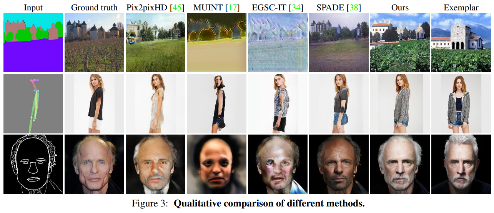
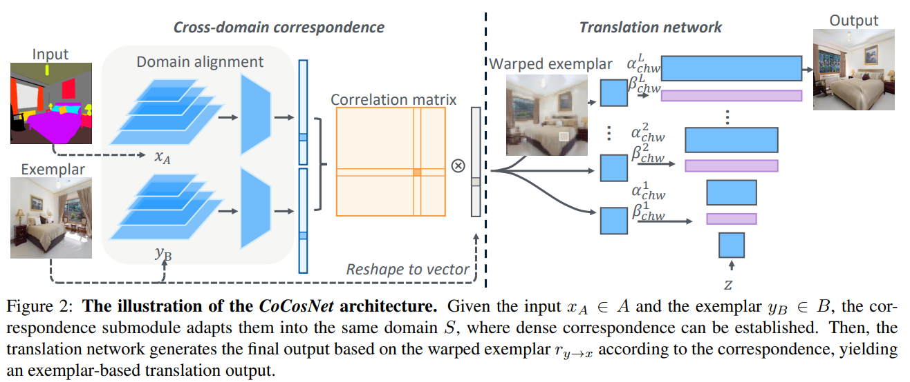
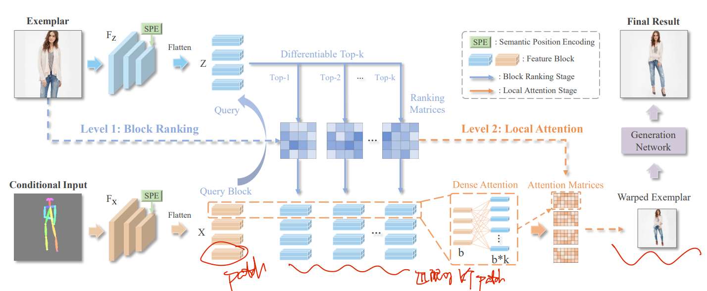

# feature alignment survey :bow_and_arrow:

- 需求

  1. 调研现有特征对齐、图像对齐方法，对现有方法有整体思路；
  2. 总结问题点，如何应用，trick
  3. 总结使用非对齐模块的 motivation

- 目标

  1. 绘制非对齐特征融合模块 framework，改进实验
  2. challenge: 根据此文档写出 feature alignment survey :mountain:

- 调研方案

  1. `feature alignment` 关键词搜 `google scholar`
  2. 根据现有整理的 `feature alignment` 文章，根据文章引用拓展
  3. 按时间线，在此文档内整理各论文笔记链接，必要时贴出 `framework`

  > :warning: 1.5 天内快速整理各论文方法，粗读即可；之后 1 天对挑选出的论文精读仔细看 code
  >
  > 看 abstract，framework，exp 看效果判断是否继续读，methods，introduction（看故事 + motivation）

- [x] "Semantic Image Synthesis with Spatially-Adaptive Normalization" CVPR oral, 2019 Mar, `SPADE` :statue_of_liberty:
  [paper](https://arxiv.org/abs/1903.07291) [code](https://github.com/NVlabs/SPADE) [blog](https://zhuanlan.zhihu.com/p/373068906)

- [ ] "Temporal FiLM: Capturing Long-Range Sequence Dependencies with Feature-Wise Modulations" NIPS, 2019 Sep
  [paper](https://arxiv.org/abs/1909.06628) [code](https://github.com/kuleshov/audio-super-res)

- [ ] "Cross-domain Correspondence Learning for Exemplar-based Image Translation" CVPRoral, 2020 Apr
  [paper](http://arxiv.org/abs/2004.05571v1) [code]() 

- [ ] "Beyond Self-attention: External Attention using Two Linear Layers for Visual Tasks" TPAMI, 2021 May
  [paper](https://arxiv.org/abs/2105.02358) [code_attn_series](https://github.com/xmu-xiaoma666/External-Attention-pytorch) :star:

- [x] "Bi-level Feature Alignment for Versatile Image Translation and Manipulation" ECCV, 2021 Jul
  [paper](https://arxiv.org/abs/2107.03021) [code](https://github.com/fnzhan/RABIT)
  [note](./2021_07_ECCV_Bi-level-Feature-Alignment-for-Versatile-Image-Translation-and-Manipulation_Note.md)

  > Image Translation. 提出 RAS 模块（余弦相似度）对 exemplar 和 condition（分割图）做对齐，然后输出结构上稍稍对齐的 warped exemplar 图像。但语义上还是很不准，所以还需要第二阶段加权平均一下
  >
  > 模型很重，不好 plug&play

- [ ] "Relational Embedding for Few-Shot Classification" ICCV, 2021 Aug
  [paper](https://arxiv.org/abs/2108.09666) [code](https://github.com/dahyun-kang/renet)

- [x] "Monte Carlo denoising via auxiliary feature guided self-attention" SIGGRAPH, 2021 Dec, MC-deoise:baby_chick:
  [paper](https://dl.acm.org/doi/abs/10.1145/3478513.3480565) [code](https://github.com/Aatr0x13/MC-Denoising-via-Auxiliary-Feature-Guided-Self-Attention/tree/main)
  [paper local pdf](./2021_SIGGRAPH_Monte-Carlo-Denoising-via-Auxiliary-Feature-Guided-Self-Attention.pdf)

  > 非对齐特征融合  Denoising via Auxiliary Feature 很贴近

- [x] "Vision Transformer with Deformable Attention" CVPR, 2022 Jan, DAT
  [paper](https://arxiv.org/abs/2201.00520) [code](https://github.com/LeapLabTHU/DAT) [blog_explanation](https://zhuanlan.zhihu.com/p/497432647) [code_improvement](https://github.com/lucidrains/deformable-attention/blob/main/deformable_attention/deformable_attention_2d.py)
  [note](./2022_01_CVPR_Vision-Transformer-with-Deformable-Attention_Note.md)

  > 特征融合部分可以考虑使用这个deformable attention，**此前deformable convolution经常用于非对齐的特征融合**，local reference 7和5帧特征就是非对齐的特征融合，考虑使用这种 deformable attention
  >
  > **2D deformable attention**

- [ ] "Probabilistic Warp Consistency for Weakly-Supervised Semantic Correspondences" CVPR, 2022 Mar
  [paper](https://browse.arxiv.org/abs/2203.04279)

- [ ] "Rethinking Alignment in Video Super-Resolution Transformers" NIPS, 2022 Jul
  [paper](https://arxiv.org/abs/2207.08494) [code](https://github.com/XPixelGroup/RethinkVSRAlignment)
  [note](./2022_07_NIPS_Rethinking-Alignment-in-Video-Super-Resolution-Transformers_Note.md)

  > 探索 deformable，optical flow 用来 warp 的优缺点和使用场景 :+1:

- [ ] "Blur Interpolation Transformer for Real-World Motion from Blur" CVPR, 2022 Nov
  [paper](https://arxiv.org/abs/2211.11423) [code](https://github.com/zzh-tech/BiT)

- [ ] "DFA3D: 3D Deformable Attention For 2D-to-3D Feature Lifting" ICCV, 2023 Jul
  [paper](https://arxiv.org/abs/2307.12972) [code](https://github.com/IDEA-Research/3D-deformable-attention)

  > 3D deformable attn

- [ ] "DDT: Dual-branch Deformable Transformer for image denoising" ICME, 2023 Apr
  [paper](https://arxiv.org/abs/2304.06346) [code](https://github.com/Merenguelkl/DDT)

  > 融合非对齐特征

- [x] "Recurrent Video Restoration Transformer with Guided Deformable Attention" NeurlPS, 2022 June, **RVRT** :statue_of_liberty:
  [paper](https://arxiv.org/abs/2206.02146) [code](https://github.com/JingyunLiang/RVRT?utm_source=catalyzex.com)
  [note](./2022_06_NeurIPS_RVRT_Recurrent-Video-Restoration-Transformer-with-Guided-Deformable-Attention_Note.md)

- [x] "Dual-Camera Super-Resolution with Aligned Attention Modules" ICCV oral, 2021 Sep, DCSR
  [paper](https://arxiv.org/abs/2109.01349) [code](https://github.com/Tengfei-Wang/DCSR)
  [note](./2021_09_ICCV_oral_Dual-Camera-Super-Resolution-with-Aligned-Attention-Modules_Note.md)

  > reference images 按相似度筛选提取信息

- [x] A Toolbox for Video Restoration: VR-Baseline. CVPR NTIRE 3rd award :baby:
  [paper](https://arxiv.org/abs/2201.01893) [code](https://github.com/linjing7/VR-Baseline)

  1. "Unsupervised Flow-Aligned Sequence-to-Sequence Learning for Video Restoration" ICML, 2022 May, **S2SVR**
     [paper](https://arxiv.org/abs/2205.10195)

     > 在 Encoder 和 Decoder 部分都进行前后帧的 propagation

  2. "Flow-Guided Sparse Transformer for Video Deblurring" ICML, 2022 Jan :statue_of_liberty:
     [paper](https://arxiv.org/abs/2201.01893) [local_pdf](./2022_01_ICML_Flow-Guided-Sparse-Transformer-for-Video-Deblurring.pdf)
     FGSW-MSA attn [code](https://github.com/linjing7/VR-Baseline/blob/99611fb878962b1924ab1b15af170a3c3824e447/mmedit/models/backbones/sr_backbones/FGST_util.py#L75)

- [x] "STDAN: Deformable Attention Network for Space-Time Video Super-Resolution" NNLS, 2023 Feb :statue_of_liberty:
  [paper](https://ieeexplore.ieee.org/document/10045744) [code](https://github.com/littlewhitesea/STDAN)
  [note](./2023_02_NNLS_STDAN--Deformable-Attention-Network-for-Space-Time-Video-Super-Resolution_Note.md)

  > *Deformable Attention* 视频 SR

- [x] "An Implicit Alignment for Video Super-Resolution" Arxiv, 2023 Apr
  [paper](https://arxiv.org/abs/2305.00163) [code](https://github.com/kai422/IART)
  [note](./2023_04_Arxiv_An-Implicit-Alignment-for-Video-Super-Resolution_Note.md)

  > 对 deformable 中 bilinear 采样方式，使用 NN 优化

- [x] "Gated Multi-Resolution Transfer Network for Burst Restoration and Enhancement"
  [paper](https://arxiv.org/pdf/2304.06703.pdf)
  
- [x] "LightGlue: Local Feature Matching at Light Speed" 2023 Jun
  [paper](https://arxiv.org/abs/2306.13643) [code](https://github.com/cvg/LightGlue)
  [note](./2023_06_ICCV_LightGlue--Local-Feature-Matching-at-Light-Speed_Note.md)

- [x] "Multi-view Self-supervised Disentanglement for General Image Denoising" ICCV, 2023 Sep
  [paper](http://arxiv.org/abs/2309.05049v1) [code](https://github.com/chqwer2/Multi-view-Self-supervised-Disentanglement-Denoising) [website](https://chqwer2.github.io/MeD/)
  [note](./2023_09_ICCV_Multi-view-Self-supervised-Disentanglement-for-General-Image-Denoising_Note.md)

- [ ] "Fix the Noise: Disentangling Source Feature for Controllable Domain Translation"
  [paper]() [code](https://github.com/LeeDongYeun/FixNoise)

## SR

- "Dual-Camera Super-Resolution with Aligned Attention Modules" ICCV oral, 2021 Sep, DCSR
  [paper](https://arxiv.org/abs/2109.01349) [code](https://github.com/Tengfei-Wang/DCSR)
  [note](./2021_09_ICCV_oral_Dual-Camera-Super-Resolution-with-Aligned-Attention-Modules_Note.md)

  > reference images 按相似度筛选提取信息

## Image Translation

> 按 ` exemplar-based image translation` 关键词查 google scholar

给定参考图像 exemplar image，condition 图像，想要将 exemplar 图像尽可能 warp 到 condition 的样子，看下面这张图方便理解；

由于 condition 过于抽象，此类 alignment 在高度抽象的语义上进行，得到的 warped image 一般不太好，追求形式上类似

- "Semantic Image Synthesis with Spatially-Adaptive Normalization" CVPR oral, 2019 Mar, `SPADE` :statue_of_liberty:
  [paper](https://arxiv.org/abs/1903.07291) [code](https://github.com/NVlabs/SPADE) [blog](https://zhuanlan.zhihu.com/p/373068906)

  > 没细看具体结构

  Image Encoder 学习后续的 $\mu, \sigma^2$ 参数，类似 AdaIN

- "Cross-domain Correspondence Learning for Exemplar-based Image Translation" CVPR oral, 2020 Apr, `CoCosNet`
  [paper](https://arxiv.org/abs/2004.05571)
  [note](./2020_04_CVPRoral_Cross-domain-Correspondence-Learning-for-Exemplar-based-Image-Translation_Note.md)

可以参考一些 Exemplar-based image synthesis 方法，如何做 alignment

- "Bi-level Feature Alignment for Versatile Image Translation and Manipulation" ECCV, 2021 Jul
  [paper](https://arxiv.org/abs/2107.03021) [code](https://github.com/fnzhan/RABIT)
  [note](./2021_07_ECCV_Bi-level-Feature-Alignment-for-Versatile-Image-Translation-and-Manipulation_Note.md)

  > - :question: EMD 距离
  > - RAS feature alignment 实现理解？[code](https://github.com/fnzhan/RABIT/blob/658c6af2cbea1d6dbff87e769f7875250a47840b/models/networks/correspondence.py#L310)

两阶段方法，模型很重，不好 plug&play

1. 将 exemplar & condition 分 patch 提取特征，取余弦相似度 topk，**用提出的 RAS 做 atten 做 feature alignment 来得到 warped exemplar** 图像。align 时候用了提出的 semantic position encoding (SPE) 提升性能
2. 将 warped exemplar （**warp的图在语义上还是不准！存在物体不存在的情况，要融合一下再输出**）和 condition 图像用提出的 CONFI 模块（就是计算特征余弦相似度作为 confidence）加权平均一下，最后输出

- "MIDMs: Matching Interleaved Diffusion Models for Exemplar-based Image Translation" AAAI, 2022 Sep
  [paper](http://arxiv.org/abs/2209.11047v3) [code](https://github.com/KU-CVLAB/MIDMs/) [website](https://ku-cvlab.github.io/MIDMs/)
  [note](./2022_09_AAAI_MIDMs--Matching-Interleaved-Diffusion-Models-for-Exemplar-based-Image-Translation_Note.md)