# survey_old_film_restoration

> [READMD.md](./READMD.md)


## data & ckpt & metrics

> https://github.com/xiaobai1217/Awesome-Video-Datasets

### **synthetic dataset**

合成数据不用测太多，选2个细化为不同退化程度；可以参考 VSR 数据集

- **DAVIS30**
- **REDS**
  - REDS4 test 集合，合成数据
  - REDS30
- Vid4
- YouHQ :+1:
- Videvo


- Q：如何衡量合成的退化程度？

PSNR 区间，进行细化


### Real-old FIlm

> [C:\Users\Loki\workspace\Tongji_CV_group\VHS_video_restoration\dataset\shanghai_film_technology_plant/old-films-collections.md](C:\Users\Loki\workspace\Tongji_CV_group\VHS_video_restoration\dataset\shanghai_film_technology_plant/old-films-collections.md)

按类型，镜头分类

- 动漫
- sanmao，黑白
- bihaihongbo，RGB
- 不动的竖线 constant line
- 快速移动，火焰 flickering


真实电影，人工修复

- 手工（GT）修复 1-2 个


上色：REDS（TODO）


### metrics

- FLOPS(G), Runtime(s/frame)
- PSNR, SSIM, LPIPS
- FID(Fréchet InceptionDistance)
- NIQE
- CDC(ColorDistributionConsistency) 上色指标


## Old film restoration :star:

- Q：测试哪些方法？

算法

```
Input
DeOldify(OpenSource),
DeepRemaster(SIGGRAPH2019),
[BasicVSR++(CVPR2021),]
RVRT(NIPS2022), 
RTN(CVPR2022),
[TAPE(WACV2023)],
RRTN(WACV2024), 测试灰度图
DeepEnhancer(ICMR2024) 测试灰度图

(Commercial)
MTI (RIFE + Camera Pose Prediction)
DiaMANT
[Professionals restore by hand]
```

商用软件自动修复

- DeOldify

- MTI https://mtifilm.com/software/drs-nova/

  - Cortex

  > 展示的视频仍然有噪声 Watch a full before/after video
  
- VIVA pro https://algosoft-tech.com/pro

  ```
  https://www.youtube.com/watch?v=x4JjFFiCn9I
  ```

- DIAMANT

手工（GT）修复 1-2 个

```
TODO: 联系袁哥
```


### related work

- "DeepRemaster: Temporal Source-Reference Attention Networks for Comprehensive Video Enhancement" SIGGRAPH-ASIA, 2020 Sep 18
  [paper](http://arxiv.org/abs/2009.08692v1) [web](http://iizuka.cs.tsukuba.ac.jp/projects/remastering/en/index.html) [code](https://github.com/satoshiiizuka/siggraphasia2019_remastering) [pdf](./2019_SIGGRAPH_DeepRemaster-Temporal-Source-Reference-Attention-Networks-for-Comprehensive-Video-Enhancement.pdf) [note](./2020_09_SIGGRAPH-ASIA_DeepRemaster--Temporal-Source-Reference-Attention-Networks-for-Comprehensive-Video-Enhancement_Note.md)
  Authors: Satoshi Iizuka, Edgar Simo-Serra

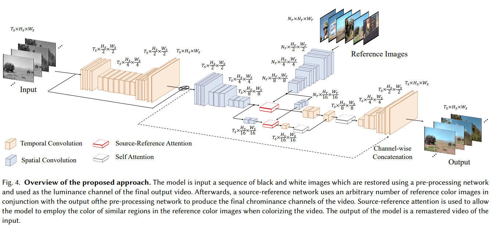

3D CNN + Reference CrossAttn


- "BasicVSR++: Improving video super-resolution with enhanced propagation and alignment" CVPR, 2021 Apr 🗿 
  [paper](https://arxiv.org/abs/2104.13371) [code](https://github.com/open-mmlab/mmagic/blob/main/configs/basicvsr_pp/README.md) [note](./2021_04_CVPR_BasicVSR++--Improving-Video-Super-Resolution-with-Enhanced-Propagation-and-Alignment_Note.md)


bidirectional 传播 second order，Deformable 对齐


- "Bringing Old Films Back to Life" CVPR, 2022 Mar 31, `RTN` :fire:
  [paper](http://arxiv.org/abs/2203.17276v1) [code](https://github.com/raywzy/Bringing-Old-Films-Back-to-Life) [website](http://raywzy.com/Old_Film/) [pdf](./2022_03_CVPR_Bringing-Old-Films-Back-to-Life.pdf) [note](./2022_03_CVPR_Bringing-Old-Films-Back-to-Life_Note.md)
  Authors: Ziyu Wan, Bo Zhang, Dongdong Chen, Jing Liao

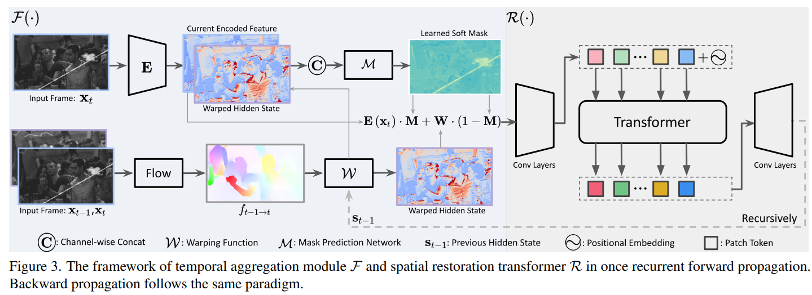

基于 BasicVSR++ 改的 bidirectional，加了个 scratch mask 预测模块，SwinTransformer 输出 + GAN loss；存在伪影


- "Recurrent Video Restoration Transformer with Guided Deformable Attention" NeurlPS, 2022 June, **RVRT** :statue_of_liberty:
  [paper](https://arxiv.org/abs/2206.02146) [code](https://github.com/JingyunLiang/RVRT?utm_source=catalyzex.com) [note](./2022_06_NeurIPS_RVRT_Recurrent-Video-Restoration-Transformer-with-Guided-Deformable-Attention_Note.md)


- "Reference-based Restoration of Digitized Analog Videotapes" WACV, 2023 Oct, TAPE  :star:
  [paper](http://arxiv.org/abs/2310.14926v2) [code](https://github.com/miccunifi/TAPE) [note](./2023_10_WACV_Reference-based-Restoration-of-Digitized-Analog-Videotapes_Note.md) 
  Authors: Lorenzo Agnolucci, Leonardo Galteri, Marco Bertini, Alberto Del Bimbo


VHS 修复，可训练；CLIP-score 选较为清晰的一帧，搞了一个 CrossAttn 传入 UNet(Swin3D)


- "Restoring Degraded Old Films With Recursive Recurrent Transformer Networks" WACV, 2024 Jan 3, `RRTN` :star:
  [paper](https://openaccess.thecvf.com/content/WACV2024/html/Lin_Restoring_Degraded_Old_Films_With_Recursive_Recurrent_Transformer_Networks_WACV_2024_paper.html) [code](https://github.com/mountln/RRTN-old-film-restoration) [pdf](./2024_01_WACV_Restoring-Degraded-Old-Films-With-Recursive-Recurrent-Transformer-Networks.pdf) [note](./2024_01_WACV_Restoring-Degraded-Old-Films-With-Recursive-Recurrent-Transformer-Networks_Note.md)
  Authors: Shan Lin,  Edgar Simo-Serra


设计了一个划痕预测模块；&& 参考 BasicVSR++ 加上 Second Order 传播模块 && 加上 deformable 做**两帧的对齐**；训练重复修复两次，提升时序一致性


- "BlazeBVD: Make Scale-Time Equalization Great Again for Blind Video Deflickering" ECCV, 2024 Mar 10
  [paper](http://arxiv.org/abs/2403.06243v1) [code]() [pdf](./2024_03_Arxiv_BlazeBVD--Make-Scale-Time-Equalization-Great-Again-for-Blind-Video-Deflickering.pdf) [note](./2024_03_Arxiv_BlazeBVD--Make-Scale-Time-Equalization-Great-Again-for-Blind-Video-Deflickering_Note.md)
  Authors: Xinmin Qiu, Congying Han, Zicheng Zhang, Bonan Li, Tiande Guo, Pingyu Wang, Xuecheng Nie


Diffusion 做 deflickering 有修复电影


- "Unsupervised Model-Based Learning for Simultaneous Video Deflickering and Deblotching" WACV, 2024 Jan 1
  [paper](https://openaccess.thecvf.com/content/WACV2024/html/Fulari_Unsupervised_Model-Based_Learning_for_Simultaneous_Video_Deflickering_and_Deblotching_WACV_2024_paper.html) [code]() [video](https://www.youtube.com/watch?v=K5uCcAF7RrA) [pdf](./2024_01_WACV_Unsupervised-Model-Based-Learning-for-Simultaneous-Video-Deflickering-and-Deblotching.pdf) [note](./2024_01_WACV_Unsupervised-Model-Based-Learning-for-Simultaneous-Video-Deflickering-and-Deblotching_Note.md)
  Authors: Anuj Fulari, Satish Mulleti, Ajit Rajwade (india IIT)

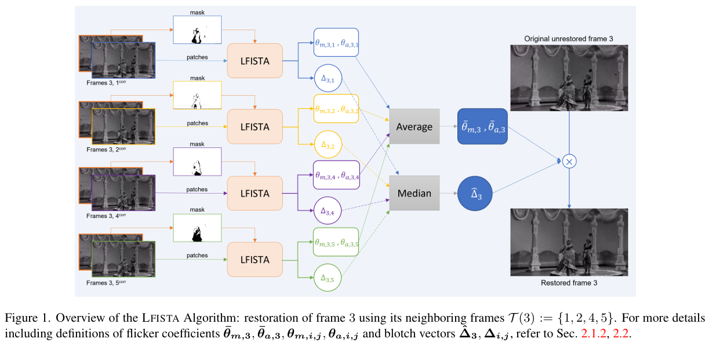

把凸优化方法 FISTA 改到 video 上面；没代码。。。

对比方法

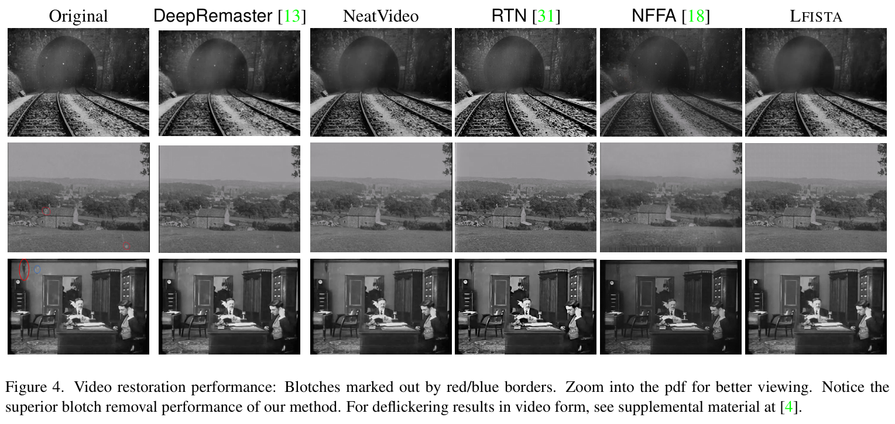


- "DeepEnhancer: Temporally Consistent Focal Transformer for Comprehensive Video Enhancement" ICMR, 2024 Jun 7
  [paper](https://dl.acm.org/doi/pdf/10.1145/3652583.3658031) [code](https://github.com/jiangqin567/DeepEnhancer) [pdf](./2024_06_ICMR_DeepEnhancer--Temporally-Consistent-Focal-Transformer-for-Comprehensive-Video-Enhancement.pdf) [note](./2024_06_ICMR_DeepEnhancer--Temporally-Consistent-Focal-Transformer-for-Comprehensive-Video-Enhancement_Note.md)
  Authors: Qin Jiang, Qinglin Wang, Lihua Chi, Wentao Ma, Feng Li, Jie Liu

参考本文的 related work 做实验！ :star: 无训练 code，但有灰度修复的模型！

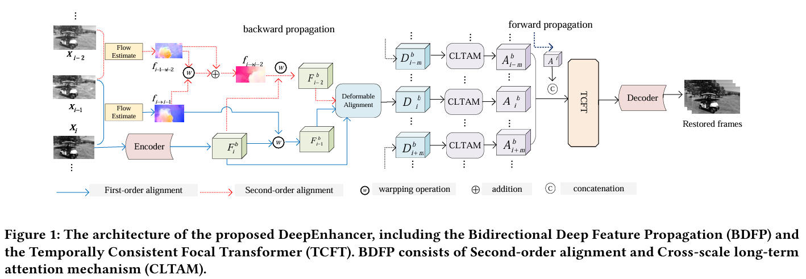


- "Research on the Digital Restoration of Female Hero Images in Shandong Red Films" ECNCT, 2024 Jul 19
  [paper](https://ieeexplore.ieee.org/document/10704335) [code]() [pdf](./2024_07_ECNCT_Research-on-the-Digital-Restoration-of-Female-Hero-Images-in-Shandong-Red-Films.pdf) [note](./2024_07_ECNCT_Research-on-the-Digital-Restoration-of-Female-Hero-Images-in-Shandong-Red-Films_Note.md)
  Authors: Qingshuang Dong, Guangran Zhong, Bing Wu

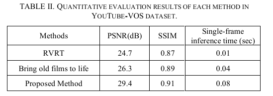

> we trained the model on the YouTube-VOS dataset and compared it with RVRT [10] and the method "Bring old films to life." [11]

只说了在 YouTubeVOS 上用 RVRT 训练，无代码 + 中文期刊。。。


- "SVFR: A Unified Framework for Generalized Video Face Restoration" Arxiv, 2025 Jan 2
  [paper](http://arxiv.org/abs/2501.01235v2) [code](https://github.com/wangzhiyaoo/SVFR.git) [pdf](./2025_01_Arxiv_SVFR--A-Unified-Framework-for-Generalized-Video-Face-Restoration.pdf) [note](./2025_01_Arxiv_SVFR--A-Unified-Framework-for-Generalized-Video-Face-Restoration_Note.md)
  Authors: Zhiyao Wang, Xu Chen, Chengming Xu, Junwei Zhu, Xiaobin Hu, Jiangning Zhang, Chengjie Wang, Yuqi Liu, Yiyi Zhou, Rongrong Ji


### Colorization :paintbrush:

- "ColorMNet: A Memory-based Deep Spatial-Temporal Feature Propagation Network for Video Colorization" 2404

https://arxiv.org/pdf/2404.06251


- [Video Colorization Based on Variational Autoencoder](https://www.mdpi.com/2079-9292/13/12/2412), "Electronics"  **16 May 2024**


- [HyperColorization: propagating spatially sparse noisy spectral clues for reconstructing hyperspectral images](https://opg.optica.org/abstract.cfm?uri=oe-32-7-10761)


- "OmniFusion: Exemplar-based Video Colorization Using OmniMotion and Diffusion Priors"

  [paper](https://openaccess.thecvf.com/content/ACCV2024/papers/Fang_OmniFusion_Exemplar-based_Video_Colorization_Using_OmniMotion_and_Diffusion_Priors_ACCV_2024_paper.pdf)


### deflicker :leaves:

- "Blind Video Deflickering by Neural Filtering with a Flawed Atlas" CVPR, 2023 Mar, `NFFA`,:statue_of_liberty:
  [paper](https://arxiv.org/abs/2303.08120) [code](https://github.com/ChenyangLEI/All-In-One-Deflicker?utm_source=catalyzex.com) [website](https://chenyanglei.github.io/deflicker/) [note](./2023_05_CVPR_Blind-Video-Deflickering-by-Neural-Filtering-with-a-Flawed-Atlas_Note.md)

**用 Nerf 类似的 atlas 处理视频一致性问题**

有公布数据  <a name="Blind flickering Dataset"></a> 60 * old_movie, 大多为 350 帧图像; 21* old_cartoon, 大多为 50-100 帧;
用 [RE:VISION. De:flicker](https://revisionfx.com/products/deflicker/) 去用软件人工修复（存在新手修的质量差的问题）


- "BlazeBVD: Make Scale-Time Equalization Great Again for Blind Video Deflickering" ECCV, 2024 Mar 10
  [paper](http://arxiv.org/abs/2403.06243v1) [code]() [pdf](./2024_03_Arxiv_BlazeBVD--Make-Scale-Time-Equalization-Great-Again-for-Blind-Video-Deflickering.pdf) [note](./2024_03_Arxiv_BlazeBVD--Make-Scale-Time-Equalization-Great-Again-for-Blind-Video-Deflickering_Note.md)
  Authors: Xinmin Qiu, Congying Han, Zicheng Zhang, Bonan Li, Tiande Guo, Pingyu Wang, Xuecheng Nie


Diffusion 做 deflickering 有修复电影


### metrics

> [survey_IQA.md](./survey_IQA.md)

- Q：展示哪些 metrics?

1. 看最新 film-restoration & video restoration 用哪些指标；
2. VBench 看一下是怎么做的


reference

```
PSNR↑ SSIM↑ LPIPS  DISTS
```

No-reference

```
BRISQUE↓ NIQE  CDC FID
```

video temporal consistency

```
FVD
```


### VHS :vhs:

> analog video restoration

- "Memory-Augmented Non-Local Attention for Video Super-Resolution" CVPR, 2021 Aug, **MANA** [paper](https://arxiv.org/abs/2108.11048) [code]()
- "Multi-Scale Memory-Based Video Deblurring" CVPR, 2022 Apr 
  [paper](https://arxiv.org/abs/2204.02977v1) [code](https://github.com/jibo27/memdeblur)
- "Restoration of Analog Videos Using Swin-UNet" ACM-ICM, 2022 Oct [paper](https://arxiv.org/abs/2311.04261) [ACM-paper](https://dl.acm.org/doi/10.1145/3503161.3547730) [code](https://github.com/miccunifi/analog-video-restoration)


- "Bitstream-Corrupted Video Recovery: A Novel Benchmark Dataset and Method" NeurIPS, 2023 Sep :statue_of_liberty:
  [paper](https://arxiv.org/abs/2309.13890) [code](https://github.com/LIUTIGHE/BSCV-Dataset) [note](./2023_09_Arxiv_Bitstream-corrupted-Video-Recovery_Note.md)

VHS 类似的噪声合成数据 :warning:


-  "Reference-based Restoration of Digitized Analog Videotapes" WACV, 2023 Oct, TAPE [paper](http://arxiv.org/abs/2310.14926v2) [code](https://github.com/miccunifi/TAPE)  [note](./2023_10_WACV_Reference-based-Restoration-of-Digitized-Analog-Videotapes_Note.md) Authors: Lorenzo Agnolucci, Leonardo Galteri, Marco Bertini, Alberto Del Bimbo


- [BlazeBVD: Make Scale-Time Equalization Great Again for Blind Video Deflickering](https://arxiv.org/abs/2403.06243)


### VideoSR :mag:

- [survey_VSR_VFI.md](./survey_VSR_VFI.md)


## scratch detection

- "Robust Automatic Line Scratch Detection in Films" TIP, 2014
  [paper](https://hal.science/hal-00927007/file/Scratch_detection_journal_revised.pdf)

Line scratch detection in old films


- "Mobile phone screen surface scratch detection based on optimized YOLOv5 model (OYm)" TIP, 2022 Jul 14 
  [paper](https://ietresearch.onlinelibrary.wiley.com/doi/pdf/10.1049/ipr2.12718)


- "Line Scratch Detection in Old Motion Picture"
  [paper]()


- "IMPROVED-SDROM filtering for scratches removal from images" 
  [paper](https://link.springer.com/article/10.1007/s11042-020-09224-7)


- "Learning Defects in Old Movies from Manually Assisted Restoration" 2020
  [paper](https://hal.science/hal-02965296/document)


- "Scratch detection of archival flms: modeling and trajectory calculation" HS, 2023 Dec 16
  [paper](https://link.springer.com/content/pdf/10.1186/s40494-023-01119-8.pdf)

> https://www.researchgate.net/publication/377081561_Scratch_detection_of_archival_films_modeling_and_trajectory_calculation/references

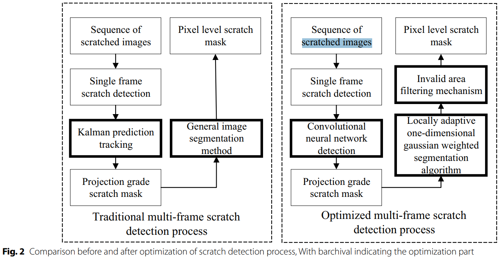


- "Scratch detection of archival films: modeling and trajectory calculation" Nature, 2024 Jan 02 
  https://www.nature.com/articles/s40494-023-01119-8


## Old Photo restoration

- "Bringing Old Photos Back to Life" CVPR oral, 2020 Apr :star:
  [paper(CVPR version)](https://arxiv.org/abs/2004.09484) [paper(TPAMI version)](https://arxiv.org/pdf/2009.07047v1.pdf) [code](https://github.com/microsoft/Bringing-Old-Photos-Back-to-Life) [website](http://raywzy.com/Old_Photo/) [note](./2020_CVPR_Bringing-Old-Photos-Back-to-Life_Note.md)

Pascal VOC 上合成噪声（DA & 噪声模板 collect 62 scratch texture images and 55 paper texture image）；可以参考**消除合成数据和真实数据之间 domain gap 的方法**。

Face Enhancement 模块用 FFHQ 数据


- "Pik-Fix: Restoring and Colorizing Old Photo" WACV, 2022 May
  [paper](https://arxiv.org/abs/2205.01902) [code](https://github.com/DerrickXuNu/Pik-Fix) [pdf](./2022_05_WACV_Pik-Fix-Restoring-and-Colorizing-Old-Photos.pdf)

RealOld 200个老照片，**有 Expert 修复过的 GT！**


- "Modernizing Old Photos Using Multiple References via Photorealistic Style Transfer" CVPR, 2023 Apr, `MROPM`
  [paper](https://arxiv.org/abs/2304.04461) [code](https://github.com/KAIST-VICLab/old-photo-modernization) [website](https://kaist-viclab.github.io/old-photo-modernization/?utm_source=catalyzex.com) [note](./2023_04_CVPR_Modernizing-Old-Photos-Using-Multiple-References-via-Photorealistic-Style-Transfer_Note.md)


- "MLRN: A multi-view local reconstruction network for single image restoration" IPM, 2024 May
  [paper](https://www.sciencedirect.com/science/article/pii/S0306457324000608)


### Unsupervised

- "Time-Travel Rephotography" SIGGRAPH, 2020 Dec :star:
  [paper](https://arxiv.org/abs/2012.12261) [website](https://time-travel-rephotography.github.io/) [code](https://github.com/Time-Travel-Rephotography/Time-Travel-Rephotography.github.io) [pdf](./2020_12_SIGGRAPH_Time-Travel-Rephotography.pdf) [talk](https://www.youtube.com/watch?v=C8IV7xK7-UI) :+1: 

**无监督方式！！将灰度图人脸修复为彩色图 >> Sibling 概念，使用预训练 stylegan 的优良颜色特征**，用 StyleGAN 生成先弄一个类似的人脸（颜色ok，人不像），然后另外训一个 decoder 生成结构和原图相似的人脸，**`Color Transfer`,`contextual loss` 训练**。**无监督方式训练：模拟一个老相机的退化**，将 RGB 转为灰度图，与原图做 reconstruction loss （这里前提是数据集本身的噪声并不多，没有扭曲很多情况下）


## Commercial Software :star:

- "DeOldify" open-sourced toolbox to restore image and video
  [code](https://github.com/jantic/DeOldify)

strong baseline in multi papers


- [Neat Video - best noise and flicker reduction for digital video](https://www.neatvideo.com/) ?? 也不是电影修复的。。。


- MTI https://mtifilm.com/software/drs-nova/  :star:

Cortex, DRS Nova

> 展示的视频仍然有噪声 Watch a full before/after video


- VIVA pro https://algosoft-tech.com/pro

  ```
  https://www.youtube.com/watch?v=x4JjFFiCn9I
  ```


- DIAMANT


### MTI

VP 说用 RIFE + camera pose control 实现对齐+修复。。。方法很老了


- blocking?? structure distortion seems micro change
- Frame limit -> move scratch from over frames to this one
- pretty advanced, so many options for amateur 。。。。
  - have to select so many scratches。。。

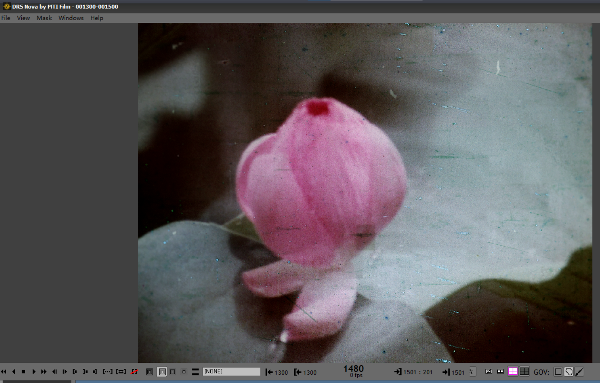

- Frame Cache? once 6 frame?

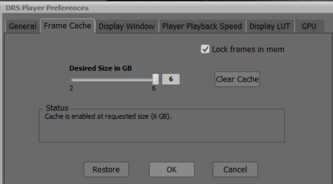

- Q：what this used for?

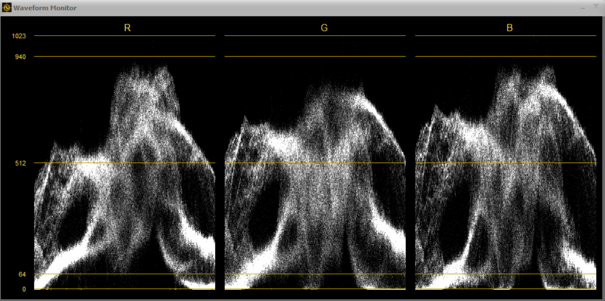


tutorial

> - download https://forum.mtifilm.com/t/drs-nova-6-0-release/3238
>
> - manual https://drive.google.com/file/d/1Bj-8vmiR4HouzRvKyHmTZG8iLWOKW5S4/view
>
> - tutorial video 
>
>   https://drive.google.com/file/d/1yVcIyaoMeTk3opPSXBvRlLdAwXVCDcJ2/view


### VIAVA-Pro

> https://algosoft-tech.com/restored-films-partners
>
> https://algosoft-tech.com/sample-videos-2
>
> https://www.youtube.com/@AlgosoftTech


### TopazLab SD restore

https://x.com/topazlabs/status/1887497602398073234


# Physical Restoration & Data

## Old Films

合成数据，**滤镜**

> [PR video: 8mm胶片效果](https://www.bilibili.com/video/BV1PE411c74o/)
> [电影胶片-划痕素材](https://www.bilibili.com/video/BV1jE411R7HV/?p=3&spm_id_from=pageDriver)


- Commercial Old films 
  https://www.britishpathe.com/ 老电影商店 75英镑下载一个。。


- Youtube [Denis Shiryaev](https://www.youtube.com/@DenisShiryaev) Youtuber permit other to use the video for research in his video comment. 有给出 source video Youtube url

  [[4k, 60 fps] A Trip Through New York City in 1911](https://www.youtube.com/watch?v=hZ1OgQL9_Cw&t=12s) already restore by several algorithms :warning:
  [[4k, 60 fps] San Francisco, a Trip down Market Street, April 14, 1906](https://www.youtube.com/watch?v=VO_1AdYRGW8) >> tell what methods used to restore


- [Youtube GHWTVideos](https://www.youtube.com/@GHWTVideos/videos)


## Old VHS video

> https://www.youtube.com/watch?v=FwFduRA_L6Q

> **VHS recordings videos** given from Mr.[Jorvan](https://discuss.huggingface.co/u/Jorvan) contacted under the blog: [Can I upload a dataset of old VHS recordings of music videos?](https://discuss.huggingface.co/t/can-i-upload-a-dataset-of-old-vhs-recordings-of-music-videos/37362)
> You’ll probably need to do some trimming and velocity adjustments here and there, and some videos don’t have audio for some reason. 
>
> - [What is VHS?](https://en.wikipedia.org/wiki/VHS)
>   VHS(Video Home System) is a [standard](https://en.wikipedia.org/wiki/Technical_standard) for consumer-level [analog](https://en.wikipedia.org/wiki/Analog_recording) [video recording](https://en.wikipedia.org/wiki/Video_recording) on tape [cassettes](https://en.wikipedia.org/wiki/Videocassette) invented in **1976 by the [Victor Company of Japan](https://en.wikipedia.org/wiki/Victor_Company_of_Japan)** and was the competitor to the ill-fated [Sony Betamax](https://en.wikipedia.org/wiki/Sony_Betamax) system.
>
> - 没有 GT 但有相似的
>
> - [How the 90s VHS look works](https://www.youtube.com/watch?v=h6RRNNztN5o)
>
> - [How to Convert Your Old VHS Tapes to DVD with honestech VHS to DVD 4.0 Deluxe](https://huggingface.co/spaces/exolitga/open-reverse-proxy/blob/main/datasets/Honestech%20Vhs%20To%20Dvd%204.0%20Deluxe%20Keygen.md)
>
> - [如何合成 old VHS video](https://www.reddit.com/r/VHS/comments/157r1sl/i_tried_to_make_a_realistic_effect_of_a_bad/)
>   [vaporwave](https://github.com/itorr/vaporwave) 通过抽象虚拟信号影像展现过程中的各种可能性、实现了九十年代影像风格的重现。
>
>   [IOS app](https://techcrunch.com/2015/08/19/this-app-shoots-vhs-quality-video-that-bob-saget-would-be-proud-of/)

- [ ] :question: have old music videos (with blur, noise, artifacts, etc.) that nowadays are on youtube in HD

  At least some of them have GT！

  - [ ] 确定视频 degradation 类型
    [Sade - Is It A Crime (Live Video from San Diego)](https://www.youtube.com/watch?v=U-SHfpm5Bxk)
    [Mariah Carey - Emotions](https://www.youtube.com/watch?v=s-J5znCS1Ng)

  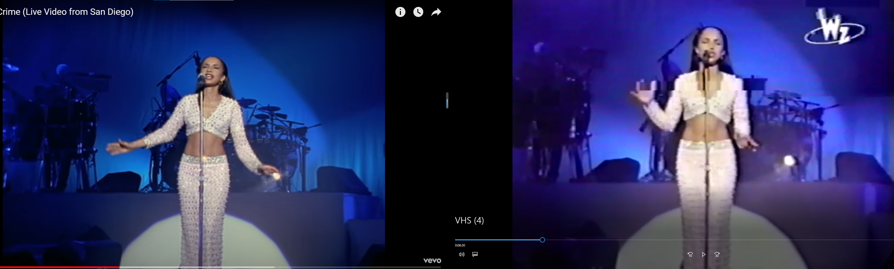

- [ ] 可以模仿类似方法找老视频数据！去影像店找那种旧的录像带
  [如何把图片处理成VHS录像带的效果？](https://www.zhihu.com/question/53534828)


### Synthetic VHS

> - PR software VHS template
>   [video1](https://www.bilibili.com/video/BV1BE411o7jU/?spm_id_from=333.337.search-card.all.click&vd_source=eee3c3d2035e37c90bb007ff46c6e881)
>
>   [PR 软件下载](https://nic.tongji.edu.cn/zbrjpt/list.htm)
>
> - image VHS like
>   [vaporwave](https://github.com/itorr/vaporwave)
>
> - video VHS
>
>   [Creating faux analogue video imagery with python](https://polprog.net/blog/pyvideo/)
>   [ntscqt](https://github.com/JargeZ/ntscqt) :+1: python rewrite of https://github.com/joncampbell123/composite-video-simulator
>
>   The ultimate goal is to reproduce all of the artifacts described here https://bavc.github.io/avaa/tags.html#video :star: >> Video artifact 社区标准
>
>   - [How to compile using Makefile.am](


### VHS 转录

> [blog](https://www.zhihu.com/question/25873372/answer/55159946?utm_campaign=shareopn&utm_content=group3_Answer&utm_medium=social&utm_oi=1068508841213423616&utm_psn=1732403163192201216&utm_source=wechat_session) 
> [录像机论坛](http://www.crystalradio.cn/)
>
> [VHS 录像带科普](https://www.bilibili.com/video/BV1aY4y1F7Xv/?spm_id_from=333.337.search-card.all.click&vd_source=eee3c3d2035e37c90bb007ff46c6e881) 
>
> - 中国广告博物馆数字馆藏
>
>   [90s 广告视频](https://www.bilibili.com/video/BV1354y1n7Zm/?spm_id_from=pageDriver&vd_source=eee3c3d2035e37c90bb007ff46c6e881)

VHS 录像机

> [b 站录像带机器广告（老录像带！）](https://www.bilibili.com/video/BV1A4411J71A/?p=11&vd_source=eee3c3d2035e37c90bb007ff46c6e881) 
> [松下NV-J27MC录像机修复笔记](http://www.crystalradio.cn/thread-850100-1-1.html)
>
> 高清视频录到带子上，在转录一下？

- 购买标准

  1. 打开观摩，磁头状态，机芯干净程度，从磨损情况可以推断使用时间很短
  2. 录像功能
  3. 尽可能便宜 + 性价比（咸鱼 J27 180￥）

- 存储介质：VHS 录像带，8mm 磁带，mini-DV 磁带，DVD

- 修复：磁带会发霉长毛

- 松下 NV-J27MC

  单声道 300￥，**有搭配遥控器**，可以调播放速率（可以出现噪声），检索功能

- 松下**HD100**立体声录像机

- 松下 F55 ，500￥


## 传统人工修复

- **上海电影技术厂**

  > [官网](http://www.spcsc.sh.cn/renda/hsdy/node7684/node7689/u1a1298946.html) 上海市宝通路449号 86-21-56628742

  上海电影历史博物馆展览未详细介绍电影修复流程，但有提供修复电影观看活动，了解到数据从上海电影技术厂获取。

- 修复流程

  > [解密电影修复十三年](https://zhuanlan.zhihu.com/p/70960593)
  > [那些经典老电影的高清修复是怎么实现的？](https://www.zhihu.com/question/271774931/answer/966998379) >> 焦翔老师 [采访视频](https://tv.cctv.com/2019/04/08/VIDE7kDgVroittJnFredeOZX190408.shtml)
  > [电影修复书籍](https://dl1.cuni.cz/pluginfile.php/817568/mod_resource/content/1/Read%2C%20Paul%20-%20Meyer%2C%20Mark-Paul_Restoration%20of%20Motion%20Picture%20Film.pdf)
  > https://zhuanlan.zhihu.com/p/86859428

  90min电影，每人一天 1.5k-2k 帧， 3周->4月；

  1. 黑白片：很多的划痕脏点 & 抖动
  2. 彩色片：颜色的褪色，胶片保存20y，画面会偏红

  50年代之前胶片，硝酸片基，燃点40度。资料馆有两个库房：陕西西安临瞳（原底：没有配光，没有调色），北京（存储拷贝），恒温恒湿（5度 35%）

  

- 主流修复机构

  意大利博洛尼亚修复实验室 [website](https://www.immagineritrovata.it/cn/)

  中国电影资料馆 >> app
  


**上海电影技术厂**

> 人工修复主要还是考人工来弄，只是花的大量时间去修复。这样能更好的保持画面原来的本质，
>
> 已经看到的2-3种算法。一种增加很强的锐度。降噪很厉害，电影原有的颗粒感没了；
> 为了去除脏点等，会把比如有些细小东西弄没了，比如**人的皱纹**。比如1000响鞭炮点燃以后**地上的鞭炮**。还有以前上海那种**一点点的墙壁**，算法好了以后就会没了；比如波光粼粼的水面，，算法一过可能没那么波光粼粼了
>
> 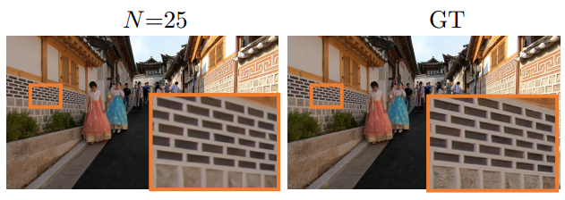

- 修复有很多方面，比如去脏点划痕，画面的缺损，抖动等等方面
- 细节被算法处理过，过于平滑丢失了细节

还有就是有些难点，人工没办法解决，算法也没有办法比人工做的更好，比如有一根划痕，一直处于画面的一个地方10几秒


## Old film Degradation Type

> 爱奇艺搜集 https://list.iqiyi.com/www/1/----------0-1980_1989--24-1-1-iqiyi--.html
>
> - Q：爱奇艺？https://www.infoq.cn/article/UdH2LorYBOkbV22oPQMO
>
>   朱俊敏，爱奇艺技术总监。上海交通大学硕士，拥有 3 篇美国专利， 8 篇中国专利。2015 年加入爱奇艺，负责 AI 产品落地和创新应用开发，先后孵化了 HomeAI（智能语音交互平台）， 奇观（智能识别平台），逗芽（表情生产和分发平台） 等创新应用。
>
> - Q：爱奇艺有独加修复视频？
>
>   搜 `独家修复电影`
>
> - Q：Motivation？
>
>   爱奇艺上专业修复的太少了只有 30部电影，还有很多没有得到修复！专业修复的机构修复完的还要去电影院才能看，自己想看的电影还不一定有修复


## tools

**qsv 格式视频** 

> Rust 版本：https://github.com/zhangzhilinx/qsv2flv :+1:
>
> C版本 https://github.com/btnkij/qsv2flv

```shell
#下载位置：`E:\qycache\download`
x86_64-pc-windows-msvc-qsv2flv.exe -v shimianmaifu_1989_480P.qsv shimianmaifu_1989_480P.mp4
```
