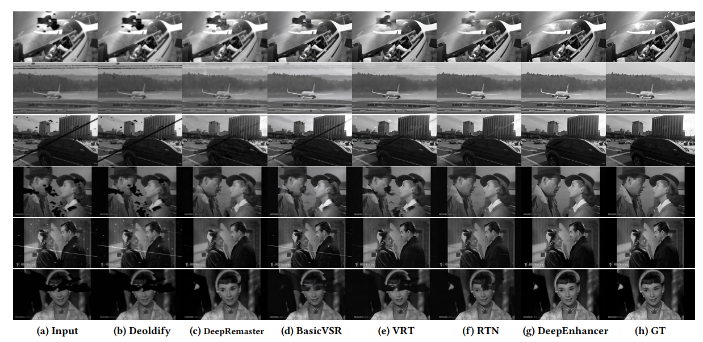

# survey_old_film_restoration


## Old Photo restoration

- "Bringing Old Photos Back to Life" CVPR oral, 2020 Apr :star:
  [paper(CVPR version)](https://arxiv.org/abs/2004.09484) [paper(TPAMI version)](https://arxiv.org/pdf/2009.07047v1.pdf) [code](https://github.com/microsoft/Bringing-Old-Photos-Back-to-Life) [website](http://raywzy.com/Old_Photo/) [note](./2020_CVPR_Bringing-Old-Photos-Back-to-Life_Note.md)

Pascal VOC 上合成噪声（DA & 噪声模板 collect 62 scratch texture images and 55 paper texture image）；可以参考**消除合成数据和真实数据之间 domain gap 的方法**。

Face Enhancement 模块用 FFHQ 数据


- "Pik-Fix: Restoring and Colorizing Old Photo" WACV, 2022 May
  [paper](https://arxiv.org/abs/2205.01902) [code](https://github.com/DerrickXuNu/Pik-Fix) [pdf](./2022_05_WACV_Pik-Fix-Restoring-and-Colorizing-Old-Photos.pdf)

RealOld 200个老照片，**有 Expert 修复过的 GT！**


- "Modernizing Old Photos Using Multiple References via Photorealistic Style Transfer" CVPR, 2023 Apr, `MROPM`
  [paper](https://arxiv.org/abs/2304.04461) [code](https://github.com/KAIST-VICLab/old-photo-modernization) [website](https://kaist-viclab.github.io/old-photo-modernization/?utm_source=catalyzex.com) [note](./2023_04_CVPR_Modernizing-Old-Photos-Using-Multiple-References-via-Photorealistic-Style-Transfer_Note.md)


- "MLRN: A multi-view local reconstruction network for single image restoration" IPM, 2024 May
  [paper](https://www.sciencedirect.com/science/article/pii/S0306457324000608)


### Unsupervised

- "Time-Travel Rephotography" SIGGRAPH, 2020 Dec :star:
  [paper](https://arxiv.org/abs/2012.12261) [website](https://time-travel-rephotography.github.io/) [code](https://github.com/Time-Travel-Rephotography/Time-Travel-Rephotography.github.io) [pdf](./2020_12_SIGGRAPH_Time-Travel-Rephotography.pdf) [talk](https://www.youtube.com/watch?v=C8IV7xK7-UI) :+1: 

**无监督方式！！将灰度图人脸修复为彩色图 >> Sibling 概念，使用预训练 stylegan 的优良颜色特征**，用 StyleGAN 生成先弄一个类似的人脸（颜色ok，人不像），然后另外训一个 decoder 生成结构和原图相似的人脸，**`Color Transfer`,`contextual loss` 训练**。**无监督方式训练：模拟一个老相机的退化**，将 RGB 转为灰度图，与原图做 reconstruction loss （这里前提是数据集本身的噪声并不多，没有扭曲很多情况下）


### scratch detect

- "Scratch detection of archival films: modeling and trajectory calculation"
  [paper](https://link.springer.com/content/pdf/10.1186/s40494-023-01119-8.pdf)


## Old film restoration :star:

- Q：补充哪些数据集？

TODO


- Q：测试哪些方法？

算法

```
DeOldify, DeepRemaster(SIGGRAPH2019), [BasicVSR++(CVPR2021),] RTN(CVPR2022), RVRT(NIPS2022), TAPE(WACV2023), RRTN(WACV2024), 
DeepEnhancer(ICMR2024) 测试灰度图
```

商用软件自动修复

- DeOldify

- MTI https://mtifilm.com/software/drs-nova/

  - Cortex

  > 展示的视频仍然有噪声 Watch a full before/after video
  
- VIVA pro https://algosoft-tech.com/pro

  ```
  https://www.youtube.com/watch?v=x4JjFFiCn9I
  ```

- DIAMANT

手工（GT）修复 1-2 个

```
TODO: 联系袁哥
```


### related work

- "DeepRemaster: Temporal Source-Reference Attention Networks for Comprehensive Video Enhancement" SIGGRAPH, 2019 Nov :statue_of_liberty:
  [paper](https://arxiv.org/abs/2009.08692) [website](http://iizuka.cs.tsukuba.ac.jp/projects/remastering/en/index.html) [note](./2019_SIGGRAPH_DeepRemaster-Temporal-Source-Reference-Attention-Networks-for-Comprehensive-Video-Enhancement_Note.md)


- "BasicVSR++: Improving video super-resolution with enhanced propagation and alignment" CVPR, 2021 Apr 🗿 
  [paper](https://arxiv.org/abs/2104.13371) [code](https://github.com/open-mmlab/mmagic/blob/main/configs/basicvsr_pp/README.md) [note](./2021_04_CVPR_BasicVSR++--Improving-Video-Super-Resolution-with-Enhanced-Propagation-and-Alignment_Note.md)


- "Bringing Old Films Back to Life" CVPR, 2022 Mar 31, `RTN` :fire:
  [paper](http://arxiv.org/abs/2203.17276v1) [code](https://github.com/raywzy/Bringing-Old-Films-Back-to-Life) [website](http://raywzy.com/Old_Film/) [pdf](./2022_03_CVPR_Bringing-Old-Films-Back-to-Life.pdf) [note](./2022_03_CVPR_Bringing-Old-Films-Back-to-Life_Note.md)
  Authors: Ziyu Wan, Bo Zhang, Dongdong Chen, Jing Liao


- "Recurrent Video Restoration Transformer with Guided Deformable Attention" NeurlPS, 2022 June, **RVRT** :statue_of_liberty:
  [paper](https://arxiv.org/abs/2206.02146) [code](https://github.com/JingyunLiang/RVRT?utm_source=catalyzex.com) [note](./2022_06_NeurIPS_RVRT_Recurrent-Video-Restoration-Transformer-with-Guided-Deformable-Attention_Note.md)


- "Reference-based Restoration of Digitized Analog Videotapes" WACV, 2023 Oct, TAPE  :star:
  [paper](http://arxiv.org/abs/2310.14926v2) [code](https://github.com/miccunifi/TAPE) [note](./2023_10_WACV_Reference-based-Restoration-of-Digitized-Analog-Videotapes_Note.md) Authors: Lorenzo Agnolucci, Leonardo Galteri, Marco Bertini, Alberto Del Bimbo

VHS 修复，可训练


- "Restoring Degraded Old Films With Recursive Recurrent Transformer Networks" WACV, 2024 Jan 3, `RRTN` :star:
  [paper](https://openaccess.thecvf.com/content/WACV2024/html/Lin_Restoring_Degraded_Old_Films_With_Recursive_Recurrent_Transformer_Networks_WACV_2024_paper.html) [code](https://github.com/mountln/RRTN-old-film-restoration) [pdf](./2024_01_WACV_Restoring-Degraded-Old-Films-With-Recursive-Recurrent-Transformer-Networks.pdf) [note](./2024_01_WACV_Restoring-Degraded-Old-Films-With-Recursive-Recurrent-Transformer-Networks_Note.md)
  Authors: Shan Lin,  Edgar Simo-Serra

可训练


- "Unsupervised Model-Based Learning for Simultaneous Video Deflickering and Deblotching" WACV, 2024, `LFISTA`

  [paper](https://openaccess.thecvf.com/content/WACV2024/papers/Fulari_Unsupervised_Model-Based_Learning_for_Simultaneous_Video_Deflickering_and_Deblotching_WACV_2024_paper.pdf) [pdf](2024_01_WACV_Unsupervised_Model-Based_Learning_for_Simultaneous_Video_Deflickering_and_Deblotching.pdf)

无代码


整理 SOTA


- "DeepEnhancer: Temporally Consistent Focal Transformer for Comprehensive Video Enhancement" ICMR, 2024 Jun 07

[paper](https://dl.acm.org/doi/pdf/10.1145/3652583.3658031) [code](https://github.com/jiangqin567/DeepEnhancer/issues/1) [pdf](./2024_ICMR_DeepEnhancer.pdf)

参考本文的 related work 做实验！ :star: 无训练 code，但有灰度修复的模型！




### commercial software :zap:

- "DeOldify" open-sourced toolbox to restore image and video
  [code](https://github.com/jantic/DeOldify)

strong baseline in multi papers


### Color

- "ColorMNet: A Memory-based Deep Spatial-Temporal Feature Propagation Network for Video Colorization" 2404

https://arxiv.org/pdf/2404.06251


- [Video Colorization Based on Variational Autoencoder](https://www.mdpi.com/2079-9292/13/12/2412), "Electronics"  **16 May 2024**


- [HyperColorization: propagating spatially sparse noisy spectral clues for reconstructing hyperspectral images](https://opg.optica.org/abstract.cfm?uri=oe-32-7-10761)


### flickering

- "Blind Video Deflickering by Neural Filtering with a Flawed Atlas" CVPR, 2023 Mar, `NFFA`,:statue_of_liberty:
  [paper](https://arxiv.org/abs/2303.08120) [code](https://github.com/ChenyangLEI/All-In-One-Deflicker?utm_source=catalyzex.com) [website](https://chenyanglei.github.io/deflicker/) [note](./2023_05_CVPR_Blind-Video-Deflickering-by-Neural-Filtering-with-a-Flawed-Atlas_Note.md)

**用 Nerf 类似的 atlas 处理视频一致性问题**

有公布数据  <a name="Blind flickering Dataset"></a> 60 * old_movie, 大多为 350 帧图像; 21* old_cartoon, 大多为 50-100 帧;
用 [RE:VISION. De:flicker](https://revisionfx.com/products/deflicker/) 去用软件人工修复（存在新手修的质量差的问题）


- [BlazeBVD: Make Scale-Time Equalization Great Again for Blind Video Deflickering](https://arxiv.org/abs/2403.06243)


### metrics

> [survey_IQA.md](./survey_IQA.md)

- Q：展示哪些 metrics?

reference

```
PSNR↑ SSIM↑ LPIPS  DISTS
```

No-reference

```
BRISQUE↓ NIQE
```

video temporal consistency

```

```


## Colorization

- "LatentColorization: Latent Diffusion-Based Speaker Video Colorization"
  [paper](https://ieeexplore.ieee.org/stamp/stamp.jsp?arnumber=10539953)


## VHS

> analog video restoration


- "Memory-Augmented Non-Local Attention for Video Super-Resolution" CVPR, 2021 Aug, **MANA** [paper](https://arxiv.org/abs/2108.11048) [code]()
- "Multi-Scale Memory-Based Video Deblurring" CVPR, 2022 Apr 
  [paper](https://arxiv.org/abs/2204.02977v1) [code](https://github.com/jibo27/memdeblur)
- "Restoration of Analog Videos Using Swin-UNet" ACM-ICM, 2022 Oct [paper](https://arxiv.org/abs/2311.04261) [ACM-paper](https://dl.acm.org/doi/10.1145/3503161.3547730) [code](https://github.com/miccunifi/analog-video-restoration)


- "Bitstream-Corrupted Video Recovery: A Novel Benchmark Dataset and Method" NeurIPS, 2023 Sep :statue_of_liberty:
  [paper](https://arxiv.org/abs/2309.13890) [code](https://github.com/LIUTIGHE/BSCV-Dataset) [note](./2023_09_Arxiv_Bitstream-corrupted-Video-Recovery_Note.md)

VHS 类似的噪声合成数据 :warning:


-  "Reference-based Restoration of Digitized Analog Videotapes" WACV, 2023 Oct, TAPE [paper](http://arxiv.org/abs/2310.14926v2) [code](https://github.com/miccunifi/TAPE)  [note](./2023_10_WACV_Reference-based-Restoration-of-Digitized-Analog-Videotapes_Note.md) Authors: Lorenzo Agnolucci, Leonardo Galteri, Marco Bertini, Alberto Del Bimbo


- [BlazeBVD: Make Scale-Time Equalization Great Again for Blind Video Deflickering](https://arxiv.org/abs/2403.06243)


## VideoSR

- "Semantic Lens: Instance-Centric Semantic Alignment for Video Super-Resolution"
  [paper](https://arxiv.org/abs/2312.07823)


## scratch detection

- "Robust Automatic Line Scratch Detection in Films" TIP, 2014
  [paper](https://hal.science/hal-00927007/file/Scratch_detection_journal_revised.pdf)

Line scratch detection in old films


- "Mobile phone screen surface scratch detection based on optimized YOLOv5 model (OYm)" TIP, 2022 Jul 14 
  [paper](https://ietresearch.onlinelibrary.wiley.com/doi/pdf/10.1049/ipr2.12718)


- "Line Scratch Detection in Old Motion Picture"
  [paper]()


- "IMPROVED-SDROM filtering for scratches removal from images" 
  [paper](https://link.springer.com/article/10.1007/s11042-020-09224-7)


- "Learning Defects in Old Movies from Manually Assisted Restoration" 2020
  [paper](https://hal.science/hal-02965296/document)


- "Scratch detection of archival flms: modeling and trajectory calculation" HS, 2023 Dec 16
  [paper](https://link.springer.com/content/pdf/10.1186/s40494-023-01119-8.pdf)

> https://www.researchgate.net/publication/377081561_Scratch_detection_of_archival_films_modeling_and_trajectory_calculation/references


## detail texture :sweat_drops:

- "Concept Sliders: LoRA Adaptors for Precise Control in Diffusion Models" Arxiv, 2023 Nov 20 :star:
  [paper](http://arxiv.org/abs/2311.12092v2) [web](https://sliders.baulab.info/) [code](https://github.com/rohitgandikota/sliders) [pdf](./2023_11_Arxiv_Concept-Sliders--LoRA-Adaptors-for-Precise-Control-in-Diffusion-Models.pdf) [note](./2023_11_Arxiv_Concept-Sliders--LoRA-Adaptors-for-Precise-Control-in-Diffusion-Models_Note.md)
  Authors: Rohit Gandikota, Joanna Materzynska, Tingrui Zhou, Antonio Torralba, David Bau


- "Interpreting the Weight Space of Customized Diffusion Models" Arxiv, 2024 Jun 13
  [paper](http://arxiv.org/abs/2406.09413v2) [code]() [pdf](./2024_06_Arxiv_Interpreting-the-Weight-Space-of-Customized-Diffusion-Models.pdf) [note](./2024_06_Arxiv_Interpreting-the-Weight-Space-of-Customized-Diffusion-Models_Note.md)
  Authors: Amil Dravid, Yossi Gandelsman, Kuan-Chieh Wang, Rameen Abdal, Gordon Wetzstein, Alexei A. Efros, Kfir Aberman


> 参考蒸馏方法搞一个模块，生成纹理提升 PSNR

- "TextureDreamer: Image-guided Texture Synthesis through Geometry-aware Diffusion" CVPR, 2024 Jan 17
  [paper](http://arxiv.org/abs/2401.09416v1) [code]() [pdf](./2024_01_CVPR_TextureDreamer--Image-guided-Texture-Synthesis-through-Geometry-aware-Diffusion.pdf) [note](./2024_01_CVPR_TextureDreamer--Image-guided-Texture-Synthesis-through-Geometry-aware-Diffusion_Note.md)
  Authors: Yu-Ying Yeh, Jia-Bin Huang, Changil Kim, Lei Xiao, Thu Nguyen-Phuoc, Numair Khan, Cheng Zhang, Manmohan Chandraker, Carl S Marshall, Zhao Dong, Zhengqin Li

参考 https://texturedreamer.github.io/ 视频，学习一下如何一步步从 baseline 改进一次后，发现还有问题逐步搭建新的模块 :star:

- Q：纹理是啥？

albedo，metallic，roughness


- "VideoGigaGAN: Towards Detail-rich Video Super-Resolution"
  [paper](https://arxiv.org/pdf/2404.12388)


## frequency domain

- "Exploring Spatial-Temporal Multi-Frequency Analysis for High-Fidelity and Temporal-Consistency Video Prediction"

  https://openaccess.thecvf.com/content_CVPR_2020/papers/Jin_Exploring_Spatial-Temporal_Multi-Frequency_Analysis_for_High-Fidelity_and_Temporal-Consistency_Video_Prediction_CVPR_2020_paper.pdf

- "Turning Frequency to Resolution: Video Super-resolution via Event Cameras"

  https://openaccess.thecvf.com/content/CVPR2021/papers/Jing_Turning_Frequency_to_Resolution_Video_Super-Resolution_via_Event_Cameras_CVPR_2021_paper.pdf

- "Temporal Wavelet Transform-Based Low-Complexity Perceptual Quality Enhancement of Compressed Video"
  [paper](https://ieeexplore.ieee.org/stamp/stamp.jsp?tp=&arnumber=10254565)


# Physical Restoration & Data

## Old Films

合成数据，**滤镜**

> [PR video: 8mm胶片效果](https://www.bilibili.com/video/BV1PE411c74o/)
> [电影胶片-划痕素材](https://www.bilibili.com/video/BV1jE411R7HV/?p=3&spm_id_from=pageDriver)


## Old VHS video

> https://www.youtube.com/watch?v=FwFduRA_L6Q

> **VHS recordings videos** given from Mr.[Jorvan](https://discuss.huggingface.co/u/Jorvan) contacted under the blog: [Can I upload a dataset of old VHS recordings of music videos?](https://discuss.huggingface.co/t/can-i-upload-a-dataset-of-old-vhs-recordings-of-music-videos/37362)
> You’ll probably need to do some trimming and velocity adjustments here and there, and some videos don’t have audio for some reason. 
>
> - [What is VHS?](https://en.wikipedia.org/wiki/VHS)
>   VHS(Video Home System) is a [standard](https://en.wikipedia.org/wiki/Technical_standard) for consumer-level [analog](https://en.wikipedia.org/wiki/Analog_recording) [video recording](https://en.wikipedia.org/wiki/Video_recording) on tape [cassettes](https://en.wikipedia.org/wiki/Videocassette) invented in **1976 by the [Victor Company of Japan](https://en.wikipedia.org/wiki/Victor_Company_of_Japan)** and was the competitor to the ill-fated [Sony Betamax](https://en.wikipedia.org/wiki/Sony_Betamax) system.
>
> - 没有 GT 但有相似的
>
> - [How the 90s VHS look works](https://www.youtube.com/watch?v=h6RRNNztN5o)
>
> - [How to Convert Your Old VHS Tapes to DVD with honestech VHS to DVD 4.0 Deluxe](https://huggingface.co/spaces/exolitga/open-reverse-proxy/blob/main/datasets/Honestech%20Vhs%20To%20Dvd%204.0%20Deluxe%20Keygen.md)
>
> - [如何合成 old VHS video](https://www.reddit.com/r/VHS/comments/157r1sl/i_tried_to_make_a_realistic_effect_of_a_bad/)
>   [vaporwave](https://github.com/itorr/vaporwave) 通过抽象虚拟信号影像展现过程中的各种可能性、实现了九十年代影像风格的重现。
>
>   [IOS app](https://techcrunch.com/2015/08/19/this-app-shoots-vhs-quality-video-that-bob-saget-would-be-proud-of/)

- [ ] :question: have old music videos (with blur, noise, artifacts, etc.) that nowadays are on youtube in HD

  At least some of them have GT！

  - [ ] 确定视频 degradation 类型
    [Sade - Is It A Crime (Live Video from San Diego)](https://www.youtube.com/watch?v=U-SHfpm5Bxk)
    [Mariah Carey - Emotions](https://www.youtube.com/watch?v=s-J5znCS1Ng)

  

- [ ] 可以模仿类似方法找老视频数据！去影像店找那种旧的录像带
  [如何把图片处理成VHS录像带的效果？](https://www.zhihu.com/question/53534828)


### Synthetic VHS

> - PR software VHS template
>   [video1](https://www.bilibili.com/video/BV1BE411o7jU/?spm_id_from=333.337.search-card.all.click&vd_source=eee3c3d2035e37c90bb007ff46c6e881)
>
>   [PR 软件下载](https://nic.tongji.edu.cn/zbrjpt/list.htm)
>
> - image VHS like
>   [vaporwave](https://github.com/itorr/vaporwave)
>
> - video VHS
>
>   [Creating faux analogue video imagery with python](https://polprog.net/blog/pyvideo/)
>   [ntscqt](https://github.com/JargeZ/ntscqt) :+1: python rewrite of https://github.com/joncampbell123/composite-video-simulator
>
>   The ultimate goal is to reproduce all of the artifacts described here https://bavc.github.io/avaa/tags.html#video :star: >> Video artifact 社区标准
>
>   - [How to compile using Makefile.am](


### VHS 转录

> [blog](https://www.zhihu.com/question/25873372/answer/55159946?utm_campaign=shareopn&utm_content=group3_Answer&utm_medium=social&utm_oi=1068508841213423616&utm_psn=1732403163192201216&utm_source=wechat_session) 
> [录像机论坛](http://www.crystalradio.cn/)
>
> [VHS 录像带科普](https://www.bilibili.com/video/BV1aY4y1F7Xv/?spm_id_from=333.337.search-card.all.click&vd_source=eee3c3d2035e37c90bb007ff46c6e881) 
>
> - 中国广告博物馆数字馆藏
>
>   [90s 广告视频](https://www.bilibili.com/video/BV1354y1n7Zm/?spm_id_from=pageDriver&vd_source=eee3c3d2035e37c90bb007ff46c6e881)

#### VHS 录像机

> [b 站录像带机器广告（老录像带！）](https://www.bilibili.com/video/BV1A4411J71A/?p=11&vd_source=eee3c3d2035e37c90bb007ff46c6e881) 
> [松下NV-J27MC录像机修复笔记](http://www.crystalradio.cn/thread-850100-1-1.html)
>
> 高清视频录到带子上，在转录一下？

- 购买标准

  1. 打开观摩，磁头状态，机芯干净程度，从磨损情况可以推断使用时间很短
  2. 录像功能
  3. 尽可能便宜 + 性价比（咸鱼 J27 180￥）

- 存储介质：VHS 录像带，8mm 磁带，mini-DV 磁带，DVD

- 修复：磁带会发霉长毛

- 松下 NV-J27MC

  单声道 300￥，**有搭配遥控器**，可以调播放速率（可以出现噪声），检索功能

- 松下**HD100**立体声录像机

- 松下 F55 ，500￥


## 传统人工修复

- **上海电影技术厂**

  > [官网](http://www.spcsc.sh.cn/renda/hsdy/node7684/node7689/u1a1298946.html) 上海市宝通路449号 86-21-56628742

  上海电影历史博物馆展览未详细介绍电影修复流程，但有提供修复电影观看活动，了解到数据从上海电影技术厂获取。

- 修复流程

  > [解密电影修复十三年](https://zhuanlan.zhihu.com/p/70960593)
  > [那些经典老电影的高清修复是怎么实现的？](https://www.zhihu.com/question/271774931/answer/966998379) >> 焦翔老师 [采访视频](https://tv.cctv.com/2019/04/08/VIDE7kDgVroittJnFredeOZX190408.shtml)
  > [电影修复书籍](https://dl1.cuni.cz/pluginfile.php/817568/mod_resource/content/1/Read%2C%20Paul%20-%20Meyer%2C%20Mark-Paul_Restoration%20of%20Motion%20Picture%20Film.pdf)
  > https://zhuanlan.zhihu.com/p/86859428

  90min电影，每人一天 1.5k-2k 帧， 3周->4月；

  1. 黑白片：很多的划痕脏点 & 抖动
  2. 彩色片：颜色的褪色，胶片保存20y，画面会偏红

  50年代之前胶片，硝酸片基，燃点40度。资料馆有两个库房：陕西西安临瞳（原底：没有配光，没有调色），北京（存储拷贝），恒温恒湿（5度 35%）

  

- 主流修复机构

  意大利博洛尼亚修复实验室 [website](https://www.immagineritrovata.it/cn/)

  中国电影资料馆 >> app
  


**上海电影技术厂**

> 人工修复主要还是考人工来弄，只是花的大量时间去修复。这样能更好的保持画面原来的本质，
>
> 已经看到的2-3种算法。一种增加很强的锐度。降噪很厉害，电影原有的颗粒感没了；
> 为了去除脏点等，会把比如有些细小东西弄没了，比如**人的皱纹**。比如1000响鞭炮点燃以后**地上的鞭炮**。还有以前上海那种**一点点的墙壁**，算法好了以后就会没了；比如波光粼粼的水面，，算法一过可能没那么波光粼粼了
>
> 

- 修复有很多方面，比如去脏点划痕，画面的缺损，抖动等等方面
- 细节被算法处理过，过于平滑丢失了细节

还有就是有些难点，人工没办法解决，算法也没有办法比人工做的更好，比如有一根划痕，一直处于画面的一个地方10几秒


# Old film Degradation Type

- Target: 构造测试数据集，更好评估方法效果

- 竖线


## Synthetic Data

TODO


## RealData

> 爱奇艺搜集 https://list.iqiyi.com/www/1/----------0-1980_1989--24-1-1-iqiyi--.html
>
> - Q：联系爱奇艺合作？https://www.infoq.cn/article/UdH2LorYBOkbV22oPQMO
>
>   朱俊敏，爱奇艺技术总监。上海交通大学硕士，拥有 3 篇美国专利， 8 篇中国专利。2015 年加入爱奇艺，负责 AI 产品落地和创新应用开发，先后孵化了 HomeAI（智能语音交互平台）， 奇观（智能识别平台），逗芽（表情生产和分发平台） 等创新应用。
>
> - Q：爱奇艺有独加修复视频？
>
>   搜 `独家修复电影`
>
> - Q：Motivation？
>
>   爱奇艺上专业修复的太少了只有 30部电影，还有很多没有得到修复！专业修复的机构修复完的还要去电影院才能看，自己想看的电影还不一定有修复

- 洛奇1 开头有划痕
- 十面埋伏 1989

```
00:00:20 00:00:31 闪烁细小划痕	公交车内景，背景高曝光，
00:52:22 00:52:29 
```


### Chinese

#### 1940s

- 三毛流浪记 1949（爱奇艺独家修复版本）

> https://www.iqiyi.com/v_19rrmyaa94.html?method=run_app
>
> 没法下载咋搞？

- Q：如何在 T 上精准加残差？

女人的衣服图案一开始看不清，后面拉近了才更明显，怎么关联到呢？

https://www.bilibili.com/video/BV1ma411T7EZ?t=3390.8


#### 1960s

- 嘉陵江边

> https://www.iqiyi.com/v_19rrn6m6hc.html?method=run_app

480p；黑白老电影；1960；

退化类型：高频划痕


### Foreigner

TODO


### comics

- 三毛

  https://www.iqiyi.com/v_19rrmudgwg.html?method=run_app

动画，传统中国风


### Text

- 三毛流浪记（爱奇艺独家修复版本）

> https://www.iqiyi.com/v_19rrmyaa94.html?method=run_app
>
> 没法下载咋搞？


## tools

**qsv 格式视频** 

> Rust 版本：https://github.com/zhangzhilinx/qsv2flv :+1:
>
> C版本 https://github.com/btnkij/qsv2flv

```shell
#下载位置：`E:\qycache\download`
x86_64-pc-windows-msvc-qsv2flv.exe -v shimianmaifu_1989_480P.qsv shimianmaifu_1989_480P.mp4
```


# paper

Old films bear precious memories of multiple generations. However, there are large amount of old films are suffering from various irreversible degradations which cost professionals huge burdens to restore them.

In this paper, we propose a restoration framework, called \textit{Film Reviving Diffusion Model(FRDM)}, to assist professionals to accelerate the restoration process.

We explores video diffusion's generation prior to restore the films' scratches and improve the visual quality.
Also, we collects an evaluation dataset to help further works evaluate on the same page.

Through qualitative and quantitative evaluations, our approach demonstrates superior performance compared with existing open-sourced methods. 
The code, dataset and model are available at 
