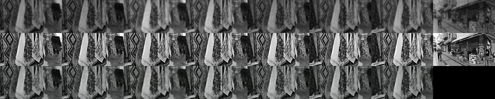
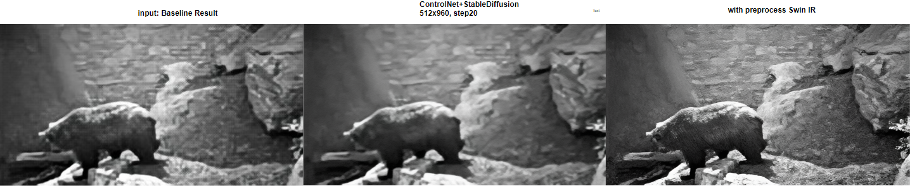

# Video LDM Prior

> [Video to video with Stable Diffusion (step-by-step)](https://stable-diffusion-art.com/video-to-video/)
> [TemporalKit](https://github.com/CiaraStrawberry/TemporalKit)

## image prior

> - "GAN Inversion: A Survey" CVPR&TPAMI, 2021 Jan
>   [paper](https://arxiv.org/abs/2101.05278) [code](https://github.com/weihaox/GAN-Inversion)

参考 GAN-Inversion 思路，类似 `SeeSR`

- "Exploiting diffusion prior for real-world image super-resolution" Arxiv, 2023 May, StableSR :star:
  [paper](https://arxiv.org/pdf/2305.07015.pdf) [code](https://github.com/IceClear/StableSR)

- "DiffBIR: Towards Blind Image Restoration with Generative Diffusion Prior" Arxiv, 2023 Aug :statue_of_liberty:
  [paper](https://arxiv.org/abs/2308.15070) [code](https://github.com/xpixelgroup/diffbir) [website](https://0x3f3f3f3fun.github.io/projects/diffbir/)
  [note](./2023_08_Arxiv_DiffBIR--Towards-Blind-Image-Restoration-with-Generative-Diffusion-Prior_Note.md)

  > diffusion 先验实现 real-world 修复

- "Pixel-Aware Stable Diffusion for Realistic Image Super-resolution and Personalized Stylization" CVPR, 2023 Aug, PASD
  [paper](http://arxiv.org/abs/2308.14469v2) [code](https://github.com/yangxy/PASD) 
  [note](./2023_08_Arxiv_Pixel-Aware-Stable-Diffusion-for-Realistic-Image-Super-resolution-and-Personalized-Stylization_Note.md)

1. 训练新的 Encoder 实现预处理，与 GT 图做 L1 loss。同时微调 ControlNet 来**用一个新的 Encoder 代替 VAE Encoder**
2. 直接用 Transformer 对 SD 生成特征和
3. 用预训练的模型事先提取 video caption，可以作为**视频的全局信息**，思考如何维持各帧一致性。
   1. 各帧的 VAE 特征事先聚类，得到**聚类中心的特征**
   2. CoDeF 全局图？paper 里面说很耗时，100帧视频要 3-4h 去训练一个全局图
   3. 可以模仿后续 CoSeR 不用预训练模型，而是自己去训练得到 caption，降低 domain gap？

- "SeeSR: Towards Semantics-Aware Real-World Image Super-Resolution" Arxiv, 2023 Nov :star:
  [paper](http://arxiv.org/abs/2311.16518v1) [code]() 
  [note](./2023_11_Arxiv_SeeSR--Towards-Semantics-Aware-Real-World-Image-Super-Resolution_Note.md)

- "CoSeR: Bridging Image and Language for Cognitive Super-Resolution" Arxiv, 2023 Nov
  [paper](https://arxiv.org/abs/2311.16512) [code](https://github.com/VINHYU/CoSeR) [website](https://coser-main.github.io/)

## Video Diffusion

- "Align your Latents: High-Resolution Video Synthesis with Latent Diffusion Models" CVPR, 2023 Apr, **VideoLDM** :star: :warning:
  [paper](https://arxiv.org/abs/2304.08818) [website](https://research.nvidia.com/labs/toronto-ai/VideoLDM/) [code: unofficial implementation](https://github.com/srpkdyy/VideoLDM.git)
  [note](./2023_04_CVPR_Align-your-Latents--High-Resolution-Video-Synthesis-with-Latent-Diffusion-Models_Note.md)

  > diffusion 用于 text2video 生成，用预训练的 stable-diffusion，**对 U-net 加 temporal layer** 实现时序一致性

- "VideoComposer: Compositional Video Synthesis with Motion Controllability" Arxiv, 2023 Jun, **VideoComposer**
    
  [note](./2023_06_VideoComposer--Compositional-Video-Synthesis-with-Motion-Controllability_Note.md)

  > Video LDM 上加入各种样式的 condition 实现可控视频生成

- [ ] "StableVideo: Text-driven Consistency-aware Diffusion Video Editing" ICCV. 2023 Aug
  [paper](https://arxiv.org/abs/2308.09592) [code](https://github.com/rese1f/StableVideo)

- [x] "CoDeF: Content Deformation Fields for Temporally Consistent Video Processing" Arxiv, 2023 Aug :star:
  [paper](https://arxiv.org/abs/2308.07926) [code](https://github.com/qiuyu96/codef) [website](https://qiuyu96.github.io/CoDeF/) 
  [note](./2023_08_Arxiv_CoDeF--Content-Deformation-Fields-for-Temporally-Consistent-Video-Processing_Note.md)

  > 视频一致性编辑，效果非常好！
  > as a new type of video representation, which consists of a **canonical content field**

- [ ] "FreeNoise: Tuning-Free Longer Video Diffusion Via Noise Rescheduling" Arxiv, 2023 Oct
  [paper](http://arxiv.org/abs/2310.15169v1) [code](https://github.com/arthur-qiu/longercrafter) [website](http://haonanqiu.com/projects/FreeNoise.html)
  [note](./2023_10_Arxiv_FreeNoise--Tuning-Free-Longer-Video-Diffusion-Via-Noise-Rescheduling_Note.md)

- [ ] "VideoCrafter1: Open Diffusion Models for High-Quality Video Generation" Arxiv, 2023 Oct
  [paper](https://arxiv.org/abs/2310.19512) [code](https://github.com/AILab-CVC/VideoCrafter)
  [note](./2023_10_Arxiv_VideoCrafter1--Open-Diffusion-Models-for-High-Quality-Video-Generation_Note.md)

- [ ] "Stable Video Diffusion: Scaling Latent Video Diffusion Models to Large Datasets" CVPR, 2023 Nov
  [paper](https://arxiv.org/abs/2311.15127) [code](https://github.com/Stability-AI/generative-models)

- [ ] "VideoBooth: Diffusion-based Video Generation with Image Prompts" CVPR, 2023 Dec
  [paper](https://arxiv.org/abs/2312.00777)

## Plan

- 问题

  - 参考 PASD 使用 VAE Decoder 出图

  - 若使用外部解码器，diffusion 输出 z0 特征 channel=4 如何与主干网络融合

    > 为什么要替换 VAE Encoder，为 2d conv 未考虑时序信息；按之前视频经验，使用 Conv3d 或 Transformer 融合时序信息

    1. zero_conv，repetition 调整通道
    2. 使用 VAE Decoder 的特征？
    3. 使用 VAE Decoder 出图，再使用 Encoder 提取相关特征

  - Swin-Transformer 如何做 QKV 融合？

**预想到的问题**

- 对 Diffusion 做修改，增加 temporal layer 实现时序

- diffusion 训练缓慢，LoRA 针对老电影数据微调

  LoRA 针对 specific domain 的数据进行微调，实现 x10 倍加速；按年代分类，训一个 90s 年代图像的 Stable Diffusion. 

- **预处理模块，划痕没去掉**，例如连续帧同一位置的划痕，类似 inpainting

  参考引用 RTN 的一片老照片修复，去预测划痕

- 全局信息：使用预训练网络获取 video caption，image CLIP embedding?

  **引入语义信息**：若无语义信息，退化太严重情况下，人看都不知道是啥

  

- **改善一下合成退化数据**

### Dataset

- 输入图像尺寸要求

  SD 在 256x256 上预训练，在 512x512 数据 finetune，因此需要输入图像最短边 >= 512

  **同时输入要求尺寸能整除 64**：`VAE_Encoder` 先调整为 `(h w 3) -> (h/8, w/8 4)`；`UNet` 内部最小的尺寸的 stage ，特征尺寸 / 8，`(h/64, w/64, C)`

  

UNet 内部结构

使用预训练的 DiffBIR 模型（ControlNet + Stable Diffusion），评估各输入图像尺寸下效果，选取输入图像尺寸

- 若使用 < 512 尺寸图像训练

- resize 最短边到 512 使用预训练模型测试后处理效果

结论：

StableDiffusion V2.1 使用 512x512 数据训练，若需要输入 <512 尺寸图像提取特征，容易产生噪声、伪影，需要后续对 Stable Diffusion 进行微调。当前方案不对 Stable Diffusion 处理

