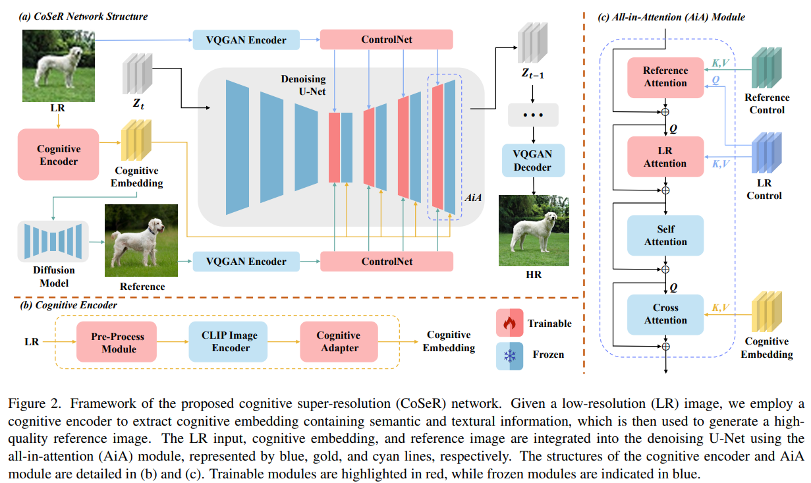
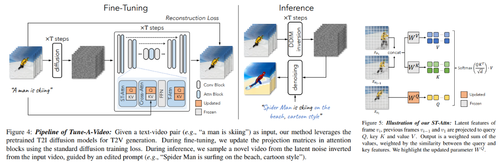
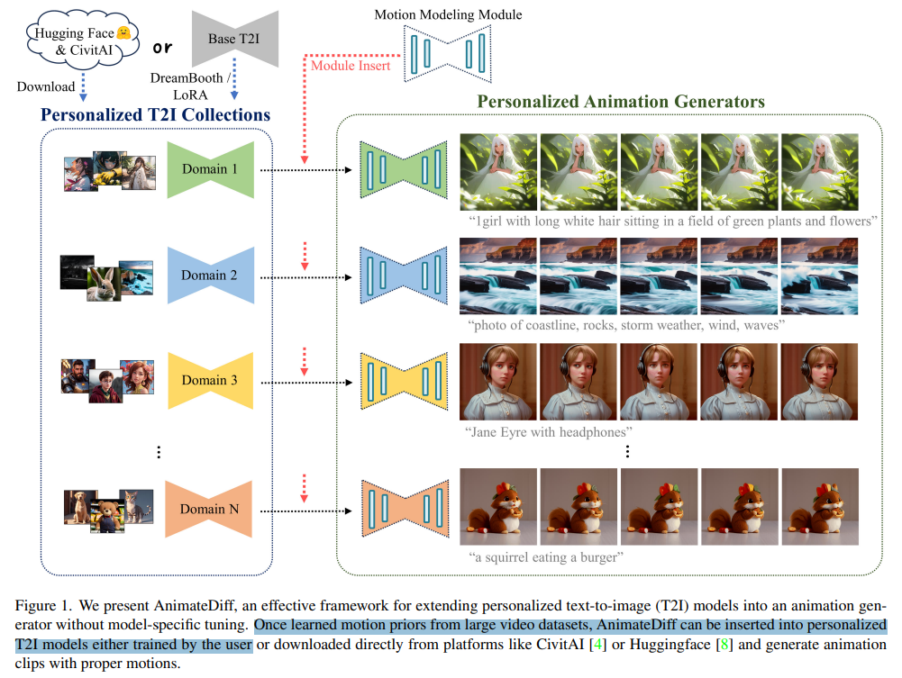
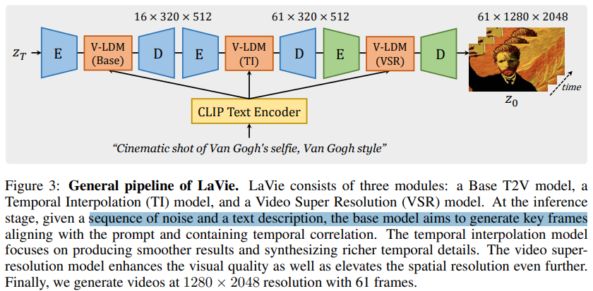
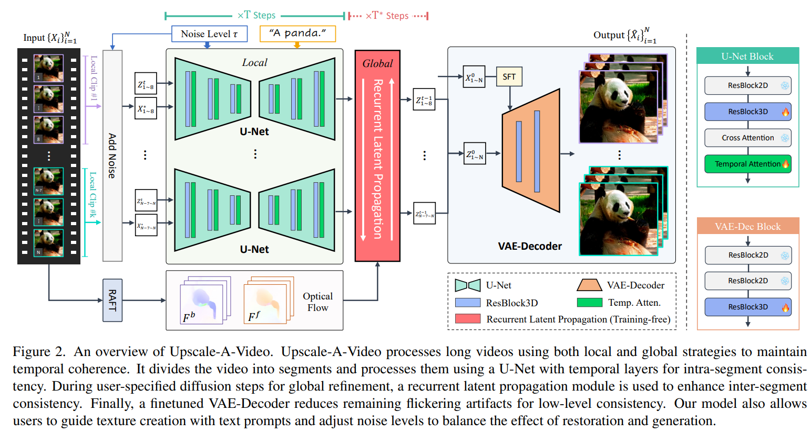
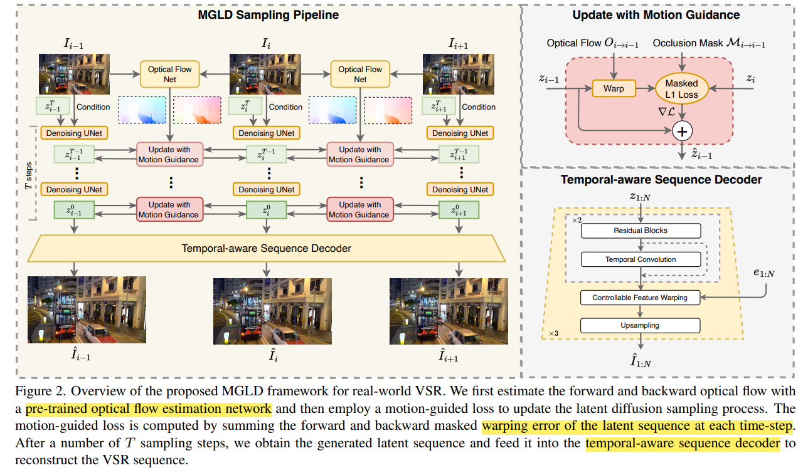

# Video LDM Prior

> [Video to video with Stable Diffusion (step-by-step)](https://stable-diffusion-art.com/video-to-video/)
> [TemporalKit](https://github.com/CiaraStrawberry/TemporalKit)
>
> https://github.com/yzhang2016/video-generation-survey/blob/main/video-generation.md
>
> 老电影数据：调研 VideoSR 的数据集，补充数据


## image prior

> - "GAN Inversion: A Survey" CVPR&TPAMI, 2021 Jan
>   [paper](https://arxiv.org/abs/2101.05278) [code](https://github.com/weihaox/GAN-Inversion)
> - [Titled Diffusion code](https://github.com/pkuliyi2015/multidiffusion-upscaler-for-automatic1111) 集成各个功能的 diffusion，超分，转绘都可以 :+1:
>   [tutorial](https://civitai.com/models/34726?modelVersionId=54518) 
>
> - Q：关注 Image Prompt 如何对图像提取特征进行 prompt. 
> - 参考 GAN-Inversion 思路，类似 `SeeSR`


- "InstructPix2Pix: Learning to Follow Image Editing Instructions" CVPR, 2022 Nov
  [paper](https://arxiv.org/abs/2211.09800)

  > 融合多模态输入


- "Paint by Example: Exemplar-based Image Editing with Diffusion Models" CVPR, 2022 Nov
  [paper](http://arxiv.org/abs/2211.13227v1) [code](https://github.com/Fantasy-Studio/Paint-by-Example) 
  [pdf](./2022_11_CVPR_Paint-by-Example--Exemplar-based-Image-Editing-with-Diffusion-Models.pdf) [note](./2022_11_CVPR_Paint-by-Example--Exemplar-based-Image-Editing-with-Diffusion-Models_Note.md)
  Authors: Binxin Yang, Shuyang Gu, Bo Zhang, Ting Zhang, Xuejin Chen, Xiaoyan Sun, Dong Chen, Fang Wen

对于参考图像使用 CLIP Image Encoder 提取特征，只是训练几个 MLP 达到迁移的目的 :+1:


- "Reference-based Image Composition with Sketch via Structure-aware Diffusion Model" Arxiv, 2023 Mar
  [paper](http://arxiv.org/abs/2304.09748v1) [code]() 
  [pdf](./2023_03_Arxiv_Reference-based-Image-Composition-with-Sketch-via-Structure-aware-Diffusion-Model.pdf) [note](2023_03_Arxiv_Reference-based-Image-Composition-with-Sketch-via-Structure-aware-Diffusion-Model_Note.md)
  Authors: Kangyeol Kim, Sunghyun Park, Junsoo Lee, Jaegul Choo


1. 参考图像 xr is generated by cropping and augmenting the RoI region, being successively fed to a **CLIP [9] image encoder** to make a condition c， $c = MLP(CLIP(xr))$. 直接使用简单的 MLP 即可
2. Paint-by-E 只用参考图像一致性不是很好


- "Hierarchical Integration Diffusion Model for Realistic Image Deblurring" NIPS-spotlight, 2023 May 
  [paper](http://arxiv.org/pdf/2305.12966v4) [code](https://github.com/zhengchen1999/HI-Diff) [note](2023_05_NIPS_Hierarchical-Integration-Diffusion-Model-for-Realistic-Image-Deblurring_Note.md)

使用主干网络 Encoder-Decoder 的主干网络（Restormer），在每个 scale 开头加上 diffusion 的先验特征，当作 KV 融入主干网络（提出的 HIM block）；两阶段训练，stage1 先训练用于 diffusion 的图像编码器 LE Encoder, 不训diffusion 把特征 z 输入主干网络，**在图像空间约束**；stage2 zT 的编码器不训，训练 condition 的编码器 + diffusion + HIM


- "Uni-ControlNet: All-in-One Control to Text-to-Image Diffusion Models" NIPS, 2023 May
  [paper](http://arxiv.org/abs/2305.16322v3) [code](https://github.com/ShihaoZhaoZSH/Uni-ControlNet) 
  [pdf](./2023_05_NIPS_Uni-ControlNet--All-in-One-Control-to-Text-to-Image-Diffusion-Models.pdf) [note](2023_05_NIPS_Uni-ControlNet--All-in-One-Control-to-Text-to-Image-Diffusion-Models_Note.md)
  Authors: Shihao Zhao, Dongdong Chen, Yen-Chun Chen, Jianmin Bao, Shaozhe Hao, Lu Yuan, Kwan-Yee K. Wong

将 condition 分为 local (图像等等)，global 特征（prompt），多种 condition 通过 AdaIN 的方式融入 controlNet


- "Exploiting diffusion prior for real-world image super-resolution" Arxiv, 2023 May, StableSR :star:
  [paper](https://arxiv.org/pdf/2305.07015.pdf) [code](https://github.com/IceClear/StableSR)

图像 Encoder Decoder 使用 AutoEncoderKL (SD 里面的 VAE) 提取图像特征


在 latent space 分patch融合，解决分 patch 处理 blocking，color shift 问题 :star:


- "DiffBIR: Towards Blind Image Restoration with Generative Diffusion Prior" Arxiv, 2023 Aug :statue_of_liberty:
  [paper](https://arxiv.org/abs/2308.15070) [code](https://github.com/xpixelgroup/diffbir) [website](https://0x3f3f3f3fun.github.io/projects/diffbir/)
  [note](./2023_08_Arxiv_DiffBIR--Towards-Blind-Image-Restoration-with-Generative-Diffusion-Prior_Note.md)

  > diffusion 先验实现 real-world 修复


- "IP-Adapter: Text Compatible Image Prompt Adapter for Text-to-Image Diffusion Models" Arxiv, 2023 Aug
  [paper](http://arxiv.org/abs/2308.06721v1) [code](https://ip-adapter.github.io) 
  [pdf](./2023_08_Arxiv_IP-Adapter--Text-Compatible-Image-Prompt-Adapter-for-Text-to-Image-Diffusion-Models.pdf) [note](./2023_08_Arxiv_IP-Adapter--Text-Compatible-Image-Prompt-Adapter-for-Text-to-Image-Diffusion-Models_Note.md)
  Authors: Hu Ye, Jun Zhang, Sibo Liu, Xiao Han, Wei Yang

Prior works, such as [SD Image Variations2 ](https://huggingface.co/lambdalabs/sd-image-variations-diffusers) and Stable unCLIP3 , have demonstrated the effectiveness of fine-tuning the text-conditioned diffusion models directly on image embedding to achieve **image prompt capabilities.**  :star:


- "Pixel-Aware Stable Diffusion for Realistic Image Super-resolution and Personalized Stylization" CVPR, 2023 Aug, PASD
  [paper](http://arxiv.org/abs/2308.14469v2) [code](https://github.com/yangxy/PASD) 
  [note](./2023_08_Arxiv_Pixel-Aware-Stable-Diffusion-for-Realistic-Image-Super-resolution-and-Personalized-Stylization_Note.md)


1. 训练新的 Encoder 实现预处理，**与 GT 图做 L1 loss**。同时微调 ControlNet 来**用一个新的 Encoder 代替 VAE Encoder**
2. 直接用 Transformer 对 SD 生成特征和
3. 用预训练的模型事先提取 video caption，可以作为**视频的全局信息**，思考如何维持各帧一致性。
   1. 各帧的 VAE 特征事先聚类，得到**聚类中心的特征**
   2. CoDeF 全局图？paper 里面说很耗时，100帧视频要 3-4h 去训练一个全局图
   3. 可以模仿后续 CoSeR 不用预训练模型，而是自己去训练得到 caption，降低 domain gap？


- "Image Super-resolution Via Latent Diffusion: A Sampling-space Mixture Of Experts And Frequency-augmented Decoder Approach" Arxiv, 2023 Oct
  [paper](http://arxiv.org/abs/2310.12004v3) [code](https://github.com/amandaluof/moe_sr.) 
  [pdf](./2023_10_Arxiv_Image-Super-resolution-Via-Latent-Diffusion--A-Sampling-space-Mixture-Of-Experts-And-Frequency-augmented-Decoder-Approach.pdf) [note](./2023_10_Arxiv_Image-Super-resolution-Via-Latent-Diffusion--A-Sampling-space-Mixture-Of-Experts-And-Frequency-augmented-Decoder-Approach_Note.md)
  Authors: Feng Luo, Jinxi Xiang, Jun Zhang, Xiao Han, Wei Yang


- "SeeSR: Towards Semantics-Aware Real-World Image Super-Resolution" Arxiv, 2023 Nov :star:
  [paper](http://arxiv.org/abs/2311.16518v1) [code](https://github.com/cswry/SeeSR)
  [note](./2023_11_Arxiv_SeeSR--Towards-Semantics-Aware-Real-World-Image-Super-Resolution_Note.md)


1. DAPE 生成 tag 模型基于 RAM 模型微调（生成 Tags），想要训练一个 Degradation Aware 的 tag 生成器
2. ControlNet 来引导 SD；adopt the cross-attention mechanism proposed in PASD （RCA 模块）to learn semantic guidance
3. Image Encoder 结构使用 ControlNet 原文中的 image encoder （几层简单卷积即可）. 
   " Adding conditional control to text-to-image diffusion models": use a **tiny network E(·) of four convolution layers with 4 × 4 kernels and 2 × 2 strides** (activated by ReLU, using 16, 32, 64, 128, channels respectively, initialized with Gaussian weights and trained jointly with the full model) to encode an image-space condition ci into a feature space conditioning vector cf


- "CoSeR: Bridging Image and Language for Cognitive Super-Resolution" Arxiv, 2023 Nov
  [paper](https://arxiv.org/abs/2311.16512) [code](https://github.com/VINHYU/CoSeR) [website](https://coser-main.github.io/)




- "AnyText: Multilingual Visual Text Generation And Editing" ICLR-Spotlight, 2023 Nov
  [paper](http://arxiv.org/abs/2311.03054v4) [code](https://github.com/tyxsspa/AnyText) [pdf](./2023_11_ICLR_AnyText--Multilingual-Visual-Text-Generation-And-Editing.pdf) [note](./2023_11_ICLR_AnyText--Multilingual-Visual-Text-Generation-And-Editing_Note.md) 
  Authors: (Alibaba Group) Yuxiang Tuo, Wangmeng Xiang, Jun-Yan He, Yifeng Geng, Xuansong Xie


- "Scaling Up to Excellence: Practicing Model Scaling for Photo-Realistic Image Restoration In the Wild" Arxiv, 2024 Jan, `SUPIR`
  [paper](http://arxiv.org/abs/2401.13627v1) [code](https://github.com/Fanghua-Yu/SUPIR) [website](https://supir.xpixel.group/)
  [pdf](./2024_01_Arxiv_Scaling-Up-to-Excellence--Practicing-Model-Scaling-for-Photo-Realistic-Image-Restoration-In-the-Wild.pdf) [note](2024_01_Arxiv_Scaling-Up-to-Excellence--Practicing-Model-Scaling-for-Photo-Realistic-Image-Restoration-In-the-Wild_Note.md)
  Authors: Fanghua Yu, Jinjin Gu, Zheyuan Li, Jinfan Hu, Xiangtao Kong, Xintao Wang, Jingwen He, Yu Qiao, Chao Dong


1. **fine-tune the encoder** to make it robust to the degradation，使用 SDXL 预训练的 Image Encoder 基础上微调；**把 Decoder 固定住，去训练 Encoder 的特征**
2. SDXL 复制得到的 ControlNet 参数量太大，很难训练，就只训练 ControlNet 的一部分 ViT 模块（一组 ViT blocks 只训练前面一半）
3. negative prompt 有负面作用


- "InstantID: Zero-shot Identity-Preserving Generation in Seconds" Arxiv, 2024 Jan
  [paper](http://arxiv.org/abs/2401.07519v1) [code](https://github.com/InstantID/InstantID) 
  [pdf](./2024_01_Arxiv_InstantID--Zero-shot-Identity-Preserving-Generation-in-Seconds.pdf) [note](./2024_01_Arxiv_InstantID--Zero-shot-Identity-Preserving-Generation-in-Seconds_Note.md)
  Authors: Qixun Wang, Xu Bai, Haofan Wang, Zekui Qin, Anthony Chen

结合 IP-Adapter & ControlNet，同时使用有更强的一致性


- "High-Quality Image Restoration Following Human Instructions" 
  [paper](https://arxiv.org/pdf/2401.16468v2.pdf)


### condition design

- "Regression Metric Loss: Learning a Semantic Representation Space for Medical Images" MICCAI, 2022 Jul 
  [paper](https://arxiv.org/abs/2207.05231) [note](2022_07_MICCAI_Regression-Metric-Loss--Learning-a-Semantic-Representation-Space-for-Medical-Images_Note.md)


## Video Diffusion

> [Awesome Video Diffusion](https://github.com/showlab/Awesome-Video-Diffusion)
> [paper with code searching 'diffusion video'](https://paperswithcode.com/search?q_meta=&q_type=&q=diffusion+video) :+1:
>
> - 调研如何保持时序一致，例如 temporal layer 怎么加
> - Diffusion 如何进行上色？

- "Video Diffusion Models" CVPR, 2022 Apr
  [paper](https://arxiv.org/abs/2204.03458v2) [website](https://video-diffusion.github.io/) [blog](https://zhuanlan.zhihu.com/p/585009571)


1. 第一个使用扩散模型进行视频生成任务的论文工作，这里的视频生成任务包括无条件和有条件两种设定。

2. 提出了3D UNet，该架构使用到了space-only 3D卷积和时空分离注意力

   将原UNet中的2D卷积替换成了**space-only 3D卷积**（space-only 3D convolution）3x3卷积替换为1x3x3卷积 （T维度步长1）；


- "Imagen Video: High Definition Video Generation with Diffusion Models" CVPR, 2022 Oct
  [paper](https://arxiv.org/pdf/2210.02303.pdf)

级联结构：scales up the Video Diffusion Model with a cascade of spatial and temporal video super-resolution models


- "Tune-A-Video: One-Shot Tuning of Image Diffusion Models for Text-to-Video Generation" ICCV, 2022 Dec
  [paper](https://arxiv.org/abs/2212.11565) [code](https://github.com/showlab/Tune-A-Video) [website](https://tuneavideo.github.io/)
  [note](./2022_12_ICCV_Tune-A-Video--One-Shot-Tuning-of-Image-Diffusion-Models-for-Text-to-Video-Generation_Note.md)



1. inflate 2D -> 3D，和每帧单独做 Conv2d 没区别

2. 视频帧先用 VAE 映射到 latent space，**用 DDIM 加噪到 zt 作为开始点**，以目标编辑的文本作为 condition 开始去噪；

3. **One-shot 训练**，只对当前视频微调一下就行：We sample 32 uniform frames at resolution of **512 × 512 from input video**, and **finetune the models with our method for 500 steps on a learning rate 3 × 10−5 and a batch size 1**；

   在一个 A100 上使用时候对于一个视频微调 10min，测试 1min 实现编辑


- "Text2Video-Zero: Text-to-Image Diffusion Models are Zero-Shot Video Generators" CVPR, 2023 Mar
  [paper](http://arxiv.org/abs/2303.13439v1) [code](https://github.com/Picsart-AI-Research/Text2Video-Zero) 
  [note](./2023_03_CVPR_Text2Video-Zero--Text-to-Image-Diffusion-Models-are-Zero-Shot-Video-Generators_Note.md)


- "Align your Latents: High-Resolution Video Synthesis with Latent Diffusion Models" CVPR, 2023 Apr, **VideoLDM** :star: :warning:
  [paper](https://arxiv.org/abs/2304.08818) [website](https://research.nvidia.com/labs/toronto-ai/VideoLDM/) [code: unofficial implementation](https://github.com/srpkdyy/VideoLDM.git)
  [note](./2023_04_CVPR_Align-your-Latents--High-Resolution-Video-Synthesis-with-Latent-Diffusion-Models_Note.md)

> diffusion 用于 text2video 生成，用预训练的 stable-diffusion，对 U-net 加 temporal layer 实现时序一致性


- "Pose-Guided Text-to-Video Generation using Pose-Free Videos" AAAI, 2023 Apr
  [paper](https://arxiv.org/abs/2304.01186) [website](https://follow-your-pose.github.io/)


- "VideoComposer: Compositional Video Synthesis with Motion Controllability" Arxiv, 2023 Jun, **VideoComposer**
  [code](https://github.com/damo-vilab/videocomposer) [paper](https://arxiv.org/abs/2306.02018) [website](https://videocomposer.github.io/)
  [note](./2023_06_VideoComposer--Compositional-Video-Synthesis-with-Motion-Controllability_Note.md)


add Rotary Position Embedding (RoPE) into the temporal layers to provide the model with positional information for time.


- "Make-Your-Video: Customized Video Generation Using Textual and Structural Guidance" Arxiv, 2023 Jun :statue_of_liberty:
  [paper](https://arxiv.org/abs/2306.00943) [website](https://doubiiu.github.io/projects/Make-Your-Video/?utm_source=catalyzex.com) [code](https://github.com/AILab-CVC/Make-Your-Video)


使用额外的 depth 信息作为 condition 提升时序一致性

It takes approximately 13 seconds and requires a peak GPU memory of 20 GB to animate an image using a single NVIDIA A100 (40G) GPU.


- "AnimateDiff: Animate your personalized text-to-image diffusion models without specific tuning" CVPR, 2023 Jul :statue_of_liberty:, `AnimateDiff v1`
  [paper](https://arxiv.org/abs/2307.04725) [code](https://github.com/guoyww/animatediff/) [website](https://animatediff.github.io/) 
  [note](./2023_07_CVPR_AnimateDiff--Animate-Your-Personalized-Text-to-Image-Diffusion-Models-without-Specific-Tuning_Note.md)

> Motion Module [download](https://hf-mirror.com/guoyww/animatediff/tree/main)
> [code](https://github.com/guoyww/AnimateDiff/blob/0e9ad276e714cbed2940a757664469e2107cd775/animatediff/models/motion_module.py#L248)

训练一个 motion modeling module 就是在 Text2image 模型上**加几层时序 atten layer，只不过这个时序 attention layer 可以迁移到不同 Diffusion 模型**（例如动画，油画版本的 SD）；输入 5D tensor `batch × channels × frames × height × width`，**只训练增加的 temporal transformer**

**提供 modtion module**




- "SparseCtrl: Adding Sparse Controls to Text-to-Video Diffusion Models" Arxiv, 2023 Nov
  [paper](https://arxiv.org/pdf/2311.16933.pdf) 


- "CoDeF: Content Deformation Fields for Temporally Consistent Video Processing" Arxiv, 2023 Aug :star:
  [paper](https://arxiv.org/abs/2308.07926) [code](https://github.com/qiuyu96/codef) [website](https://qiuyu96.github.io/CoDeF/) 
  [note](./2023_08_Arxiv_CoDeF--Content-Deformation-Fields-for-Temporally-Consistent-Video-Processing_Note.md)

  > 视频一致性编辑，效果非常好！


用一张图 Canonical Image 来表示整个视频片段，对这一张图来修改，再传播到其他帧


- "LaVie: High-quality video generation with cascaded latent diffusion models" CVPR, 2023 Sep
  [paper](https://arxiv.org/pdf/2309.15103.pdf) [website](https://vchitect.github.io/LaVie-project/) [code](https://github.com/Vchitect/LaVie ) 
  [note](./2023_09_CVPR_LAVIE--High-Quality-Video-Generation-with-Cascaded-Latent-Diffusion-Models_Note.md)



generating videos with 16 frames at a resolution of `320 × 512`

1. inflate 2D -> 3D Conv
2. we extend the original transformer block to a Spatio-Temporal Transformer (ST-Transformer) by including a temporal attention layer after each spatial layer
3. Rotary Positional Encoding (RoPE) from the recent LLM (Touvron et al., 2023) to integrate the temporal attention layer
4. Through various experiments with different designs of the temporal module, such as spatio-temporal attention and temporal causal attention, we observed that increasing the complexity of the temporal module only marginally improved the results while significantly increasing model size and training time


- "Rerender A Video: Zero-Shot Text-Guided Video-to-Video Translation" SIGGRAPH, 2023 Sep
  [paper](https://arxiv.org/pdf/2306.07954.pdf) [code](https://github.com/williamyang1991/Rerender_A_Video)

In terms of running time for **512×512 videos, testing with their short side resized to 512**


将图像映射到 latent space 后，模仿 SDEdit，对图像特征加噪。

To build a general zero-shot V2V framework, we use ControlNet to provide structure guidance from the input video

1. Key Frame Translation：对关键帧之间做 cross frame attn

   参考 SDEdit, 将图像特征加噪到 zt 而不是直接从纯噪声开始

   cross-frame attention 参考 "Tune-a-video: One-shot tuning of image diffusion models for text-to-video generation"

2. Non-key frames: 基于前后最近的关键帧插值


- "SEINE: Short-to-Long Video Diffusion Model for Generative Transition and Prediction" Arxiv, 2023 Oct
  [paper](https://arxiv.org/abs/2310.20700) [code](https://github.com/Vchitect/SEINE)

  > image2video, improved LaVie


- "Stable Video Diffusion: Scaling Latent Video Diffusion Models to Large Datasets" CVPR, 2023 Nov
  [paper](https://arxiv.org/abs/2311.15127) [code](https://github.com/Stability-AI/generative-models) [note](./2023_11_Arxiv_Stable-Video-Diffusion--Scaling-Latent-Video-Diffusion-Models-to-Large-Datasets_Note.md)

使用 SD v2.1 现在图像数据上预训练，再参考 videoLDM 插入 temporal layer 依次在视频数据 小分辨率、大分辨率数据集（提出的数据集）上微调

发现对 temporal attention 的 prompt 替换掉效果很好。可以做 img2video, 新视角合成


- "MagicAnimate: Temporally Consistent Human Image Animation using Diffusion Model" CVPR, 2023 Nov :statue_of_liberty:
  [paper](http://arxiv.org/abs/2311.16498v1) [code](https://github.com/magic-research/magic-animate) [website](https://showlab.github.io/magicanimate/)
  [note](./2023_11_CVPR_MagicAnimate--Temporally-Consistent-Human-Image-Animation-using-Diffusion-Model_Note.md)

  > human image animation task, which aims to generate a video of a certain reference identity


1. 发现 sharing the same initial noise z 1:K for all the segments improves video quality

   大概是因为视频变化不大，随机取反而会影响性能；分 patch 的时候根据物体来选取 noise？上一个 patch 里面发现了猫，获取到一组 noise，下面的 patch 直接在这个 patch 上继续做，而不是重新随机取一组新的？

2. SD Encoder 不一定要用 VAE or CLIP 提取特征，换为另一个 UNet 去训练提取特征也行

   尝试：去掉 VAE Encoder，换为自己的 Encoder 作为 Condition

3. 维持时序一致性

   1. 使用 AnimateDiff 的 motion module :star:
   2. temporal 分重叠 patch 再取平均


- "SimDA: Simple Diffusion Adapter for Efficient Video Generation" Arxiv, 2023 Aug
  [paper](https://arxiv.org/abs/2308.09710)

text2video task, 提出 temporal adapter 和 attention adapter 把 image SD 调整为 video SD


- "VIDiff: Translating Videos via Multi-Modal Instructions with Diffusion Models" 
  [paper](https://arxiv.org/abs/2311.18837) [website](https://chenhsing.github.io/VIDiff/)


- "VidToMe: Video Token Merging for Zero-Shot Video Editing" CVPR, 2023 Dec
  [paper](https://arxiv.org/abs/2312.10656) [website](https://vidtome-diffusion.github.io/)


- "Upscale-A-Video: Temporal-Consistent Diffusion Model for Real-World Video Super-Resolution" CVPR, 2023 Dec, `Upscale-A-Video`
  [paper](http://arxiv.org/abs/2312.06640v1) [code](https://github.com/sczhou/Upscale-A-Video) [website](https://shangchenzhou.com/projects/upscale-a-video/) [note](./2023_12_CVPR_Upscale-A-Video--Temporal-Consistent-Diffusion-Model-for-Real-World-Video-Super-Resolution_Note.md)

将整个视频按 8 帧切为各个 clip，模仿 `SD x4 upscaler` 将输入 LR 加噪作为 SD latent space 特征。改造了一下 UNet 加了一点 temporal layer 微调了一下，然后对 z0 对于不同clip 传播一下。更新后的特征输入 VAE decoder 得到 x4 的 HR。这里的 VAE Decoder 加入了 conv3d 微调了一下作为 decoder.




- "Motion-Guided Latent Diffusion for Temporally Consistent Real-world Video Super-resolution" Arxiv, 2023 Dec, `MGLD-VSR`
  [paper](http://arxiv.org/abs/2312.00853v1) [code](https://github.com/IanYeung/MGLD-VSR) [note](2023_12_Arxiv_Motion-Guided-Latent-Diffusion-for-Temporally-Consistent-Real-world-Video-Super-resolution_Note.md) [pdf](./2023_12_Arxiv_Motion-Guided-Latent-Diffusion-for-Temporally-Consistent-Real-world-Video-Super-resolution.pdf)
  Authors: Xi Yang, Chenhang He, Jianqi Ma, Lei Zhang




- "StreamDiffusion: A Pipeline-level Solution for Real-time Interactive Generation" Arxiv, 2023 Dec :fire:
  [paper](https://arxiv.org/abs/2312.12491) [code](https://github.com/cumulo-autumn/StreamDiffusion?tab=readme-ov-file)

  > 实时生成 Real-time image-to-image results from camera and screen captures.
  >
  > achieve up to **91.07fps for image generation** on a one RTX4090 GPU, surpassing the diffusion Autopipeline from Diffusers team by up to 59.6x


inference pipeline，输入多帧没多大差别直接去掉，冗余图像不要再去生成


- "VideoBooth: Diffusion-based Video Generation with Image Prompts" CVPR, 2023 Dec
  [paper](https://arxiv.org/abs/2312.00777) [code](https://github.com/Vchitect/VideoBooth) [website](https://vchitect.github.io/VideoBooth-project/)
  [note](./2023_12_CVPR_VideoBooth--Diffusion-based-Video-Generation-with-Image-Prompts_Note.md)


- "VideoSwap: Customized Video Subject Swapping with Interactive Semantic Point Correspondence" Arxiv, 2023 Dec, `VideoSwap`
  [paper](https://arxiv.org/abs/2312.02087) [code]() [website](https://videoswap.github.io/)

支持交互地指定编辑物体的关键点，作为 condition 输入 SD; 

参考 `TAP-Vid` 指定 `Point Correspondence`


1. 发现 Semantic points optimized on source video frames have the potential to align the subject’s motion trajectory and change the subject’s shape

2. To create customized concepts, we train **ED-LoRA [15]** on a set of representative images to encode their identity

3.  incorporate the pretrained motion layer from AnimateDiff [16] as the foundational model. 

4. All experiments are conducted on an Nvidia A100 (40GB) GPU

5. 16 frames with a time stride of 4, **matching the temporal window of the motion layer in AnimateDiff**

    crop the videos to two alternate resolutions (H × W): 512 × 512 and 448 × 768.

   For all experiments, we employ the Adam optimizer with a learning rate of **5e-5, optimizing for 100 iterations**

> TuneAVideo 对当前视频微调 temporal layer 来维持时序，然后效果并不好。之后工作想办法**去原始视频提取额外运动信息**（depths，attention maps，光流）来辅助时序一致性
>
> 主观效果参考 [comparison video](https://videoswap.github.io/supplementary/assets/qualitative_comp/comp_previous/2003_6_duck/videoswap_6_duck.mp4)


- https://huggingface.co/CiaraRowles/TemporalNet2


- "DreaMoving: A Human Video Generation Framework based on Diffusion Models" Arxiv, 2023 Dec, `DreaMoving`
  [paper](https://arxiv.org/abs/2312.05107) [website](https://dreamoving.github.io/dreamoving/)


- Denoising U-Net, the Video ControlNet, and the Content Guider
- 参考 **AnimateDiff 加入 Motion Block**


### Generation

- "PEEKABOO: Interactive Video Generation via Masked-Diffusion" Arxiv, 2023 Dec, PEEKABOO 
  [paper](https://arxiv.org/abs/2312.07509)

改进 spatial, temporal attention，去除冗余计算量


- "MagicVideo-V2: Multi-Stage High-Aesthetic Video Generation" Arxiv, 2024 Jan, MagicVideoV2
  [paper](https://arxiv.org/pdf/2401.04468.pdf) [code](https://magicvideov2.github.io/) [note](2024_01_Arxiv_MagicVideo-V2--Multi-Stage-High-Aesthetic-Video-Generation_Note.md)

high-fidelity video generation from textual descriptions；视频更连贯，更长时序


- "MoonShot: Towards Controllable Video Generation and Editing with Multimodal Conditions" Arxiv, 2024 Jan, `MoonShot`
  [paper](https://arxiv.org/pdf/2401.01827.pdf) [code]() [website](https://showlab.github.io/Moonshot/)

**Zero-Shot Subject Customized Video Generation**


### Finetune

> - LoRA 是啥？
> - civitai 上面如何使用 LoRA 模型，为什么模型只 500MB?

- "Parameter-efficient Tuning of Large-scale Multimodal Foundation Model"
  [code](https://github.com/WillDreamer/Aurora)
- "Distribution-Aware Prompt Tuning for Vision-Language Models"
  [code](https://github.com/mlvlab/DAPT)
- "Make Pre-trained Model Reversible: From Parameter to Memory Efficient Fine-Tuning"
  [code](https://github.com/BaohaoLiao/mefts)


## Diffusion Acceleration

- [x] "Latent Consistency Models: Synthesizing High-Resolution Images with Few-Step Inference"
  [paper](https://arxiv.org/abs/2310.04378) [website](https://latent-consistency-models.github.io/)
  Authors: Simian Luo, Yiqin Tan, Longbo Huang, Jian Li, and Hang Zhao


- [ ] "Accelerating Diffusion Models for Inverse Problems through Shortcut Sampling" Arxiv, 2023 May
  [paper](https://arxiv.org/abs/2305.16965) [note](./2023_05_Arxiv_Accelerating-Diffusion-Models-for-Inverse-Problems-through-Shortcut-Sampling_Note.md)


- [x] "LCM-LoRA: A Universal Stable-Diffusion Acceleration Module" Arxiv, 2023 Nov
  [paper](http://arxiv.org/abs/2311.05556v1) [code](https://github.com/luosiallen/latent-consistency-model) [pdf](./2023_11_Arxiv_LCM-LoRA--A-Universal-Stable-Diffusion-Acceleration-Module.pdf) [note](./2023_11_Arxiv_LCM-LoRA--A-Universal-Stable-Diffusion-Acceleration-Module_Note.md)
  Authors: Simian Luo, Yiqin Tan, Suraj Patil, Daniel Gu, Patrick von Platen, Apolinário Passos, Longbo Huang, Jian Li, Hang Zhao


- [ ] "Adversarial Diffusion Distillation" Arxiv, 2023 Nov 28, `ADD`
  [paper](http://arxiv.org/abs/2311.17042v1) [code](https://github.com/Stability-AI/generative-models) [pdf](./2023_11_Arxiv_Adversarial-Diffusion-Distillation.pdf) [note](./2023_11_Arxiv_Adversarial-Diffusion-Distillation_Note.md)
  Authors: Axel Sauer, Dominik Lorenz, Andreas Blattmann, Robin Rombach

SD-Turbo 模型，基于 SDv2.1 使用 ADD 进行蒸馏实现 **1step 出图**

> SD-Turbo is a distilled version of [Stable Diffusion 2.1](https://hf-mirror.com/stabilityai/stable-diffusion-2-1), trained for real-time synthesis. SD-Turbo is based on a novel training method called Adversarial Diffusion Distillation (ADD), which allows sampling large-scale foundational image diffusion models in 1 to 4 steps at high image quality. 


- [x] "One-Step Image Translation with Text-to-Image Models" Arxiv, 2024 Mar 18
  [paper](http://arxiv.org/abs/2403.12036v1) [code](https://github.com/GaParmar/img2img-turbo.) [pdf](./2024_03_Arxiv_One-Step-Image-Translation-with-Text-to-Image-Models.pdf) [note](./2024_03_Arxiv_One-Step-Image-Translation-with-Text-to-Image-Models_Note.md)
  Authors: Gaurav Parmar, Taesung Park, Srinivasa Narasimhan, Jun-Yan Zhu

验证了 one-step SD-turbo 有足够的能力做 image 合成任务 && low-level 任务中，在 VAE Decoder 中加入 Encoder 特征能够减轻信息丢失问题


- [ ] "SDXS: Real-Time One-Step Latent Diffusion Models with Image Conditions" Arxiv, 2024 Mar 25
  [paper](http://arxiv.org/abs/2403.16627v1) [code](https://github.com/IDKiro/sdxs) [pdf](./2024_03_Arxiv_SDXS--Real-Time-One-Step-Latent-Diffusion-Models-with-Image-Conditions.pdf) [note](./2024_03_Arxiv_SDXS--Real-Time-One-Step-Latent-Diffusion-Models-with-Image-Conditions_Note.md)
  Authors: Yuda Song, Zehao Sun, Xuanwu Yin


## VideoArc

传统视频去噪架构

- "Recurrent Video Restoration Transformer with Guided Deformable Attention" NeurlPS, 2022 June, **RVRT** :statue_of_liberty:
  [paper](https://arxiv.org/abs/2206.02146) [code](https://github.com/JingyunLiang/RVRT?utm_source=catalyzex.com)
  [pdf](./2022_06_NeurIPS_RVRT_Recurrent-Video-Restoration-Transformer-with-Guided-Deformable-Attention.pdf) [note](./2022_06_NeurIPS_RVRT_Recurrent-Video-Restoration-Transformer-with-Guided-Deformable-Attention_Note.md)

在特征空间用 Transformer，最后用 Conv 升维度


- "Scalable Diffusion Models with Transformers (DiT)"
  [code](https://github.com/facebookresearch/DiT)


- "Open-Sora: Revealing Complete Model Parameters, Training Details, and Everything for Sora-like Video Generation Models"
  [code](https://github.com/hpcaitech/Open-Sora/blob/main/docs/zh_CN/README.md)


## Sora

> https://openai.com/index/video-generation-models-as-world-simulators/
>
> - https://github.com/hpcaitech/Open-Sora
> - https://github.com/PKU-YuanGroup/Open-Sora-Plan

**Dataset**

training with original video's resolution, aspect ratio, and length increase sampling flexibility and improve framing and composition

**Bucket** ([SDXL](https://arxiv.org/abs/2307.01952), [PixArt](https://arxiv.org/abs/2310.00426)): support dynamic size in different batches by bucketing, but the size must be the same within the same batch

> https://github.com/hpcaitech/Open-Sora/blob/main/docs/config.md#training-bucket-configs

Buck 实现多分辨率训练，用于指定 batch 内训练数据的分辨率


**VariableVideoTextDataset** 

> https://vscode.dev/github/hpcaitech/Open-Sora/blob/main/opensora/datasets/datasets.py#L136

默认 FPS=24,

RandomCrop 片段

```
class TemporalRandomCrop(object):
    """Temporally crop the given frame indices at a random location.

    Args:
            size (int): Desired length of frames will be seen in the model.
    """

    def __init__(self, size):
        self.size = size

    def __call__(self, total_frames):
        rand_end = max(0, total_frames - self.size - 1)
        begin_index = random.randint(0, rand_end)
        end_index = min(begin_index + self.size, total_frames)
        return begin_index, end_index

def temporal_random_crop(vframes, num_frames, frame_interval):
    temporal_sample = video_transforms.TemporalRandomCrop(num_frames * frame_interval)
    total_frames = len(vframes)
    start_frame_ind, end_frame_ind = temporal_sample(total_frames)
    assert end_frame_ind - start_frame_ind >= num_frames
    frame_indice = np.linspace(start_frame_ind, end_frame_ind - 1, num_frames, dtype=int)
    video = vframes[frame_indice]
    return video
```


## Auxiliary Info

- 目标：每个区域具体内容 or 细节信息


### AutoEncoder

- [SD-AutoEncoderKL](https://github.com/CompVis/latent-diffusion?tab=readme-ov-file#pretrained-autoencoding-models)


### SegMap

TODO


### Caption

PASD 模型中有使用 high-level 信息 [code](https://github.com/yangxy/PASD/blob/19d2a876ee710f9014cc37a029bc7ccde921ed24/test_pasd.py#L95)

```python
def load_high_level_net(args, device='cuda'):
    if args.high_level_info == "classification":
        from torchvision.models import resnet50, ResNet50_Weights
        weights = ResNet50_Weights.DEFAULT
        preprocess = weights.transforms()
        resnet = resnet50(weights=weights)
        resnet.eval()
        return resnet, preprocess, weights.meta["categories"]
    elif args.high_level_info == "detection":
        from annotator.yolo import YoLoDetection
        yolo = YoLoDetection()
        return yolo, None, None
    elif args.high_level_info == "caption":
        from lavis.models import load_model_and_preprocess
        model, vis_processors, _ = load_model_and_preprocess(name="blip_caption", model_type="base_coco", is_eval=True, device=device)
        return model, vis_processors, None
    else:
        return None, None, None
```


- [LAVIS - A Library for Language-Vision Intelligence](https://github.com/salesforce/LAVIS) :star: 
  [doc](https://opensource.salesforce.com/LAVIS//latest/index.html#)

LAVIS is a Python deep learning library for LAnguage-and-VISion intelligence research and applications. This library aims to provide engineers and researchers with a one-stop solution to rapidly develop models for their specific multimodal scenarios, and benchmark them across standard and customized datasets.

> 看 github README 有 image caption, VQA 代码

:warning: 注意：下载好预训练的 blip 模型参数文件，需要修改 lavis 库里面 config file 的文件路径！

先查看 lavis 包的存储路径

```sh
pip list | grep lavis  # salesforce-lavis
pip show salesforce-lavis  # check package local path
```

`name="blip_caption", model_type="large_coco"` 对应配置文件`lavis/configs/models/blip_caption_large_coco.yaml`，**模型加载占用显存 2.7G 左右**

[image-caption-colab-example](https://github.com/salesforce/LAVIS/blob/main/examples/blip_image_captioning.ipynb)

```python
import torch
from PIL import Image

raw_image = Image.open("/home/ps/Desktop/dataset/REDS/train/train_sharp/000/00000000.png").convert("RGB")
raw_image = raw_image.crop((50,50, 612,612))
raw_image.save("/home/ps/Desktop/xrj/video_understanding/VHS_restoration_journey/test.png")

device = torch.device("cuda:1" if torch.cuda.is_available() else "cpu")

from lavis.models import load_model_and_preprocess
model, vis_processors, _ = load_model_and_preprocess(name="blip_caption", model_type="large_coco", is_eval=True, device=device)
image = vis_processors["eval"](raw_image).unsqueeze(0).to(device)
model.generate({"image": image})
```


完整的图会先 resize 到 `384x384`，输出 caption `a green bus driving down a street next to a lush green forest`


- Q：如果crop 太小(400x400) caption 会出错！！``，**一些细节还是没有**

`'a giraffe standing on top of a lush green field'`


- Q：用 VQA 问一下？

下载模型文件，修改配置文件中的路径

```
/home/ps/anaconda3/envs/py3.9-cu11.3/lib/python3.9/site-packages/lavis/configs/models/blip_vqav2.yaml
```

finetuned 模型占用 6G 显存左右


```python
question_1 = txt_processors["eval"]("What in the background?")  # 'white car'
question_1 = txt_processors["eval"]("Describe objects appearance in details?")  # 'afternoon'
question_3 = txt_processors["eval"]("What is the relationship of objects in this photo?")  
# 'traffic' or 'cars and buses' 
question_1 = txt_processors["eval"]("How the tree looks like in this photo?")  # 'green' or 'tall and green'
question_2 = txt_processors["eval"]("What brand is the white car in the background in this photo?")  # 'toyota'

question_batch = [question_1, question_2, question_3]
model.predict_answers(samples={"image": image_batch, "text_input": question_batch}, inference_method="generate")
```


- https://huggingface.co/spaces/Salesforce/BLIP2


- "Video ChatCaptioner: Towards Enriched Spatiotemporal Descriptions" 
  [paper](https://arxiv.org/pdf/2304.04227.pdf) [code](https://github.com/vision-cair/chatcaptioner) [doc](https://github.com/Vision-CAIR/ChatCaptioner/blob/main/Video_ChatCaptioner/README.md)


- "Caption Anything: Interactive Image Description with Diverse Multimodal Controls" Arxiv, 2023 May 4
  [paper](http://arxiv.org/abs/2305.02677v3) [code](https://github.com/ttengwang/Caption-Anything) [pdf](./2023_05_Arxiv_Caption-Anything--Interactive-Image-Description-with-Diverse-Multimodal-Controls.pdf) [note](./2023_05_Arxiv_Caption-Anything--Interactive-Image-Description-with-Diverse-Multimodal-Controls_Note.md)
  Authors: Teng Wang, Jinrui Zhang, Junjie Fei, Hao Zheng, Yunlong Tang, Zhe Li, Mingqi Gao, Shanshan Zhao

[***Caption-Anything***](https://arxiv.org/abs/2305.02677) is a versatile image processing tool that combines the capabilities of [Segment Anything](https://github.com/facebookresearch/segment-anything), Visual Captioning, and [ChatGPT](https://openai.com/blog/chatgpt). 


#### Diffusion adaptation

- "Mastering Text-to-Image Diffusion: Recaptioning, Planning, and Generating with Multimodal LLMs" Arxiv, 2024 Jan 22, `RPG`
  [paper](http://arxiv.org/abs/2401.11708v2) [code](https://github.com/YangLing0818/RPG-DiffusionMaster) [pdf](./2024_01_Arxiv_Mastering-Text-to-Image-Diffusion--Recaptioning--Planning--and-Generating-with-Multimodal-LLMs.pdf) [note](./2024_01_Arxiv_Mastering-Text-to-Image-Diffusion--Recaptioning--Planning--and-Generating-with-Multimodal-LLMs_Note.md)
  Authors: Ling Yang, Zhaochen Yu, Chenlin Meng, Minkai Xu, Stefano Ermon, Bin Cui

提供多种控制方式，能够用按 patch 方式生成高分辨率图像：优化 prompt，**让每个 patch 用不同的 prompt，保持各个 patch 之间的一致性！**


MLLM(GPT4) 调用 API 即可，不需要下载其他的一些 Lalama 模型到本地；需要手动先输入一段 prompt，然后使用 GPT4 去对每个区域查询需要的主体，去优化各个 patch 的 prompt


### Tag

> [blog](https://huke88.com/article/8132.html)

- https://github.com/DominikDoom/a1111-sd-webui-tagcomplete
- https://github.com/picobyte/stable-diffusion-webui-wd14-tagger :+1:
- https://github.com/hako-mikan/sd-webui-regional-prompter?tab=readme-ov-file


- "Recognize Anything: A Strong Image Tagging Model" Arxiv, 2023 Jun, `RAM`
  [paper](https://arxiv.org/abs/2306.03514) [website](https://recognize-anything.github.io/) [code](https://github.com/xinyu1205/recognize-anything) [online](https://huggingface.co/spaces/xinyu1205/recognize-anything) :+1:


tag 有点粗糙，没有关于纹理的信息


- "Open-Set Image Tagging with Multi-Grained Text Supervision" Arxiv, 2023 Oct 23
  [paper](http://arxiv.org/abs/2310.15200v2) [code](https://github.com/xinyu1205/recognize-anything) [pdf](./2023_10_Arxiv_Open-Set-Image-Tagging-with-Multi-Grained-Text-Supervision.pdf) [note](./2023_10_Arxiv_Open-Set-Image-Tagging-with-Multi-Grained-Text-Supervision_Note.md)
  Authors: Xinyu Huang, Yi-Jie Huang, Youcai Zhang, Weiwei Tian, Rui Feng, Yuejie Zhang, Yanchun Xie, Yaqian Li, Lei Zhang


- REDS 训练数据

  


## SD 插件

> [blog](https://www.zhihu.com/tardis/zm/art/668720293?source_id=1005)
> [SD tag tutorial](https://www.bilibili.com/video/BV1YM41137qR/)
>
> - **Ultimate SD Upscale**
>
> - tag inversion
>
> - **Regional Prompter ** :star:
>
>   区域提示器允许我们将图像分成几个部分并为每个部分设置独特的提示词。

模型文件，建立软连接：`sudo ln -s 源文件 目标文件  ` >> `-s 软链接(符号链接)`

```
ln -s /remote-home/weichao/NiZhangKai_group/stable-diffusion-v1-5  /remote-home/weichao/NiZhangKai_group/SD_webui/ComfyUI-master/models/checkpoints/stable-diffusion-v1-5
ln -s /remote-home/weichao/NiZhangKai_group/sd-vae-ft-mse /remote-home/weichao/NiZhangKai_group/SD_webui/ComfyUI-master/models/checkpoints/sd-vae-ft-mse
ln -s /remote-home/weichao/NiZhangKai_group/SDXL /remote-home/weichao/NiZhangKai_group/SD_webui/ComfyUI-master/models/checkpoints/SDXL
```


### ComfyUI

> [code](https://github.com/comfyanonymous/ComfyUI)


### SD-webui

> https://github.com/AUTOMATIC1111/stable-diffusion-webui >> [doc](https://github.com/AUTOMATIC1111/stable-diffusion-webui/wiki)
>
> Installation 
> [blog1](https://www.bilibili.com/read/cv20466834/) [blog2](https://blog.csdn.net/weixin_42735060/article/details/130321331) 
> [SD-webUI installation](https://dev.to/gladevise/building-a-stable-diffusion-webui-local-environment-on-ubuntu-2204-5gd7)
> [docker](https://github.com/AbdBarho/stable-diffusion-webui-docker)

**Installation**

```sh
# Debian-based:
sudo apt install wget git python3 python3-venv libgl1 libglib2.0-0
# Red Hat-based:
sudo dnf install wget git python3 gperftools-libs libglvnd-glx 
# openSUSE-based:
sudo zypper install wget git python3 libtcmalloc4 libglvnd
# Arch-based:
sudo pacman -S wget git python3
```

`git clone` 仓库


> `./stable-diffusion-webui-master/modules/launch_utils.py` 会检查环境

修改 `webui-user.sh` ：这里是一部分，还要改下面的 github 仓库依赖

```
install_dir="/remote-home/weichao/NiZhangKai_group/SD_webui/"

export TORCH_COMMAND="pip install torch==2.0.0 torchvision==0.15.1 torchaudio==2.0.1"
export COMMANDLINE_ARGS="--autolaunch --xformers"
```

使 shell 脚本生效

```
chmod 755 webui-user.sh
bash ./webui-user.sh
```


**安装 SD-webUI 依赖的仓库**

- Github 镜像 [blog](https://zhuanlan.zhihu.com/p/360677731)

  国内服务器无法连接 github

  ```
  https://hub.yzuu.cf/
  https://hub.nuaa.cf/
  ```

找一个 github 镜像，用 vim 命令替换

```
vim modules/launch_utils.py
:342,349s/https:\/\/github.com/https:\/\/hub.yzuu.cf
```

或者在 `webui-user.sh` 加入

```sh
export XFORMERS_PACKAGE="xformers==0.0.22"
export CLIP_PACKAGE="https://hub.yzuu.cf/openai/CLIP/archive/d50d76daa670286dd6cacf3bcd80b5e4823fc8e1.zip"
export OPENCLIP_PACKAGE="https://hub.yzuu.cf/mlfoundations/open_clip/archive/bb6e834e9c70d9c27d0dc3ecedeebeaeb1ffad6b.zi" 
export STABLE_DIFFUSION_REPO="https://hub.yzuu.cf/Stability-AI/stablediffusion.git"
export STABLE_DIFFUSION_XL_REPO="https://hub.yzuu.cf/Stability-AI/generative-models.git"
export K_DIFFUSION_REPO="https://hub.yzuu.cf/}crowsonkb/k-diffusion.git"
export CODEFORMER_REPO="https://hub.yzuu.cf/sczhou/CodeFormer.git"
export BLIP_REPO="https://hub.yzuu.cf/salesforce/BLIP.git"
```


`python launch.py` 运行 WebUI


## Color Shift

- "GamutMLP: A Lightweight MLP for Color Loss Recovery" 
  [paper](https://arxiv.org/abs/2304.11743) [code](https://github.com/hminle/gamut-mlp) [website](https://gamut-mlp.github.io/)


## Dataset

- WebVid10M 有水印 [repo](https://github.com/m-bain/webvid?tab=readme-ov-file) 336×596


### Synthesis

> [civitAI](https://civitai.com/search/models?sortBy=models_v5&query=film)
> [usage](https://github.com/civitai/civitai/wiki/How-to-use-models#lora)

- 目标：用 SD 去合成视频退化，退化数据有限
- 方案
  - **C 站上现有模型**，按关键词搜索：`old film`
- [Movie Diffusion](https://civitai.com/models/8067/movie-diffusion-v12) trained on 35mm film stills from popular movies.
- [Film Decay XL](https://civitai.com/models/162054?modelVersionId=182447)  SDXL
- [40s](https://civitai.com/models/149787/nuclear-film-noir-40s-and-50s-style-sdxl-early-beta-lora)
- [Film Grain Control for SD15](https://civitai.com/models/155526/film-grain-control-sd15)
- [Film Noir Style (Retro photo) by YeiyeiArt](https://civitai.com/models/125916/film-noir-style-retro-photo-by-yeiyeiart)
- [Old Siemens Photos](https://civitai.com/models/74429/old-siemens-photos)
- [Polaroid Film Style](https://civitai.com/models/243554/polaroid-film-style)


- 


## Plan


- 问题

  - 参考 PASD 使用 VAE Decoder 出图

  - 若使用外部解码器，diffusion 输出 z0 特征 channel=4 如何与主干网络融合

    > 为什么要替换 VAE Encoder，为 2d conv 未考虑时序信息；按之前视频经验，使用 Conv3d 或 Transformer 融合时序信息

    1. zero_conv，repetition 调整通道
    2. 使用 VAE Decoder 的特征？
    3. 使用 VAE Decoder 出图，再使用 Encoder 提取相关特征

  - Swin-Transformer 如何做 QKV 融合？


**预想到的问题**

- 对 Diffusion 做修改，增加 temporal layer 实现时序

- diffusion 训练缓慢，LoRA 针对老电影数据微调

  LoRA 针对 specific domain 的数据进行微调，实现 x10 倍加速；按年代分类，训一个 90s 年代图像的 Stable Diffusion. 

- **预处理模块，划痕没去掉**，例如连续帧同一位置的划痕，类似 inpainting

  参考引用 RTN 的一片老照片修复，去预测划痕

- 全局信息：使用预训练网络获取 video caption，image CLIP embedding?

  **引入语义信息**：若无语义信息，退化太严重情况下，人看都不知道是啥

  

- **改善一下合成退化数据**


### Dataset

- 输入图像尺寸要求

  SD 在 256x256 上预训练，在 512x512 数据 finetune，因此需要输入图像最短边 >= 512

  **同时输入要求尺寸能整除 64**：`VAE_Encoder` 先调整为 `(h w 3) -> (h/8, w/8 4)`；`UNet` 内部最小的尺寸的 stage ，特征尺寸 / 8，`(h/64, w/64, C)`

  

UNet 内部结构


使用预训练的 DiffBIR 模型（ControlNet + Stable Diffusion），评估各输入图像尺寸下效果，选取输入图像尺寸

- 若使用 < 512 尺寸图像训练


- resize 最短边到 512 使用预训练模型测试后处理效果


结论：

StableDiffusion V2.1 使用 512x512 数据训练，若需要输入 <512 尺寸图像提取特征，容易产生噪声、伪影，需要后续对 Stable Diffusion 进行微调。当前方案不对 Stable Diffusion 处理


## Q&A

> - SD 训练 256x256 图像出图全是糊的。
>   - SD 训练过程如何可视化？
>   - 训练数据尺寸？
>   - 模仿 PASD 加入调制
> - 每个区域没有清晰的文本？
>   - 部署 CompfyUI 获取 tag；
> - FP16 混合精度训练，NaN
> - 256x256 使用 VideoSwin 显存占用太大，32G 显存不足
>   - Video SwinTransformer 如何轻量化

### SD 输入 <512

- 使用 SD v2.1 直接用在 256x256 的图像作为 condition，生成出来基本上是噪声

  > [Generating images smaller than 512x512 gives only noises?](https://github.com/YuxinWenRick/tree-ring-watermark/issues/8#top)
  > [Checkpoint trained on only 256x256 data?](https://github.com/CompVis/stable-diffusion/issues/58) >> https://huggingface.co/lambdalabs/sd-image-variations-diffusers 

1. 针对 256x256 输入，[repo](https://github.com/LambdaLabsML/lambda-diffusers) 支持224x224 维度的特征，影响更小一些
2. 使用 512x512 输入，第一个 scale rescale 多一些


- why use SD v1.5 other than v2

  > [blog](https://www.assemblyai.com/blog/stable-diffusion-1-vs-2-what-you-need-to-know/)
  > [What is the advantage of stable diffusion 2.X? 1.5 seems better in most ways.](https://www.reddit.com/r/StableDiffusion/comments/10no2wv/what_is_the_advantage_of_stable_diffusion_2x_15/)
  >
  > SD 2.X should be better in terms of image generation quality. But it isn't. The problem stems from the text encoder. The new text encoder is trained on LAION 2B which is a much larger dataset than LAION 5B. As a result, the new text encoder understands 254 million words, far more than 67 million words understood by CLIP. Unfortunately, SD is trained on LAION 5B.
  >
  > In essence, there is a misalignment between the text encoder and the underlying SD dataset. As a result, you will need to realign it by using the negative prompt in order to get a decent result.

1. SD v1 使用 CLIP，训练数据未公开；SDv2 使用 Open-CLIP，基于开源的 LAION 数据训练，过滤掉了 NSFW 数据。SDv2 新能稍差，但完全开源，有助于推动开源社区。

2. **negative prompting** 对 SD v2 影响很大，如果不加性能降低很多！

   ```
   negative prompt 例如 ugly, tiling, poorly drawn hands, poorly drawn feet, poorly drawn face, out of frame, mutation, mutated, extra limbs, extra legs, extra arms, disfigured, deformed, cross-eye, body out of frame, blurry, bad art, bad anatomy, blurred, text, watermark, grainy
   ```

3. complicated (positive) prompt

   add negative prompt may actually adversely affect SD 1, but universally help SD 2.

   adding the negative prompt seems to push the generated images towards photorealism

4. celebrity, Artistic Images: SD v1.5 比 SD v2.1 更好

5. Stable Diffusion 2.1: LAION dataset with NSFW filter;


- 下载 SDv1.5

  > [huggingface 下载 python package](https://github.com/LetheSec/HuggingFace-Download-Accelerator)
  > [issue: ImportError: cannot import name 'is_compiled_module' from 'diffusers.utils'](https://github.com/yangxy/PASD/issues/14)
  
  ```
  sudo apt-get install git-lfs
  # git clone
  ```
  


### Diffusers 训练设置

[official blog: uncanny face](https://huggingface.co/blog/train-your-controlnet) >> [diffusers: train controlNet](https://github.com/huggingface/diffusers/blob/main/examples/controlnet/train_controlnet.py)

- 混合精度训练

  > [blog](https://zhuanlan.zhihu.com/p/165152789)
  > 使用 accelerator ，进行了封装

  混合精度训练以后速度变慢了一点，显存占用下降了近一半，不过值得注意的是如果混合精度训练出现了NAN，可以检查了一下之前模型中避免0产生加入的eps，eps<=1e-8的情况在半精度下直接默认为0的，所以混合精度会产生NAN。**可以将`eps`调整到大于`1e-7`**

  速度变慢应该有两个原因，1是**单精度和半精度之间的转换开销**，不过这部分开销比较小，相比之下半精度减少的后续计算量可以cover住，另一部分额外的开销应该是**梯度回传时的数值放大和缩小**，也就是评论中说加了scaler会变慢，这部分开销应该是蛮大的，本身需要回传的参数梯度就很多，再加上乘法和除法操作，但是如果不加scaler，梯度回传的时候就容易出现underflow（16bit能表示的精度有限，梯度值太小丢失信息会很大），所以不加scaler最后的结果可能会变差

- accelerate 降低显存
  - `gradient_checkpointing` SD 7x3x256x256 图像训练，`nvidia-smi` 上来看不用 checkpoint 要 28G 左右（nvidia-smi 上的值不是很准），使用 checkpoint 在 22G 左右
  - 512x512 图像加上 8bit Adam, gradient_checkpoint, mixed_precision, xformer_efficient_transformer 帧数减小为 5 帧还是跑不起来 OOM


- DDP error

  > [blog](https://github.com/NVIDIA/nccl/issues/1016)
  > [issue](https://github.com/NVIDIA/nccl/issues/1013) :+1:

  `torch.distributed.DistBackendError: NCCL error in: ../torch/csrc/distributed/c10d/ProcessGroupNCCL.cpp:1275, internal error, NCCL version 2.14.3
  ncclInternalError: Internal check failed. NCCL WARN Cuda failure 'peer mapping resources exhausted`

  The most likely explanation is that there is a firewall on `net1` preventing NCCL from communicating freely between nodes

  ```sh
  # CUDA 版本
  nvcc -V
  
  # NCCL 版本
  import torch
  print(torch.cuda.nccl.version())
  
  export NCCL_IB_DISABLE=1
  export NCCL_IB_GID_INDEX=1
  export NCCL_DEBUG=INFO
  export NCCL_SOCKET_IFNAME=eth0
  export NCCL_CUMEM_ENABLE=1  # work
  ```


- diffusion v-prediction Loss

  > [blog](https://medium.com/@zljdanceholic/three-stable-diffusion-training-losses-x0-epsilon-and-v-prediction-126de920eb73)

  3 种 Diffusion 训练的 loss，

  1. 根据当前 X_t， 预测 x_0 or 预测到 x_0 的噪声

     *x0* and *eps* represent the original un-noised image and epsilon (the adding noise)

  2. the *v-prediction*

      v-prediction objective is formulated as a **combination of \*x0\* and \*eps\* (weighted summation)**
     $$
     v = \alpha_t * \epsilon - \sigma_t * x_0
     $$
     

usually performs better than *eps*. *v-prediction* can lead to faster convergence and better conditional generation


#### fp16

> [SD fp16-32 对比](https://www.bilibili.com/video/BV1dX4y1e7Yr?t=1551.4&p=2) 出图质量差不多, fp16 占用资源更少（显存少一半），更快 :+1:
>
> [bf16, fp16 区别](https://zhuanlan.zhihu.com/p/657886517) 
>
> - 如何使用 fp16 ？

**BF16**

brain floating point，也是用16位二进制来表示的，是由Google Brain开发的，所以这个brain应该是Google Brain的第二个单词。和上述FP16不一样的地方就是指数位和尾数位不一样


与32位相比，采用 BF16/FP16 吞吐量可以翻倍，内存需求可以减半。

> BF16 计算时可避免计算溢出，出现 Inf case；
> FP16 在输入数据超过65506 时，计算结果溢出，出现 Inf case


### train controlNet

> https://github.com/lllyasviel/ControlNet-v1-1-nightly/issues/89
>
> https://github.com/huggingface/diffusers/issues/5406
>
> https://github.com/lllyasviel/ControlNet/discussions/318#discussioncomment-7090255
>
> `--gradient_accumulation_steps=16`
>
> https://civitai.com/articles/2078


#### diffusers Controlnet

> [set_attention_slice](https://huggingface.co/docs/diffusers/v0.25.0/en/api/models/controlnet#diffusers.ControlNetModel.set_attention_slice)

When `"auto"`, input to the attention heads is halved, so attention is computed in two steps. If `"max"`, maximum amount of memory is saved by running only one slice at a time.

Enable sliced attention computation. 节省显存 
This is useful for saving some memory in exchange for a small decrease in speed.


### Clandestine

- 问题：512 尺寸图像，32G 显存跑不起来

  1. 分析 SD + Motion Moudle 需要占用的显存

  2. **SwinTransformer Encoder 对 512 图像做会爆掉**，优化 or 替换掉 SwinTransformer

     去除冗余步骤

     1. Transformer 做前后帧对齐有效
     2. 传播方式有效，但传播效率太低
     3. 调研如何替换掉 Video SwinTransformer


- Pipeline 看效果
  - Encoder L1 Loss 两个特征先做一下 Norm 再算 Loss


- 文本 prompt
  - 分区域的 prompt :star:


- LoRA 原理，生成数据


- 预测 mask，融合的时候选择性加一下

  不加 mask 去融合原始特征，一些划痕还是在


- 特征约束

  "Meta-Learning-Based Degradation Representation for Blind Super-Resolution"

  用 KL 散度联合 L1 loss 一起约束


### Color shift

- 不同 patch 之间存在 color shift 


