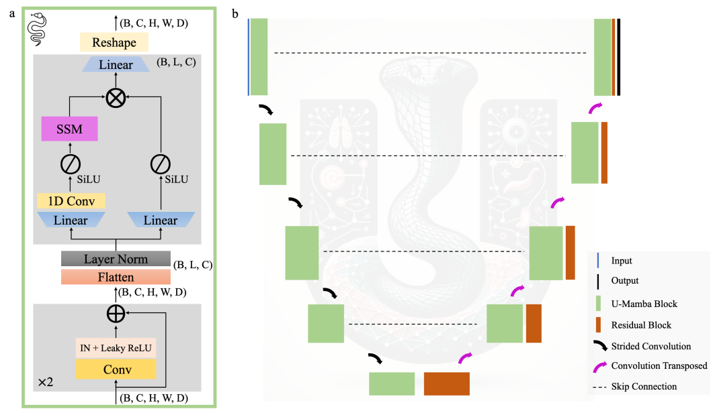
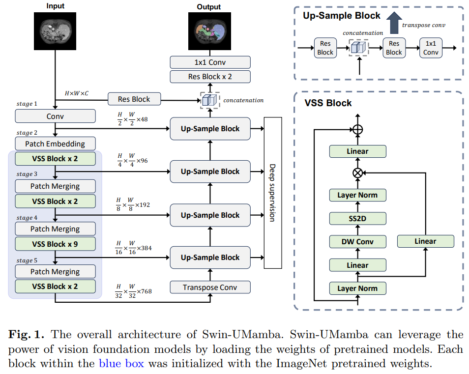
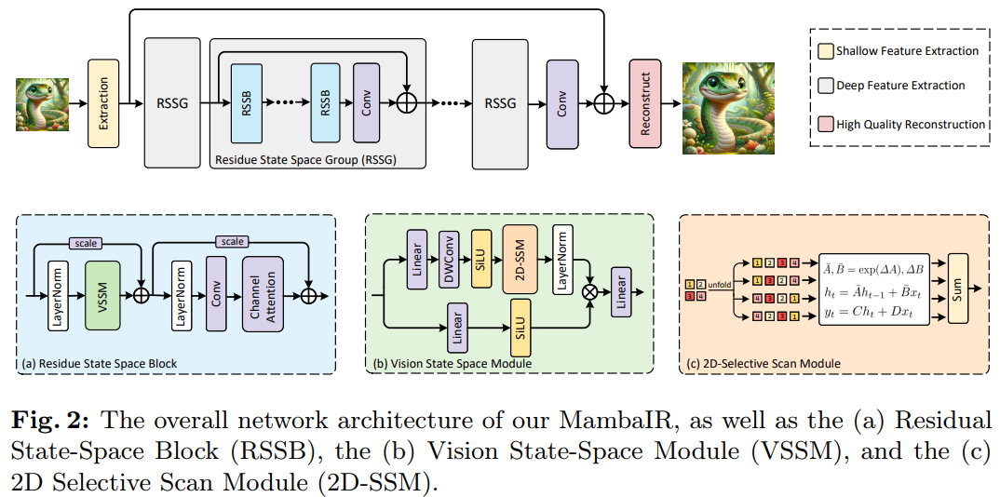
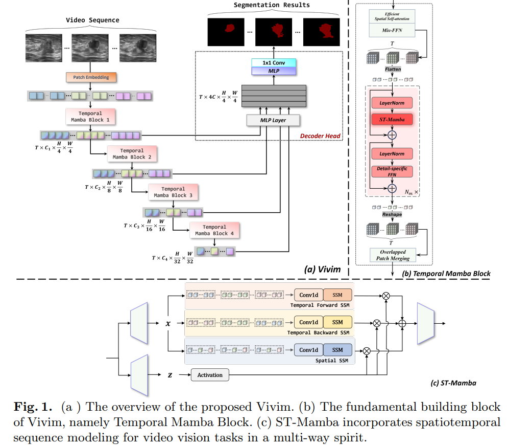

# Video Mamba Survey :snake:

collects mamba-related papers in video processing!


## survey

**paper list**

- [Awesome-Mamba](https://github.com/yeruoforever/Awesome-Mamba)
- [Awesome-Mamba-Papers](https://github.com/yyyujintang/Awesome-Mamba-Papers)


**[Other Useful Sources](https://github.com/yyyujintang/Awesome-Mamba-Papers?tab=readme-ov-file#other-useful-sources)**

- https://srush.github.io/annotated-s4/

Video tutorial

- [Mamba and S4 Explained: Architecture, Parallel Scan, Kernel Fusion, Recurrent, Convolution, Math](https://www.youtube.com/watch?v=8Q_tqwpTpVU)


## basics

- "Efficiently Modeling Long Sequences with Structured State Spaces" Arxiv, 2021 Oct 31, `S4`
  [paper](http://arxiv.org/abs/2111.00396v3) [code]() [pdf](./2021_10_Arxiv_Efficiently-Modeling-Long-Sequences-with-Structured-State-Spaces.pdf) [note](./2021_10_Arxiv_Efficiently-Modeling-Long-Sequences-with-Structured-State-Spaces_Note.md)
  Authors: Albert Gu, Karan Goel, Christopher Ré


- "Hungry Hungry Hippos: Towards Language Modeling with State Space Models" Arxiv, 2022 Dec 28, `H3`
  [paper](http://arxiv.org/abs/2212.14052v3) [code]() [pdf](./2022_12_Arxiv_Hungry-Hungry-Hippos--Towards-Language-Modeling-with-State-Space-Models.pdf) [note](./2022_12_Arxiv_Hungry-Hungry-Hippos--Towards-Language-Modeling-with-State-Space-Models_Note.md)
  Authors: Daniel Y. Fu, Tri Dao, Khaled K. Saab, Armin W. Thomas, Atri Rudra, Christopher Ré


**Mamba Block code 看笔记**

- "Vision Mamba: Efficient Visual Representation Learning with Bidirectional State Space Model" Arxiv, 2024 Jan
  [paper](http://arxiv.org/abs/2401.09417v2) [code](https://github.com/hustvl/Vim.) [pdf](./2024_01_Arxiv_Vision-Mamba--Efficient-Visual-Representation-Learning-with-Bidirectional-State-Space-Model.pdf) [note](./2024_01_Arxiv_Vision-Mamba--Efficient-Visual-Representation-Learning-with-Bidirectional-State-Space-Model_Note.md)
  Authors: Lianghui Zhu, Bencheng Liao, Qian Zhang, Xinlong Wang, Wenyu Liu, Xinggang Wang


Video Mamba 大致 code 流程看下面文章的笔记

- "VideoMamba: State Space Model for Efficient Video Understanding" Arxiv, 2024 Mar
  [paper](http://arxiv.org/abs/2403.06977v1) [code](https://github.com/OpenGVLab/VideoMamba) [pdf](./2024_03_Arxiv_VideoMamba--State-Space-Model-for-Efficient-Video-Understanding.pdf) [note](./2024_03_Arxiv_VideoMamba--State-Space-Model-for-Efficient-Video-Understanding_Note.md)
  Authors: Kunchang Li, Xinhao Li, Yi Wang, Yinan He, Yali Wang, Limin Wang, Yu Qiao


## Image

- "Mamba: Linear-Time Sequence Modeling with Selective State Spaces" Arxiv, 2023 Dec
  [paper](http://arxiv.org/abs/2312.00752v1) [code](https://github.com/state-spaces/mamba) [pdf](./2023_12_Arxiv_Mamba--Linear-Time-Sequence-Modeling-with-Selective-State-Spaces.pdf) [note](./2023_12_Arxiv_Mamba--Linear-Time-Sequence-Modeling-with-Selective-State-Spaces_Note.md) [blog](https://zhuanlan.zhihu.com/p/680846351)
  Authors: Albert Gu, Tri Dao


- "U-Mamba: Enhancing Long-range Dependency for Biomedical Image Segmentation" Arxiv, 2024 Jan 09
  [paper](http://arxiv.org/abs/2401.04722v1) [code](https://github.com/bowang-lab/U-Mamba) [website](https://wanglab.ai/u-mamba.html) [pdf](./2024_01_Arxiv_U-Mamba--Enhancing-Long-range-Dependency-for-Biomedical-Image-Segmentation.pdf) [note](./2024_01_Arxiv_U-Mamba--Enhancing-Long-range-Dependency-for-Biomedical-Image-Segmentation_Note.md)
  Authors: Jun Ma, Feifei Li, Bo Wang




- "Vision Mamba: Efficient Visual Representation Learning with Bidirectional State Space Model" Arxiv, 2024 Jan
  [paper](http://arxiv.org/abs/2401.09417v2) [code](https://github.com/hustvl/Vim.) [pdf](./2024_01_Arxiv_Vision-Mamba--Efficient-Visual-Representation-Learning-with-Bidirectional-State-Space-Model.pdf) [note](./2024_01_Arxiv_Vision-Mamba--Efficient-Visual-Representation-Learning-with-Bidirectional-State-Space-Model_Note.md)
  Authors: Lianghui Zhu, Bencheng Liao, Qian Zhang, Xinlong Wang, Wenyu Liu, Xinggang Wang


- "VMamba: Visual State Space Model" Arxiv, 2024 Jan 18
  [paper](http://arxiv.org/abs/2401.10166v1) [code](https://github.com/MzeroMiko/VMamba.) [pdf](./2024_01_Arxiv_VMamba--Visual-State-Space-Model.pdf) [note](./2024_01_Arxiv_VMamba--Visual-State-Space-Model_Note.md)
  Authors: Yue Liu, Yunjie Tian, Yuzhong Zhao, Hongtian Yu, Lingxi Xie, Yaowei Wang, Qixiang Ye, Yunfan Liu


- "SegMamba: Long-range Sequential Modeling Mamba For 3D Medical Image Segmentation" Arxiv, 2024 Jan
  [paper](http://arxiv.org/abs/2401.13560v3) [code](https://github.com/ge-xing/SegMamba) [pdf](./2024_01_Arxiv_SegMamba--Long-range-Sequential-Modeling-Mamba-For-3D-Medical-Image-Segmentation.pdf) [note](./2024_01_Arxiv_SegMamba--Long-range-Sequential-Modeling-Mamba-For-3D-Medical-Image-Segmentation_Note.md)
  Authors: Zhaohu Xing, Tian Ye, Yijun Yang, Guang Liu, Lei Zhu

framework


tri-orientated Mamba moudle


- "Can Mamba Learn How to Learn? A Comparative Study on In-Context Learning Tasks" Arxiv, 2024 Feb 6
  [paper](http://arxiv.org/abs/2402.04248v1) [code]() [pdf](./2024_02_Arxiv_Can-Mamba-Learn-How-to-Learn--A-Comparative-Study-on-In-Context-Learning-Tasks.pdf) [note](./2024_02_Arxiv_Can-Mamba-Learn-How-to-Learn--A-Comparative-Study-on-In-Context-Learning-Tasks_Note.md)
  Authors: Jongho Park, Jaeseung Park, Zheyang Xiong, Nayoung Lee, Jaewoong Cho, Samet Oymak, Kangwook Lee, Dimitris Papailiopoulos


- "Swin-UMamba: Mamba-based UNet with ImageNet-based pretraining" Arixv, 2024 Feb 05
  [paper](https://arxiv.org/abs/2402.03302) [code](https://github.com/JiarunLiu/Swin-UMamba)




- "Weak-Mamba-UNet: Visual Mamba Makes CNN and ViT Work Better for Scribble-based Medical Image Segmentation" Arixv, 2024 Feb 16
  [paper](https://arxiv.org/abs/2402.10887) [code](https://github.com/ziyangwang007/Mamba-UNet)


- "LocalMamba: Visual State Space Model with Windowed Selective Scan" Arxiv, 2024 Mar 14
  [paper](http://arxiv.org/abs/2403.09338v1) [code](https://github.com/hunto/LocalMamba) [pdf](./2024_03_Arxiv_LocalMamba--Visual-State-Space-Model-with-Windowed-Selective-Scan.pdf) [note](./2024_03_Arxiv_LocalMamba--Visual-State-Space-Model-with-Windowed-Selective-Scan_Note.md)
  Authors: Tao Huang, Xiaohuan Pei, Shan You, Fei Wang, Chen Qian, Chang Xu


- "VmambaIR: Visual State Space Model for Image Restoration" Arxiv, 2024 Mar 18
  [paper](http://arxiv.org/abs/2403.11423v1) [code]() [pdf](./2024_03_Arxiv_VmambaIR--Visual-State-Space-Model-for-Image-Restoration.pdf) [note](./2024_03_Arxiv_VmambaIR--Visual-State-Space-Model-for-Image-Restoration_Note.md)
  Authors: Yuan Shi, Bin Xia, Xiaoyu Jin, Xing Wang, Tianyu Zhao, Xin Xia, Xuefeng Xiao, Wenming Yang


### restoration

- "MambaIR: A Simple Baseline for Image Restoration with State-Space Model" Arxiv, 2024 Feb
  [paper](http://arxiv.org/abs/2402.15648v1) [code](https://github.com/csguoh/MambaIR) [pdf](./2024_02_Arxiv_MambaIR--A-Simple-Baseline-for-Image-Restoration-with-State-Space-Model.pdf) [note](./2024_02_Arxiv_MambaIR--A-Simple-Baseline-for-Image-Restoration-with-State-Space-Model_Note.md)
  Authors: Hang Guo, Jinmin Li, Tao Dai, Zhihao Ouyang, Xudong Ren, Shu-Tao Xia




### hidden attention

- "The Hidden Attention of Mamba Models"
  [paper](https://arxiv.org/pdf/2403.01590v2.pdf)

可视化 Mamba 如何做 attention


## Video

- "Vivim: a Video Vision Mamba for Medical Video Object Segmentation" Arxiv, 2024 Jan 25
  [paper](http://arxiv.org/abs/2401.14168v2) [code](https://github.com/scott-yjyang/Vivim) [pdf](./2024_01_Arxiv_Vivim--a-Video-Vision-Mamba-for-Medical-Video-Object-Segmentation.pdf) [note](./2024_01_Arxiv_Vivim--a-Video-Vision-Mamba-for-Medical-Video-Object-Segmentation_Note.md) 
  Authors: Yijun Yang, Zhaohu Xing, Lei Zhu

> :warning: 没 release 代码




- "VideoMamba: State Space Model for Efficient Video Understanding" Arxiv, 2024 Mar
  [paper](http://arxiv.org/abs/2403.06977v1) [code](https://github.com/OpenGVLab/VideoMamba) [pdf](./2024_03_Arxiv_VideoMamba--State-Space-Model-for-Efficient-Video-Understanding.pdf) [note](./2024_03_Arxiv_VideoMamba--State-Space-Model-for-Efficient-Video-Understanding_Note.md)
  Authors: Kunchang Li, Xinhao Li, Yi Wang, Yinan He, Yali Wang, Limin Wang, Yu Qiao


VideoMamba Block 参考 Vim 使用双向 SSM


## Q&A


### setup

> 参考 [Vim](https://github.com/hustvl/Vim)

```
conda create -n py3-10_torch2-1-1_cu18 python=3.10.13
```


### nnU-Net

> nnU-Net is a semantic segmentation method that automatically adapts to a given dataset. It will analyze the provided training cases and automatically configure a matching U-Net-based segmentation pipeline.


### effectiveness

- "Understanding the effective receptive field in deep convolutional neural networks"
