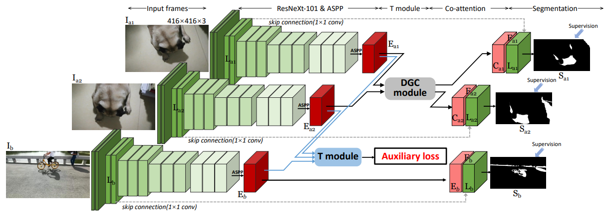
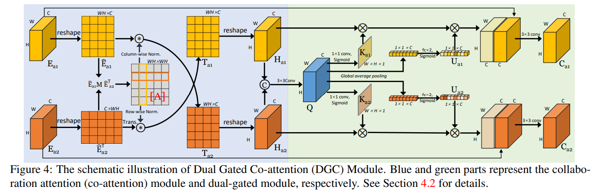

# Video Transformer

- 需求：查阅相关 video swin Transformer 的改进
- 目标：总结 video transformer 网络架构，对当前 framework 进行改进

- "Deformable ConvNets v2: More Deformable, Better Results" CVPR, 2018 Nov, **DCNv2** :statue_of_liberty:
  [paper](https://arxiv.org/abs/1811.11168)
  [note](./2018_11_CVPR_Deformable-ConvNets-v2--More-Deformable--Better-Results_Note.md)

  > 1. 相比 DCNv1 增加更多卷积层
  > 2. Modulation mechanism 就是对区域点的特征加权平均 :+1:
  >    $y(p) = \sum_{k=1}^{K}{w_k}\cdot x(p+p_k+\triangle{p_k})\cdot \triangle{m_k}$
  >
  > - 从结果上看
  >
  >   输入图像越小，感受也越大，物体上的点更为密集 & 但会存在很多 offset 到其他物体上的点；随着输入图尺度增加，点会更分散 & 更为准确，偏移错的点比例减少
  >
  >   从 ROI 区域来看，DCNv2 还是有偏差，**说明要按相似度再筛选一下，只加权还是有可能把错的信息拉进来**
  >
  > - :warning: 相比 DCNv1 参数量和 FLOPS 都增加接近 10%
  
- "Swin Transformer: Hierarchical Vision Transformer using Shifted Windows" ICCV_best_paper, 2021 Mar
  [paper](http://arxiv.org/abs/2103.14030v2) [code](https://github.com/microsoft/Swin-Transformer)
  [note](./2021_03_ICCV_Swin-Transformer--Hierarchical-Vision-Transformer-using-Shifted-Windows_Note.md)

- "Is Space-Time Attention All You Need for Video Understanding?" ICML, 2021 Feb, `TimeSFormer`
  [paper](http://arxiv.org/abs/2102.05095v4) [code](https://github.com/facebookresearch/TimeSformer.) 
  [note](./2021_02_ICML_Is-Space-Time-Attention-All-You-Need-for-Video-Understanding-_Note.md)

  > 对每一帧在空间维度划分 patch，没有在 t 维度设置窗口；此时提取的特征是按空间维度的，没对 t 维度一起提取特征，造成 spatial&temporal 效果每 divided 好；

- "ViViT: A Video Vision Transformer" ICCV, 2021 Mar
  [paper](http://arxiv.org/abs/2103.15691v2) [code](https://github.com/google-research/scenic/tree/main/scenic/projects/vivit)
  [note](./2021_03_ICCV_ViViT--A-Video-Vision-Transformer_Note.md)

  > 在 t 维度也设置一个窗口，每个窗口为一个长方体 `t,h,w`；用 3D 卷积同时提取 `t,h,w` 维度的特征，此时 spatial&temporal 效果更好

- "Video Swin Transformer" CVPR, 2021 Jun
  [paper](https://arxiv.org/abs/2106.13230) [code](https://github.com/SwinTransformer/Video-Swin-Transformer) [blog](https://blog.csdn.net/zjupeco/article/details/122860198) 
  [note](./2021_06_CVPR_Video-Swin-Transformer_Note.md)

  > 类似 vivit 设置 tube 形式的窗口，在 T 维度设置窗口。同样进行 cycle shift
  
- "Multiscale Vision Transformers" ICCV, 2021 Apr, `MViT`
  [paper](https://arxiv.org/abs/2104.11227) [code](https://github.com/facebookresearch/SlowFast)
  [note](2021_04_ICCV_Multiscale-Vision-Transformers_Note.md)
  
  > 对 attention QKV 使用 **conv-pooling 降低 spatial 尺寸的同时升高 channel，实现多尺度融合**
  > 从浅层到深层根据channel 的维度划分成多个stage，channel维度逐渐增大，空间分辨率逐渐变小（变得更coarse)
  >
  > 参数只有 vivit 的 1/4，准确率更高
  
- "MViTv2: Improved Multiscale Vision Transformers for Classification and Detection" CVPR, 2021 Dec, `MViTv2`
  [paper](https://arxiv.org/abs/2112.01526) [code](https://github.com/facebookresearch/SlowFast)
  [note](./2021_12_CVPR_MViTv2--Improved-Multiscale-Vision-Transformers-for-Classification-and-Detection_Note.md)
  
- "UniFormer: Unified Transformer for Efficient Spatiotemporal Representation Learning" ICLR+TPAMI, 2022 Jan
  [paper](http://arxiv.org/abs/2201.04676v3) [code](https://github.com/Sense-X/UniFormer) [blog](https://zhuanlan.zhihu.com/p/461361343) 
  [note](./2022_01_ICLR_UniFormer--Unified-Transformer-for-Efficient-Spatiotemporal-Representation-Learning_Note.md)
  Authors: Kunchang Li, Yali Wang, Peng Gao, Guanglu Song, Yu Liu, Hongsheng Li, Yu Qiao
  
  > 发现 Encoder 全部用 attn，也只是在相邻帧的对应位置左右做注意力，用 attn 浪费计算资源，因此浅层用 CNN 代替
  
- "UniFormerV2: Spatiotemporal Learning by Arming Image ViTs with Video UniFormer" ICCV, 2022 Nov :star:
  [paper](https://arxiv.org/abs/2211.09552) [code](https://github.com/OpenGVLab/UniFormerV2)
  [note](./2022_11_ICCV_UniFormerV2--Spatiotemporal-Learning-by-Arming-Image-ViTs-with-Video-UniFormer_Note.md)

- "InternImage: Exploring Large-Scale Vision Foundation Models with Deformable Convolutions" CVPR highlight, 2022 Nov, **INTERN-2.5** :star:
  [paper](https://arxiv.org/abs/2211.05778) [code](https://github.com/OpenGVLab/InternImage) [blog_explanation](https://zhuanlan.zhihu.com/p/610772005)
  [pdf](./2022_11_CVPR_InternImage--Exploring-Large-Scale-Vision-Foundation-Models-with-Deformable-Convolutions.pdf)

  > SOTA

- [ ] "PointAvatar: Deformable Point-based Head Avatars from Videos" CVPR, 2022 Dec
  [paper](https://arxiv.org/abs/2212.08377)

  > Deformable 用于视频

- [x] "InternVideo: General Video FoundatioMViTv2n Models via Generative and Discriminative Learning" Arxiv, 2022 Dec
  [paper](http://arxiv.org/abs/2212.03191v2) [code](https://github.com/OpenGVLab/InternVideo)
  [note](./2022_12_Arxiv_InternVideo--General-Video-Foundation-Models-via-Generative-and-Discriminative-Learning_Note.md)

  > 视频基础大模型，39个数据集的 SOTA， 6B 参数。
  >
  > 1. 验证了 masked video learning (VideoMAE) and video-language contrastive modeling 对于下游任务的有效性；用两个分支的 Encoder
  > 2. 高效训练，相比之前 Coca 只要 23% power costs
  > 3. 无法处理长视频

- [ ] "OSRT: Omnidirectional Image Super-Resolution with Distortion-aware Transformer" CVPR, 2023 Feb
  [paper](https://arxiv.org/abs/2302.03453) [code](https://github.com/Fanghua-Yu/OSRT)

  > Deformable attn 用于图像 SR

- [x] "STDAN: Deformable Attention Network for Space-Time Video Super-Resolution" NNLS, 2023 Feb :statue_of_liberty:
  [paper](https://ieeexplore.ieee.org/document/10045744) [code](https://github.com/littlewhitesea/STDAN)
  [note](./2023_02_NNLS_STDAN--Deformable-Attention-Network-for-Space-Time-Video-Super-Resolution_Note.md)

  > *Deformable Attention* 视频 SR

- [ ] "An Efficient Accelerator Based on Lightweight Deformable 3D-CNN for Video Super-Resolution" CS, 2023 Mar
  [paper](https://ieeexplore.ieee.org/abstract/document/10079152)

  > *Deformable Attention* 视频 SR

- [ ] "Eventful Transformers: Leveraging Temporal Redundancy in Vision Transformers" Arxiv, 2023 Aug
  [paper](https://arxiv.org/abs/2308.13494)

- [x] "DAT++: Spatially Dynamic Vision Transformer with Deformable Attention"
  [paper](https://arxiv.org/abs/2309.01430) [code](https://github.com/LeapLabTHU/DAT-Detection)

  > Extended version of "Vision Transformer with Deformable Attention"
  >
  > 关注 deformable 可视化 code

- [x] "Aerial Image Dehazing with Attentive Deformable Transformers" WACV, 2023 :star:
  [paper](https://openaccess.thecvf.com/content/WACV2023/papers/Kulkarni_Aerial_Image_Dehazing_With_Attentive_Deformable_Transformers_WACV_2023_paper.pdf) [code](https://github.com/AshutoshKulkarni4998/AIDTransformer)

  > Self-atten QKV 特征都单独过 SE 空间注意力 + Deformable 偏移（自己计算偏移）
  >
  > 对比了不同类型 deformable，针对不同任务稍微修改一下 deformable ，psnr 能高 1 db

- [ ] "Video-FocalNets: Spatio-Temporal Focal Modulation for Video Action Recognition" ICCV, 2023 Jul
  [paper](https://arxiv.org/abs/2307.06947) [code](https://github.com/TalalWasim/Video-FocalNets)

## Shadow Detection

- Triple-cooperative Video Shadow Detection
  [paper](https://arxiv.org/abs/2103.06533)
  1. collect a new video shadow detection dataset (ViSha)
  2. utilizes triple parallel networks in a cooperative manner to learn discriminative representations at intra-video and inter-video levels
  3. co-attention module is proposed to constrain features from neighboring frames in the same video

- Video Shadow Detection via Spatio-Temporal Interpolation Consistency Training
  [paper](https://arxiv.org/abs/2206.08801v1)

 takes three shadow images as inputs. The first two images (denoted as {Ia1, Ia2}) are from the same video, while the third image Ib is randomly selected from another video. 

- SCOTCH and SODA: A Transformer Video Shadow Detection Framework

> [note](./2022_11_CVPR_SCOTCH-and-SODA--A-Transformer-Video-Shadow-Detection-Framework_Note.md)